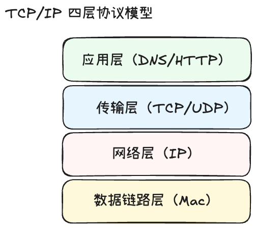
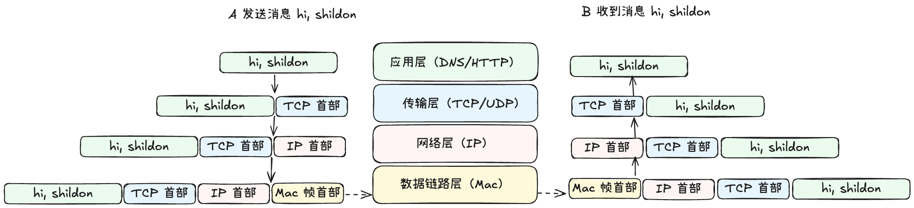
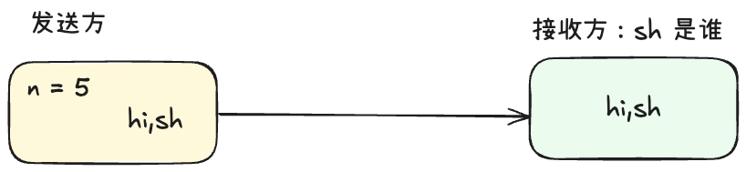
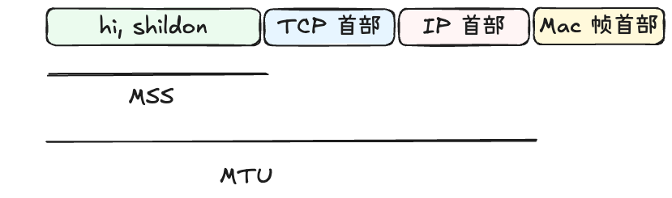

## 1. 前言
最近在学习如何手写一个 [tiny-mq](https://github.com/OneCastle5280/tiny-mq)，其中在写网络通讯模块的时候，了解到黏包和半包的概念，并且需要对其进行处理；这篇文档就简单聊一聊什么是黏包、半包，产生的原因是什么，对我们有什么影响，我们应该如何来处理

## 2. TCP/IP 四层协议模型
我们先了解一下 TCP/IP 四层协议模型，结构如下： 

* 应用层
  * HTTP、DNS、FTP 等都是处于应用层的协议
* 传输层
  * 负责上层（即应用层）的数据传输，代表协议为可靠传输的 TCP 协议和高效的 UDP 协议
* 网络层
  * 负责将上层的数据在网络中传输，主要为 IP 协议
* 数据链路层
  * 负责将上层数字信号转化成物理信号，例如 ARP（地址解析协议），根据 IP 地址转化成 Mac 地址。

## 3. Nagle 算法

当我们在应用层发送消息 `hi,shildon`，消息在四层的表现如下：

1. 消息由应用层产生，并且将数据向下层传递，消息为 `hi, shildon`
2. 传输层采用可靠的 TCP 协议，TCP 协议会为消息加上 TCP 首部，首部包含 TCP 相关的信息，此时变成 `TCP 首部 + hi, shildon`，继续向下层传递
3. 网络层为 IP 协议，IP 协议会为消息加上 IP 首部，首部包含 IP 相关的信息，此时消息变成 `IP 首部 + TCP 首部 + hi, shildon`，继续向下层传递
4. 数据链路层会将上层消息封装成帧，为消息加上 Mac 首部，此时消息变成 `Mac 首部 + IP 首部 + TCP 首部 + hi, shildon`，经过网线等物理介质传输，到达目的地
5. 首先到达数据链路层，会将 Mac 首部拆掉，此时消息变成 `IP 首部 + TCP 首部 + hi, shildon`, 向上层传递
6. 数据到达网络层，在网络层会将 Ip 首部拆掉，此时消息变成 `TCP 首部 + hi, shildon`，继续向上传递
7. 数据到达传输层，在传输层会将 TCP 首部拆掉，此时消息变成 `hi, shildon`，继续向上传递
8. 在应用层成功收到 `hi, shildon`。

我们可以看到数据在 TCP/IP 四层协议模型中，数据传输是正向封包和反向拆包的两个过程。发送过程，每一层都会为其新增专属首部；基于这个流程，假设应用层将 `hi, shildon` 拆成 `h` `i` `,` `s` `h` `i` `l` `d` `o` `n` 分别进行发送，
按照上述流程，会分别为 `h` `i` `,` `s` `h` `i` `l` `d` `o` `n` 加上各层的首部，最后再进行传输；这样会有什么坏处？

假设我们每一个字符、 tcp 首部、ip 首部、mac 首部各占用 1 Byte，那将 `hi, shildon` 一起发送的时候，最终发送出去的消息大小为：10 + 3 Byte。现在将`hi, shildon`拆分成一个一个字符进行传输，每一个字符都会加上`tcp首部、ip 首部、mac 首部`，那么最终发送出去的消息大小为：10 + 3 * 10 Byte；数据传输吞吐量变低了，太浪费了。

针对上述这种频繁发送小消息而带来的网络开销、(有可能会造成网络拥堵), tcp 协议提供了一种解决方案，即 Nagle 算法，也叫小包合并算法。当发送的数据量小于等于 `n` (n 是一个常量) 字节时，TCP 会将这些数据合并，直到收到一个大于 `n` 字节的数据，才将这些数据发送出去。
这种场景下， Nagle 算法能够大量的节省我们的网络开销；相应的，因为消息并不是即刻发送出去的，所以消息时效性会变低。

## 4. 黏包和半包
那 TCP 的 Nagle 算法跟我们的黏包、半包有什么关系呢？ 

### 半包
还是上面的例子，假设 Nagle 的 n = 5,`h` `i` `,` `s` `h` 已经达到了可以发送的大小，TCP 就会将 `hi,sh` 经过 TCP/IP 模型发送出去，对于接收方来说收到的是 `hi,sh`，接收方就会很疑惑 `sh` 是谁？

这就是**半包问题: 接收方在一次读取操作中未能接收到一个完整的消息，而是只接收到部分数据**。

### 黏包

那什么是黏包呢？

假设 n = 15, 发送方除开发送 `hi,shildon` 之外，还发送了`shuaige`消息，这样有可能在发送出去之后变成了 `hi,shildonshuai`，本应是两个消息的，接收方接收到的是 `hi,shildonshuai`，接收方也很迷惑，`shildonshuai` 是谁？ 

这就是**黏包问题：接收方在一次读取操作中接收到多个消息黏在一起**

那 Nagle 算法是黏包、半包产生的根本原因吗？

不是的，根本原因还是 TCP 是面向字节流的协议，消息本身无边界，而当缓冲区的大小相比较消息偏大或者偏小的时候，就会出现黏包和半包问题。

## 5. MTU 和 MSS 产生的半包问题
传输层和数据链路层都有一次最大传输大小限制，在传输层有 MSS（`Maximum Segement Size`）最大报文大小，TCP 会将消息拆分成 MSS 大小的报文（这个时候就有可能将你的一个消息拆分成多个报文），在数据链路层有 MTU（`Maxitum Transmission Unit`） 最大传输单元.

`MTU = MSS + TCP 首部大小 + IP 首部大小`; 如果 `MTC < MSS + TCP 首部大小 + IP 首部大小`，那么就会将你的消息拆分发送。

## 6. 如何解决
既然根本原因是因为 TCP 是面向字节流的，无边界的，那我们在应用层自己去把这个“边界”定义出来，自己去辨别一次读取的数据是否为完整的消息。

### 定长消息
每个数据都是一个固定的长度。当接收方累计读取到固定长度的报文后，就认为已经获得一个完整的消息。当发送方的数据小于固定长度时，则需要空位补齐。
这个很好理解，相当于双方约定好，我每一个消息都固定是 `n` 长度，你收到 `n` 个长度，就是一个完整的消息了，反之，就认为没有收到完整的消息。

优点： 实现非常简单

缺点： 因为消息的长度不好固定，太容易造成浪费了

### 特殊符分隔
可以在每次发送报文的尾部加上特定分隔符，接收方就可以根据特殊分隔符进行消息拆分。（redis 就是使用的这种方式）

例如，发送方在每一个完整的消息后面加一个 `\n`, 这样在接收方就可以根据 `\n` 进行消息拆分。反之，则认为还没有收到完整的消息。
需要特别注意你的分隔符一定不会出现在的消息中，分隔符的选择特别重要。
### 消息长度 + 消息体

消息分为两部分：消息头 + 消息体，消息头中有消息体的长度，接收方首先接收到消息头，然后从中获取到消息长度，表示往后取`length`个长度即为消息完整体。这种处理方法非常常见并且特别灵活。

## 7.小结
Nagle 算法是 TCP 协议中的一个优化策略，它通过合并小数据包来减少网络开销，但是同时也会导致半包和黏包的问题；MTU 和 MSS 是 TCP/IP 协议中的一个限制，它们限制了网络传输的单个数据包的大小，如果数据包过大，可能会被拆分成多个更小的数据包进行传输，从而可能导致黏包和半包的问题。
目前黏包、半包常见的解决思路有三种 1. 定长消息 2. 特殊符分隔 3. 消息长度+消息体。

结束～ 关于 TCP 其实能聊的还有很多，我们在后面慢慢展开学习～