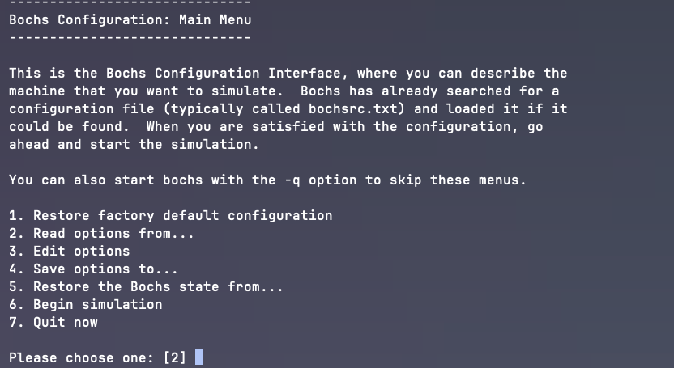
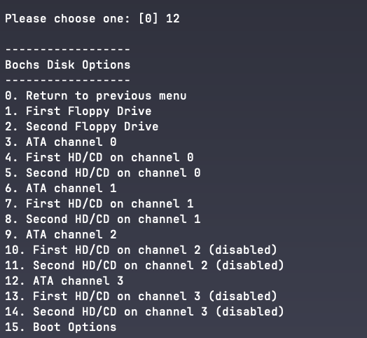
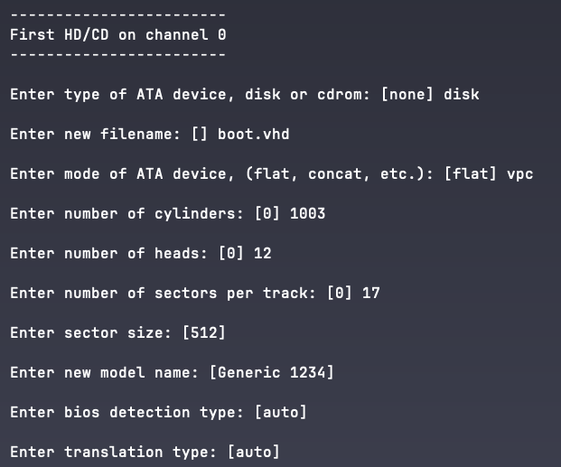
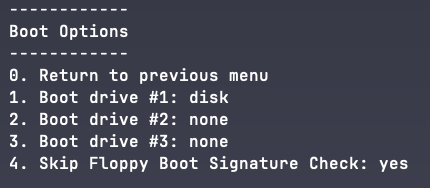
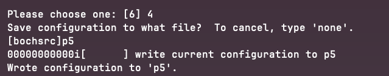
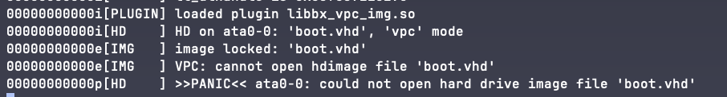

我手里有一台 M1 芯片的 MBP，学习 x86 汇编需要一个 x86 的机器，恰好我有一台实验机，安装的是 ubuntu server 24.04 版本。由于 Server 本身没有图形界面，也没有连接任何显示器。就想试试能不能通过远程的方式运行 bochs。

<!-- truncate -->

## 远程桌面服务 X
X Window System 是一套服务端与客户端分离的窗口管理系统。那就是的远程运行 GUI 程序成为了可能。

大概就是如图所示：


可以参考：[https://sinestroedmonce.github.io/2019/03/28/macos-remote-sever-GUIconnection-intro/](https://sinestroedmonce.github.io/2019/03/28/macos-remote-sever-GUIconnection-intro/)

时间有点久，我忘记当时是按照哪篇文章配置的了，但原理上都是一样的。

## x86服务器安装bochs
ubuntu 安装 bochs 很简单：

`sudo apt install bochs`

`sudo apt install bochs-x`

done.

## 从硬盘启动

编译代码并写入虚拟磁盘文件

`java -jar fixvhdwr-1.0.jar mbr_main boot.vhd 1`

写入后的 vhd 文件如图所示：


### 配置bochs
bochs默认会读取当前目录下的 bochsrc 文件，也可以通过`bochs -f <config_file_path>`来指定。

如果不希望读取配置，可以使用`bochs -n`来强制重新配置一套新配置。



进入选项编辑后，编辑第 12 项——disk & boot options



然后编辑`[4] First HD/CD on channel 0`



再编辑 [15] Boot Options



保存配置



可以通过`bochs -f p5`按刚才的配置启动。

## 从软盘启动
这个已证实好用，可以直接使用这份配置：

```plain
#图形模式设置，这两个一起开启  
display_library: x

#bios 和 vga bios
romimage: file=$BXSHARE/BIOS-bochs-legacy 
vgaromimage: file=$BXSHARE/VGABIOS-lgpl-latest

#1.44=磁盘镜像位置  boot.img 跟刚才创建磁盘时的磁盘名字保持一致
floppya: 1_44=boot.img, status=inserted

#从软盘启动
boot: floppy

#输出日志
log: bochsout.txt

#置鼠标不可用
mouse: enabled=0

#键盘配置
keyboard: keymap=#$BXSHARE/keymaps/x11-pc-us.map

#内存容量
megs: 32

#注释掉下面这两个
#sound: driver=default, waveout=/dev/dsp. wavein=, midiout=
#ata0-master: type=disk, mode=flat, path="30M.sample"
```

如何将程序代码copy到软盘中：

```bash
# 编译
nasm boot.asm -o boot.bin
# 刻录
dd if=boot.bin of=boot.img bs=512 count=1 conv=notrunc
```

上述方案过于繁琐了，可以使用我新写的 build 脚本，一键从源码到镜像。详情参考：https://gitee.com/wjc133/x86-asm

## 问题处理
### could not open hard drive image file 'boot.vhd'


在终端会显示具体的错误原因。需要注意的是，bochs 有点傻，它只能读取当前目录下的 bochsrc 文件，而且 bochsrc 文件中的镜像文件路径也只能在当前目录下，否则就会加载失败。

### 无法跳转到0x7c00
无法跳转，且终端提示：

`bx_dbg_read_linear: physical memory read error`

[这篇问答](https://askubuntu.com/questions/1521719/bochs-cant-access-bootloader-address-0x7c00-error-physical-memory-read-error)有给出解决方案，将 rom 镜像改为 legacy 版即可解决。

```plain
display_library: x
memory: host=32, guest=32
romimage: file="/usr/share/bochs/BIOS-bochs-legacy"
vgaromimage: file="/usr/share/bochs/VGABIOS-lgpl-latest"
//.. 后面省略
```

