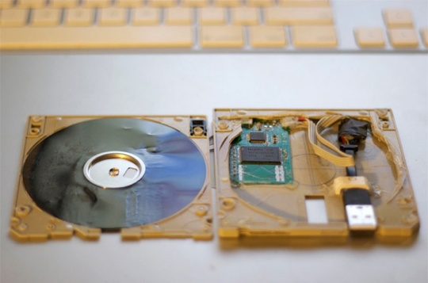
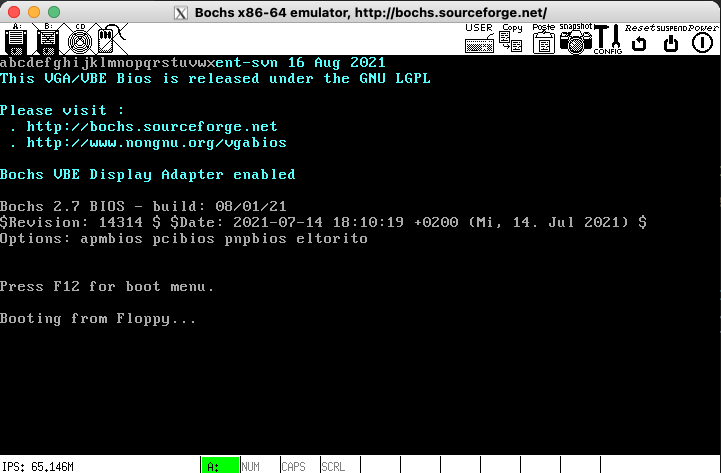

最近阅读李忠老师的《x86汇编：从实模式到保护模式》，书中示例是读硬盘的，因为实验环境的问题，在我的程序中改成了读软盘，原封不动地使用原程序会得到如下错误：

```plain
00012936084i[HD    ] ata0-0: read sectors issued to non-disk
```

所以需要探究一下软盘如何读。

注意📢：这篇文章的内容中有关非中断的部分**不敢保证百分百正确**，尤其是通信步骤的部分！因为本文最后的例程我虽然写出来了，但一直没有跑通！这有可能是 bochs 的问题，也有可能是程序中哪个部分不符合 FDC 的控制协议！

搞了两天实在搞不下去，后面有新想法了再来更新。

最新：学习了 **BIOS 中断**后，发现 BIOS 中断提供了直接磁盘服务(Direct Disk Service——INT 13H)，遂尝试实用中断读取软盘，果断成功了！详见第 9 节。

## 软盘
软盘由一种薄的、柔软的磁性材料（通常是塑料片）制成，表面涂有铁氧化物或其他磁性物质。这些磁性物质能够记录数据。  
磁性材料的方向代表数据的二进制值（0或1）。  
软盘驱动器通过磁头进行读写操作，当写数据时，磁头通过电流改变磁性材料的方向，从而记录数据；当读数据时，磁头感知磁场的变化并转换为电信号，再解码为二进制数据。与硬盘类似，软盘的表面被划分为多个同心圆（称为轨道）和弧形区段（称为扇区），每个扇区存储一块数据。  
早期软盘都是单面设计，仅使用软盘的一面记录数据，对应的单磁头驱动器就只有一个磁头；后期设计出了两面都可以记录数据的软盘，对应的双面软盘驱动器通常在上下各配备一个磁头。

软驱内部有两个马达：

+ 转盘马达：驱动软盘以恒定速度旋转，通常是每分钟300转（300 RPM）
+ 步进马达：控制磁头沿径向移动，定位到目标轨道

容量取决于磁盘的大小和扇区密度，软盘因物理磨损、磁性退化等问题容易丢失数据，且存取速度较慢，因此逐渐被更先进的存储介质取代。



### 常见的尺寸和容量一览表
| 尺寸 | 单面单密度 | 单面双密度 | 双面双密度 | 高密度 | 扩展密度 |
| --- | --- | --- | --- | --- | --- |
| **8英寸** | 80 KB | 160 KB | 320 KB | - | - |
| **5.25英寸** | 90 KB | 360 KB | 720 KB | 1.2 MB | - |
| **3.5英寸** | 360 KB | 720 KB | 1.44 MB | 2.88 MB | - |


> 备注：单密度是早期软盘的磁记录技术，采用一种简单的调制方式（通常是FM）来记录二进制数据；双密度是在单密度的基础上，通过改进磁性材料和磁头设计，增大磁道密度和扇区数。它通常采用MFM调制（Modified Frequency Modulation）来提高数据存储效率。


### 软盘的物理结构
软盘不支持像硬盘那样直接使用 LBA（逻辑块地址）模式访问扇区，因为 FDC 并没有实现类似硬盘那种高级的逻辑地址转换机制。软盘操作基于传统的 CHS（柱面-磁头-扇区）模式进行访问。

+ 磁道（Cylinder/Track）
+ 磁头（Head）
+ 扇区（Sector）

### 经典的 3.5 英寸 1.44MB 软盘
对于常见的 3.5 英寸 1.44MB 软盘：

+ 每磁道有 **18 个扇区**（扇区编号 1-18）。
+ 有 **2 个磁头**（磁头编号 0 和 1）。
+ 总共有 **80 个柱面**（柱面编号 0-79）。

### CHS 到 LBA 转换公式
给定一个逻辑块地址 LBA，转换为 CHS 参数的公式为：

+ 磁道号 
+ 磁头号 
+ 扇区号 

> 注意：扇区编号从 1 开始，而非 0。


所以，app_lba_start 是 LBA 100，也就是：

+ 扇区号 = 100 mod 18 + 1 = 11 扇区
+ 磁头号 = (100 / 18) mod 2 = 1 头
+ 磁道号 = 100 / (2 * 18) = 2 道


## 软盘控制器概述
在 x86 架构的计算机中，可以通过特定的 I/O 端口与软盘驱动器（FDD, Floppy Disk Drive）进行通信。

软盘驱动器（FDD）通过软盘控制器（FDC）与 CPU 交互。FDC 接收 CPU 发出的命令和数据，通过控制信号驱动软盘的物理操作。

| I/O 地址 | 寄存器 | 功能说明 |
| --- | --- | --- |
| **0x3F0** | 状态控制寄存器 A | 存储软盘驱动器的当前状态。 |
| **0x3F1** | 状态控制寄存器 B | 存储一些高级状态信息。 |
| **0x3F2** | 数字输出寄存器 (DOR) | 控制驱动器选择、马达开关和复位 FDC。 |
| **0x3F3** | 主状态寄存器 (MSR) | 显示 FDC 的当前状态，指示是否可发送命令。 |
| **0x3F4** | 数据寄存器 (DIR) | 用于传输命令和数据。 |
| **0x3F5** | 数据 FIFO | 用于读写数据到软盘（命令和数据共享通道）。 |
| **0x3F7** | 控制寄存器 | 用于控制数据速率或其他特定功能。 |


## 与 FDD 通信的步骤
#### 初始化软盘控制器
+ **复位软盘控制器**：  
写 `0x00` 到 **DOR (0x3F2)**，然后写入 `0x1C`（开启主机和驱动器）。
+ **检查状态**：  
读取 **主状态寄存器 (MSR, 0x3F4)**，确保 FDC 准备好处理命令（状态为非忙状态）。

#### 发送命令到软盘控制器
+ **寻道**：  
通过发送寻道命令字节，控制磁头移动到指定磁道。
+ **命令字节格式**：  
根据具体操作（例如读/写磁盘、寻道），将对应的命令字节发送到 **数据寄存器 (0x3F5)**。
+ **等待状态更新**：  
再次检查 **MSR (0x3F4)**，确认数据被正确接收。

#### 数据读写
+ **写操作**：
    1. 将写命令发送到 **0x3F5**。
    2. 将要写入的数据逐字节发送到 **数据寄存器 (0x3F5)**。
+ **读操作**：
    1. 发送读命令到 **0x3F5**。
    2. 从 **数据寄存器 (0x3F5)** 逐字节读取数据。

#### 检查完成状态
+ **读取状态寄存器**：  
通过 **状态控制寄存器 (0x3F0)** 检查操作是否完成，以及是否发生错误。

#### 关闭软盘控制器
+ 最终通过写 `0x00` 到 **DOR (0x3F2)**，关闭 FDD 马达。

## 数字输出寄存器 (0x3F2, DOR, Digital Output Register)
+ **I/O 地址**：0x3F2
+ **作用**：控制软盘驱动器选择、马达开关、软盘控制器复位等功能。

| 位（bit） | 名称 | 作用 |
| --- | --- | --- |
| 0-1 | 驱动器选择位 | 指定使用哪个驱动器： <br/>00 = 驱动器 0 <br/>01 = 驱动器 1 <br/>10 = 驱动器 2 <br/>11 = 驱动器 3。 |
| 2 | 复位控制位 | 1 = 正常模式；<br/>0 = 复位模式 |
| 3 | DMA禁用位 | 1 = 禁用 DMA 传输（切换到程序控制 I/O 模式）； <br/>0 = 启用 DMA。 |
| 4 | 驱动器 0 马达开关 | 1 = 打开驱动器 0 的马达； <br/>0 = 关闭驱动器 0 的马达。 |
| 5 | 驱动器 1 马达开关 | 1 = 打开驱动器 1 的马达； <br/>0 = 关闭驱动器 1 的马达。 |
| 6 | 驱动器 2 马达开关 | 1 = 打开驱动器 2 的马达； <br/>0 = 关闭驱动器 2 的马达。 |
| 7 | 驱动器 3 马达开关 | 1 = 打开驱动器 3 的马达； <br/>0 = 关闭驱动器 3 的马达。 |


## 主状态寄存器 (0x3F4, MSR, Main Status Register)
+ **I/O 地址**：0x3F4
+ **作用**：提供软盘控制器的运行状态和驱动器状态信息。

| 位（bit） | 名称 | 作用 |
| --- | --- | --- |
| 0 | 驱动器忙状态位 0 | 1 = 驱动器 0 正在忙； <br/>0 = 驱动器 0 空闲。 |
| 1 | 驱动器忙状态位 1 | 1 = 驱动器 1 正在忙； <br/>0 = 驱动器 1 空闲。 |
| 2 | 驱动器忙状态位 2 | 1 = 驱动器 2 正在忙； <br/>0 = 驱动器 2 空闲。 |
| 3 | 驱动器忙状态位 3 | 1 = 驱动器 3 正在忙； <br/>0 = 驱动器 3 空闲。 |
| 4 | FDC命令忙状态 | 1 = FDC 正在处理命令； <br/>0 = FDC 空闲，可以接收新命令。 |
| 5 | NDM | 非 DMA 模式（Non-DMA Mode）：1 表示正在进行非 DMA 数据传输；0 表示 DMA 模式。 |
| 6 | DIO | 数据方向（Data Input/Output）：1 表示 FDC 向主机发送数据；0 表示主机向 FDC 发送数据。 |
| 7 | FDC控制器忙 | 1 = FDC 正在忙于内部操作（例如磁道搜索）； 0 = FDC 空闲。 |


## 数据寄存器 (0x3F5)
### 命令模式
+ **写入命令流程**：
    1. 向 **0x3F5** 写入命令字节（如读扇区、写扇区、寻道等）。
    2. 后续写入多个参数字节，例如磁道号、扇区号、扇区大小等。
    3. 软盘控制器执行命令。
+ **示例：读扇区命令**  
如果需要读取软盘中的某一扇区，典型命令序列为：
    1. 写入命令字节 `0x06`（读扇区命令）。
    2. 写入参数字节：
        * 磁头号。
        * 磁道号。
        * 扇区号。
        * 每扇区大小等。

常见命令：

```c
enum FLPYDSK_CMD {
	
	FDC_CMD_READ_TRACK	=	2,
	FDC_CMD_SPECIFY		=	3,
	FDC_CMD_CHECK_STAT	=	4,
	FDC_CMD_WRITE_SECT	=	5,
	FDC_CMD_READ_SECT	=	6,
	FDC_CMD_CALIBRATE	=	7,
	FDC_CMD_CHECK_INT	=	8,
	FDC_CMD_WRITE_DEL_S	=	9,
	FDC_CMD_READ_ID_S	=	0xa,
	FDC_CMD_READ_DEL_S	=	0xc,
	FDC_CMD_FORMAT_TRACK	=	0xd,
	FDC_CMD_SEEK		=	0xf
};
```

### 数据传输模式
**读取或写入数据流程**：

1. CPU 从 **0x3F5** 读取：获取来自软盘的数据（读命令结果）。
2. CPU 向 **0x3F5** 写入：将数据发送到软盘（写命令内容）。

每次从 0x3F5 读取/写入一个字节。


在与 **0x3F5** 交互前，应检查主状态寄存器 (**MSR, 0x3F4**) ，0x80

## 例程
第一个扇区是MBR：

```plain
;=======
;常量
;=======
app_lba_start equ 1
FDC_DOR         equ 0x3F2  ; 数字输出寄存器
FDC_MSR         equ 0x3F4  ; 主状态寄存器
FDC_DATA        equ 0x3F5  ; 数据寄存器

SECTION mbr align=16 vstart=0x7c00
    ;设置段地址
    mov ax,0
    mov ss,ax
    mov sp,ax
    mov ax,0xb800
    mov es,ax

    mov ax,[cs:phy_base] ; 程序加载处的物理地址
    mov dx,[cs:phy_base+0x02] ; 4字节
    mov bx,16  
    div bx         ; 取段地址
    mov ds,ax
   
    ;读磁盘
    xor di,di
    mov si,app_lba_start
    xor bx,bx
    call read_floppy_disk_0

    mov cx,24
    mov di,0x0000
    @ll:
        mov al,[bx]
        mov [es:di],al
        inc di
        mov byte [es:di],0x07
        inc di
        loop @ll

    jmp $

;================
; 读1个扇区的软盘数据到内存
; di、si - 扇区 LBA 值，使用di的低12位和si的全部16位，共计28位
; ds:bx - 写入内存逻辑地址
;================
read_floppy_disk_0:
    push ax
    push bx
    push cx
    push dx

    ; 0x7c29
    mov byte [cs:@3],0
    mov byte [cs:@3+1],0
    mov byte [cs:@3+2],2

    ; === 1. 复位软盘控制器 ===
    mov dx, FDC_DOR     ; DOR 地址
    mov al, 0x00
    out dx, al
    mov cx, 1000
    .delay_loop:
        loop .delay_loop  
    mov al, 0x1C      ; 启用 FDC，选择驱动器 0 并打开马达  00011100
    out dx, al        ; 写入到 DOR
    call wait_fdc_ready        ; 等待马达启动

    ; 设置数据速率
    mov dx, 0x3F7
    mov al, 0x00          ; 500 kbps
    out dx, al
    call wait_fdc_ready

    ; 寻道
    mov cl,[cs:@3]   ; 柱面号
    mov ch,[cs:@3+1]   ; 磁头号   
    call floppy_seek

    mov dx, FDC_DATA  ; FDC 数据端口
    mov al, 0xE6      ; 读数据命令
    out dx, al

    mov al,ch   ; 磁头号   
    shl al,2
    out dx, al
    
    mov al, cl
    out dx, al

    mov al, ch
    out dx, al

    mov al,[cs:@3+2]   ; 扇区号
    out dx, al

    mov al, 2     ; 扇区大小
    out dx, al

    mov al, 18          ; 每磁道的扇区数
    out dx, al

    mov al, 0x1B      ; 间隙长度
    out dx, al

    mov al, 0xFF     ; 数据长度
    out dx, al

    call wait_fdc_ready

    mov cx,512 ; 共读取 512 byte   0x7c77
    mov dx, FDC_DATA          ; FDC 数据端口
    .readw:
        in al,dx
        mov [bx],al
        inc bx
        loop .readw
    
    pop dx
    pop cx
    pop bx
    pop ax

    ret

;================
; 磁盘寻道
; track = cl
; head = ch
;================
floppy_seek:
    push ax
    push dx
    mov dx, FDC_DATA          ; FDC 数据端口
    mov al, 0x0F      ; 寻道命令
    out dx, al

    shl ch, 2
    mov al, ch
    out dx, al

    mov al, cl
    out dx, al
    call wait_fdc_ready
    pop dx
    pop ax
    ret

wait_fdc_ready:
    push ax
    push dx
    mov dx, FDC_MSR          ; FDC 主状态寄存器
.wait_loop:
    in al, dx              ; 读取状态寄存器
    and al, 0x80          ; 检查位 7 (BUSY) 
    cmp al, 0x80          ; 检查位 7 (BUSY) 
    jnz .wait_loop         ; 如果 FDC 忙碌，继续等待
    pop dx
    pop ax
    ret

@3: db 0,0,0    ; 用于存储 柱面、磁头、扇区

phy_base: dd 0x10000   ;程序被加载处的物理地址

times 510-($-$$) db 0
db 0x55, 0xaa
```

数据保存到第二个扇区：

```plain
db 'abcdefghijklmnopqrstuvwxyz'
```

使用 build.sh 编译并烧录：

```bash
build.sh mbr.asm 0 constants.asm 1
```

## 总结
+ **DOR** 用于控制软盘驱动器的选择、马达开关以及 FDC 的使能。
+ **MSR** 提供 FDC 和驱动器的状态信息，协助同步命令和数据的传输操作。  
在实际编程中，需结合这两个寄存器配合使用，以确保软盘驱动器的正常运行和数据交换。
+ **0x3F5** 是软盘控制器的核心通信接口，用于发送命令字节或数据字节，或者获取 FDC 的执行结果、状态信息或软盘数据。

## 利用 BIOS 中断读取软盘数据
### 指令概述
BIOS 中断提供了 13 号中断处理程序，直接磁盘服务(Direct Disk Service——INT 13H)  

+ 00H — 磁盘系统复位 
+ 01H — 读取磁盘系统状态 
+ 02H — 读扇区 
+ 03H — 写扇区 
+ 04H — 检验扇区 
+ 05H — 格式化磁道 
+ 06H — 格式化坏磁道 
+ 07H — 格式化驱动器 
+ ………………

### 02H 读磁盘功能详解  
+ 入口参数：
    - AH＝02H 
    - AL＝扇区数 
    - CH＝柱面 
    - CL＝扇区 
    - DH＝磁头 
    - DL＝驱动器，00H~7FH：软盘；80H~0FFH：硬盘 
    - ES:BX＝缓冲区的地址 
+ 出口参数
    - CF＝0——操作成功时，AH＝00H，AL＝传输的扇区数
    - CF = 1，AH＝状态代码 

### 例程
```plain
TRACK equ 0
HEAD equ 0
SEC  equ 2

;=============
segment code align=16 vstart=0x7c00
; 设置段寄存器
mov ax, 0x1000     
mov ds, ax
mov es, ax ; ES寄存器指向内存0x10000区域

; 设置LBA 100扇区
mov ah, 0x02        ; BIOS中断 13h，读取扇区
mov al, 0x01        ; 读取1个扇区
mov ch, 0x00        ; 柱面号 0
mov cl, 0x02        ; 扇区号 100
mov dh, 0x00        ; 磁头号 0
mov dl, 0x00        ; 驱动器号 0 (软盘)

; 读取软盘的LBA 100扇区到内存地址0x10000
mov bx, 0x0000      ; BX指向0x0000 (0x1000:0x0000 = 0x10000)
int 0x13            ; 调用BIOS中断读取扇区

; 检查读取是否成功
jc disk_error       ; 如果载入失败，跳转到错误处理

; 显示出来
mov cx,24
mov di,0x0000
mov ax,0xb800
mov es,ax
mov bx,0x0000
@ll:
    mov al,[bx]
    mov [es:di],al
    inc di
    mov byte [es:di],0x07
    inc di
    inc bx
    loop @ll

jmp $

disk_error:
    ; 错误提示，然后进入低功耗模式
    mov ax,0xb800
    mov es,ax
    mov byte [es:0x00],"S"
    mov byte [es:0x01],0x07
    mov byte [es:0x02],"o"
    mov byte [es:0x03],0x07
    mov byte [es:0x04],"r"
    mov byte [es:0x05],0x07
    mov byte [es:0x06],"r"
    mov byte [es:0x07],0x07
    mov byte [es:0x08],"y"
    mov byte [es:0x09],0x07
    hlt                ; 进入停机状态


times 510-($-$$) db 0
db 0x55, 0xaa
```

编译后成功运行：



## 附录：参考资料
[http://www.brokenthorn.com/Resources/OSDev20.html](http://www.brokenthorn.com/Resources/OSDev20.html)

[https://wiki.osdev.org/Floppy_Disk_Controller](https://wiki.osdev.org/Floppy_Disk_Controller)

有人在论坛提问他的程序 bochs 跑不起来，在其他虚拟机可以。所以我也往这个方向考虑了一下。但还是无解。

[https://f.osdev.org/viewtopic.php?t=22338](https://f.osdev.org/viewtopic.php?t=22338)

