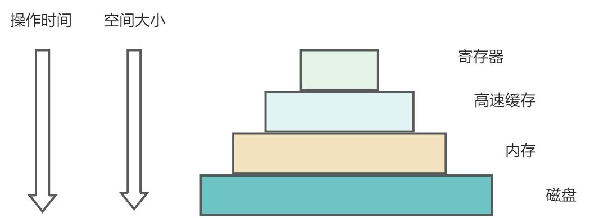
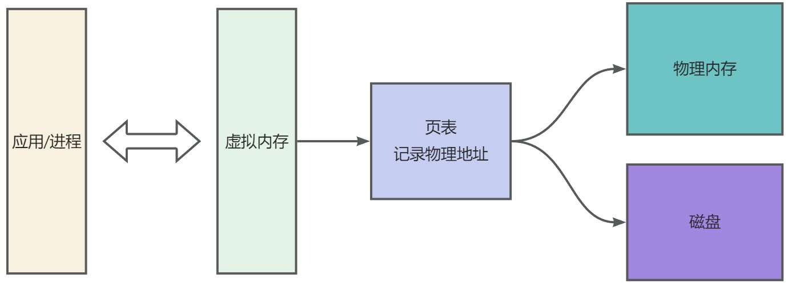
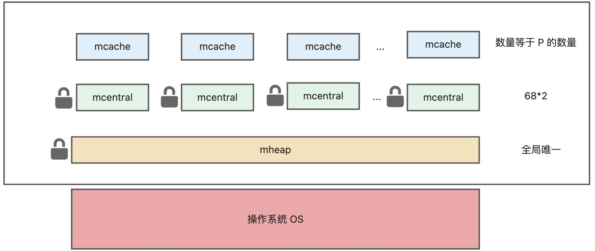
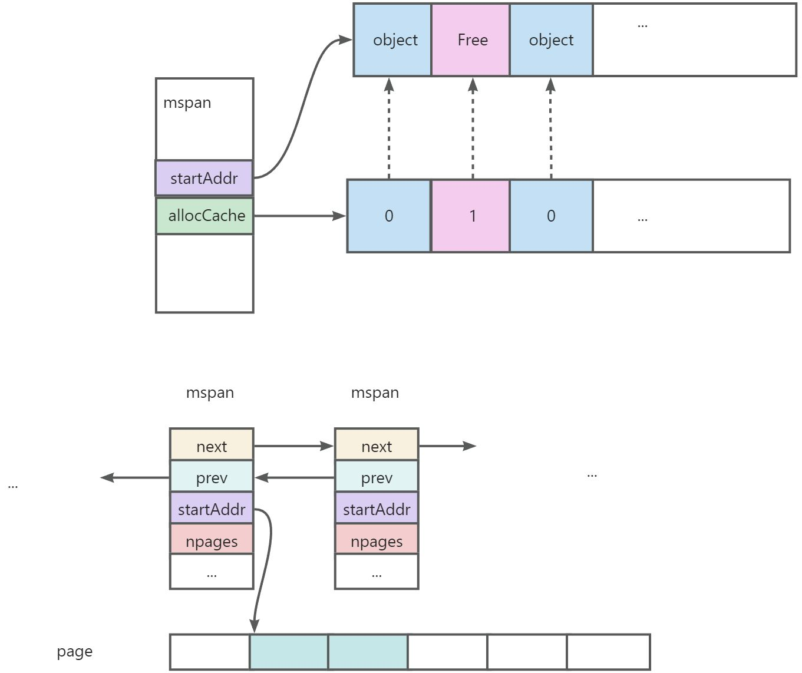
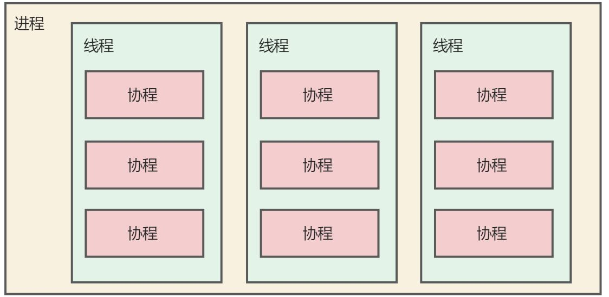
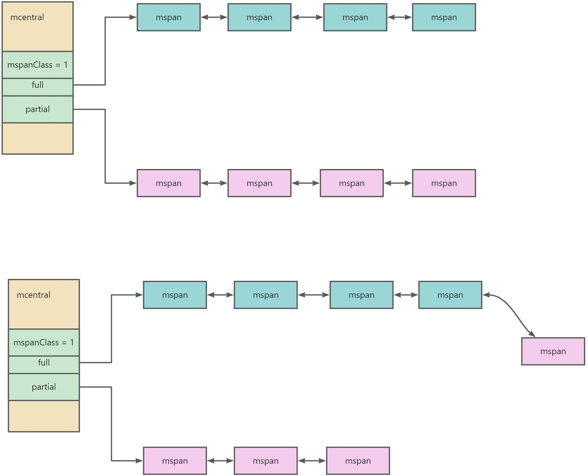
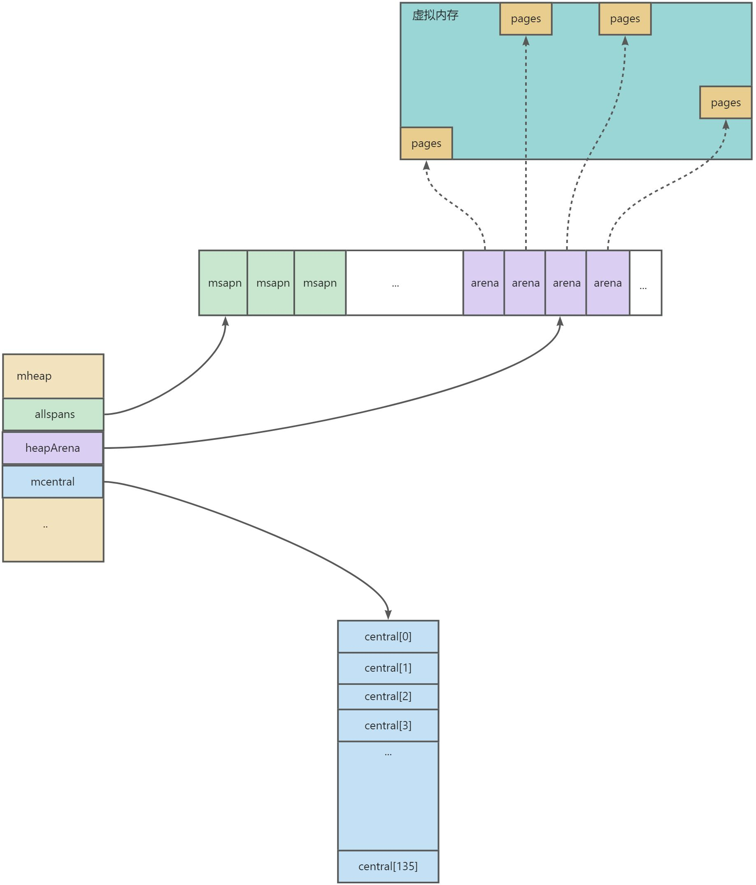
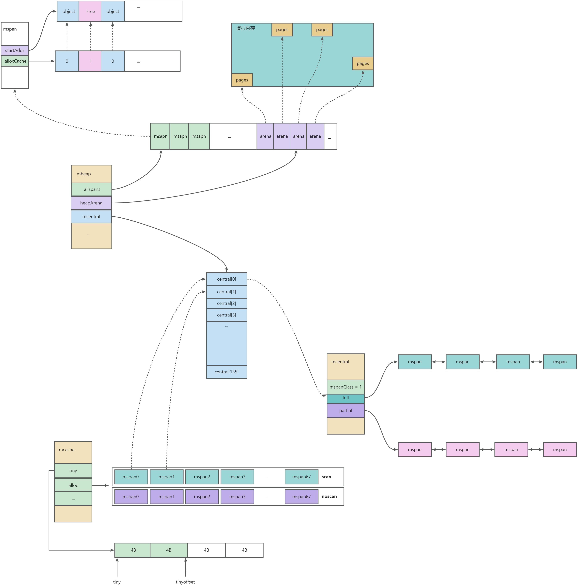

与需要主动申请和释放内存的 C/C++ 不同，GO 实现了自动内存分配、逃逸分析和自动垃圾回收（GC），极大地解放了开发者的双手。在这篇文章中，我将为大家介绍 GO 语言的内存管理模型，深入了解 GO 在进行内存申请时是如何快速分配内存的。您将了解到 GO 语言在内存管理方面的独特设计和实现原理，帮助您更好地理解和应用 GO 语言进行高效编程。

<!-- truncate -->

# 前言
这篇文章会为大家介绍一下 GO 内存管理模型，了解 GO 在进行内存申请的时候，go 是如何进行快速的分配内存。

go 管理内存，无需跟c/c++一样需要主动申请/主动释放，实现了自动分配内存、逃逸分析和自动 gc 回收内存，解放开发者

# 相关概念
## 分层设计
在真正讲解 go 内存模型之前，我们先回顾一下操作系统中经典的多存储模型设计



- [x] 多级模型/分层设计

我们知道 cpu 处理速度很快，内存的速度远远跟不上 cpu 的处理速度，此时内存成为瓶颈；（众所周知，没有什么是加一个中间层解决不了），为了缩短 cpu 和内存的速率差异，就引入了寄存器/高速缓存这些比内存更快的 cache，这些 cache 中间层的特点就是速度非常快，相应的价格也比较贵。因为寄存器/高速缓存这些的处理速度远远大于内存/磁盘，可以让 cpu 更加高效的进行工作。

## 虚拟内存


- [x] 降低内存并发访问粒度。物理内存是所有进程共享的，多进程同时访问同一块物理内存会存在并发问题。引入虚拟内存，每一个进程都有自己的虚拟内存，并发粒度从多进程降低成多线程级别
- [x] 是一个中间层（众所周知，没有什么是加一个中间层解决不了）
- [x] 屏蔽应用/进程对内存空间的感知，不需要管一系列地址什么的

# GO 内存管理
前面提到，引入虚拟内存之后，内存访问的多并发粒度从多进程降低了多线程。 但是在同一进程下，所有的线程都是共享内存空间的，为了避免并发问题，线程在申请内存空间的时候，需要加锁申请。而且申请内存空间需要系统调用申请，并且涉及到操作系统用户态向内核态的转换。如果每一次 new 都需要进行加锁申请、需要系统调用，那工作效率可太低了。那 Go 是怎么来解决这个问题的呢？

- [x] 一次申请，多次复用；既然每次申请的内存的操作很重，那就一次性申请多一些。为每一个线程都预分配缓存，后续小内存的分配就可以直接从这一块内存中进行分配，不需要进行系统调用
- [x] 多个线程同时申请小内存时，直接从各自的缓存中去申请内存，不存在并发问题，不需要加锁

## 模型总揽
---

堆内存空间就是 Go 运行时最大的临界共享资源，每一次存取如果都需要加锁，性能存在巨大问题。Go 解决这个问题就是利用「空间换时间」的思想。Go 的内存管理模型：



可以看到，Go 除开 mheap 之外，还细分了 mcentral、mcache 概念，多级分层

- [x] mheap：全局的内存，访问要加全局锁
- [x] mcentral：每种对象大小规格（全局共划分为 68 种）对应的缓存，锁的粒度为同一种规格
- [x] mcache：每个 P（正是 **GMP **中的 P）持有一份的内存缓存，访问时无锁

## 模型细分
### page
最小的存储单元，Go 借鉴操作系统分页管理的思想，每个最小的存储单元也称之为页 page，但大小为 8 KB

### mspan
最小的管理单元。有几个特点：

1. mspan 大小为 page 的整数倍，且从 8B 到 80 KB 被划分为 67 种不同的规格，在虚拟内存的视角上来看 page 是连续的
2. 每个 mspan 根据空间大小以及面向分配对象的大小，会被划分为不同的等级
3. 同等级的 mspan 会从属同一个 mcentral，最终会被组织成链表，因此带有前后指针（prev、next）

---

源码中的结构

```go
type mspan struct {
    // 标识前后节点的指针 
    next *mspan     
    prev *mspan
    // 起始地址
    startAddr uintptr 
    // 包含几页，页是连续的
    npages    uintptr 
    // 最多可以存放多少个 object
    nelems uintptr
    // bitmap 每个 bit 对应一个 object 块，标识该块是否已被占用
    allocCache uint64
    // 标识 mspan 等级
    spanclass  spanClass
    ...
}
```

可以看如下图示：



info
1. 当程序需要向 mspan 申请内存的时候，可以使用 allocCache 字段快速查询哪些内存已经分配了 object 哪些还没有分配
2. 如果发现内存不够分配时候，会以 page为单位 向上申请内存


### spanClass
mspan 根据空间大小和面向分配对象的大小，被划分为 67 种等级（1-67，实际上还有一种隐藏的 0 级，用于处理更大的对象）

```java
// class  bytes/obj  bytes/span  objects  tail waste  max waste  min align
//     1          8        8192     1024           0     87.50%          8
//     2         16        8192      512           0     43.75%         16
//     3         24        8192      341           8     29.24%          8
//     4         32        8192      256           0     21.88%         32
//     5         48        8192      170          32     31.52%         16
//     6         64        8192      128           0     23.44%         64
//     7         80        8192      102          32     19.07%         16
//     8         96        8192       85          32     15.95%         32
//     9        112        8192       73          16     13.56%         16
//    10        128        8192       64           0     11.72%        128
//    11        144        8192       56         128     11.82%         16
//    12        160        8192       51          32      9.73%         32
//    13        176        8192       46          96      9.59%         16
//    14        192        8192       42         128      9.25%         64
//    15        208        8192       39          80      8.12%         16
//    16        224        8192       36         128      8.15%         32
//    17        240        8192       34          32      6.62%         16
//    18        256        8192       32           0      5.86%        256
//    19        288        8192       28         128     12.16%         32
//    20        320        8192       25         192     11.80%         64
//    21        352        8192       23          96      9.88%         32
//    22        384        8192       21         128      9.51%        128
//    23        416        8192       19         288     10.71%         32
//    24        448        8192       18         128      8.37%         64
//    25        480        8192       17          32      6.82%         32
//    26        512        8192       16           0      6.05%        512
//    27        576        8192       14         128     12.33%         64
//    28        640        8192       12         512     15.48%        128
//    29        704        8192       11         448     13.93%         64
//    30        768        8192       10         512     13.94%        256
//    31        896        8192        9         128     15.52%        128
//    32       1024        8192        8           0     12.40%       1024
//    33       1152        8192        7         128     12.41%        128
//    34       1280        8192        6         512     15.55%        256
//    35       1408       16384       11         896     14.00%        128
//    36       1536        8192        5         512     14.00%        512
//    37       1792       16384        9         256     15.57%        256
//    38       2048        8192        4           0     12.45%       2048
//    39       2304       16384        7         256     12.46%        256
//    40       2688        8192        3         128     15.59%        128
//    41       3072       24576        8           0     12.47%       1024
//    42       3200       16384        5         384      6.22%        128
//    43       3456       24576        7         384      8.83%        128
//    44       4096        8192        2           0     15.60%       4096
//    45       4864       24576        5         256     16.65%        256
//    46       5376       16384        3         256     10.92%        256
//    47       6144       24576        4           0     12.48%       2048
//    48       6528       32768        5         128      6.23%        128
//    49       6784       40960        6         256      4.36%        128
//    50       6912       49152        7         768      3.37%        256
//    51       8192        8192        1           0     15.61%       8192
//    52       9472       57344        6         512     14.28%        256
//    53       9728       49152        5         512      3.64%        512
//    54      10240       40960        4           0      4.99%       2048
//    55      10880       32768        3         128      6.24%        128
//    56      12288       24576        2           0     11.45%       4096
//    57      13568       40960        3         256      9.99%        256
//    58      14336       57344        4           0      5.35%       2048
//    59      16384       16384        1           0     12.49%       8192
//    60      18432       73728        4           0     11.11%       2048
//    61      19072       57344        3         128      3.57%        128
//    62      20480       40960        2           0      6.87%       4096
//    63      21760       65536        3         256      6.25%        256
//    64      24576       24576        1           0     11.45%       8192
//    65      27264       81920        3         128     10.00%        128
//    66      28672       57344        2           0      4.91%       4096
//    67      32768       32768        1           0     12.50%       8192
```

- [x] class: mspan 等级标识，1 - 67
- [x] bytes/obj: 该大小规格的对象会从这一 mspan 中获取空间. 创建对象过程中，大小会向上取整为 8B 的整数倍，因此该表可以直接实现 object 到 mspan 等级 的映射
- [x] bytes/span: 该等级的 mspan 的总空间大小
- [x] objects: 该等级的 mspan 最多可以 new 多少个对象，计算方式： bytes/span 除 bytes/obj
- [x] tail waste： bytes/span % bytes/obj
- [x] max waste：最异常的的情况下，可能浪费的空间比例

---

源码结构

```java
type spanClass uint8

const (
	numSpanClasses = _NumSizeClasses << 1
	tinySpanClass  = spanClass(tinySizeClass<<1 | 1)
)

func makeSpanClass(sizeclass uint8, noscan bool) spanClass {
	return spanClass(sizeclass<<1) | spanClass(bool2int(noscan))
}

func (sc spanClass) sizeclass() int8 {
	return int8(sc >> 1)
}

func (sc spanClass) noscan() bool {
	return sc&1 != 0
}

```

除开根据 object 大小确定 mspan 等级之外，还有很重要的属性是 **noscan**，这个主要是用来标识 object 是否包含指针，在 GC 的时候判断是否进行可达性分析。 可以看到源码将 span class + nocan 两部分信息组装成一个 uint8，形成完整的 spanClass 标识。 8 个 bit 中，高 7 位表示了上表的 span 等级（总共 67 + 1 个等级，8 个 bit 足够用了），最低位表示 nocan 信息。

### mcache 
线程缓存。

- [x]  mcache 是每一个 P 独有的缓存，没有锁（此处 P 为 GMP 模型中的 P）
- [x]  mcache 将每一种 spanClass 等级都缓存了一份，并且区分 scan 和 noscan 类型

---


success
可以清楚的看到，mcache 会持有各个等级的 mspanClass，用于小对象的内存分配；区分 noscan 和 scan 的目的是为了在后续GC的时候能够高速扫描。mcache 初始化的时候并不会真正持有 mspan，只有用户程序申请内存的时候才会向上一级 mcentral 真正获取 mspn 进行分配内存。

mcache 包含了微小对象（小于16B的对象）的内存分配和小对象（16B~）的内存分配能力


源码结构

```go
type mcache struct {

    // Allocator cache for tiny objects w/o pointers.
    // See "Tiny allocator" comment in malloc.go.

    // tiny points to the beginning of the current tiny block, or
    // nil if there is no current tiny block.
    //
    // tiny is a heap pointer. Since mcache is in non-GC'd memory,
    // we handle it by clearing it in releaseAll during mark
    // termination.
    //
    // tinyAllocs is the number of tiny allocations performed
    // by the P that owns this mcache.
    tiny       uintptr
    tinyoffset uintptr
    tinyAllocs uintptr

    // The rest is not accessed on every malloc.
    alloc [numSpanClasses]*mspan // spans to allocate from, indexed by spanClass

    ...
}
```

#### GMP 模型
这里提到 GMP 模型，这里稍微展开讲一下 GMP 是什么？

首先，我们知道，线程可以划分为用户态和内核态线程；内核态线程就是实际 cpu 视野里的线程； 用户态线程，操作系统/cpu 不感知，用户态线程实际运行还是由内核态线程来执行，也就是一个用户态线程的执行必须要有一个内核态线程的。 我们把用户态线程称为是协程，内核态线程称为线程。

Go 语言中的协程就是 goroutine，协程运行在线程之上，如果协程发生了阻塞，则由协程调度器来调度其他 goroutine 继续执行。协程的切换不需要 CPU 介入切换，cpu 利用率进一步提高。调度更加灵活。

GMP 模型就是 go 自己实现的协程调度器。是一种 M:N 调度模型。关系如图



    - [x] G： goroutine 协程
    - [x] M:  内核线程，与 P 一一对应，M 运行运行任务就是从队列中获取相应的 P 去执行
    - [x] P： processor 处理器，包含了 G 运行的资源；G 想要运行，一定要先获取到 P

总览模型如下：

图源网络

OK，GMP 暂时介绍到这里，回到这里 mcache 是每一个 P 独有的缓存，线程独有的，不需要进行加锁 

### mcentral 
- [x] 所有的 mcentral 都在 mheap 中进行管理
- [x] 每一个 mcentral 存在一把锁

与 mcache 不一样，mcentral 是一个公共资源，可能会有多个 P 都来 mcentral 申请 mspan，所以访问需要加上锁。

- [x] 每一个 mcentral 都管理**某个spanClass**的内存管理单元，都会持有两个 spanSet，分别是 有空间的 mspan set 和 满空间的 mspan set



info
具体分配：mcache 向 mcentral 申请 span 的时候，会从partial的 mspan 列表中取出一个满足 mcache 诉求的 span 返回给到 mcache 缓存；然后将这个节点从 partial 链表 加入到 full 链表中，表示这个 mspan 已经被分配了。**整个过程是加锁的**


---

源码结构

```go
// Central list of free objects of a given size.
type mcentral struct {
	_         sys.NotInHeap
	spanclass spanClass

	partial [2]spanSet // 有空位的 mspan set
	full    [2]spanSet // 无空位的 mspan set
}


// A spanSet is a set of *mspans.
//
// spanSet is safe for concurrent push and pop operations.
type spanSet struct {

    // 互斥锁
	spineLock mutex
	spine     atomicSpanSetSpinePointer // *[N]atomic.Pointer[spanSetBlock]
	spineLen  atomic.Uintptr            // Spine array length
	spineCap  uintptr                   // Spine array cap, accessed under spineLock
    
	index atomicHeadTailIndex
}


```

### mheap
代表 GO 程序持有的所有堆空间。

- [x] 全局唯一，对上所有的 mspan 都是 从 mheap 中分配出去的




color2
可以看到，所有的 mcentral 实际上都在 mheap 中进行管理记录，所有的分配的 mspn 也有记录。


#### HeapArena
可以看到 mheap 中还管理了一个 heapArena 数组，它的作用就是记录从操作系统申请的内存与 mspan 的映射关系。**每一个从操作系统申请的内存都会有一个 heapArena 进行记录**


---

源码结构

```go
type mheap struct {
	_ sys.NotInHeap
    
	lock mutex

	allspans []*mspan // all spans out there

	...
    
	arenas [1 << arenaL1Bits]*[1 << arenaL2Bits]*heapArena

    ...

	// central free lists for small size classes.
	// the padding makes sure that the mcentrals are
	// spaced CacheLinePadSize bytes apart, so that each mcentral.lock
	// gets its own cache line.
	// central is indexed by spanClass.
	central [numSpanClasses]struct {
		mcentral mcentral
		pad      [(cpu.CacheLinePadSize - unsafe.Sizeof(mcentral{})%cpu.CacheLinePadSize) % cpu.CacheLinePadSize]byte
	}

    ...
}
```

```go
type heapArena struct {
    // ...
    // page 到 mspan 的映射
    spans [pagesPerArena]*mspan
}
```


## 模型总览


## 微小对象分配流程
微小对象（小于等于 16B），mcache 的微小内存分配器，在 16B 的内存中直接分配.分配的对象不允许是指针类型。

## 小对象的分配流程
小对象（16B~32KB）

1. 首先根据对象的规格大小计算，然后从 mcache 中相应规格大小的 maspn 进行分配
2. 如果内存不够或者没有对应规格的 msapn ，则向上申请，即 mcentral
3. mcentral 也不够 mspn，那就继续向上申请，即 mheap
4. mheap 也不够对应的mspn，则走系统调用，向系统申请 heapArena 大小的内存，记录在 mheap里

## 大对象分配流程
大于 32KB 的对象，则不经过 mcache 和 mcentral，直接向 mheap 进行申请

1. 计算申请的空间需要多少个 page【操作系统的page】
2. mheap 首先是先向 heapArena 对应的 pages
3. 如果heapArena也不够，则向虚拟内存申请heapArena大小的pages，记录在 arenas中
4. mheap 返回内存地址

# 总结
本文开始从操作系统的分层设计开始接入讲起，介绍了 go 的内存模型，了解 GO 内存模型的各个组件(mspan、spanClass、mcache、mcentral、mheap)的大致结构，各个组件大概做什么事情，了解在 new(T), &T{} 创建对象时，GO 是通过怎么样的链路来申请内存的；其中还简单介绍了 GMP 模型，GMP 模型是GO 非常重要的一个模型，详细展开是一个非常大篇幅的分享~ 希望后面有机会分享~


# 参考文档

[详解Go语言的内存模型及堆的分配管理](https://juejin.cn/post/6844903906833760270?searchId=202412102006359813594C5F5F5506CDEC)

[Golang 内存模型与分配机制](https://mp.weixin.qq.com/s/2TBwpQT5-zU4Gy7-i0LZmQ)


