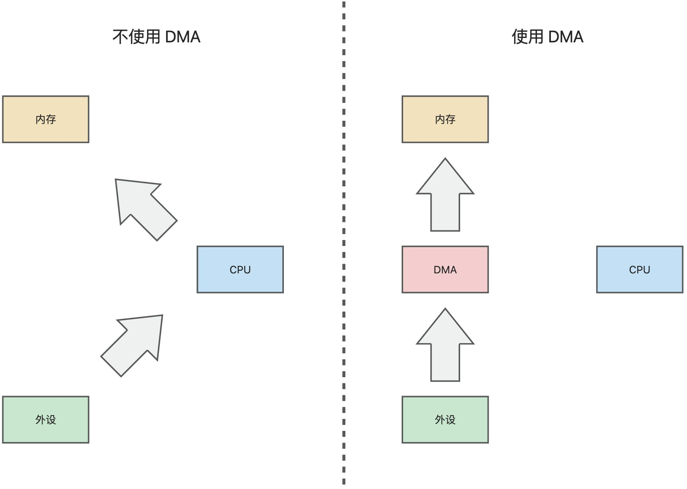
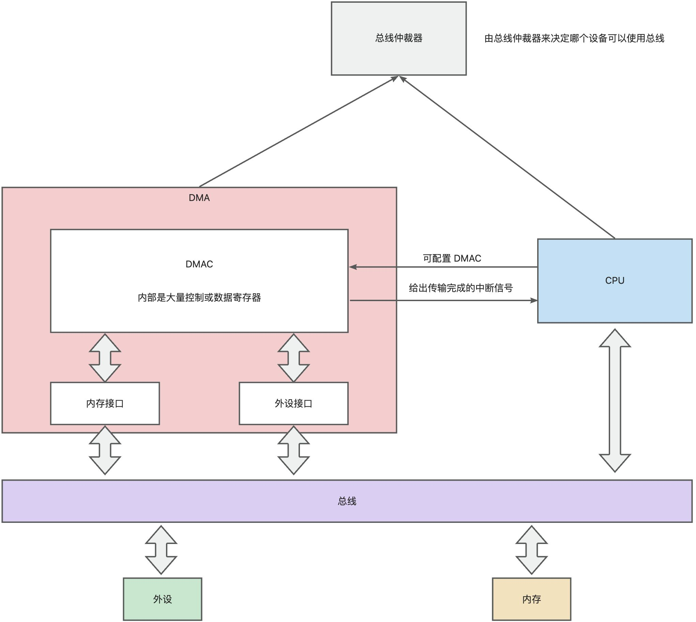

## DMA 简介

### 什么是 DMA？
**DMA**（Direct Memory Access，直接内存访问）是一种硬件机制，允许外部设备（如磁盘控制器、网络接口卡或显卡等）直接与内存进行数据传输，传输过程中无需 CPU 的干预。这种机制可以大大减少 CPU 在数据传输中的负载，提高系统的整体性能。在 PC 中，最典型的就是从磁盘读取数据到内存，或从网卡读取数据到内存；嵌入式设备中，DMA 常用于传感器数据读取或信号处理。



一般情况下，DMA 的硬件实现主要由以下几个核心部分组成：

1. **DMA 控制器（DMAC，Direct Memory Access Controller）：**
    - DMA 控制器是实现 DMA 的关键硬件，它负责管理设备到内存或内存到设备的数据传输。
    - 它具有以下功能：
        * 设置传输源地址和目标地址。
        * 设置传输数据的大小。
        * 管理数据传输的模式（如读模式或写模式）。
        * 监控传输状态，并在完成时通知 CPU。
2. **内存接口：** DMA 控制器与内存直接相连，通过内存总线读取或写入数据。
3. **外设接口：** DMA 控制器通过 I/O 数据总线（如 PCIe 或高速串行总线等其他接口）与外设通信。

在 DMA 和 CPU 同时需要访问内存时，需要通过仲裁电路来决定访问优先级，通常 DMA 的优先级较高，可以优先访问数据总线。



### 为什么 DMA 可以绕过 CPU 直接传输数据？
DMA 能够绕过 CPU 传输数据的核心原因在于它直接控制了 系统总线。外设与内存的通信需要经过总线，而 DMA 控制器可以像 CPU 一样成为总线的主设备（Bus Master），从而直接与内存进行交互。

系统总线（如数据总线、地址总线和控制总线）通常由 CPU 管理，当 DMA 启动时，它会向总线控制器请求控制权。如果总线控制器同意（通常优先级较高），CPU 会暂时失去对总线的访问权。DMA 控制器在获得总线控制权后，可以直接与内存通信，而不需要 CPU 的参与。DMA 传输期间，CPU 只负责启动 DMA 操作并在完成后处理 DMA 发出的中断请求。

这种模式称为 “**循环窃取（Cycle Stealing）**”，DMA 控制器在需要访问内存时“窃取”总线周期，而 CPU 在剩余时间继续执行其任务。

### DMA 工作流程
DMA 的硬件工作流程如下：

1. **初始化 DMA 控制器：**
    - CPU 配置 DMA 控制器，包括传输模式、源地址、目标地址和传输长度。
    - CPU 启动 DMA 操作。
2. **请求总线控制权：**
    - DMA 控制器通过总线请求信号（如 `BRQ`）向总线控制器（如内存控制器）请求控制权。
    - 如果当前总线被 CPU 占用，总线控制器会暂停 CPU 的内存访问，并将总线控制权交给 DMA 控制器。
3. **数据传输：**
    - DMA 控制器直接从外设读取数据，并写入内存（或从内存读取数据，写入外设）。
    - 每次传输可以是一个字节、一个字（word）或一个块（block）。
4. **完成传输：**
    - 当 DMA 传输完成时，DMA 控制器通过中断通知 CPU。

## DMA 的传输模式
DMA 的传输模式决定了数据是如何从源到目标传输的。常见模式包括：

+ **单字节模式（Single-byte Transfer）**

每次传输一个字节（或一个字），每次传输都需要请求总线。所以适合对实时性要求较高的小规模传输。

+ **块模式（Block Transfer）**

一次传输多个字节（块传输），DMA 控制器在获取总线控制权后，完成整个块的传输后才释放总线。所以适合大数据量传输（如磁盘数据到内存）。

+ **需求模式（Demand Mode）**

数据的传输由外设控制，当外设准备好数据时，触发 DMA 控制器进行传输，适合需要外设主导的动态传输。

## DMA 的多通道概念
DMA 控制器通常支持多个通道。每个通道可以看作一个独立的路径，用于管理不同设备的数据传输请求。

在 Intel 8237A DMA 控制器中，主 DMA 控制器支持 4 个通道（0 到 3），辅 DMA 控制器支持 4 个通道（4 到 7）。

双控制器配置中，总共可以使用 8 个 DMA 通道，其中辅控制器通过通道 4 与主控制器通信。


DMA 通道分配是有约定俗成的规矩的。在 IBM PC 及兼容机的设计中，DMA 通道分配通常遵循以下约定：

| DMA 通道 | 设备 | 描述 |
| --- | --- | --- |
| 通道 0 | DRAM 刷新 | 为早期 DRAM 提供周期性刷新信号（硬件需求）。 |
| 通道 1 | 未分配 | 可能被其他外设占用（通常未固定）。 |
| 通道 2 | 软盘控制器 | 专用于软盘数据传输，因为软盘需要频繁进行块传输。 |
| 通道 3 | 串行口或打印机 | 在某些系统中用于外设，如并行口或串行口传输。 |
| 通道 4 | 主/辅控制器通信桥接 | 连接主 DMA 控制器和辅 DMA 控制器。 |
| 通道 5 | 声卡 | 通常用于声卡传输音频数据。 |
| 通道 6 | 未分配 | 未固定分配，可以动态用于外设。 |
| 通道 7 | 硬盘控制器（部分系统） | 部分早期系统使用 DMA 通道 7 进行硬盘数据传输。 |


+ **DMA 通道的优先级由硬件决定：**
    - 主 DMA 控制器中，通道 0 优先级最高，通道 3 优先级最低。
    - 辅 DMA 控制器中，通道 4 优先级最高，通道 7 优先级最低。
+ **现代计算机中的一些变化：**
    - PCI 和 PCIe 设备支持自己的总线主控（Bus Master），不再依赖固定 DMA 通道。
    - 操作系统会通过 HAL（Hardware Abstraction Layer）管理 DMA 通道，用户无需直接关心通道分配。但在裸机上运行程序，则需要用户自行关心 DMA 了。一般 BIOS 例程为了向前兼容都会按照上面的约定写死通道。

## 对 DMA 进行配置
DMA 内部有很多寄存器，我们可以通过对对应的端口进行编程来控制 DMA 的行为。

### DMA 寄存器的分类
根据寄存器的类型可以分以下几种：

1. 地址寄存器
    - **功能**：设置内存中数据传输的起始地址。
    - **每个通道都有一个地址寄存器**，用于存放该通道的内存起始地址。地址为 16 位，分为低 8 位和高 8 位依次写入。
    - ⚠️ **注意**：DMA 控制器只能使用 20 位地址（1 MB 地址空间），地址的高 4 位需要通过页寄存器补充。
2. 计数寄存器
    - **功能**：设置传输数据的字节数。
    - **每个通道都有一个计数寄存器**，用于指定当前 DMA 操作需要传输的字节数。16 位，分为低 8 位和高 8 位依次写入。
    - ⚠️ **注意**：写入的是数据字节数减 1，例如，传输 512 字节时，需要写入 `511`。
3. 页寄存器
    - **功能**：用于补充地址寄存器的高 4 位（20 位地址总线中）。
4. 屏蔽寄存器
    - **功能**：启用或禁用 DMA 通道。在配置 DMA 设置时需要先禁用通道，完成后再启用。禁用时写入通道编号的屏蔽值，如`AL = 0x04` 禁用通道 2，`AL = 0x02` 启用通道 2。
5. 模式寄存器

用于设置 DMA 的运行模式

| 位号 | 名称 | 描述 |
| :--- | :--- | :--- |
| 7-6 | 传输模式 | `00` = 需求模式，`01` = 单字节传输，`10` = 块传输，`11` = 级联模式（用于级联另一个 DMA 控制器） |
| 5  | Down模式 | 此位为`1`时会反转内存顺序。会从高地址向低地址访问内存|
| 4  | 自动模式 | 此位为`1`时，当一次传输完成，通道会将地址和计数值复位到你的程序设置的值上。这对于软盘数据传输是很友好的。读取一个磁道——这些值会立即为再次读取做好准备。如果下一步需要写，你只需要更改传输模式，而不用更改地址。 一些扩展卡不支持自动初始化DMA，比如：Sound Blaster 1.x。在这些不支持的扩展卡上使用 Auto 模式会引发崩溃|
| 3-2 | 传输方向 | `00` = 验证模式，`01` = 从设备到内存，`10` = 从内存到设备，`11` 是无效取值 |
| 1-0 | 通道选择位（Channel Select）  | 选择要设置的 DMA 通道（`00`=通道 0，`01`=通道 1，`10`=通道 2，`11`=通道 3） |


1. 状态寄存器

提供 DMA 控制器的当前状态信息，包括完成标志和错误标志。

| 位号 | 名称 | 描述 |
| --- | --- | --- |
| 7 | 通道 3 传输完成标志 | 如果通道 3 的传输完成，则此位被置为 `1`。 |
| 6 | 通道 2 传输完成标志 | 如果通道 2 的传输完成，则此位被置为 `1`（常用于软盘）。 |
| 5 | 通道 1 传输完成标志 | 如果通道 1 的传输完成，则此位被置为 `1`。 |
| 4 | 通道 0 传输完成标志 | 如果通道 0 的传输完成，则此位被置为 `1`（常用于 DRAM 刷新）。 |
| 3 | 请求状态标志 | 如果某个通道正在请求传输，则此位被置为 `1`。 |
| 2 | 通道优先级标志 | 显示当前通道优先级顺序是否被锁定，`1` 表示优先级被锁定（通常用于轮询模式）。 |
| 1 | DMA 控制器终止标志 | 如果 DMA 传输被强制终止或异常终止，则此位被置为 `1`。 |
| 0 | DMA 错误标志 | 如果发生了 DMA 错误（如非法内存地址访问等），此位被置为 `1`。 |


7. 命令寄存器

    - **功能**：控制 DMA 控制器的工作状态。
    - **命令格式**（8 位）：
        * **位 7**：全局屏蔽（1=禁用，0=启用）。
        * **位 6**：延迟 DMA 写入。
        * **位 5-0**：其他控制位。

### 寄存器与端口映射一览
| 寄存器名称 | 通道编号 | 地址（主 DMA） | 地址（从 DMA，64KB+ 支持） |
| --- | --- | --- | --- |
| 地址寄存器 | 通道 0 | `0x00` | `0xC0` |
| 地址寄存器 | 通道 1 | `0x02` | `0xC2` |
| 地址寄存器 | 通道 2 | `0x04` | `0xC4` |
| 地址寄存器 | 通道 3 | `0x06` | `0xC6` |
| 计数寄存器 | 通道 0 | `0x01` | `0xC1` |
| 计数寄存器 | 通道 1 | `0x03` | `0xC3` |
| 计数寄存器 | 通道 2 | `0x05` | `0xC5` |
| 计数寄存器 | 通道 3 | `0x07` | `0xC7` |
| 页寄存器 | 通道 0 | `0x87` | `N/A` |
| 页寄存器 | 通道 1 | `0x83` | `N/A` |
| 页寄存器 | 通道 2 | `0x81` | `N/A` |
| 页寄存器 | 通道 3 | `0x82` | `N/A` |
| 屏蔽寄存器 |  | `0x0A` | `0xD4` |
| 模式寄存器 |  | `0x0B` | `0xD6` |
| 状态寄存器 |  | `0x08` | `N/A` |
| 命令寄存器 |  | `0x0C` | `N/A` |


### 小结
+ **地址寄存器**：设置内存起始地址，1M 地址的高 4 位需要用**页寄存器**补充。
+ **计数寄存器**：设置传输字节数。
+ **屏蔽寄存器**：启用/禁用 DMA 通道。
+ **模式寄存器**：指定传输方向和模式。
+ **状态寄存器**：监控 DMA 传输状态。

## 操作示例
以下是设置 DMA 通道 2 的步骤：

```plain
; 禁用通道 2
mov dx, 0x0A
mov al, 0x04  ; 屏蔽通道 2
out dx, al

; 设置地址寄存器和页寄存器
mov dx, 0x04
mov al, 0xFF  ; 地址低 8 位
out dx, al
mov al, 0x00  ; 地址高 8 位
out dx, al

mov dx, 0x81  ; 页寄存器
mov al, 0x00  ; 设置地址高 4 位
out dx, al

; 设置计数寄存器
mov dx, 0x05
mov al, 0xFF  ; 计数低 8 位（511）
out dx, al
mov al, 0x01  ; 计数高 8 位
out dx, al

; 设置模式寄存器
mov dx, 0x0B
mov al, 0x94  ; 通道 2，读模式，单字节传输
out dx, al

; 启用通道 2
mov dx, 0x0A
mov al, 0x02  ; 取消屏蔽通道 2
out dx, al
```
