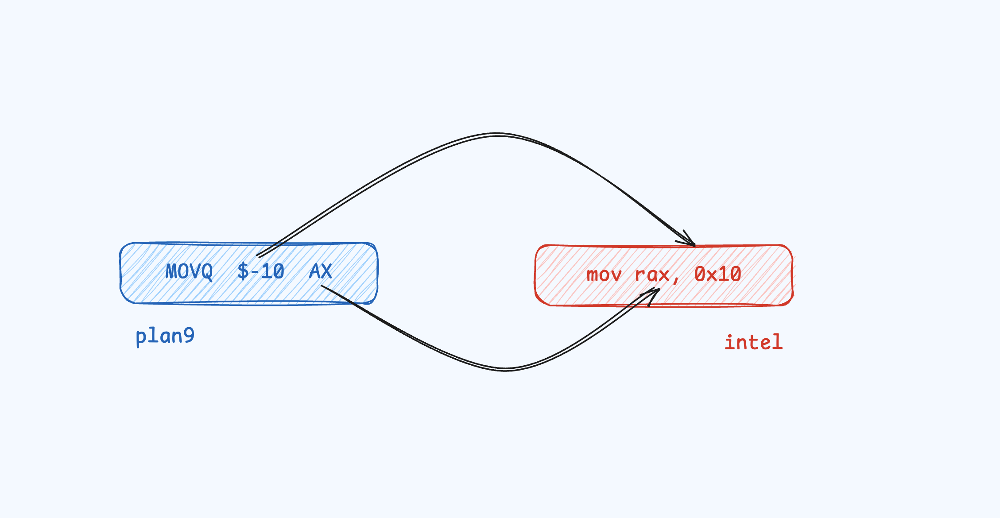
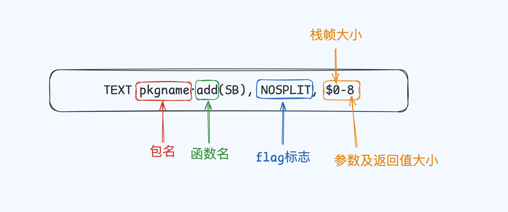
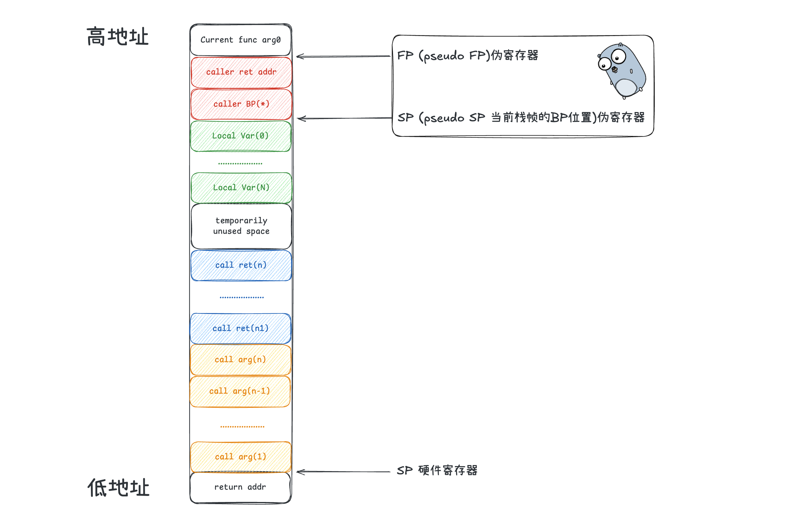
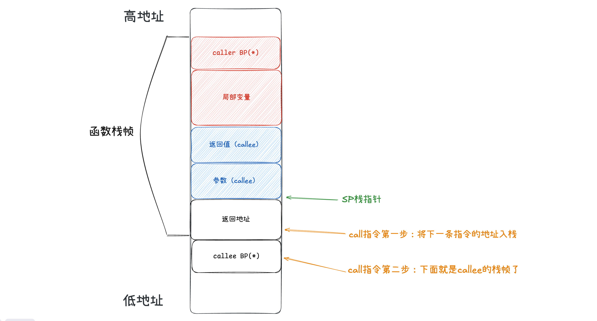

## Plan 9 & Go Plan 9 Assembler 基础

[Rob_Pike](https://en.wikipedia.org/wiki/Rob_Pike)多次在Golang的会议提到，Go语言的设计理念追求**简洁、清晰和高效**。在使用的层面上Go语言确实能够给人一种简单的感觉，但是当问出「为什么」的时候，这些简单就会变成黑魔法。因此本篇文章是作为揭开Golang外衣窥探黑魔法的基石。

> 在*计算机*里头*没有*任何黑*魔法*！— 浙江大学翁恺

**Everything is 「for」 😈**


学习它你能得到什么？！

1. 能够揭开语法糖底层是如何运作的

2. 以不变应万变或许你还可以尝试分析其他语言是如何做的

3. **在与对方进行对线的时候能够有理有据（Important‼️）**

## 什么是 Go Plan 9 Assembler

> The assembler is based on the input style of the Plan 9 assemblers — https://go.dev/doc/asm

Go语言的Go Assembler（汇编器）是基于Plan 9风格进行实现（TOP级程序员们选择自己搞一套汇编器～）保留了许多Plan 9的汇编的语法和特性，在某些地方增加或者简化了，目的自然就是为了Go语言的特性如并发、垃圾回收、内存管理。

Plan 9是来自于大名鼎鼎的[贝尔实验室(Bell Labs)](https://en.wikipedia.org/wiki/Bell_Labs)，你所熟悉的[Unix](https://en.wikipedia.org/wiki/Unix)和C/C++都是出自该实验室，Plan 9其实一个分布式操作系统。其中[Rob_Pike](https://en.wikipedia.org/wiki/Rob_Pike)也是Plan 9的团队成员（下图是Plan9的吉祥物和Gopher有几分相似）


需要注意的是Plan 9是一个操作系统，其中它有一套自己的汇编指令也就是Plan 9汇编。虽然在Go中可以使用Plan 9汇编进行编码，但是在最终的执行上还是需要翻译成对应平台的汇编，这个过程是通过Go工具链。

---

## Plan 9 & Go Plan 9 Assembler 知识点

为了区分这里用Go Assembler来指代Go风格的Plan 9，下面将会从以下几个方面来介绍Plan 9汇编基础（如果你想知道更多可参考[**A Manual for the Plan 9 assembler**](https://9p.io/sys/doc/asm.html)）。

1. 基本指令

2. 寄存器

3. 变量声明

4. 函数声明

5. 栈结构

> ‼️ 目标是能够在后续分析的时候看懂即可

### 基本指令

#### 数据移动

使用`MOV`指令进行，例如`MOVB`后缀则是表示长度，`$`表示常数字，并且可以为负数

```
MOVQ $-10, AX     // 8 bytes
```

需要注意以下Plan 9与其他汇编操作数是相反的



#### 计算指令

- `ADDQ`：相加并赋值，例如 `ADDQ BX, AX` 表示`BX`和`AX`的值相加并赋值给`AX`

- `SUBQ`：相减并赋值，例如 `SUBQ AX, BX` 表示`AX`和`BX`的值相减并赋值给`BX`

- `IMULQ`：无符号乘法，例如 `IMULQ AX, BX` 表示`AX`和`BX`的值相乘并赋值给`BX`

- `IDIVQ`：无符号除法，例如 `IDIVQ CX` 表示用`CX`作为除数，`AX`作为被除数，结果存储到`AX`中

- `CMPQ`：对两数相减，比较大小，例如 `CMPQ SI, CX` 表示比较`SI`和`CX`的大小。与`SUBQ`类似，只是不返回相减的结果

同样后缀表示的是不同长度的操作数

#### 条件跳转

跳转可以分为无条件和有条件的跳转，分别是`JMP`和`JZ`

```
无条件跳转
JMP addr   // addr 为代码的地址
JMP 2(PC)  // 以当前指令为基础，向前/后跳转 ==> 同理 JMP -2(PC) 
===========================================================
有条件跳转
JZ target
```

#### 栈调整

Plan 9的`push`和`pop`指令通常在生成汇编的时候是不存在的，你将会看到使用`SP`进行运算实现。

> ‼️ 注意区分Go Assembler对伪寄存器`SP`，Plan 9的`SP`是硬件寄存器直接由汇编指令操作（函数栈真实栈顶地址）

```
SUBQ $0x1, SP   // 对 SP 做减法，为函数分配函数栈帧
ADDQ $0x1, SP   // 对 SP 做加法，清除函数栈帧
```

### 寄存器

对于amd64的通用寄存器在Plan 9汇编都是可以正常使用的，需要注意的是在Plan 9中使用寄存器是不带名字的首字母，例如`rax`在Plan 9则为`AX`。

还记得前面栈调整的时候说到，进行栈调整使用的是`SP`，那么在使用寄存器的时候应该避免使用`rbp`和`rsp`。

#### 伪寄存器

> ‼️ 这个是由Go Assembler所定义的，注意对于伪寄存器所有的平台架构都是相同的

- `FP`: Frame pointer: arguments and locals. 用来表示函数的参数、返回值

- `PC`: Program counter: jumps and branches. 程序计数器，它与体系结构中的`PC`类似，通常都是出现在**跳转指令**，例如`JMP target`无条件跳转到target标签中，这里就是Go Assembler的`PC`d的一个象征

- `SB`: Static base pointer: global symbols. 静态基地址指针，一般用来声明函数或全局变量

- `SP`: Stack pointer: the highest address within the local stack frame. 用于指向当前栈帧的局部变量的开始位置，形式如`symbol + offset(SP)`。如何区分硬件寄存器SP和伪寄存器呢？看是否带`symbol`

一些注意点，在` go tool objdump/go tool compile -S `等指令输出的代码，是不存在伪`SP`和`FP`的，在编译和反编译下只有真实的硬件寄存器

### 变量声明

在汇编中变量通常是存在在`.rodata`或者是`.data`段中

- `.data`段存储可修改的变量如全局变量、静态变量

- `.rodata`段存储程序的常量，在加载的时候会标记为**只读**，例如字符串字面量或其他数据。

`DATA`和`GLOBL`指令是用于定义变量

- `DATA` 用来定义一个数据段，用于声明和初始化全局数据；

- `GLOBL`用来声明全局符号，使得该符号可以在其他模块中访问。


需要注意的是`offset`偏移指的是`symbol`的偏移，这里可以看到一个熟悉的伪寄存器`SB`其表示的就是，数据在内存中的位置

```
DATA symbol+offset(SB)/width, value
```

用于声明全局符号，并且指定在内存的位置、类型以及大小，这里的`RODATA`表示是一种`flag`还有其他的类型

```
GLOBL divtab(SB), RODATA, &1
```

`DATA`与`GLOBL`两者结合

- `DATA`首先在`age`变量的起始位置存储值`1`，同时数据的大小为`4`字节 

- `GLOBL`声明了全局符号`age`，大小为`4`字节，并且是只读属性，这个数据项被初始化为`1`，并且存在`0x00`内存地址中

```
DATA age+0x00(SB)/4, $1
GLOBL age(SB), RODATA, $4
```

偏移量`offset` 什么时候为非0呢？当在全局中定义变量类型为数组、字符串等时候就需要使用到`offset`。这里的`<>`可以理解为该全局变量只在当前文件中生效。

```
DATA bio<>+0(SB)/8, $"hello"
DATA bio<>+8(SB)/8, $" world"
GLOBL bio<>(SB), RODATA, $16
```

其中`flag`还有其他类型[🔗](https://github.com/golang/go/blob/master/src/runtime/textflag.h)

```c
// Don't profile the marked routine. This flag is deprecated.
#define NOPROF	1
// It is ok for the linker to get multiple of these symbols. It will
// pick one of the duplicates to use.
#define DUPOK	2
// Don't insert stack check preamble.
#define NOSPLIT	4
// Put this data in a read-only section.
#define RODATA	8
// This data contains no pointers.
#define NOPTR	16
// This is a wrapper function and should not count as disabling 'recover'.
#define WRAPPER 32
// This function uses its incoming context register.
#define NEEDCTXT 64
// Allocate a word of thread local storage and store the offset from the
// thread local base to the thread local storage in this variable.
#define TLSBSS	256
// Do not insert instructions to allocate a stack frame for this function.
// Only valid on functions that declare a frame size of 0.
#define NOFRAME 512
// Function can call reflect.Type.Method or reflect.Type.MethodByName.
#define REFLECTMETHOD 1024
// Function is the outermost frame of the call stack. Call stack unwinders
// should stop at this function.
#define TOPFRAME 2048
// Function is an ABI wrapper.
#define ABIWRAPPER 4096
```

### 函数声明

函数的声明以`TEXT`标识开头，下面来看看一个函数的声明在汇编是怎么样的并且尝试进行分析吧

```
func add(a, b int) int {
	return a + b
}
===========================================================
TEXT pkgname·add(SB), NOSPLIT, $0-8
    MOVQ a+0(FP), AX
    MOVQ b+8(FP), BX
    ADDQ AX, BX
    MOVQ BX, ret+16(FP)
    RET
```

**由于 Go 是栈帧管理的语言**，栈帧中通常包含函数参数、局部变量等

函数参数：

- `a`是`int`类型，位于`a+0(FP)`。由于`int`在 64 位架构中占 8 字节，所以`a`在栈帧中的偏移量是0

- `b`也是`int`类型，位于`b+8(FP)`，因此偏移量是 8 字节

1. `TEXT pkgname·add(SB), NOSPLIT, $0-8`

  

2. ` MOVQ a+0(FP), AX`：取`a`参数的值，`a`是从栈中`offset=0`处进行读取，栈帧指针`FP`加上偏移量`0`得到`a`的位置，`AX`是一个寄存器

3. `MOVQ b+8(FP)BX`和上面的分析是同理的

4. `ADDQ AX, BX`将`AX`寄存器的值加到`BX`寄存器中，实现`b = a + b`

5. `MOVQ BX, ret+16(FP)将 BX 寄存器的值（即 a + b 的结果）存储到栈上的返回值位置。通常返回值会存放在栈帧中的 ret 位置，ret+16(FP) 表示返回值在栈中的偏移量

6. 结束

最后再来回顾一下上面所使用到Go Assembler的伪寄存器

- FP（Frame Pointer）：伪寄存器，指向当前栈帧的基址。它用于定位栈中的局部变量和参数

- SB（Stack Base）：伪寄存器，表示栈的基址，在函数调用中通常用于标识栈的起始位置

### 栈结构

前面也有说到**由于 Go 是栈帧管理的语言**，因此了解栈帧的结构对后续是十分重要的，那么首先先来明确几个专业术语吧

- 栈帧：是每一个函数在调用的过程中创建的一块区域，用于保存局部信息、返回地址等

- 调用者：caller这个很好理解，就是谁做出了调用的动作

- 被调用者：callee

以下是具体的栈帧布局，对于伪寄存器`SP`可以理解为用于模拟指针的变化过程，会随着栈帧的压栈和弹栈而动态变化



可以抽象出大致的布局，其实就是由「局部变量」、「参数」、「返回值」进行组合而成的。

同时理解`call`指令只会做两件事情

1. 将下一条指令的地址入栈，被调用函数执行结束后会跳回到「返回地址」

2. 跳转到被调用函数入口处执行



> ‼️  需要注意在Golang早期的版本中，参数都是通过栈进行传入的，后续也支持了通过寄存器进行传入。

那么接下来用一个例子来具体看看函数调用者与被调用者的栈帧图

```go
func main() {
	a := 1
	b := 2
	add(a, b)
}

func add(a, b int) int {
	sum := a + b
	return sum
}
```


## 总结 & 计划

现在你应该明白了Plan 9的一些历史，以及Go Assembler与Plan 9的关系。

Plan 9的汇编对于现阶段只需要点到为止，后续如果你感兴趣可再深入进行学习。作为应用层开发者，暂时并不需要太过深究里面的细节，掌握基本的知识点后续在进行分析的时候能够看懂足以。

后续将会基于这些基础知识逐步转移到应用层代码进行探索与分析。

# # 参考

1. https://en.wikipedia.org/wiki/Plan_9_from_Bell_Labs
2. https://en.wikipedia.org/wiki/Rob_Pike
3. https://go.dev/doc/asm#special-instructions
4. https://go.dev/wiki/Plan9
5. https://golang.design/under-the-hood/zh-cn/part1basic/ch01basic/asm/
6. https://xiaomi-info.github.io/2019/11/27/golang-compiler-plan9/
7. https://github.com/yangyuqian/technical-articles/blob/master/asm/golang-plan9-assembly-cn.md
8. https://github.com/cch123/golang-notes/blob/master/assembly.md#plan9-assembly-%E5%AE%8C%E5%85%A8%E8%A7%A3%E6%9E%90
