## 要求
> 阅读这篇文章之前，需要对以下知识点有所了解~
> 1.  BASE 理论
> 2. 事务的概念
> 3. 分布式架构

## 1. 什么是分布式事务
> 是指在分布式系统中，事务的参与者、支持该事务的服务器、资源管理器和事务管理器分别位于不同的分布式节点之上。一个分布式事务通常涉及多个操作，这些操作可能跨越多个不同的数据库系统或服务，并且需要保证所有操作要么全部成功执行，要么全部不执行（即保持事务的原子性）。

例如：xx 电商系统的交易系统，承担用户下单功能；当用户对商品 A 进行购买的时候，假设商品 A 不允许超卖的场景，需要执行下面几个步骤：

1. 检查库存：当用户提交订单时，系统首先调用库存服务检查所需商品是否有足够的库存。
2. 锁定库存：如果库存充足，库存服务将临时锁定这些商品的数量，防止其他订单同时购买导致超卖。
3. 检查积分：当用户选择使用积分抵扣现金时，系统需要调用积分服务检查用户是否有足够的积分进行抵扣。
4. 锁定积分：如果积分充足，积分服务将临时锁定用户选择抵扣的积分数量，防止其他订单同时使用这份积分。
5. 创建订单：订单服务创建一个新的订单记录，并设置订单状态为“待支付”。
6. 发起支付：系统调用第三方支付网关交互以完成实际的支付过程。
7. 确认支付并减少库存：支付成功后，系统通知库存服务正式减少商品库存，通知积分服务正式减少可使用积分，并更新订单状态为“已支付”。

涉及的服务有: 
1. 库存服务：负责管理商品的库存。
2. 订单服务：负责处理用户的订单创建和对接第三方支付流程。
3. 积分服务：负责处理用户的积分抵扣逻辑。

如果这些服务都是部署在同一台机器上，那就可以使用本地事务轻松控制一致性；但实际上述服务可能跑在不同的服务上，如下图所示：
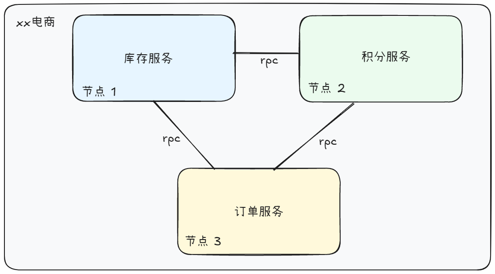

不同的服务部署在不同的节点上，节点之间通过 `RPC` 进行通讯；回到用户购买商品 A 这个流程，每个步骤都是由不同的服务执行的，用户想要购买成功，上述 5 个步骤都需要执行成功，如果任何一个步骤失败（例如库存不足、积分不足），那失败之前的步骤都需要进行回滚，例如锁定积分失败，那就需要将原本锁定成功的库存给释放掉，避免资源被长时间占用；

即用户购买商品的整个行为要么成功、要么失败。

## 2. TCC 是什么
即 `Try-Confirm-Cancel`，分布式事务的其中一种实现方式，是基于补偿机制实现的最终一致性；体现了 `BASE` 理论的一种实现方式；

### 2.1 整体架构
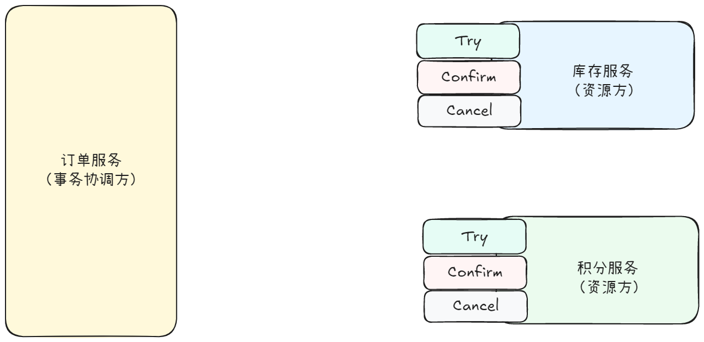
#### 事务协调方
分布式事务的核心角色：负责管理和协调参与事务的各个服务或资源管理器；是分布式事务的发起方，需要确保所有参与者都能一致地提交或回滚事务。
#### 资源方
分布式事务中负责管理本地资源（例如对于库存服务来说，库存就是本地资源）、执行资源锁定、核销或回滚操作。资源方都需要实现 `Try()`、`Confirm()`、`Cancel()` 三个接口, 下面简述一下每个接口需要承担的责任；

> 1. Try(): 当分布式事务开启时，事务协调方会调用所有资源方的`Try()`进行「资源锁定」；资源方需要保证只要`Try()`调用成功，后续的`Confirm`、`Cancel()`能够对「被锁定的资源」进行核销或释放。
> 2. Confirm(): 用于提交分布式事务，核销前面通过`Try()`锁定的资源。
> 3. Cancel(): 用于回滚分布式事务，释放前面通过`Try()`锁定的资源。

### 2.2 工作流程
下面描述一下正常的工作流程，即所有服务不出现异常的情况
#### 2.2.1 分布式事务开启
分布式事务开启，事务协调方调用所有资源方的`Try()`接口，以上述用户购买商品作为示例：
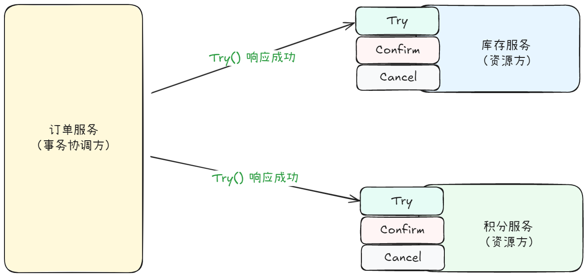
> 所有资源方都响应成功：
> 1. 库存服务（资源方）锁定库存成功，库存状态标记为「锁定中」；
> 2. 积分服务（资源方）锁定积分成功，积分状态标记为「锁定中」；
> 3. 订单服务（事务协调方）发现所有资源方都响应成功，接着便开始创建订单，然后向支付渠道发起支付请求，订单标记为「未支付」；等待用户完成真正的支付。
>    * 从发起支付到用户真正完成支付这个过程一般是异步的，订单服务需要等待支付的结果（成功/失败）来决定后续是对资源方发起 `Confirm()` 进行资源核销还是发起 `Cancel()` 进行资源释放。 
#### 2.2.2 分布式事务提交
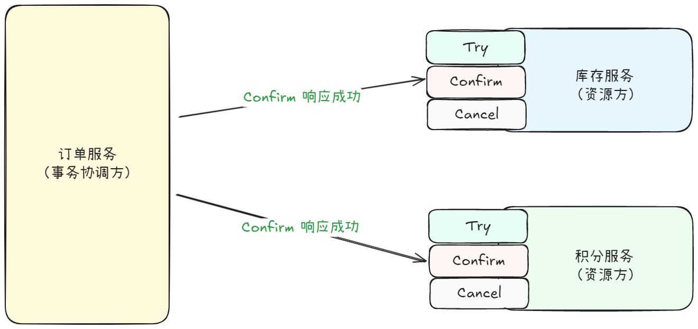
> 假设用户顺利完成支付，订单服务则标识订单为「已支付」，并且对资源方发起`Confirm()` 请求对资源进行核销；
> 1. 库存服务（资源方）正式扣减库存，库存状态标记为「已扣减」；
> 2. 积分服务（资源方）正式扣减积分，积分状态标记为「已扣减」；
#### 2.2.3 分布式事务回滚
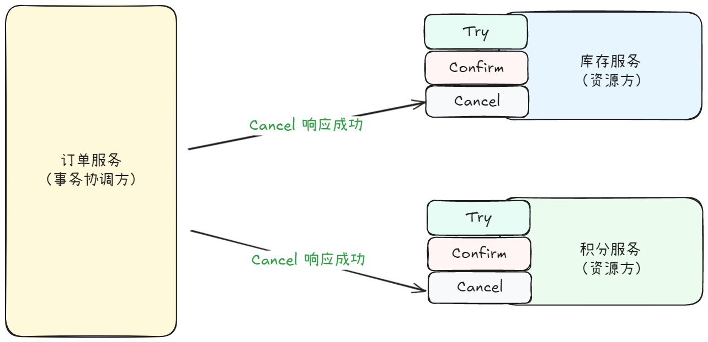
> 假设用户放弃支付：订单服务则标识订单为「放弃支付」，并且对资源方发起`Cancel()` 请求对资源进行释放：
> 1. 库存服务（资源方）释放锁定库存，库存状态标记为「已释放」；
> 2. 积分服务（资源方）释放锁定积分，积分状态标记为「已释放」；
>
> 被释放出来的资源则可以继续被其他用户进行锁定-核销/释放

### 2.3 异常场景
上述都是各个服务都能够正常响应、正常处理业务逻辑的成功场景；一切都很美好，但实际上可能会存在各种各样的异常场景，例如：
1. 有可能 `Try()` 请求应答成功了，但是后续的 `Confirm()`/`Cancel()` 无论怎么调也调用失败，资源一直处于锁定中。
2. 有可能作为事务协调方的订单服务挂了，原本对库存服务已经调用`Try()`进行资源锁定，重启之后因为丢失了上一次调用的结果，又重新调用了一次，一个订单锁定了两份资源
3. ....

我们针对每个步骤可能出现的异常做一下分析：

#### 2.3.1 Try 阶段
##### 部分资源方返回成功，部分资源方返回失败
情况1：
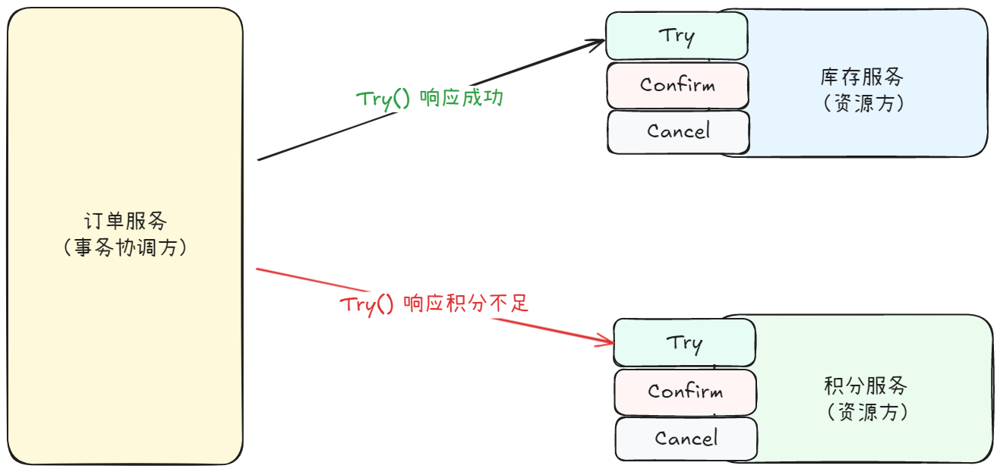
资源方明确返回资源不充足，此时事务无法开启，需要通知`Try()`返回成功的资源方进行资源释放，即调用 `Cancel()`.

情况2：
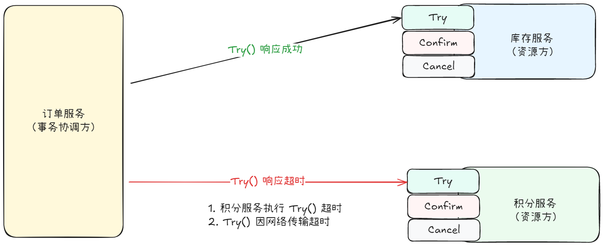
超时导致的失败，则此次`Try()`调用有可能成功到达了资源方，也有可能因为网络问题最终没有到达资源方；但是对于事务协调方来说，就是调用 `Try()` 失败了；需要对所有资源方调用 `Cancel()` 进行资源释放。

情况3：
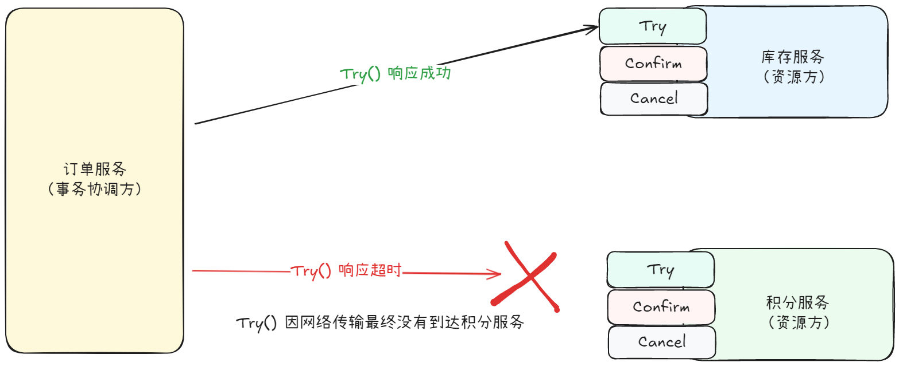
`Try()` 最终因为网络原因没有到达积分服务，此时接收到 `Cancel()` 请求，对于积分服务来说，没有任何资源可以支持回滚。
> 资源方的`Cancel()` 接口需要能够支持空回滚。

情况4：
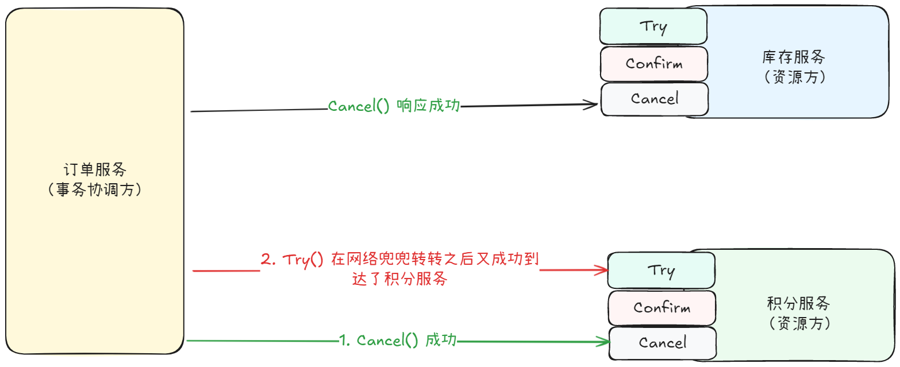
1. 刚开始调用`Try()`超时了，事务协调方调用`Cancel()`进行资源释放。
2. 在收到 `Cancel()` 之后，前面在网络中迷失的`Try()`请求又到达了积分服务；如果积分服务执行 `Try()` 成功，就会把资源给锁定了，并且对于事务协调方来说，分布式事务已经执行完成了，不会再有后续的 `Confirm()`/`Cancel()` 来对资源核销或者释放了；这个是因为网络原因导致的 **乱序问题**。

> 资源方需要对每一次的`Cancel()`做好记录，当先执行的`Cancel()` 后执行的 `Try()` 的时候，能够识别不至于造成资源被锁定无法释放。

#### 2.3.2 Confirm 阶段
作为事务协调方（订单服务），在进入`Confirm` 阶段之后，一定要确保通知所有资源方执行 `Confirm()` 进行事务的提交；
##### Confirm 调用失败
同 `Try` 阶段，因为存在网络/资源方服务状态这些不可控因素，无法确保 `Confirm()` 调用一定是成功的。
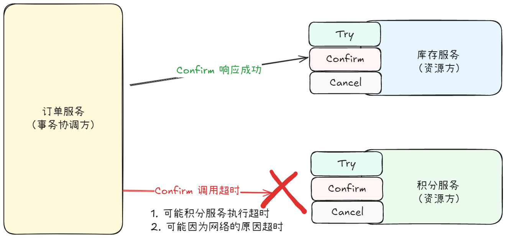
对于事务协调方来说，调用结果是失败的，积分服务是否成功无法感知，但是事务协调方不可能一直等待某个资源方的 `Confirm()` 响应成功。

此时，可以通过引入消息队列组件, 利用消息队列能够确保消息最低能够被消费一次的特性，让资源方自行监听消息，收到`Confirm`的消息，自行调用 `Confirm()` 逻辑， 完成`Confirm`阶段。如下图所示：
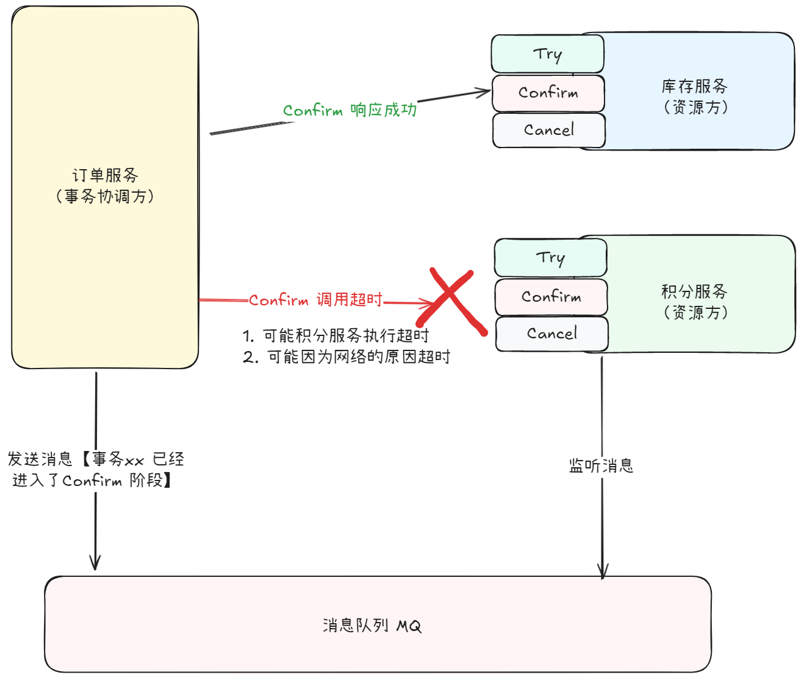
这里同样有一个问题：订单服务（事务协调方）和消息队列 Broker同样是部署在不同的节点上，同样存在不确定性，如何确保消息一定发送出来呢？例如下列场景：

> 1. Try 阶段完成，库存锁定成功、用户积分锁定成功、对应的订单创建成功，并且订单状态为「未支付」。
> 2. 用户完成支付，此时事务要进入`Confirm` 阶段，开始调用资源方的 `Confirm()` 接口进行事务提交。
> 3. 大部分情况下，调用都很顺利；此时事务顺利完成。
> 4. 如果资源方的`Confirm()`接口调用失败，则往消息队列投递消息将其转化成异步消息实现**最终一致**，成功投递之后则更新订单状态为「已支付」，后续等待资源方消费消息完成资源核销即可。
> 5. 调用 `Confirm()` 接口失败之后，转化成投递异步消息，假设这个时候消息队列挂了，消息发不出去了，没办法通知资源方了，并且如果订单服务需要一直等待这个发送成功，则订单状态一直无法更新为「已支付」。

针对上述第五步的情况，可以通过引入`本地消息表` 来解决，具体怎么做呢？

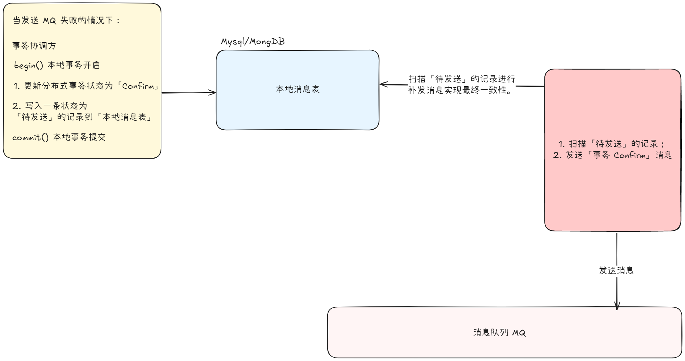

> 1. 在调用资源方 `Confirm()` 接口出现异常的时候，借助消息队列最少能消费一次的特性，发送「补偿」消息，延后通知资源方进行核销, 实现最终一致性；并且此时订单状态更新为「已支付」。
> 2. 如果发送「补偿」消息失败，则生成一条状态为「待发送」的消息记录到数据库，标识事务还有一个「补偿」消息没有完成发送；并且将存储「补偿」消息的动作和更新订单状态为「已支付」放到**同一个本地事务**里，要么一起成功、要么就一起失败；
> 3. 然后另起一个定时任务来扫描「本地消息表」里「待发送」的消息记录，然后去做补偿发送消息。

#### 2.3.3 Cancel 阶段
其实`Cancel()`阶段和`Confirm()`阶段可能产生的异常类似，事务协调方都需要保证`Cancel()`通知到位；

## 3. 最后
对于分布式架构的服务，整体成功率受到网络稳定性、各个节点服务自身的稳定性所影响，可能存在相同的请求重复请求多次、相同消息进行多次投递，这个要求各个资源方的 `Try-Confirm-Cancel` 接口需要做好幂等性；并且针对可能出现的请求乱序到达场景，需要做判断处理；其实上面只是列举到了一些常见的异常场景，还有可能存在更多更极端的情况，不能死记硬背，要理解每一种方式解决问题的本质是什么，可以用哪种方法来优化处理；

多多思考，多多学习