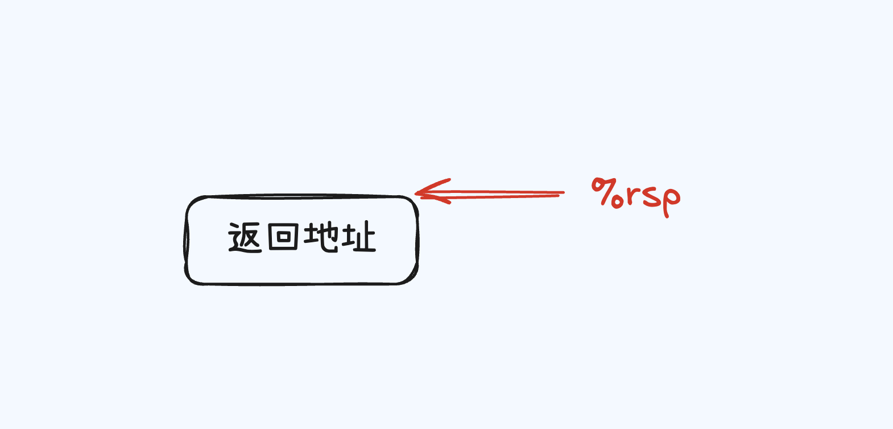
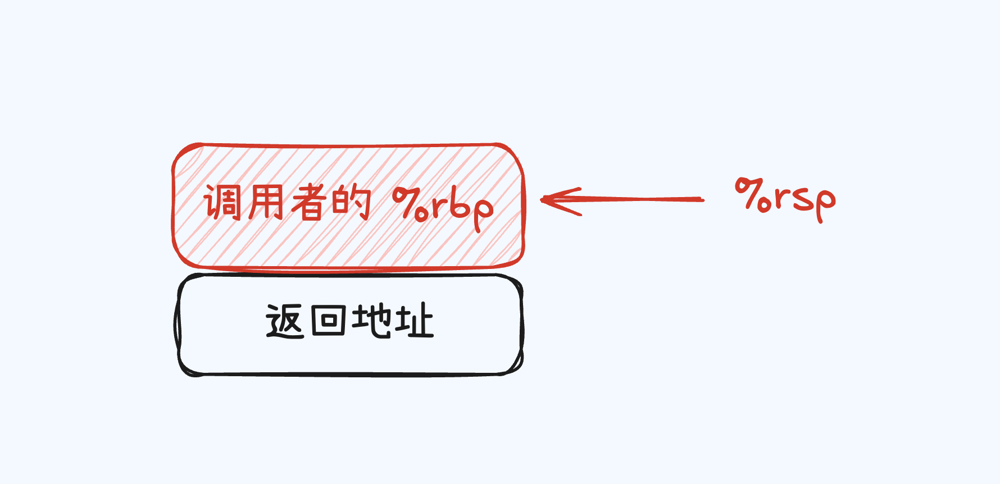
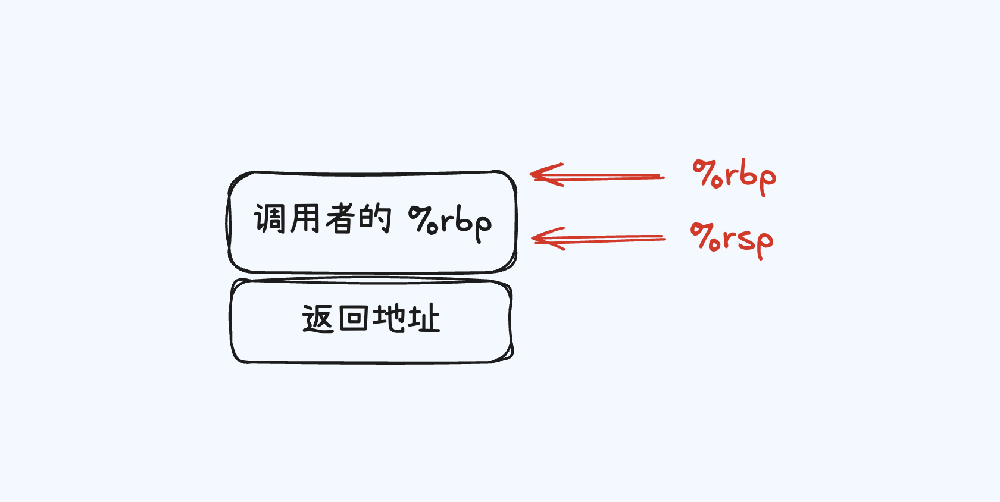
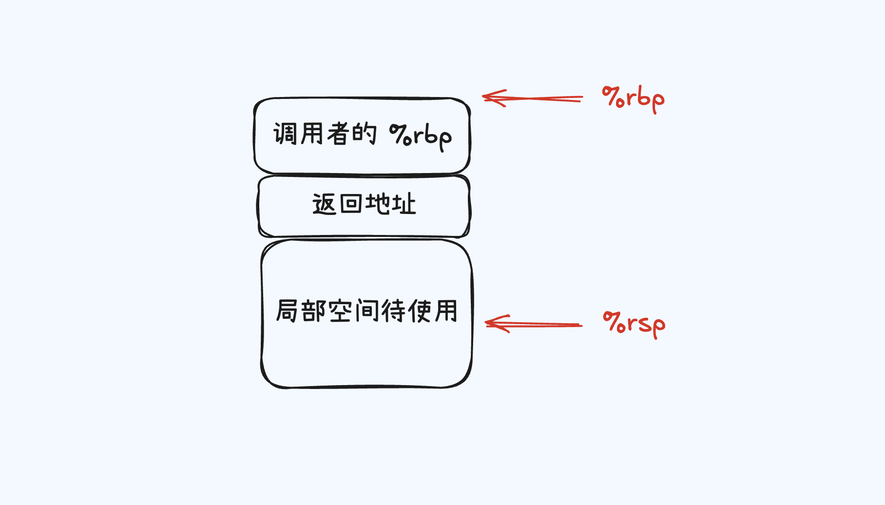
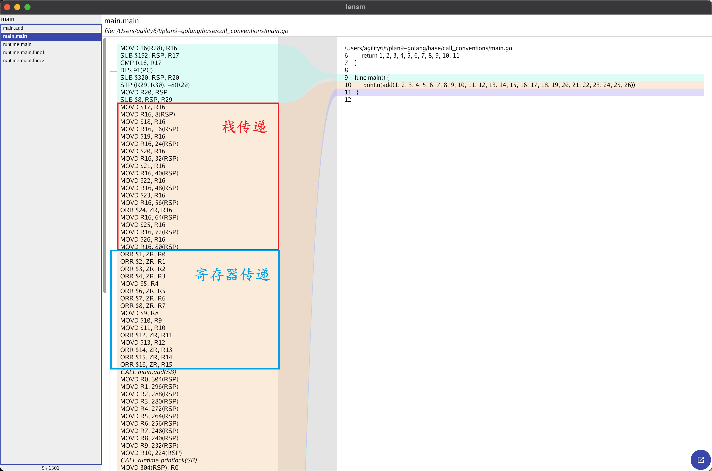
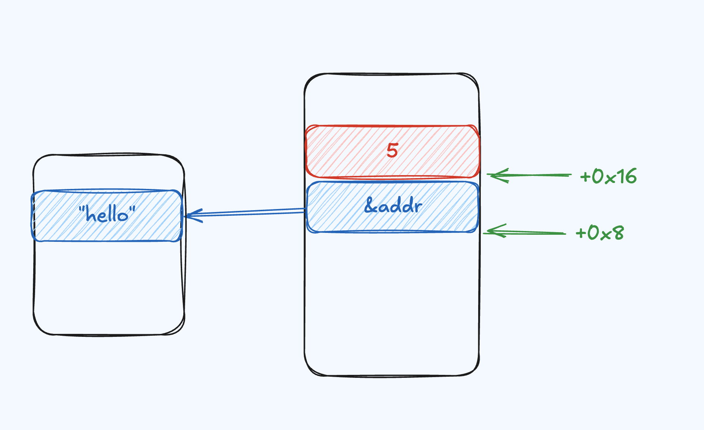
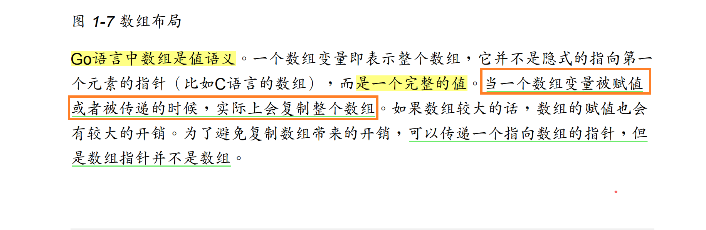
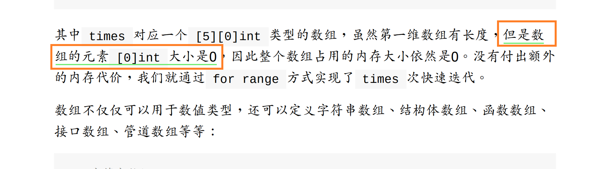

在上篇文章说到了学习Plan 9基础可以为我们揭开底层的一些细节，从而通过实践去探究原理。接下来就以Plan 9为基础，从不同角度去探索Golang语言吧。

如果你还没有阅读Plan 9相关的知识，推荐阅读[Plan9 & Go Assembler](https://tinyfun.club/blog/assembler)

> 环境说明：Mac m1 （ARM架构）、Golang v1.23.2

## 简单回顾

这里简单回顾几个比较重要的知识点吧

- Plan 9汇编伪寄存器

	- SB（Static base pointer）用于访问全局符号，比如函数、全局变量
	- FP（Frame pointer）用于访问函数的参数和返回值
	- PC（Program counter）保存CPU下一条要运行的指令
	- SP（Stack pointer）指向当前栈帧的栈顶

- Plan 9源操作数与目标操作数方向，源操作数在前，目的操作数在后

	- `movl $0x2, %eax` 将立即数0x2移动到eax寄存器


## 再次窥探函数

### 函数序言

在函数调用的时候，会经常看到这样一段的函数序言，主要的作用就是保存「调用者的」`BP`

```asm
pushq     %rbp
movq      %rsp,  %rbp
subq      %16,   %rsp
```

大致步骤如下

1. 初始状态：函数尚未被调用

  此时函数只包含返回地址（即调用函数的下一条指令的地址）

  

2. `pushq %rbp`

  将调用者的栈帧指针（`%rbp`）压入栈
  保存上一个栈帧的基地址，用于函数返回时恢复调用者的栈帧

  

3. `moveq %rsp,  %rbp`

  将当前栈指针%rsp的值赋给%rbp, 建立当前函数的栈帧基地址
  标记当前函数的栈帧起点

  

4. `subq $16, %rsp`

	将栈指针%rsp向下移动16字节，为局部变量分配空间
	完成局部变量栈空间的分配
	
	


下面就来编写代码，验证一下吧

`go tool compile -S -N -l add_func.go`

```go
// base/prologue/add_func.go
package main  
  
func add(a, b int) int {  
    return a + b  
}  
  
func main() {  
    _ = add(1, 2)  
}

```

- `MOVD.W  R30, -32(RSP)` 保存调用者的链接寄存器（R30）到栈中。
- `MOVD    R29, -8(RSP)` 保存当前帧指针（R29）到栈中。
- `SUB     $8, RSP, R29` 更新栈帧指针R29。

```assembly
0x0000 00000         TEXT    main.add(SB), NOSPLIT|LEAF|ABIInternal, $32-16  
0x0000 00000         MOVD.W  R30, -32(RSP)  
0x0004 00004         MOVD    R29, -8(RSP)  
0x0008 00008         SUB     $8, RSP, R29
```

再来看看函数尾声的分析

`ADD $24, RSP, R29` 恢复栈帧指针

- `ADD $32, RSP` 释放栈空间
- `RET (R30)` 返回调用者。

```assembly
0x0024 00036         ADD     $24, RSP, R29
0x0028 00040         ADD     $32, RSP
0x002c 00044         RET     (R30)
```

> 注意架构差异，Arm架构中使用的是`MOVD.W`保存寄存器到栈上

### 调用规约

函数的调用规约用于规定如何在程序中调用函数，例如参数的传递方式、返回值的处理和寄存器的使用等[x86 calling conventions](https://en.wikipedia.org/wiki/X86_calling_conventions)

在这里只需要明白，Go在1.17之后使用了基于寄存器的调用规约。当然寄存器不是无限使用的，当达到一定程度就会使用栈传递。



> 不同的架构对于寄存器的使用可能会不一样～

## Plan9 & 基础数据结构

### string

创建一个简单的字符串，提取出关键的汇编代码`var a = "hello"`

```go
// data/string/main.go
package main

func main() {
	var a = "hello"
	println(a)
}

```

- 将`"hello"`字符串加载到寄存器`R0`中

- 随后将立即数5，也就是我们程序字符串的长度加载到寄存器`R0`中

- `R0, main.a-16(SP)`和`R0, main.a-8(SP)`也就是它们相隔的位置，如图所示

  

```assembly
	0x0018 00024 	MOVD	$go:string."hello"(SB), R0 # 这里仅仅是地址
	0x0020 00032 	MOVD	R0, main.a-16(SP)
	0x0024 00036 	MOVD	$5, R0
	0x0028 00040 	MOVD	R0, main.a-8(SP)
```

通过汇编也可以看到Go中的字符串结构是很简单的

```go
type stringStruct struct {
	str unsafe.Pointer
	len int
}
```

#### stirng作为参数传递

如果问你在Go中字符串是如何进行参数传递的呢？这个时候只需要写一个简单的测试done，关注**重点**的汇编部分就可以解答了

```go
// data/string/string_param.go
package main

func foo(str string) {
	println("foo => " + str)
	str = "hello-golang"
	println("foo => " + str)
}

func main() {
	var a = "hello"
	println("main => " + a)
	foo(a)
	println("main => " + a)
}
```

十分清楚的可以看到，将`main.a-48(SP)`和`main.a-40(SP)`（就是前面分析的字符串的值和长度）分别拷贝到`R0`和`R1`寄存器中；最后调用`foo`函数。

因此可以说明**`string`作为参数传递是会拷贝一份的，但是注意底层数组是不是拷贝的**

```assembly
	0x0064 00100 	MOVD	main.a-48(SP), R0
	0x0068 00104 	MOVD	main.a-40(SP), R1
	0x006c 00108 	CALL	main.foo(SB)
```

### Array

日常在Golang开发中Array使用的其实并不多，更多作为一个底层的实现。array的结构是不需要长度这个字段的，因为它是定长的，也就是说它在编译期就能够确定长度是一个连续的内存区域。

那么就来验证一下是不是真的如上所说

```go
// data/array/main.go
package main

func main() {
	array := [5]int{10, 1, 2, 4, 5}
	_ = array
}

```

- **LDP**：是 ARM 架构的 “Load Pair” 指令，表示加载两个连续的值，到寄存器对 (R0, R1) 中。
- 总结一下这里的操作都是在获取值并且存入到寄存器中，并没有向string初始化到时候看到有关长度的信息

```assembly
	0x000c 00012 	LDP	main..stmp_0(SB), (R0, R1)
	0x0018 00024 	PCDATA	$0, $-4
	0x0018 00024 	LDP	main..stmp_0+16(SB), (R2, R3)
	0x0024 00036 	PCDATA	$0, $-1
	0x0024 00036 	STP	(R0, R1), main.array-40(SP)
	0x0028 00040 	STP	(R2, R3), main.array-24(SP)
	0x002c 00044 	MOVD	$5, R0
	0x0030 00048 	MOVD	R0, main.array-8(SP)
```

#### 默认值

相信你一定知道，在定义array的时候如果是没有进行初始化，那么默认值就是`0`，在汇编层面上处理默认值，也是会根据不同的定长，选择对应的方法。

```go
array := [2]int // 在汇编中默认直接使用STP	(ZR, ZR), main.array-16(SP)进行0值的初始化

array1 := [10]int // 使用runtime.duffzero进行初始化
```

>  duffzero也是汇编代码

Go 编译器会插入所谓的 duffzero 函数调用，以此来提高清零的效率[达夫设备(Duff's device)](https://en.wikipedia.org/wiki/Duff%27s_device)

### Slice

相比于array，slice可谓是开发使用频率最高的。不同于数组单单是一块连续内存；slice支持动态扩容，所以在底层的数据结构中就会有所变化。

1. 指向底层数据的指针
2. 切片长度
3. 切片容量

```go
type slice struct {
	array unsafe.Pointer
	len   int
	cap   int
}
```

按照惯例看看汇编中slice是如何的

```go
// data/slice/main.go
package main

func main() {
	slice := []int{1, 2, 3, 4, 5}
	_ = slice
}

```

大致总结一下步骤

1. 栈空间初始化

2. 向切片赋值

   1. 取地址

   2. 设置值
	 
   3. 写入对应偏移量

3. 构造切片结构（指针、长度、容量）

4. 完成切片初始化

```assembly
	# 栈空间初始化
	0x000c 00012 	STP	(ZR, ZR), main..autotmp_2-72(SP)
	0x0010 00016 	STP	(ZR, ZR), main..autotmp_2-56(SP)
	0x0014 00020 	MOVD	ZR, main..autotmp_2-40(SP)
	
	0x0018 00024 	MOVD	$main..autotmp_2-72(SP), R0
	0x001c 00028 	MOVD	R0, main..autotmp_1-32(SP)
	0x0020 00032 	PCDATA	$0, $-2
	0x0020 00032 	MOVB	(R0), R27
	0x0024 00036 	PCDATA	$0, $-1
	
	# 常量1
	0x0024 00036 	MOVD	$1, R1
	0x0028 00040 	MOVD	R1, (R0)
	
	0x002c 00044 	PCDATA	$0, $-2
	0x002c 00044 	MOVB	(R0), R27
	0x0030 00048 	PCDATA	$0, $-1
	
	# 常量2
	0x0030 00048 	MOVD	$2, R1
	0x0034 00052 	MOVD	R1, 8(R0)
	
	0x0038 00056 	PCDATA	$0, $-2
	0x0038 00056 	MOVB	(R0), R27
	0x003c 00060 	PCDATA	$0, $-1
	
	# 常量3
	0x003c 00060 	MOVD	$3, R1
	0x0040 00064 	MOVD	R1, 16(R0)
	
	0x0044 00068 	PCDATA	$0, $-2
	0x0044 00068 	MOVB	(R0), R27
	0x0048 00072 	PCDATA	$0, $-1
	
	# 常量4
	0x0048 00072 	MOVD	$4, R1
	0x004c 00076 	MOVD	R1, 24(R0)
	
	0x0050 00080 	MOVD	main..autotmp_1-32(SP), R0
	0x0054 00084 	PCDATA	$0, $-2
	0x0054 00084 	MOVB	(R0), R27
	0x0058 00088 	PCDATA	$0, $-1
	
	# 常量5
	0x0058 00088 	MOVD	$5, R1
	0x005c 00092 	MOVD	R1, 32(R0)
	0x0060 00096 	MOVD	main..autotmp_1-32(SP), R0
	0x0064 00100 	PCDATA	$0, $-2
	0x0064 00100 	MOVB	(R0), R27
	0x0068 00104 	PCDATA	$0, $-1
	0x0068 00104 	JMP	108
	
	# 构造切片结构（指针、长度、容量）
	0x006c 00108 	MOVD	R0, main.slice-24(SP) # 指向底层数组的地址（R0）
	0x0070 00112 	MOVD	R1, main.slice-16(SP) # 长度
	0x0074 00116 	MOVD	R1, main.slice-8(SP)	# 容量

```

## 解开魔法 🪄

最后再来谈谈，掌握基础的汇编能给我们带来什么；不知道你在阅读的时候，会不会疑惑一些概念的真伪性或者说想去求证它。

这个时候当然是可以通过代码done的方式去验证；或者我们还可以使用汇编的方式去进行求证，以下案例是我在阅读《Go语言高级编程》所疑惑的

### 案例一



- 代码方式进行验证

```go
package main

import "fmt"

func main() {
	array := [...]int{1, 2, 3}
	array2 := array
	array2[0] = 100
	fmt.Println(array)
	fmt.Println(array2)
}
```

- 通过汇编的方式，我们只需要关注`array2:=array`的汇编代码
  - 很简单其实就是，这些指令将寄存器中的数据（如 R0, R1, R2）分别存储到栈上的不同位置，通常在处理数组或切片时，可能是将数组或切片的多个元素（或其它结构）存入栈空间。

```assembly
	0x002c 00044 	MOVD	R0, main.array2-48(SP)
	0x0030 00048 	MOVD	R1, main.array2-40(SP)
	0x0034 00052 	MOVD	R2, main.array2-32(SP)
```

那么再来对比一下`array2:=&array`吧

1. `MOVD $main.array-32(SP), R0`将`array`的「地址」存储到寄存器`R0`中。
2. `R0`的值保存到`main.array2`到栈位置（也就是说array2 只是存储了 array 的地址，它指向的是同一块内存空间）

```assembly
	0x0024 00036 	MOVD	$main.array-32(SP), R0
	0x0028 00040 	MOVD	R0, main.array2-8(SP)
	0x002c 00044 	PCDATA	$0, $-2
```

### 案例二



```go
package main

func main() {
	array := [0]int{}
	_ = array
}

```

不难发现，对于零长度的数组，Go 编译器通常会优化掉数组的实际分配，因此在汇编代码中看不到该数组的相关内容。

```assembly
main.main STEXT size=16 args=0x0 locals=0x0 funcid=0x0 align=0x0 leaf
	0x0000 00000 	TEXT	main.main(SB), LEAF|NOFRAME|ABIInternal, $0-0
	0x0000 00000 	FUNCDATA	$0, gclocals·g2BeySu+wFnoycgXfElmcg==(SB)
	0x0000 00000 	FUNCDATA	$1, gclocals·g2BeySu+wFnoycgXfElmcg==(SB)
	0x0000 00000 	RET	(R30)
	0x0000 c0 03 5f d6 00 00 00 00 00 00 00 00 00 00 00 00  .._.............
```

## 最后

通过汇编的方式，我们可以更加深入的了解Go语言的底层实现，也可以通过汇编的方式去验证一些疑惑的问题。当然，这里只是简单的介绍算是进行抛砖引玉。

后续可以关注此[repo](https://github.com/AnnularLabs/plan9-golang)，会不定期更新一些有趣的案例，也欢迎大家一起探讨～

## 参考

https://xargin.com/go1-17-new-calling-convention/

https://en.wikipedia.org/wiki/X86_calling_conventions

https://taoshu.in/go/duff-zero.html
