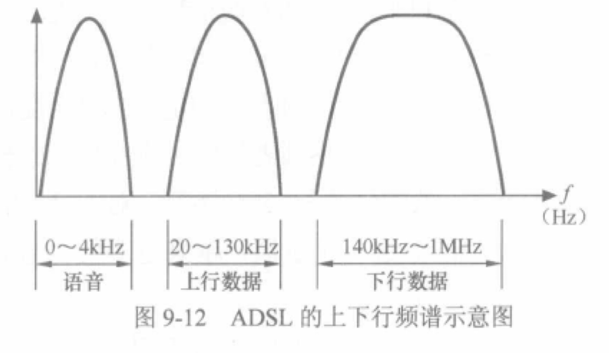
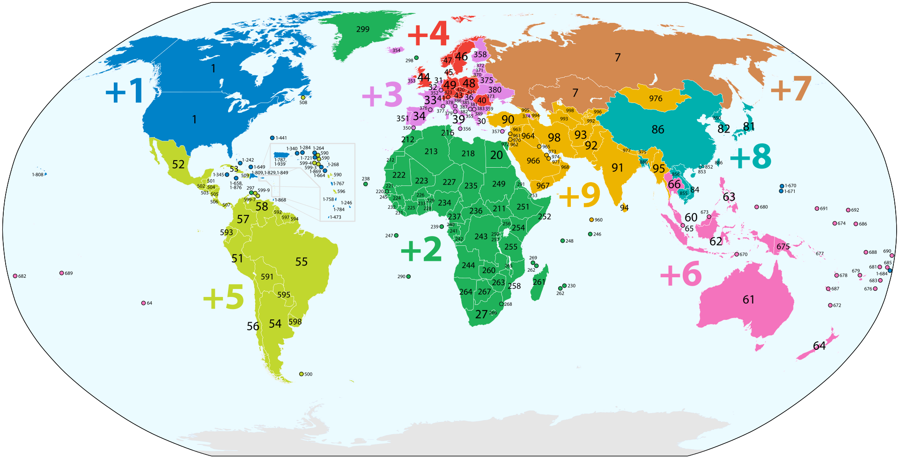
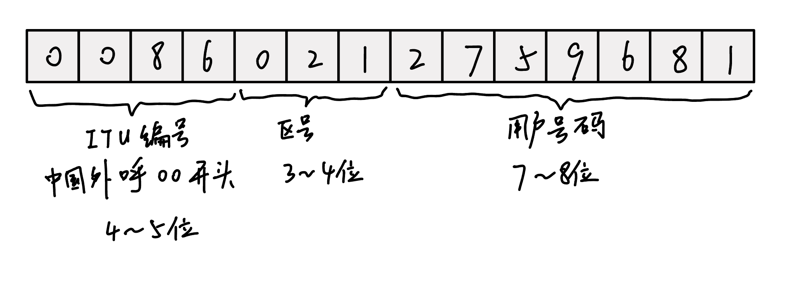
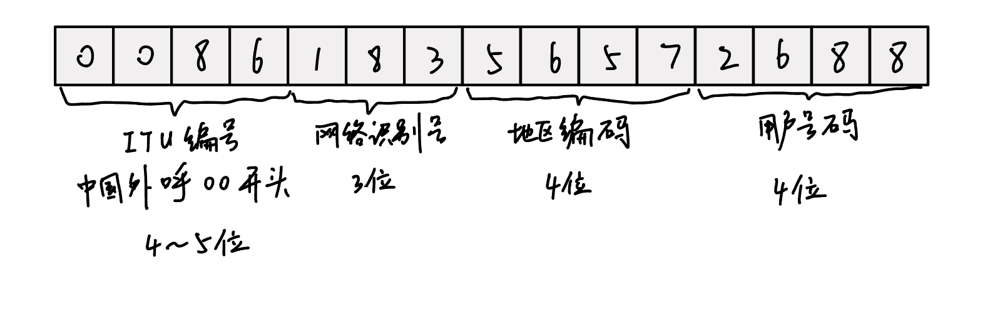

工作原因经常需要处理手机号，一般都是用一些开源库来解析。最近看了一下开源库的实现，发现对电话号码的定义还挺复杂的。所以结合之前了解到的一些 PSTN 的知识对电话和电话号码相关的内容进行了整理。

<!-- truncate -->

## PSTN
### 概念
PSTN 距离我们很近，以前家里使用的电话机，一般情况下都连接到两类设备上 —— 一类是通过电话线直接连接电信机房的交换机，另外一类是先连接到一台用户交换机，然后连接到电信机房的交换机上。前者一般是家庭和小企业用户，或者大企业里面的 VIP 用户；后者一般是企业用户。

电信机房的交换机则一层一层互连起来，构成了全国以至全球范围内庞大的电话交换机网。我们把这个庞大的电话交换网叫做 Public System of Telephone Network,中文学名“公众电话交换网”，这就是大名鼎鼎的“PSTN”。

PSTN 在整个电信的发展历史上有举足轻重的地位，你可以理解 PSTN 网络就是人类搭建的最早最成功的电信网络。

我国国内 PSTN 最早分 5 个 Class，C1 为大区中心，C2 为省中心，C3 为地区中心，C4 为县中心，C5 是为端局设计的。实际操作上，C2、C3 逐渐退化并最终消失，目前只有C1、C4和 C5 交换机真实存在。

C1 交换机作为国内 PSTN 核心节点，同时承担着与其他国家、地区交换机的连接工作; C4 交换机叫作**汇接局交换机**，作为中继互连、汇聚和分发话务量的交换机；而 C5 交换机则连接用户终端电话、企业 PBX 或者接入网，并将所有呼叫出局送到 C4 交换机上去。

### PSTN 交换机
PSTN 交换机不是我们在计算机网络中提及的交换机，它是一种运行在 PSTN 网络中的交换机。电话刚发明出来时，电话与电话之间都是一对一的接通关系，也就说A拿起电话来就能跟B通话，而且也只能和B通话。随着电话投入使用，慢慢需要组建其电话网络。在早起的电话网络中，是没有交换机的，那时候打电话是需要接线员的，即`拿起电话 --> 等待接线员接通 --> 跟接线员说明想要跟谁通电话 --> 接线员人工接通线路 --> 开始通话 --> 通话结束接线员断开线路`。

接线员效率低下，且需要付出巨大的人工成本，所以程控交换机被发明出来。现代化的程控交换机具有以下 5 个基本功能：

1. 寻址：跟网络交换机一样，交换的最核心功能就是寻址。PSTN 交换机必须维护一个“寻路指南”，也就是路由表，任何要接通电话的请求都可以通过路由表找到到达目的地的路径。
2. 建链、拆链：注意这个就跟网络交换机不同了，计算机网络运行在 TCP/IP 这个实际标准之下，IP 是基于分组交换的协议，也就是说 IP 报文的交换不需要变更物理链接。注意这是“链”而不是“连”，其实就强调了其是物理链接的事实。PSTN 交换机需要在呼叫到来的时候搭建电路，在呼叫结束的时候拆除电路。
3. 交换：指交换机自身必须具备搭建电路的资源，即“交换矩阵”。
4. 馈电：大家记得不？我们小时候家里的电话机都是不需要单独插电源线的，只需要插上电话线就可以了。这是因为电话线在传递信号的同时，也能提供电力。交换机通过用户线向电话机提供 -48V 的电压，摘机的时候才会有电流通过，这时候的电流为 18~50mA。（在以太网链路上也有类似的实现，即 POE）
5. 记录（即CDR）：啥是 CDR？就是记录你打了多久的电话，跟谁打的？记录下来干啥？当然是给你**计费**啦！


再简单说一说**信令**，交换机和终端设备之间，交换机和交换机之间，之所以能够通信，信令是必不可少的。信令就是一套设备间沟通的信号标准。信令是一个很复杂的话题，单是七号信令系统就可以拿出来厚厚的一本书来讲。我们这里就是简单聊聊。

1. 用户线信令：用户终端和交换机之间在用户线上传输的信令。
    1. 监视信令：监视是否有用户摘机、用户是否挂机等。并可以根据情况触发下一步动作，比如发送拨号音、忙音、回铃音等
    2. 地址信令：当你开始拨号，号码将通过电话线传送到交换机上，用于装载被叫号码的信令就是“地址信令”。一些电话上有一个开关，打开时拨号会发出不同音调的滴滴滴声，而关闭时拨号则会发出微小的哒哒哒的声音，而且一般按下的是几，就会哒哒哒的响几声。这其实就是两种不同形式的地址信令。前者叫做“双音多频信号”，它用“双音”表示一个数字；而后者叫做“直流脉冲信号”，那种微小的哒哒哒声其实就是在控制用户线电路的断续。目前直流脉冲信号已经很少使用了。
2. 局间信令：交换机之间的指令。根据信令通道和语音通路的关系，分成随路信令和共路信令。如果信令和语音处于同一通道，则是随路信令；否则是共路信令。
    1. 随路信令：随路信令是可以“隐藏”于语音信号之中的。因为它只占整体数据量的很小一部分。如一号信令系统。因为随路的原因，信令安全性差，容易被黑客篡改和利用。
    2. 共路信令：共路信令以统一格式的“消息信令单元”形式传送，七号信令系统是目前最普遍的共路信令。它将信令和语音通路分开，各走各的。现在的市话系统普遍采用光纤数字中继和七号信令系统。

### PSTN 用于数据传输
#### 拨号上网
拨号上网是在 PSTN 基础上发展起来的互联网接入技术，98~02年期间是国内接入互联网的最主要方式。由于电话拨号使用的频带与电话相同，因此拨号上网过程中，电话是占线状态，也就是不能呼入和呼出的。

拨号上网，用户端计算机通过串口连接Modem，Modem通过电话线连接局端后，通过E1形式连接接入服务器（Network Access Server），接入服务器的另一端连接到互联网。

拨号过程中账号密码采用PPP协议，通过电话线路与接入服务器交互信息，指定一个认证服务器进行认证。

#### ISDN 组网
ISDN 即 Integrated Services Digital Network，中文是综合数字业务网。

ISDN 之前在欧美地区盛行，但在中国应用很少，所以很多人听都没听过。

ISDN 终端和 ISDN 交换机之间的接口有两种常用类型 —— BRI 接口和 PRI 接口。前者是 1~2 根电话线连接交换机和终端，后者则采用 E1 连接。

BRI 包括两条传输速率为 64kbit/s 的全双工的 B 通道和一条传输速率 16kbit/s 的全双工 D 通道。B 通道用来传送用户信息，D 通道用来传送信令和低速的分组数据(当然可以是 IP 数据)。一般这类接口被称为 Basic Rate Interface，ISDN 基本速率接口。

PRI 学名“基群接口结构 (Primary Rate Interface Structure)”，又叫做“一次群接口”。对于欧洲和中国,采用 2048kbits 的传输速率时,基群接口的信道结构为 30B+D，B 信道的速率为64kbit/s，用来传送用户信息，D 信道的传送速率为 64kbit/s，用来传送用户一网络信令。

#### ADSL 组网
xDSL 中应用最为广泛的是 ADSL 技术，A 是 Asymmetric 的缩写，表示“不对称”，对于 DSL 而言，用户端向局端的方向被称为“上行”，反方向被称为“下行”。上行带宽窄，下行带宽宽。

xDSL 的原理就是把电话线上没被话音占用的高频部分利用起来传送数据信号，这样上网期间也不会影响接打电话了。



ADSL 需要配合使用分离器将语音信号和数据信号分离。

ADSL 接入 ISP 的 IP 网络也是需要认证的。这时 PPPoE 就登场了。PPPoE 其实就是将 PPP 帧封装到以太网帧里。通过以太网的寻址方式，PPP 帧到达目的地，再解包出来进行认证。

## VoIP
Voice over IP，即通过 IP 网络来传输语音信号。

VoIP 将语音信号数字化、压缩并打包为数据包，通过网络进行传输，接收端再解码成音频信号。

VoIP 通过互联网传输语音数据，减少了传统电信网络的通话费用，特别适用于 国际长途通话 和 企业内部通话。但受限于分组交换的通病，一旦出现延迟、丢包或者抖动就会严重影响通话质量。

## 电话号码格式
### 国际公共电话号码基本格式
国际电话号码格式遵循 E.164 规范，即：[https://www.itu.int/rec/t-rec-e.164/en](https://www.itu.int/rec/t-rec-e.164/en)

该建议书提供了用于国际公共电信编号计划的号码结构和功能，适用于全球公共交换电话网络（PSTN）以及一些其他数据网络。

**号码组成**

- 国家代码：由 1 到 3 位数字组成，用于唯一标识每个国家或地区，如中国是 86，美国和加拿大是 1。
- 国内目的地码：包含国内地区码等信息，其长度根据各国情况有所不同，用于标识国内的特定地区或网络。
- 用户号码：用于区分同一地区或网络内的不同用户。

完整的 E.164 号码总长度不超过 15 位。



**号码格式**

国际格式：通常以 “+” 开头，后面紧跟国家代码，再加上国内号码，中间可以用空格或短横线分隔，如 “+86 10-12345678” 或 “+86-10-12345678”。

拨号格式：在实际拨号时，需要根据所在国家或地区的规定，可能需要在拨打国际号码前加上国际长途接入码，如在中国拨打国际电话，通常要先拨 “00”，然后再拨 E.164 号码。

各国的电信管理机构负责在本国范围内按照 E.164 的规定分配和管理电话号码资源，确保号码的唯一性和合理性。

### 带子地址的电话号码格式
除了基本的电话号码外，ISDN 还支持子地址，用于在一个电话号码下进一步区分不同的用户终端或业务应用。格式通常是在基本电话号码后加上 “;” 和子地址信息。

例如：`+86 10 12345678;1234`，这里的 “1234” 就是子地址，可能用于区分同一用户的不同终端设备或不同业务功能。

这种带子地址的格式也就是我们说的分机。以前经常会在电视广告上看到的企业联系方式，通常都是拨打 xxx-xxxx 转 xx 号。转的那部分其实就是子地址。

### 国内固定电话的号码格式


**注意：国外号码会有不同的规则，仅 ITU 编号部分是国际规范。**

**国内区号**：一些重要城市和区域中心城市使用三位区号，如北京为 “010”、上海为 “021”、天津为 “022”、重庆为 “023” 等。这些城市通常在政治、经济、文化等方面具有重要地位，是全国或区域的重要枢纽。除了上述使用三位区号的城市外，国内其他地区的区号一般为四位，如广州的 “020” 后面还有四位本地号码，其他中小城市和地区像成都 “028”、杭州 “0571”、深圳 “0755” 等，都是四位区号加本地号码。

**本地号码**：本地号码的位数一般为 7 位或 8 位。在早期，很多城市的座机号码是 7 位，随着通信业务的发展和用户数量的增加，一些城市逐渐将本地号码升级为 8 位。一般来说，大城市或经济发达地区较早完成了 8 位号码的升级，如北京、上海、广州等；而一些中小城市或经济相对不那么发达的地区，可能仍保留 7 位本地号码。

**特殊号码**：还有一些特殊的座机号码，如一些服务机构、企业总机等可能会有特定的号码编排方式。例如，报警电话、火警电话、急救电话等公共服务电话，企业服务类的 400 电话等，以及电信运营商预留的 10000、10010、10086 等。

### 国内移动电话的号码格式
中国的手机号码为 11 位数字，其结构通常可以分为三段，即前 3 位为网络识别号、中间 4 位为地区编码、后 4 位为用户号码。



+ **网络识别号**：也称为号段，用于区分不同的电信运营商和不同的业务类型。例如，中国移动的号段有 134、135、136、137、138、139、147、150、151、152、157、158、159、178、182、183、184、187、188、195、197、198 等；中国联通的号段有 130、131、132、145、155、156、166、175、176、185、186、196 等；中国电信的号段有 133、149、153、173、177、180、181、189、190、191、193、199 等。现在允许携号转网后，这个标识号也不是判断的金标准了。
+ **地区编码**：中间 4 位数字可以在一定程度上反映手机号码的归属地信息，但并非严格对应特定的地理区域，同一地区可能会有多个不同的 4 位编码。
+ **用户号码**：最后 4 位是用户在所属地区和网络中的唯一标识，用于区分同一地区、同一运营商下的不同用户。

## 使用 URI 表示电话号码
[RFC 3966](https://www.rfc-editor.org/rfc/rfc3966.html)（“The tel URI for Telephone Numbers”）规定了一种使用统一资源标识符（URI）来表示电话号码的标准方式，目的是让电话号码能在互联网应用中被方便识别、交换和处理。

### tel URI 的语法结构
基本格式：tel: 作为 URI 方案名称，紧接着是电话号码相关信息。例如：tel:1234567890，这是最基础的表示一个简单电话号码的方式。

复杂格式：支持多种参数扩展，以更精确地表示电话号码的各个部分及相关信息。其格式是一个多行文本结构：

```plain
   telephone-uri        = "tel:" telephone-subscriber
   telephone-subscriber = global-number / local-number
   global-number        = global-number-digits *par
   local-number         = local-number-digits *par context *par
   par                  = parameter / extension / isdn-subaddress
   isdn-subaddress      = ";isub=" 1*uric
   extension            = ";ext=" 1*phonedigit
   context              = ";phone-context=" descriptor
   descriptor           = domainname / global-number-digits
   global-number-digits = "+" *phonedigit DIGIT *phonedigit
   local-number-digits  =
      *phonedigit-hex (HEXDIG / "*" / "#")*phonedigit-hex
   domainname           = *( domainlabel "." ) toplabel [ "." ]
   domainlabel          = alphanum
                          / alphanum *( alphanum / "-" ) alphanum
   toplabel             = ALPHA / ALPHA *( alphanum / "-" ) alphanum
   parameter            = ";" pname ["=" pvalue ]
   pname                = 1*( alphanum / "-" )
   pvalue               = 1*paramchar
   paramchar            = param-unreserved / unreserved / pct-encoded
   unreserved           = alphanum / mark
   mark                 = "-" / "_" / "." / "!" / "~" / "*" /
                          "'" / "(" / ")"
   pct-encoded          = "%" HEXDIG HEXDIG
   param-unreserved     = "[" / "]" / "/" / ":" / "&" / "+" / "$"
   phonedigit           = DIGIT / [ visual-separator ]
   phonedigit-hex       = HEXDIG / "*" / "#" / [ visual-separator ]
   visual-separator     = "-" / "." / "(" / ")"
   alphanum             = ALPHA / DIGIT
   reserved             = ";" / "/" / "?" / ":" / "@" / "&" /
                          "=" / "+" / "$" / ","
   uric                 = reserved / unreserved / pct-encoded
```

关注一下`context = ";phone-context=" descriptor`，phone-context 即电话号码的上下文，是在一些通信系统或配置中用于标识电话号码所属的特定环境或上下文的概念，比如在企业 IP 电话系统中，不同的分支机构或部门可能有不同的 phone-context。

示例：

1. **国际号码**

```plain
tel:+442071838750
```

这里 +44 代表英国，207 代表伦敦区号，1838750 是本地号码。

1. **局部号码（带 `phone-context`）**

```plain
tel:1838750;phone-context=+44-207
```

这里 phone-context=+44-207 表示该号码属于 +44 英国的 207 伦敦区号。

3. **企业内部拨号**

如果一个企业的电话系统支持分机号（如 1234），但需要在特定企业网域解析：

```plain
tel:1234;phone-context=example.com
```

这里 phone-context=example.com 说明 1234 这个号码应该在 example.com 这个企业域内解析。

这里可以看出，phone-context 是用于指明电话号码的适用范围的，如果该内部电话系统最终会接入到 PSTN 上，那么就跟上面说的 isdn 子地址一样了，只不过是不同的表示形式。

### 电话号码表示
推荐使用国际电信联盟（ITU） E.164 标准格式来表示电话号码，例如：tel:+861012345678 表示中国北京的一个号码。

**参数使用**：

- 指定电话号码的分机号码，如 `tel:1234567890;ext=567`
- 标识电话类型，取值如 `type=voice（语音电话）` 、`type=fax（传真）` 等。多个类型值可用逗号分隔，如 `tel:1234567890;type=voice,fax`
- 标识特定的电话上下文或环境，例如在企业内部不同分支机构可能有不同的上下文，如 `tel:1234567890;phone-context=office1`

### 应用场景
最简单的，在网页中，可通过创建 `tel: URI` 链接，使用户点击链接就能直接调用设备的拨打电话功能。比如在 HTML 中：`<a href="tel:+12125551212">Call this number</a>`

## 电话号码的解析库
Java 可以使用 Google 提供的 libphonenumber。很多 App 的手机号码归属地等功能就是使用这个实现的。支持 Java， C++ 和 JavaScript。

Go 可以使用 [nyaruka/phonenumbers](https://github.com/nyaruka/phonenumbers) 库。

