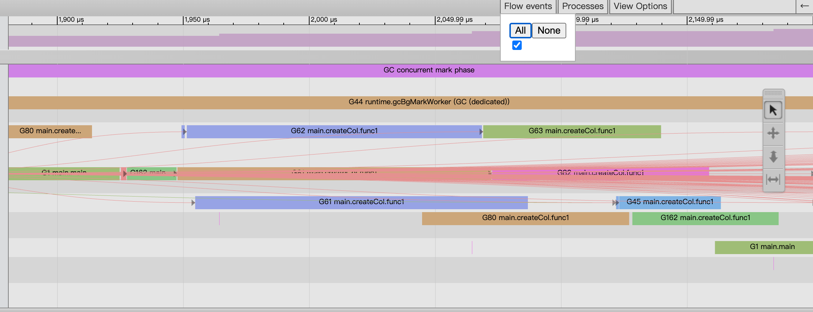

性能优化是提升用户体验和系统稳定性的关键环节，Go语言提供了两种强大的性能分析工具——pprof 和 trace，分别用于性能剖析和事件追踪。

<!-- truncate -->

## pprof（profile proto）&  Trace 的相关概念

在Go语言中pprof和trace都是性能和问题分析的利器。

1. pprof 主要用于性能分析，帮助开发者找出程序中性能瓶颈。它可以生成 CPU、内存、块（blocking）等多种维度的性能剖面数据。

2. trace 用于记录程序运行期间的详细事件，是一种事件级的追踪工具。它能捕获程序中的细粒度事件，如 goroutine 的创建、调度、阻塞、系统调用等，帮助开发者了解程序的运行时行为和并发调度情况。

pprof帮助你**快速定位性能热点**，而 trace 则能深入了解热点背后的细节（比如具体的 goroutine 行为和调度情况）

在实际调试和优化过程中，可以先利用 pprof 定位到可能存在性能问题的模块，再用 trace 对这些模块进行细致分析，找出潜在的并发调度或其他运行时问题，从而进行针对性的优化。

一位Netflix的工程师在[BPF Performance Tools](https://book.douban.com/subject/34467459/)书中，对性能优化辅助工具进行了分类。

1. 采样工具：采用一个测量的子集来描绘目标的粗略情况；这也被称为创建一个profile或profiling（剖析）。profiling工具对运行中的代码采用基于定时器的采样。其缺点是，采样只能提供一个关于目标的粗略的图像，并且可能会遗漏事件。

2. 追踪（tracing）是基于事件的记录，一旦开启跟踪，跟踪工具便能够记录所有原始事件和事件元数据。

## pprof

### 什么是pprof？

简单来说pprof，就是收集我们Golang程序的一系列指标信息，支持生成性能报告、cli、web方式进行展示，pprof 对程序进行性能剖析一共有两个阶段。

- 数据采集

    - CPU数据

    - 堆内存分配数据

    - 锁竞争数据

    - 阻塞时间数据

- 数据剖析


**CPU数据**

- 识别出代码关键路径上消耗CPU最多的函数

- Go运行时会每隔一段时间就中断一次（10ms、sigprof信号引发）

**堆内存分配数据**

- 堆内存分配的采样频率可配置，默认每1000次堆内存分配会做一次采样

**锁竞争数据**

- 记录当前Go程序中互斥锁争用导致延迟的操作

- **该类型采样数据在默认情况下是不启用的**

**阻塞时间数据**

- 记录Goroutine在某共享资源（一般是由同步原语保护）上的阻塞时间包括

    - 无缓冲channel收发数据

    - 阻塞在一个已经被其他goroutine锁住的互斥锁

    - 向一个满了的channel发送数据，或从一个空的channel接收数据

- **该类型采样数据在默认情况下是不启用的**

### 如何生成pprof

Go提供了两种方式来收集程序的指标数据

- `runtime/pprof`

- `net/http/pprof`

| 特性 | `runtime/pprof` | `net/http/pprof` |
| --- | --- | --- |
| **使用方式** | 代码内手动插桩 | HTTP 方式提供数据 |
| **是否需要修改代码** | 需要手动调用 | 仅需 `import _ "net/http/pprof"` |
| **适用场景** | 代码片段 Profiling | 在线服务 Profiling |
| **Profiling 触发方式** | 手动控制 | 运行时随时采集 |
| **数据存储方式** | 本地文件 | HTTP 端点实时查询 |
| **适用于本地调试** | ✅ | ❌（需要 HTTP 服务器） |
| **适用于线上服务** | ❌（手动采集） | ✅（可远程分析） |

**runtime/pprof**
```go
package main

import (
	"math/rand"
	"time"
)

func generate(n int) []int {
	rand.Seed(time.Now().UnixNano())
	nums := make([]int, 0)
	for i := 0; i < n; i++ {
		nums = append(nums, rand.Int())
	}
	return nums
}

func bubbleSort(nums []int) {
	for i := 0; i < len(nums); i++ {
		for j := 1; j < len(nums)-i; j++ {
			if nums[j] < nums[j-1] {
				nums[j], nums[j-1] = nums[j-1], nums[j]
			}
		}
	}
}

func main() {
	f, _ := os.OpenFile("cpu.pprof", os.O_CREATE|os.O_RDWR, 0644)
	defer f.Close()
	pprof.StartCPUProfile(f)
	defer pprof.StopCPUProfile()
	n := 10
	for i := 0; i < 5; i++ {
		nums := generate(n)
		bubbleSort(nums)
		n *= 10
	}
}
```

**net/http/pprof**
```go
package main

import (
	_ "net/http/pprof"
	"math/rand"
	"net/http"
	"time"
)

func generate(n int) []int {
	rand.Seed(time.Now().UnixNano())
	nums := make([]int, 0)
	for i := 0; i < n; i++ {
		nums = append(nums, rand.Int())
	}
	return nums
}

func bubbleSort(nums []int) {
	for i := 0; i < len(nums); i++ {
		for j := 1; j < len(nums)-i; j++ {
			if nums[j] < nums[j-1] {
				nums[j], nums[j-1] = nums[j-1], nums[j]
			}
		}
	}
}

func main() {
	n := 10
	for i := 0; i < 5; i++ {
		nums := generate(n)
		bubbleSort(nums)
		n *= 10
	}
	http.ListenAndServe("0.0.0.0:6060", nil)
}

```

例如使用 `net` 的方式，在运行的访问 `debug/pprof` 就可以看到以下页面。

- allocs：查看过去所有内存分配的样本（历史累计）
- block：查看导致阻塞同步的堆栈跟踪（历史累计）
- cmdline： 当前程序的命令行的完整调用路径（从程序一开始运行时决定）
- goroutine：查看当前所有运行的 goroutines 堆栈跟踪（实时变化）
- heap：查看活动对象的内存分配情况（实时变化）
- mutex：查看导致互斥锁的竞争持有者的堆栈跟踪（历史累计）
- profile： 默认进行 30s 的 CPU Profiling，得到一个分析用的 profile 文件（从开始分析，到分析结束）
- threadcreate：查看创建新 OS 线程的堆栈跟踪


默认情况下是不会追踪block和mutex的信息，需要代码层面加上。

```go
runtime.SetBlockProfileRate(1) // 开启对阻塞操作的跟踪，block  
runtime.SetMutexProfileFraction(1) // 开启对锁调用的跟踪，mutex
```

需要注意的是Go虽然提供了一个十分便捷方式给使用者，进行性能分析、问题排查。

但是如何在「恰好」的时间点上去获取到数据，这里其实是一个比较大的命题如何保存现场。推荐阅读曹大的两篇「无人值守的自动 dump」

[无人值守的自动 dump（一）](https://xargin.com/autodumper-for-go/)

[无人值守的自动 dump（二）](https://xargin.com/autodumper-for-go-ii/)

### 读懂pprof

对于分析的过程主要分为两个步骤，导出数据、分析数据，首先要清楚分析数据有哪几种使用模式。 

1. 交互式终端 `pprof [选项] 数据源`

2. Web界面 `pprof -http=[host]:[port] [选项] 数据源`

不管是cli还是web界面，每个位置都会包含以下两个值。

- flat（扁平值）：当前函数 **自身** 花费的 CPU 时间或内存大小，不包括它调用的其他函数。

- cum（累积值）：前函数 **自身 + 所有子函数** 总共花费的 CPU 时间或内存大小。

#### Web界面 `pprof -http=[host]:[port] [选项] 数据源`

```go
go tool pprof -http=:8080 -focus=main -nodecount=10 -unit=ms cpu.log
```

- 只显示 **前 10** 个最重要的函数。

- 统计时间以 **毫秒（ms）** 为单位。

- 在 `http://localhost:8080` 启动 Web UI 进行可视化分析。

更多的option通过`help`命令可以查看。

从启动后映入眼帘的图开始（这里参考官方的doc中的图）这里可以分为两个部分，**节点**和**连接线**。

- 节点
    - `(*Rand).Read`：灰色 + 字体小 ⇒ 表示flat和cum值比较小。

    - `(*compressor)deflate`：红色 + 字体大 ⇒ 表示flat和cum值都比较大。

    - `(*Writer).Flush`：红色 + 字体小 ⇒ 表示flat小、cum值大。

    - 总结：flat与字体有关、cum与颜色有关。

- 连接线
    - `(*Writer).Write` 和 `(*compressor).write` 虚线说明两者之间删除了一些节点（如果想看更多的节点可以通过  `-nodecount` 参数进行调整）线很粗并且是红色，所以在这两个节点之间的调用堆栈中使用了更多的资源。

    - `(*Rand).Read` 和 `read` 虚线含义和上条一样，线薄而且是灰色的，因此这两个节点之间的调用堆栈中使用的资源较少。

    - `read` 和 `(*rngSource).Int63` 实线说明是**直接调用**。
		
    - 总结：实线和虚线代表调用的关系、颜色和粗细代表着堆栈中使用的资源。

- 边上的数字很简单就是，调用者和被调用者之间所花费的时间。


**理解火焰图 🔥**

供了调用者/被调用者关系的紧凑表示。

1. 火焰图的横向长度表示cum，相比下面超出的一截代表flat。

2. 上下的关系表示调用者与被调用者的关系。

3. 点击对应的函数就会显示该函数的调用堆栈。


**深入理解指标 🔝**

1. **flat（自身值）**

	- **定义**：函数**自身代码**直接消耗的资源（如 CPU 时间、内存分配），**不包含其调用的子函数**的消耗。

	- flat一般是我们最关注的。其代表一个函数可能非常耗时，或者调用了非常多次，或者两者兼而有之，从而导致这个函数消耗了最多的时间。

	```go
	func foo() {
		for i := 0; i < ie6; i++ {...} // foo 的 flat
		bar() // 不会被算入 foo 的 flat
	}
	```

2. **cum（累计值）**

	- 定义：函数**自身代码 + 所有直接/间接调用的子函数**消耗的资源。

	- 一般cum是我们次关注的，且需要结合flat来看。flat可以让我们知道哪个函数耗时多，而cum可以帮助我们找到是哪些函数调用了这些耗时的（flat值大的）函数。

	foo函数的cum：自身的flat  + bar flat = 10ms

	bar函数的cum：5ms（没有调用其他函数）

	```go
	func foo() {
		for i := 0; i < 1e6; i++ {...} // 5ms flat
		bar() // 5ms
	}

	func bar() {
		for i := 0; i < 1e6; i++ {...} // 5ms flat
	}
	```

3. sum（总和占比）

	- 定义：在 `pprof` 的 `top` 视图中，`sum` 表示**从当前行到列表底部所有行的 `flat` 占比累加值**。用于快速判断“前 N 个函数的总耗时占比”。

	

| **指标** | **含义** | **用途** |
| --- | --- | --- |
| `flat` | 函数自身耗时（不包含子函数） | 定位函数内部代码瓶颈 |
| `cum` | 函数自身 + 所有子函数的耗时 | 分析函数整体影响 |
| `sum` | 列表中从上到下的累计占比 | 快速评估“前 N 个”总影响 |


**总结pprof**

通过上面对指标的认识，就可以通过排列组合的方式进行分析。

- `flat == cum`  无子函数调用或子函数无耗时。

- `cum > flat` 函数耗时高、**主入口函数**、深调用链。

- `flat` 高 &  `cum` 高 自身和子函数均耗时高。

- `flat` 低 & `cum` 高 瓶颈在子函数、分析子函数。

因此可以总结为,在分析cpu的时候重点关注flat与cum值之间的差值，常规的分析可以拆解为以下步骤。

1. 查看 `top` 列表。

2. 使用Web视图定位调用链。

3. 使用 `list` 分析高 `flat` 函数。

4.  使用 `peek` 追踪高 `cum` 函数。

## Trace

### 什么是trace

从Go官方对[trace的设计文档](https://docs.google.com/document/u/0/d/1FP5apqzBgr7ahCCgFO-yoVhk4YZrNIDNf9RybngBc14/pub?pli=1)可以发现，对于pprof而言提供的是汇总信息，对于更加细节的信息交给了trace工具。

例如哪些 goroutine 在何时执行？执行多长时间？它们何时阻塞？在哪里？谁解除它们的阻塞？GC 如何影响各个 goroutine 的执行？

引用官方trace的设计文档
> The trace contains events related to goroutine scheduling: a goroutine starts executing on a processor, a goroutine blocks on a synchronization primitive, a goroutine creates or unblocks another goroutine; network-related events: a goroutine blocks on network IO, a goroutine is unblocked on network IO; syscalls-related events: a goroutine enters into syscall, a goroutine returns from syscall; garbage-collector-related events: GC start/stop, concurrent sweep start/stop; and user events. Here and below by "processor" I mean a logical processor, unit of GOMAXPROCS. Each event contains event id, a precise timestamp, OS thread id, processor id, goroutine id, stack trace and other relevant information (e.g. unblocked goroutine id).
> 
1.  goroutine 调度相关的事件

    1. goroutine 开始在处理器上执行

    2. goroutine 在同步原语上阻塞
		
    3. goroutine 创建或解除阻塞另一个 goroutine

2. 与网络相关的事件

    1. goroutine 在网络 IO 上阻塞

    2. goroutine 在网络 IO 上解除阻塞

3. 与系统调用相关的事件

    1. goroutine 进入系统调用

    2. goroutine 从系统调用返回

4. 与垃圾收集器相关的事件

    1. GC 启动/停止

    2. 并发清除启动/停止

### 如何生成trace

生成trace和pprof其实很类似，这里就不多赘述了。

1. `runtime/trace`
2. `net/http/pprof`

### 读懂trace

首先通过可视化的方式打开，会有出现如下页面可以分为四个区域。

1. View Trace

2. Profiles

3. Goroutine analysis

4. Minimum mutator utilization


#### View Trace & Proc解析


**采样状态区 —— Goroutines**

- Goroutines：某一时间点上应用中启动的goroutine的数量。

- 下图其含义是当有8个正在运行、有958个准备就绪等待被调度、处于GCWaiting的为0。


> 时间轴，可以通过 `w` 和 `s` 控制精度。

**采样状态区 —— Heap**

Heap：某个时间点上Go应用heap分配情况。

- Heap NextGC：这个指标表示下次触发垃圾回收时，堆内存达到的阈值。

	- 预判 GC 行为：如果你发现应用的堆分配接近或超过这个阈值，那么很快就会触发一次 GC，这可能会带来短暂的停顿。

- Heap Allocated：这个指标表示当前在堆上分配的内存总量，也就是应用当前真正使用的堆内存。

  - GC 触发条件：当 Allocated 数值接近或超过 NextGC 时，意味着系统可能马上会触发 GC，导致额外的计算开销和暂停。

正常情况下，Heap Allocated 应该保持在 Heap NextGC 以下，因为一旦超过 NextGC，就会触发 GC。

总的来说，通过这两个指标，你可以对应用内存管理的行为有一个直观的认识，进而针对内存分配和垃圾回收策略进行调优，达到提高应用性能的目的。


**采样状态区 —— Threads**

Threads：显示了某个时间点上Go应用启动的线程数量情况。

- Threads InSyscall：表示当前处于系统调用状态、即正在等待系统操作完成而阻塞的线程数量。

 	- 在下图所示指标中，数值为 0，说明在该时刻没有线程在等待系统调用（例如 I/O 操作、文件操作等），这通常意味着系统调用没有成为性能瓶颈。

	- Threads Running：表示当前处于运行状态的线程数量，也就是正在执行 Go 代码或调度器工作、没有阻塞的线程。

	- 下图这里显示为 8，通常反映了当前活跃的 OS 线程数。

如果 Threads InSyscall 数值较高，可能表明有大量线程因为等待系统资源而阻塞，这可能会导致 CPU 利用率下降或者延迟增加。可以进一步检查是否有不必要的系统调用或优化 I/O 操作。


**P视角区**

这个区域主要就是观察Go应用中每个P发生了什么事件。从图中可以看到Proc可以分为两个区域。

1. 第一行代表的是主事件。

2. 第二行是其他事件例如系统调用、运行时事件。


将其放大后，可以看到更多细节，例如在此G1这个的goroutine是在P4调度上进行运行，并且在此基础上还有syscall事件，点击后可以看到详细信息。

```text
Title：事件的可读名称；
Start：事件的开始时间，相对于时间线上的起始时间；
Wall Duration：这个事件的持续时间，这里表示的是G1在P4上此次持续执行的时间；
Start Stack Trace：当P4开始执行G1时G1的调用栈；
End Stack Trace：当P4结束执行G1时G1的调用栈；从上面End Stack Trace栈顶的函数为runtime.asyncPreempt来看，该Goroutine G1是被强行抢占了，这样P4才结束了其运行；
Incoming flow：触发P4执行G1的事件；
Outgoing flow：触发G1结束在P4上执行的事件；
Preceding events：与G1这个goroutine相关的之前的所有的事件；
Follwing events：与G1这个goroutine相关的之后的所有的事件
All connected：与G1这个goroutine相关的所有事件。
```


在P视角中可以开启对于事件的关联关系图。




## 参考

[https://github.com/google/pprof/blob/main/doc/README.md](https://github.com/google/pprof/blob/main/doc/README.md)

[High Performance Go Workshop](https://dave.cheney.net/high-performance-go-workshop/sydney-2019.html#profiling)

[Profiling Go programs with pprof](https://jvns.ca/blog/2017/09/24/profiling-go-with-pprof/)

[docs.google.com](https://docs.google.com/document/u/0/d/1FP5apqzBgr7ahCCgFO-yoVhk4YZrNIDNf9RybngBc14/pub?pli=1)

[justforfunc/22-perf at master · campoy/justforfunc](https://github.com/campoy/justforfunc/tree/master/22-perf)

[Using the Go execution tracer to speed up fractal rendering](https://medium.com/justforfunc/using-the-go-execution-tracer-to-speed-up-fractal-rendering-c06bb3760507)

[pprof 性能分析](https://geektutu.com/post/hpg-pprof.html)

[Golang性能分析工具从原理到实战](https://zhuanlan.zhihu.com/p/680397395)
