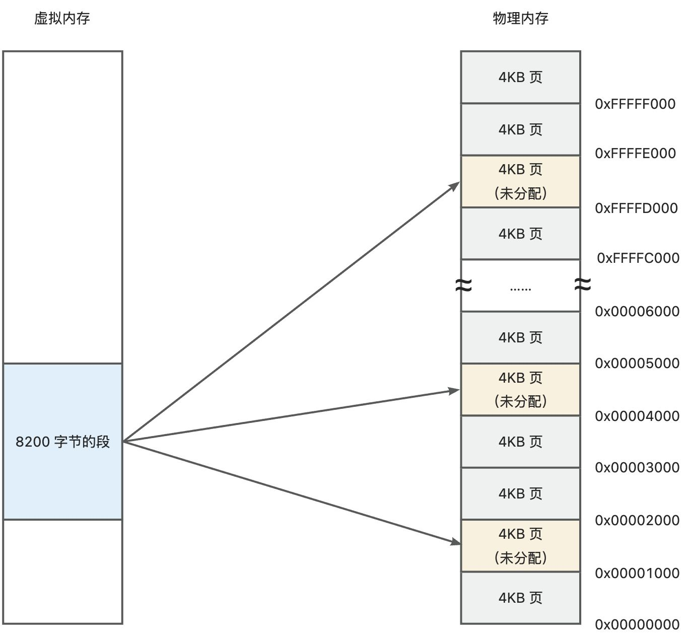

本文旨在全面回顾 x86 平台上各种分页技术的发展历程及其特点，帮助读者理解这些技术是如何逐步演进以适应不断增长的需求。

<!-- truncate -->

# 概述
x86 分段机制的段长度不固定，当要加载大段时，内存中过于零碎的分段可能导致明明还有内存空间，但是大段却无处加载。

为了解决传统分段机制存在的局限性，自 80386 处理器起，引入了分页机制。该机制的核心在于使用固定长度的页来替代长度可变的段，从而有效提升内存管理的效率与灵活性。

最初的分页机制比较简单，仅能满足对最大 4GB 内存空间的分页，这在早期个人电脑和小型服务器上已经足够使用了。然而，随着应用程序变得越来越复杂、数据量不断增加，4GB 内存难以支撑越来越广泛的计算机使用场景，因此出现了 32 位 4MB 分页技术，以及 32 位 PAE-4KB 和 PAE-2MB 分页技术。

进入 64 位时代后，处理器能够直接支持更广阔的地址空间。为了充分利用这一点，同时保持向后兼容性，IA-32e 引入了一种新的多级页表结构：首先是基于 48 位线性地址的四级分页模型，该模型允许程序理论上可以访问到高达 256TB 的虚拟内存；随后进一步发展成为基于 57 位线性地址的五级分页模型，使得单个进程能够访问的最大内存达到了惊人的 128PB。

在 64 位处理器架构的时代，出现了 48 位线性地址的 4 级分页模型，现在又有了 57 位线性地址的 5 级分页模型。

尽管从最早的简单分页到最新的高级分页方案之间经历了巨大的变化，但它们背后的核心思想却始终未变。本文旨在全面回顾 x86 平台上各种分页技术的发展历程及其特点，帮助读者理解这些技术是如何逐步演进以适应不断增长的需求。

# 基础回顾
x86 的内存访问在实模式和保护模式下有所不同。

## 实模式
实模式下由段寄存器提供 16 位的段地址，段地址左移 4 位形成 20 位的段地址。指令提供 16 位的有效偏移地址，二者相加，得到 20 位的物理地址。

注意，在 32 位处理器上，会在 20 位物理地址前加 0 扩展到 32 位。如果是地址线超过 32 位的处理器，还会在这个基础上再在左侧加 0 扩展到实际物理地址位数。

## 保护模式
在保护模式下，分段机制依然是默认模式，而分页则需要手动开启。

在分段模式下，段寄存器中存储的是段选择子，而段选择子只占用 16 位的空间，剩余 16 位则是端地址的高速缓存。总之，由段寄存器最终可以提供出 32 位的段基地址。由指令提供 32 位的有效地址。二者直接相加，得到 32 位的线性地址。线性地址左侧加 0 扩展到实际物理地址位数。

在分页模式下，拿到 32 位线性地址后，会经过一个页部件，也叫段页转换部件，将段地址转换成物理地址。

# IA-32 的分页机制
分页就是将实际内存区域划分成大小固定的页。并且以页作为内存管理和寻址的基本单位。

基础的分页模式下，每个页固定 4KB 的大小，即 0x1000 个内存单元，整个 4GB 存储空间可以划分成 1048576 个页。

虽然我们用大小固定的页来划分实际的物理内存区域了，但实际上程序还是以分段的形式存在的。也就是说开启分页后，段地址是虚拟的，页地址才是真实的。那我们就需要建立一个段和分页之间的映射关系。

有了这层映射关系，我们必须把它保存下来，才能让 CPU 知道程序中的段地址对应的实际物理地址是什么。我们先把这种映射关系的存储结构叫做——**页映射表**。

实际上，每个任务都可以拥有 4GB 的虚拟内存空间；所以同时，每个任务都需要有自己的页映射表。

那就有一个问题了，每个任务都有 4GB 虚拟内存空间，而物理内存只有一个，最大也才 4GB，根本不够分的。事实上，的确不够分配。但是，操作系统可以将暂时不用的页退避到磁盘，调入马上就要使用的页，通过这种手段来实现分页内存管理。这就是为什么内存容量较小时，程序越来越慢，硬盘工作指示灯不停地闪烁的原因。

## 4KB 分页技术
### 分页原理
4KB 分页技术就是每个页是 4KB，这也是上面所说的最基础的分页模式。

因为 4GB 的虚拟内存空间对应着 1048576 个 4KB 的页，可以随机地抽取这些页，将它们组织在 1024 个页表内，每个页表可以容纳 1024 个页。页表内的每个项目叫做页表项，占 4 字节，存放的是页的物理地址，故每个页表的大小是 4KB，正好是一个标准页的长度。

再用一个表来指向 1024 个页表，这就是页目录表 (Page Directory Table，PDT)。和页表一样，页目录项的长度 4 字节，填写的是页表的物理地址，共指向 1024 个表页，所以页目录表的大小是 4KB，正好是一个标准页的长度。

所以，可以说`sizeof(页) = sizeof(页表) = sizeof(页目录)`

这就是最基本的分页原理。

### 段页转换
那么，**如何将线性地址转换成物理地址**呢？

32 位的线性地址被划分为不同的字段来对应页目录表、页表和页内偏移等信息。一般来说，线性地址的高 10 位用于索引页目录表，中间 10 位用于索引页表，低 12 位用于表示页内偏移。

例如，假设线性地址的高 10 位为二进制值 0000000010，对应的十进制值为 2。乘以 4 后得到 8，这就表示要访问页目录表中的第 8 个表项。这个表项可能指向一个页表，也可能直接指向一个物理页框，具体取决于系统的配置和内存使用情况。

在处理器内，控制寄存器 CR3 保存着当前任务的页目录表的物理地址。在进行地址转换时，处理器通过 CR3 找到当前任务的页目录表。

这里要重点说明一下为什么是线性地址的高 10 位用于索引页目录表，中间 10 位用于索引页表，低 12 位用于表示页内偏移。

首先，我们每个分页是 4KB，为了能够表示一个分页中所有的内存地址。需要至少 4K 个数值来表示地址。即 2^12。也就是说需要 12 个二进制位。因此，最低的 12 位需要用于表示页内的偏移地址。

再看中间 10 位，每个页表的大小也是 4KB，每个页表项的大小为 4 字节，因而页表需要承载 1024 个页表项。对比物理页是每字节一个地址，页表项是每 4 个字节一个地址，因此每个页表项的索引需要用 10 位二进制数来表示，即用中间 10 位表示页表内页表项的索引。

最后，看一下最高 10 位，页目录表的大小也是 4KB，每个页目录项的大小为 4 字节，因为页目录表需要承载 1024 个页目录项。每个页目录项的索引需要用 10 位二进制数来表示，即用最高 10 位表示页目录表内页目录项的索引。

### 页表项

页目录项和页表项结构相同。无论是页目录项还是页表项，都要存储对应的下级结构的物理基地址。但这里只存储了物理基地址的 31~12 位，也就是高 20 位，那么低 12 位在哪里呢？

答案是——低 12 位被忽略掉了。因为页是 4KB 对齐的，所以低 12 位一定为 0，因此不用单独列出来了，处理器在做转换的时候会自动加上低 12 位的 0。

其他各标识位的作用是：

+ **P（Present）**：存在位，为“1”时，表示页表或者页位于内存中。否则，表示页表或者页不在内存中，必须先予以创建，或者从磁盘调入内存后方可使用
+ **RW（Read/Write）**：读/写位，“0”时表示这样的页只能读取，为“1”时可读可写
+ **US（User／Supervisor）**：用户／管理位。为“1”时，允许所有特权级别的程序访问：为“0”时，只允许特权级别为 0、1 和 2 的程序访问，特权级别为 3 的程序不能访问
+ **PWT（Page-level Write-Through）**：页级通写位，和高速缓存有关。“通写”是处理器高速缓存的一种工作方式，这一位用来间接决定是否采用此种方式来改善页面的访问效率
+ **PCD（Page－level Cache Disable）**：页级高速缓存禁止位，用来间接决定该表项所指向的那个页是否使用高速缓存策略
+ **A（Accessed）**：访问位。该位由处理器固件设置，用来指示此表项所指向的页是否被访问过。这一位很有用，可以被操作系统用来监视页的使用频率，当内存空间紧张时，用以将较少使用的页换出到磁盘，同时将其 P 位清零。然后，将释放的页分配给马上就要运行的程序，以实现虚拟内存管理功能
+ **D（Dirty）**：脏位。该位由处理器固件设置，用来指示此表项所指向的页是否写过数据
+ **PAT（Page Atttibute Table）**：页属性表支持位。后面会将，这里先不用关心
+ **G（Global）**：全局位。用来指示该表项所指向的页是否为全局性质的。如果页是全局的，那么，它将在高速缓存中一直保存（也就意味着地址转换速度会很快）。因为页高速缓存容量有限，只能存放频繁使用的那些表项。而且，当因任务切换等原因改变 CR3 寄存器的内容时，整个页高速缓存的内容都会刷新。
+ **AVL **位被处理器忽略，软件可以使用

:::info

4KB 分页技术的局限性：4KB 分页最多可以划分 1024*1024*1024*4 = 4GB 的内存空间，且一定是最低的 4GB 内存空间。即使物理内存大于 4GB，也依然只能使用内存空间的低 4GB 部分。无法有效地利用物理内存。

:::

## 4MB 分页技术（PSE）
为了解决物理内存大于 4GB 时，无法有效利用内存的问题。出现了 4MB 分页技术。

4MB 分页技术即每个页的大小是固定 4MB。要表示 4MB 的地址空间，需要 22 个二进制位。

剩余 10 个二进制位刚好可以用于表示页目录表的索引。

如上图所示，4MB 分页没有页表，从页目录项直接指向了物理页。

你可能会疑惑，这种分页方式有什么特殊，为什么可以突破 32 为物理地址呢？

要说明这一点，我们要来看一看页目录项的结构有和 4KB 的有哪些不一样。

我们重点关注页的物理地址部分。上图中位 21 是保留的，但是实际上保留位数是不固定的。这取决于处理器的最大物理地址 M。

如果处理器有 36 根地址线，那么 M=36，在这个表中位 21~17 都保留。

所以，位 13 ~ 20 是 8bit，加上 31 ~ 22 这 10bit，和低 22bit 的 0，一共最高表示 40bit 的物理地址，也就是 1TB 的内存。

:::info

40bit 的物理地址仍然有其局限性，现在的 CPU 可不止 40 根地址线，所以这种方式又落后了。

:::

## PAE 分页技术
上面所述的分页技术发展目标是充分利用物理内存。让物理内存能为更多的任务服务。虽然每个任务只有 4GB 虚拟内存，但却可以映射到物理内存中的任意位置。这样物理内存就可以同时承载很多任务，而不用频繁发生磁盘交换。

上述 4MB 分页技术最多生成 40bit 物理地址，如果需要更多位数，需要采用 PAE（Physical Address Extension，物理地址拓展）分页技术。

PAE 的核心思想是改变页目录项和页表项的大小，原本一个项是 32 位的，现在改成 64 位的，以此来扩大所能够表示的物理地址范围。

### PAE-4KB

PAE-4KB 分页方式下，每个项扩展到 64 位，页目录和页表的大小还是 4KB。所以页目录和页表都只存 512 个项，因此只需要 9 个 bit 就可以表示 512 个索引。

如此一来，多出来了 2 个 bit。为了充分利用线性地址，PAE 又引入了一个页目录指针表。它只有 4 个表项，叫做页目录指针项。每个页目录指针项用来存储页目录表的 m 位物理地址。

来看下 PAE-4KB 分页方式下的页目录指针项：

因为页目录在内存中是 4KB 对齐的，所以最低 12 位全是 0。实际需要表示的就是 M-1 ~ 12 位的物理地址。

上图为 PAE-4KB 模式下的页目录项结构。NX 是禁止执行位，若 NX=1，则禁止从此表项关联的页中取指令和执行指令。其他不做解释。

上图为 PAE-4KB 模式下的页表项结构，同样的原理，不做单独解释。

### PAE-2MB
PAE-2MB 分页模式和 4MB 分页技术一样，也是一种大页模式。一样也是通过取消掉页表来实现大页的。

因为在 PAE 模式下，只使用 9 位来表示页表项的索引，因此取消页表后，可以把这 9 位加到物理页内的索引上。也就是最多 21 个 bit 来表示一个物理页内的索引，所以一个物理页的大小是 2MB，而不是 4MB。

上图为 PAE-2MB 分页模式下的页目录项。从位 21 到位 M-1 这部分是 2MB 物理页的索引地址，因为是 2MB 对齐的，低 21 位必须全为 0，因此不用存储。因为用不着那么多位，所以位 13~20 保留。

# IA-32e 的分页机制
IA-32e 是 Intel 推出的兼容 32 位模式的 64 位架构，后续正式更名为 INTEL 64 架构。该架构下的 CPU 可以运行在以下几种模式下：

+ 传统模式
    - 实地址模式
    - 32 位保护模式
+ IA-32e 模式
    - 兼容模式：兼容传统 32 位保护模式
    - 64 位模式

传统模式相互之间不能共存，也不能和 IA-32e 模式共存，而 IA-32e 模式可以让 32 位保护模式和 64 位模式共存，并且无缝切换。在 IA-32e 模式下，不支持硬件任务切换，也不支持实模式。

传统模式下的分页与 32 位处理器无异。而 IA-32e 模式下的分页就是这部分要介绍的重点了。

由于 IA-32e 模式下，有 64 位的线性地址，其可以表示 16EB 的内存空间，如果要将 64 位的线性地址转换成物理地址，至少需要 6 级分页。但实际上 16EB 根本用不完，所以考虑制造成本，通常不会使用全部 64 位的线性地址。

目前来说，大部分低配 CPU 支持 48 位有效部分，支持 256 TB 的虚拟地址空间（日常使用场景中，在可预见的未来很长一段时间也不会达到瓶颈）。剩下的高 16 位必须进行 Canonical 处理。

:::warning

IA-32e 模式下分页是强制开启的，无法关闭。

:::

## Canonical 地址
Canonical 就是要把高 16 位扩高处理。如果有效部分的最高位是 1，则全部高 16 位都要扩成 1；如果有效部分最高位是 0，则全部高 16 位都要扩成 0。是不是有点儿像补码的规则？

Canonical 的主要作用就是向后兼容，防止有人乱用高 16 位，一旦后续要使用高 16 位，原本的程序就可能无法跑通了。

## 兼容模式的内存访问
兼容模式下会将 32 位线性地址加 0 扩展到 64 位，再送给页部件转换为物理地址。

注意，兼容模式下实际使用的新的 4 级分页机制来转换 64 位线性地址，这和传统模式下的分页不同。

## 64 位模式下的分页方式

:::warning

在 64 位模式下，分段功能将被禁止，只保留一个段，即强制使用平坦模型。但 FS 和 GS 段寄存器仍然可以使用，但不再本文讨论范围内，有兴趣可以自行拓展。

:::

### 4 级分页
4 级分页下，每个页大小仍然为 4KB，也就是需要 12 位来表示页内的索引。

除了物理页，每一级的表项都是 64 位的，因此每一级的表都存储 512 个表项，需要用 9 位来表示表内索引。

9*4+12 刚好等于线性地址中的 48 位有效部分。

### 5 级分页
目前在一些高端的处理器中已经出现了 5 级分页支持，即支持 57 位的有效地址，虚拟内存从 256TB 增加到 128 PB，这种 5 级分页对于现代的内存密集型服务器非常重要。

英特尔从 **Ice Lake** 架构开始支持 5 级分页，AMD 从 **Zen 4** 开始支持 5 级分页。

## 大页（Huge Pages）
在最新的 64 位分页技术中，仍然存在大页分页技术。可通过 2MB 或 1GB 页**减少中间页表层级**来优化性能。尤其适合数据库（如 MySQL、Oracle）和虚拟化环境。

2MB 大页仍然是省略掉页表。而 1GB 大页则是连页目录也省略掉了，直接通过页目录指针表指向物理页。

# 哈希页表
在 64 位处理器上，几乎所有的程序都不可能用完 48 位或 57 位的虚拟内存。但是每次寻址还是需要经历 4 级或 5 级查表。使用大页虽然可以减少 1~2 级，但也仍然需要多级寻址。那是否可以一步到位呢？

你应该很容易就想到了 Hash。没错，Hash 页表就是一种通过哈希函数加速页表查找的机制，主要用于解决传统多级页表（如 x86 的 4 级 /5 级分页）在大地址空间（如 64 位系统）下的效率问题。

其工作原理如下：

1. **输入时**，通过输入虚拟地址的页号（VPN），处理器中的哈希硬件加速模块会对 VPN 进行哈希运算，生成哈希表的索引。
2. **哈希冲突时**，可通过链表（Chaining）或开放寻址（Open Addressing）解决。
3. **输出时**，通过头表可直接找到匹配的物理页，再结合页内偏移得到物理地址。

X86 架构并**不支持**哈希页表。但在其他处理器上具有一定的的实际应用：

1. PowerPC 架构采用 HTAB（Hash Table）机制管理页表，通过硬件加速哈希查找，将虚拟地址的页号（VPN）哈希到固定大小的页表（HTAB）中，支持链地址法解决冲突
2. 某些 ARMv8/ARMv9 扩展架构支持类似哈希页表的机制
3. RISC-V 的某些扩展提案（如 Svpbmt）探索了哈希页表，但尚未成为主流标准
4. KVM 虚拟机用软件实现了哈希页表，用于加速客户机物理地址到主机物理地址的转换

# 参考资料
+ 《X86 汇编语言：从实模式到保护模式》，李忠
+ 《X86 汇编语言：编写 64 位多处理器多线程操作系统》，李忠、王晓波、李双圆

