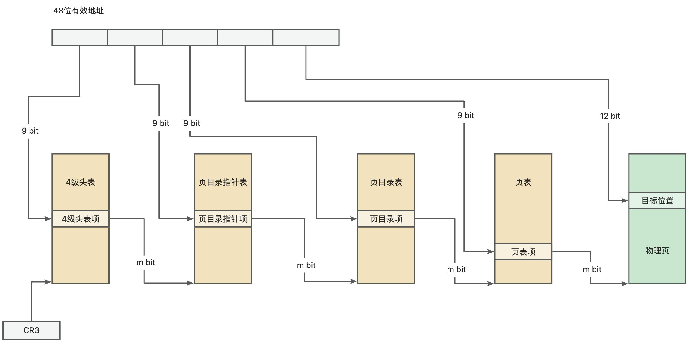
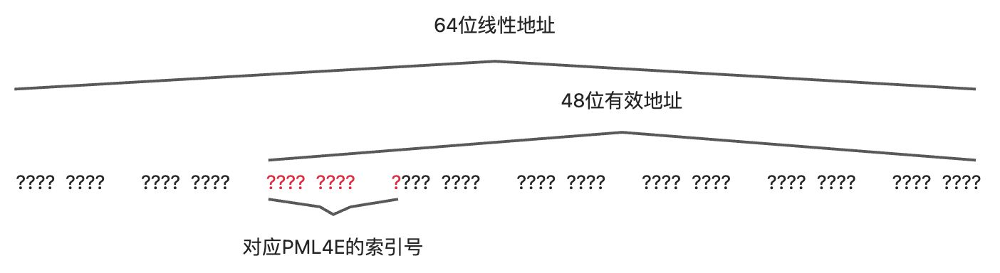
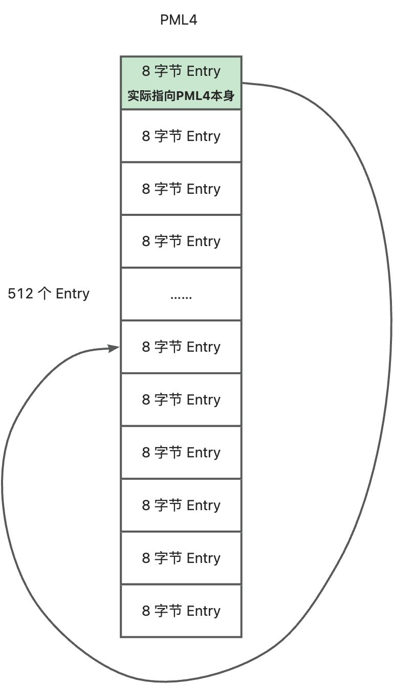
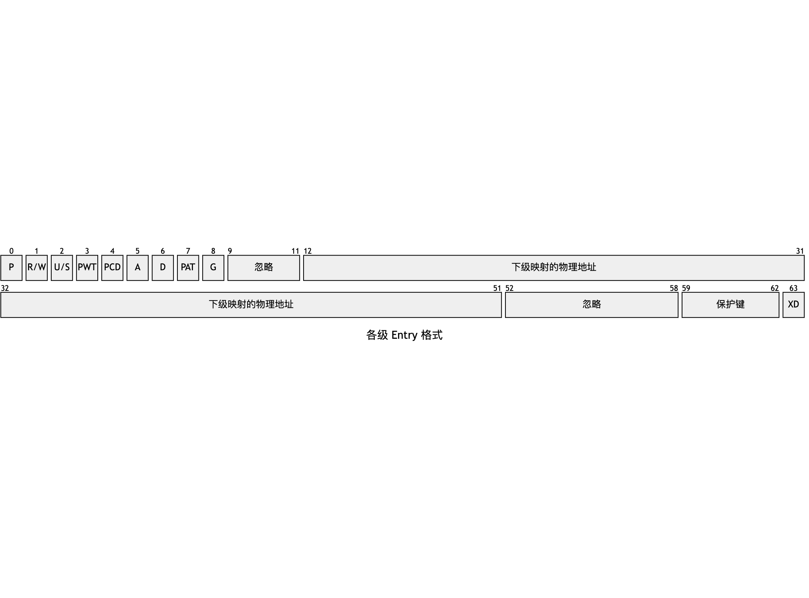

本文主要用于理顺 IA-32e 架构下的内存分配流程。

<!-- truncate -->

## 分页基础回顾
### 名词解释
为了后续表述更加统一和清晰，先做名词解释。

- Page：页（物理内存页）
- PT（Page Table）：页表
- PD（Page Directory）：页目录
- PDPT（Page Directory Pointer Table）：页目录指针表
- PML4 (Page Map Level 4)：4 级头表
- PML5 (Page Map Level 5)：5 级头表
- PTE（Page Table Entry）：页表项
- PDE（Page Directory Entry）：页目录项
- PDPTE（Page Directory Pointer Table Entry）：页目录指针表项
- PML4E (Page Map Level 4 Entry)：4 级头表项
- PML5E (Page Map Level 5 Entry)：5 级头表项

### 线性地址与物理地址

在 64 位模式下，通常不会使用全部 64 位作为有效地址。在支持 4 级分表的 64 位处理器上，只有低 48 位是有效地址，高 16 位需要符合扩高形式。

所以，一旦线性地址确定，那么它所对应的 PML4E、PDPTE、PDE、PTE 也就都确定下来了。这个过程是处理器硬件完成转换的，操作系统无法干预。

### PML4/PDPT/PD/PT 的本质
PML4/PDPT/PD/PT 本身也要占据内存空间，它们本质上也是物理页。

在典型的 4KB 分页中，每个 PML4/PDPT/PD/PT 内部都会存储 512 个表项，每一项 64 位，即一个 PML4/PDPT/PD/PT 即为 4KB。

## 内存分配整体流程
大致流程可以概括为：`确定要分配的大小-->分配线性地址-->分配物理内存页-->将页注册到多级分表中`

详细流程如下图所示：

### 分配线性地址
我们要分配线性地址，即虚拟地址，肯定需要知道线性地址空间中哪些区域是空闲的，哪些是已使用的。

一种最基础的方案就是用一个变量来记录**当前线性地址空间使用到哪里了**。为了后面解释方便，我们把这个变量叫做 _core_next_linear。

在真实操作系统中，肯定需要考虑对内存的回收和重复利用，但我们先不考虑重复利用的流程，先把基础流程捋顺。

我们要求分配的线性内存是 8 字节对齐的，这有助于提高内存访问效率。

:::info

现代 64 位系统架构的数据总线通常是 64 位（8 字节）宽的。这意味着 CPU 与 RAM 或高速缓存之间的一次数据传输最少就是 8 个字节。

即使你只需要读取一个 int（4 字节），CPU 实际上会读取包含该 int 的整个 8 字节对齐的内存块（或者更大的块）。

如果一个 int 的起始地址没有 8 字节对齐（例如，位于地址 0x1003），那么它就跨越了两个 8 字节的对齐块（0x1000 和 0x1008）。CPU 就需要发起**两次独立的访问内存操作**并组合所需的部分，才能得到这一个 int。这显然比一次读取慢得多。

:::

### 线性地址决定了分页位置
48 位有效地址中，位 47~38 决定了 PML4E 在 PML4 中的位置。我们要做的是找到这个位置，并查看该位置上是否已经注册了 PML4E，如果有证明之前已经分配过，如果没有则需要分配 PML4E 并注册。

找到这个位置，其实就是访问内存中的 PML4，但 IA-32e 架构下，强制使用线性地址访问内存空间，即便你知道 PML4 的物理地址也没有用。必须构造出指向 PML4E 的线性地址才能够访问该内存空间。

一个 64 位的线性地址，其内容不确定，可以都使用「?」表示。其中低 48 位是有效地址。

位 47~38 就是 PML4E 的索引号，实际上每个 Entry 占用 8 个字节，所以索引号乘以 8 就是 Entry 在 PML4 中的偏移量。通过`and 0x0000_ff80_0000_0000`的操作，将这 9 位的值取出，其余位置 0，然后右移 36 次，可以得到

00000000 00000000 00000000 00000000 00000000 00000000 0000???? ?????000

它就是 PML4E 的表内偏移量了。

下面就是如何得到表的起始地址了。我们采用一种很巧妙的「递归」方式解决该问题。

即在初始化 PML4 时，就将最后一个 Entry 指向自身的物理地址。

这样，我们只需要最终构造出

11111111 11111111 11111111 11111111 11111111 11111111 1111???? ?????000

就可以访问线性地址的 PML4E 所在的位置了。

我们简单思考验证下：

- 位 47~39 的 111111111 对应的是 PML4 的最后一个 Entry，其指回自身。
- 位 38~30 的 111111111 对应的是 PDPT 的最后一个 Entry，但这里的 PDPT 其实就是 PML4 自身，所以其又指回自身。
- 位 29~21 的 111111111 对应的是 PD 的最后一个 Entry，但这里的 PD 其实就是 PML4 自身，所以其又指回自身。
- 位 20~12 的 111111111 对应的是 PT 的最后一个 Entry，但这里的 PT 还是 PML4 自身，所以其又指回自身。
- 位 11~0 的 ?????????000 对应的是物理页中的偏移地址，这里的物理页是 PML4 自身，所以就能顺利访问 PML4E 的内存空间了。

同理，我们可以通过线性地址的位 38~30、位 29~21、位 20~12 分别构造出该线性地址对应的 PDPTE、PDE、PTE 的线性地址，访问并校验其是否已经生成并注册过了。

### 物理内存页的分配
和分配线性地址空间是一样的道理，我们必须知道当前物理页哪些被分配了，哪些没有被分配。由于物理页是已分配就是一页，且分配位置是随机分配的。因此，我们可以用一个 bitmap 来存储每个页是否有被占用。

bitmap 的 offset 用来表示是第几个物理内存页，对应位置的比特用来表示当前页是否已分配。

使用 bts 指令测试并设置 bitmap 中的指定比特。这条指令将选定的比特传送到标志寄存器的 CF 位。

通过判断标志寄存器的 CF 位是 0 还是 1，就知道被测试的比特是 0 还是 1。

- 如果是 0，证明未分配，将当前比特的 offset 左移 12 位（相当于乘以 4096），即可得到当前页的物理地址
- 如果是 1，证明已分配，将 offset+1，并继续测试下一个比特是否为 0

### Entry 的分配与注册
通过上述步骤，检查 Entry 是否已经注册过，主要是依靠 Entry 的 P 标识位。

:::warning

上表并不是非常标准的 Entry 格式，因为各级 Entry 的格式有细微差别，但是大体结构是相同的。这里是做了一个通用表示。

:::

我们只需要通过 Entry 的线性地址拿到内存空间中的数据，再检查一下 P 位是否为 1，即可得知当前位置是否已经有 Entry 注册。

如果没有注册，那我们需要做两个事情：

1. 为 Entry 所对应的下级映射分配内存空间
2. 将该内存空间的物理地址注册到当前级别的映射表中

#### 为 Entry 对应的下级映射分配内存空间
- 假设当前的 Entry 是 PML4E，那么它所对应的下级映射就是 PDPT
- 假设当前的 Entry 是 PDPTE，那么它所对应的下级映射就是 PD
- 假设当前的 Entry 是 PDE，那么它所对应的下级映射就是 PT

无论是哪种情况，我们都需要为下级映射分配内存空间。待分配的内存空间是 4KB，刚好一个 Page。

以 PML4E 为例，分配到 Page 后，将它作为对应 PDPT 的内存空间，我们需要初始化这部分空间，将其全部置 0，包括 P 位都要为 0。

#### 将 Entry 注册到映射表中
我们已经有了 Entry 的「线性地址」，也有下级映射表的起始物理地址，下一步就是构造一个 Entry，并写入到「线性地址」中。这部分不难理解，不做赘述。
