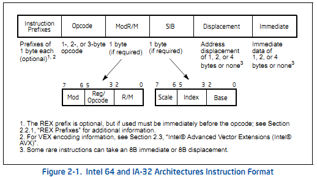

本文主要用于梳理 x86 的指令的基本格式。

<!-- truncate -->

下午快下班的时候，晓东来问：上面有一些 00 的行，这些行的作用或者含义是什么？

问了大模型，有说是为了内存对齐的。以我浅薄的汇编知识来看，指令应该是一条接一条的才对，应该不存在对齐一说。且对齐都是在一个数据区块存储到最后有空缺的时候才会对齐，莫名其妙在中间插入 0 做对齐，会浪费大量的空间，也达不到对齐的效果。

仔细观察`mov %r8,0x78(%rsp)`和`mov %r9,0x80(%rsp)`两句所对应的机器码，为什么前一句不用对齐，后一句就要对齐？这就更说不过去了。

于是就对该问题做了更详细的探究。

## 指令的组成结构

一条 x86 指令通常由以下部分组成，其总长度取决于每个部分的存在和大小：

1. **指令前缀（Optional Prefixes）**：0 到 4 个字节，用于修改指令的行为，如：
    - LOCK 前缀（用于原子操作）
    - 操作数大小覆盖前缀（如强制在 16 位模式下使用 32 位操作数）
    - 地址大小覆盖前缀
    - 重复前缀（用于字符串操作，如 REP）
2. **操作码（Opcode）**：1 到 3 个字节
    - 这是指令的核心部分，定义了 CPU 需要执行什么操作（如 add, mov, jmp）。
3. **ModR/M字节（Optional）**：1 个字节
    - 用于指定操作数的寻址模式。它告诉指令操作数是寄存器还是内存，以及使用哪种计算内存地址的方式。
4. **SIB 字节（Optional）**：1 个字节
    - Scale, Index, Base。当寻址模式比较复杂时（例如[eax + ebx*4 + 10]），需要这个字节来进一步说明。
5. **位移量（Displacement）**：0, 1, 2, 或 4 个字节
    - 一个直接包含在指令中的常数偏移值，用于内存寻址（如[array + 10]中的 10）。
6. **立即数（Immediate）**：0, 1, 2, 或 4 个字节
    - 一个直接包含在指令中的常数操作数（如 mov eax, 123 中的 123）。

从上面的组成中也可以看出，并不是所有指令都是看到 opcode 就知道有多长的定长指令，还有很多指令是变长指令。

当指令中出现内存操作对象的时候，就需要在操作码后面附加一个字节来进行补充说明，这个字节被称为 ModR/M。你可以理解 ModR/M 决定了我们常说的寻址方式。

## ModR/M字节
该字节的 8 个位被分成了三部分：

Reg/Opcode(第3、4、5位，共3个字节)描述指令中的 G 部分，即寄存器

| 寄存器宽度 | 000 | 001 | 010 | 011 | 100 | 101 | 110 | 111 |
| :---: | :---: | :---: | :---: | :---: | :---: | :---: | :---: | :---: |
| 32 | EAX | ECX | EDX | EBX | ESP | EBP | ESI | EDI |
| 8 | AL | CL | DL | BL | AH | CH | DH | BH |

Mod(第 6、7 位) 和 R/M(第 0、1、2 位) 共同描述指令中的 E 部分，即寄存器/内存

上图其实已经说的很清楚了，mod 一共占用 2 个 bit，最多 4 种取值，每种取值对应的**Effective Address**是不一样的。

+ `mod = 00`：无位移量的内存寻址（例如 `[eax]`）
    - 有一个例外：如果 `r/m = 101`，则表示纯 32 位位移寻址（例如 `[0x12345678]`），此时需要 4 字节位移量。
+ `mod = 01`：存在一个 **1 字节** 位移量的内存寻址（例如 `[eax + 0x12]`）
+ `mod = 10`：存在一个 **4 字节** 位移量的内存寻址（例如 `[eax + 0x12345678]`）
+ `mod = 11`：寄存器直接寻址（例如 `eax`），而不是内存寻址。

为什么除了 1 字节，就是 4 字节的表示呢？因为 1 字节已经覆盖了大部分常见的“访问结构体字段”、“栈帧局部变量”等场景，这些偏移量通常很小。用 1 字节编码可以**极大地节省代码尺寸**，这是 x86 设计的一个核心目标（高代码密度）。

其他情况下就可以使用 mod = 10 来“兜底”了。

:::warning
在 64 位模式下，增加了一个 REX 前缀。REX 前缀会直接影响 ModR/M 的表现。
:::

## REX 前缀

在 64 位模式下，许多指令需要一个 **REX 前缀** 来启用 64 位操作数和访问新的寄存器（R8-R15）。REX 是一个 1 字节的前缀，其格式为 `0100_wrbx`，其中每位都有特定功能：

+ **W bit (Bit 3)**: 操作数宽度。`W=1`** 表示 64 位操作数**（例如 `mov rax, rbx`），`W=0` 表示默认操作数大小（通常是 32 位，如 `mov eax, ebx`）。
+ **R bit (Bit 2)**: 扩展 `ModR/M.reg` 字段的最高位。
+ **B bit (Bit 0)**: 扩展 `ModR/M.r/m` 字段或 `SIB` 字段中 `base` 或 `index` 的最高位。
+ **X bit (Bit 1)**: 扩展 `SIB.index` 字段的最高位。

REX 前缀的存在直接改变了 ModR/M 和 SIB 字节的解释方式。

在 64 位模式下，ModR/M 主要有以下不同：

### 寄存器编码的扩展
在 32 位模式下，ModR/M 的 3 位 `reg` 和 `r/m` 字段只能编码 8 个寄存器（如 EAX, ECX, EDX, EBX, EBP, ESI, EDI, ESP）。

在 64 位模式下，REX.R 和 REX.B 位充当了 `reg` 和 `r/m` 字段的第四位（最高位）。这使得可以寻址的寄存器数量翻倍，从 8 个增加到 16 个。

例如：指令 `mov r8, r9` 的编码需要 REX 前缀。

+ `reg` 字段编码源操作数 `r9`。
+ `r/m` 字段编码目标操作数 `r8`。
+ 因为涉及 R8-R15，所以需要 `REX.B` 和 `REX.R` 位来扩展这两个字段。其机器码为 `4D 8B C1`。
    - `4D`：REX 前缀 (`0100`)，其中 `W=0`? (这里需要看具体操作)，但关键是 `R=1` 和 `B=1`。
    - `8B`： `mov` 的操作码。
    - `C1`：ModR/M 字节。假设`reg`=000 (由 REX.R=1 扩展为 1000, 即 R9)，r/m=001 (由 REX.B=1 扩展为 1001, 即 R8)。

### 对 EBP/RBP 和 ESP/RSP 寻址的特殊处理
在 32 位模式下，`r/m=101` 且 `mod=00` 是一个特例，表示纯 32 位位移寻址（如 `[0x12345678]`），而不是 `[ebp]`。

在 64 位模式下，**这个特例被取消了**。`mod=00` 且 `r/m=101` 现在表示 `[rbp]`（或者更准确地说，是 `[R13]`，因为 RBP 的编码被 R13 继承）。要表示纯 64 位位移寻址（如 `[0x12345678]`），需要使用 SIB 字节的特殊形式。

这简化了 64 位模式下的编码规则。

### 立即数和位移量的默认大小
在 64 位模式下，当操作数大小是 64 位时（REX.W=1），**立即数和位移量通常仍然是 32 位的**。32 位的位移量在符号扩展后足以满足绝大多数寻址需求，同时保持了代码的紧凑性。

例如，指令 `mov rax, [rbx + 0x12345678]` 使用 4 字节的位移量 `78 56 34 12`，而不是 8 字节。CPU 会在计算地址时自动将这个 32 位值符号扩展为 64 位。

### RIP 相对寻址
最后，64 位模式引入了一个极其重要的新寻址模式：**RIP 相对寻址**（如 `[rip + 0x1234]`）。

这是一种非常高效和有利于位置无关代码（PIC）的寻址方式。它使用 `mod=00` 和 `r/m=101` 的组合进行编码，但后跟一个 32 位的位移量。CPU 会将当前指令指针（RIP）的值加上这个位移量来计算有效地址。

## 案例分析
具体来分析一下上面的案例。

`mov %r8, 0x78(%rsp)`

+ **位移量值**：`0x78` (十进制 120)
+ **分析**：`120` 在 8 位有符号数的范围之内 (`-128` 到 `+127`)。
+ **编码**：这种情况下，`mod` 字段可以被设置为 `01`。这个模式的含义是：**存在一个 1 字节的位移量**。指令格式为：`[基址寄存器 + 1字节位移]`。
+ **机器码**：`4c 89 44 24 78`
    - `4c`：REX 前缀（指定 64 位操作和扩展寄存器）
    - `89`： `mov` 的操作码
    - `24`：ModR/M 字节。其 `mod` 部分就是 `01`，表示后续有 1 字节位移。`r/m` 部分指定了 `%rsp` 作为基址寄存器。
    - `78`： **这就是 1 字节的位移量本身** `0x78`。不需要也不应该有任何填充。

`mov %r9, 0x80(%rsp)`

+ **位移量值**：`0x80` (十进制 128)
+ **分析**：`128` **超出了** 8 位有符号数的范围（8 位有符号数的最大值是 127）。因此，不能使用上面的紧凑模式。
+ **编码**：这种情况下，`mod` 字段**必须**被设置为 `10`。这个模式的含义是：**存在一个 4 字节的位移量**。指令格式为：`[基址寄存器 + 4字节位移]`。
+ **机器码**：`4c 89 8c 24 80 00 00 00`
    - `4c 89 8c 24`：操作码和 ModR/M 字节。这里的 `mod` 部分是 `10`，表明后面跟随着 4 字节位移。
    - `80 00 00 00`：这就是 **4 字节的位移量**。在 x86 的小端序中，值 `0x00000080` 被存储为 `80 00 00 00`。后面的三个 `00` 不是填充，而是这个 32 位数字的高位字节，是指令不可或缺的一部分。

## 总结
好，最后我们再来总结一下这个问题。

首先，折行的这个 00 就**是指令的一部分**，是有意义的。

为什么有的有 00，有的没有？

分两种情况：

第一种情况，`mov %r9, 0x80(%rsp)`是因为 0x80 超出了 8 位整数的表示范围，所以 mod=10，必须用 4 个字节来表示其偏移量。

第二种情况，`movl $0x0, 0x3c(%rsp)`是因为 0x0 是一个要存入到内存中的立即数，它不是用于寻址的，自然也就没有变长一说，必须完完整整的用 4 个字节表示。

