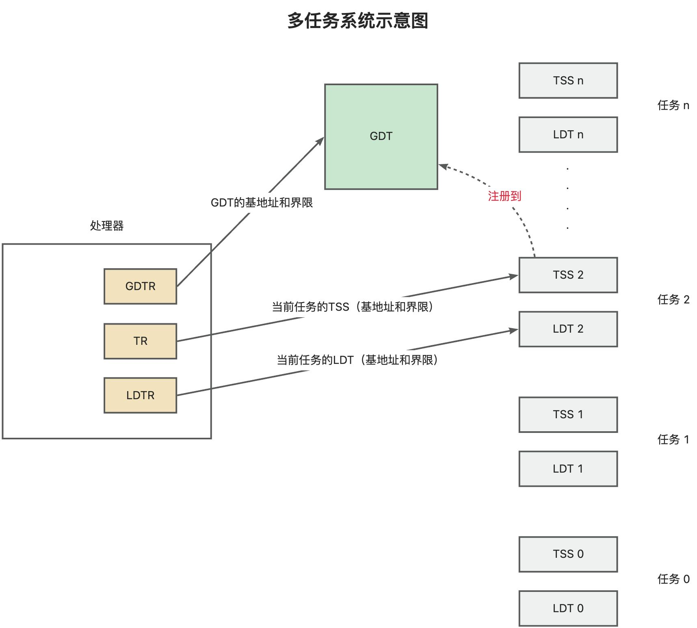
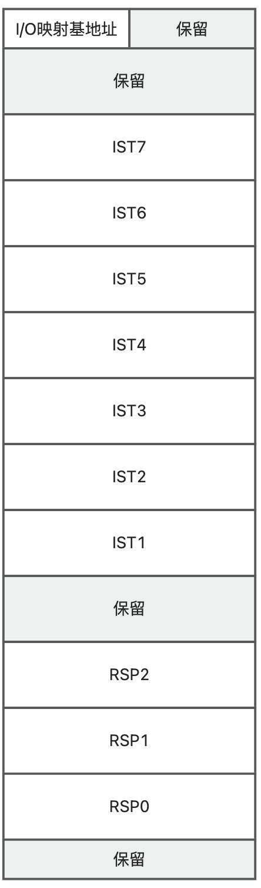
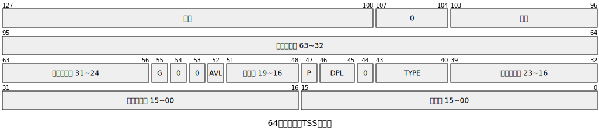
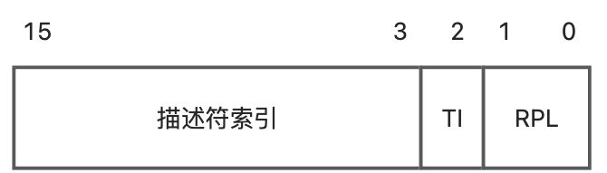
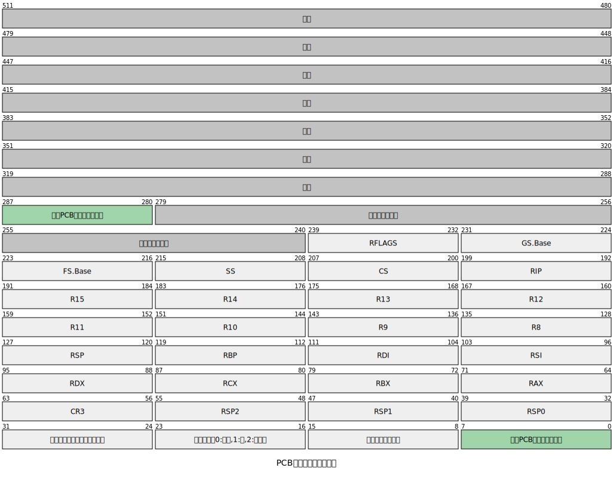
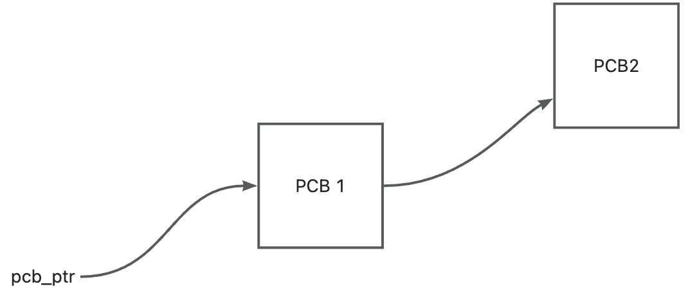
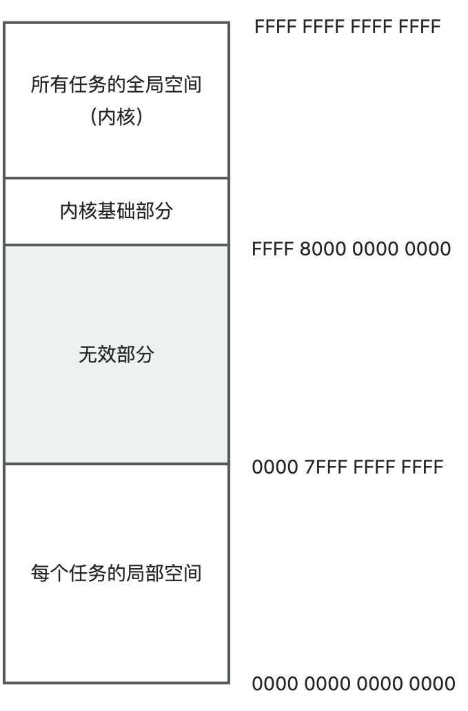
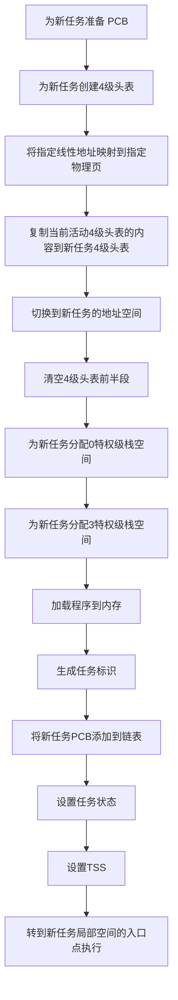
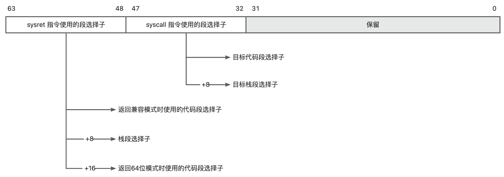
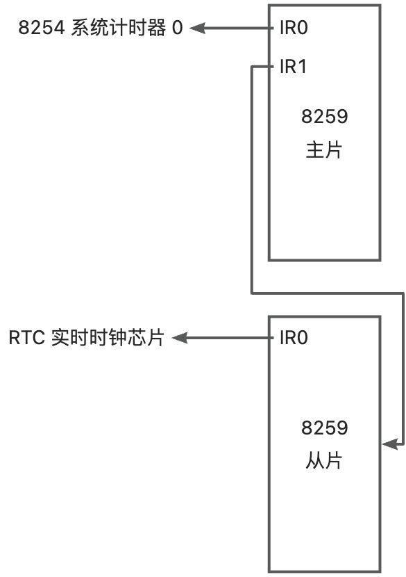

本文所述为操作系统在适配 64 位处理器时的一般逻辑，并不意味着某一具体操作系统的实现。

我们知道 IA-32e 架构在 64 位模式下取消了硬件任务切换，且强制使用平坦模型。这使得任务切换不再受到 CPU 规则的强约束，这使得任务切换变得更加轻量级。

本文会对 64 位模式下单核处理器的多任务管理的流程和方法做一些简要的整理。

<!-- truncate -->

我们先从任务的概念聊起。

## 概述
任务是一个独立的执行单元，拥有自己的地址空间（代码、数据、堆栈）和状态（寄存器、TSS）

同时为了方便操作系统对任务进行管理，还需要有 PCB 结构。

多个 PCB 串在一起可以形成一个 PCB 链表。

## TSS 任务状态段
### TSS 的结构

### TSS 描述符
TSS 是需要注册到 GDT 中的。也就是说，需要有一个 TSS 描述符用来描述 TSS 在内存中所处的位置，以及权限等属性。在 64 位模式下，TSS 描述符的长度是 128 位。

### TSS 选择子
只有描述符还不够，描述符是注册到 GDT 中的，而真正指定 TSS 的时候是需要使用选择子的。什么时候需要指定 TSS 呢？答案就是任务切换的时候，你得把 TSS 的选择子加载到 TR 寄存器中，这是任务切换中一个重要的步骤。

所有类型的选择子的格式都是一致的。请注意，无论是 32 位模式还是 64 位模式，选择子始终是 16 位（2 字节）的值。

:::warning

64 位模式下，TSS 已经不再用于任务切换，而只是用于保存控制转移时的栈指针。因此，全局可以只设置一个 TSS，所有任务共用一个 TSS。

:::

## LDT 局部描述符表
LDT 是 x86 架构中用于定义 **进程私有段** 的数据结构，与 GDT（Global Descriptor Table，全局描述符表）共同管理内存段的访问权限和属性。LDT 的主要特点是：

+ 每个进程可以有自己的 LDT，用于隔离不同任务的段描述符。
+ 通过 LLDT 指令加载 LDT 选择子（指向 GDT 中的一个系统段描述符）。
+ LDT 的条目格式与 GDT 相同（8 字节描述符），但通常用于用户态代码/数据段。

LDT 在 64 位模式下被大幅弱化，几乎无实际作用。所以现代操作系统通常不使用 LDT。LDT 本身也不是任务所必须的，但为了兼容考虑，仍被保留。

### LDT 的结构
LDT 是局部描述符表，和 GDT 一样，只不过只能作用于任务自身，是每个任务都独立拥有的描述符注册区域。

LDT 的第一个索引位置是允许存放描述符的，而 GDT 的第一个位置只能用全 0 覆盖。

## PCB 任务控制块
PCB 是 Process Control Block 的缩写。这是一种完全由操作系统定义的，为了方便管理进程而存在的结构。为了方便使用，可以将 PCB 设计为双向链表。

### PCB 项的结构
+ PCB 用于存储各个寄存器的值，为任务恢复做好准备。
+ PCB 还会记录当前任务下次可分配的起始线性地址。

### PCB 链表
通常在内核中记录 PCB 链表的起始线性地址（即我们说的头指针所记录的地址）

## 线性地址空间的分割
多任务环境下，每个任务都拥有自己独立的 64 位线性地址空间，线性地址的范围是从 0 到 0xFFFF FFFF FFFF FFFF。

## 新任务创建流程
新任务创建一定是在内核态中完成的。流程可以概括为：

## 快速系统调用——syscall
**系统调用**是操作系统内核向运行在用户空间的应用程序提供的编程接口。

在 32 位保护模式下，我们可以使用调用门来实现不同特权级之间的调用。当然，更为大家熟知的是 Linux 的早期实现，即使用软中断`int 0x80`来实现系统调用。应用程序将系统调用号放入 `eax` 寄存器，参数依次放入 `ebx`, `ecx`, `edx`, `esi`, `edi`, `ebp` 寄存器，然后执行 `int 0x80` 指令。

从 Pentium II 处理器开始，INTEL 引入了`sysenter`/`sysexit`专用指令。它们通过一组模型特定寄存器来预先设置好内核代码段、入口点等信息，避免了查询内存中的中断描述符表等步骤，因此执行速度更快。

在 64 位模式下，引入了全新的、更高效的机制：`syscall`/`sysret`。

`syscall` 指令的设计比 `sysenter` 更简洁，拥有独立的、不受干扰的专用指令和寄存器，性能极佳。这种机制叫做「快速系统调用」。

快速系统调用是远转移，且伴随着特权级的改变。进入时从特权级 3 代码段切换到特权级 0 代码段，返回时从 0 再转回 3。在任何时候，**栈段**特权级必须和当前特权级一致。所以，整个过程需要 2 个代码段选择子和 2 个栈段选择子，这些选择子在 IA32-STAR 中指定。

快速系统调用默认是不能使用的，需要开启开关。开关位于 IA32_EFER 寄存器中。IA32_EFER 的位 0 叫做 SCE，即 syscall enable。为 1 则允许执行 syscall 和 sysret 指令；为 0 则不允许，执行会引发异常。

我们现在只提供了段选择子，但是调用的入口点地址还没有地方指定。这个入口点的线性地址要通过 IA32_LSTAR 型号专属寄存器来指定。这是一个 64 位寄存器，用于保存目标例程的 64 位入口地址。LSTAR 的 意思是 Lang mode syscall/sysret target。

syscall 不会自动切换栈，因此需要手动切换。

syscall 进入内核时，可以自行决定标志寄存器 RFLAGS 各位的状态。因此引入型号专属寄存器 IA32_FMASK，标志寄存器掩码寄存器。当 syscall 时，FMASK 中对应的位为 0，则意味着要保留该位的值；若为 1，则表示要清除该位的值。将 IF 位清零是很有必要的，这样可以保证处理器在栈切换期间不会响应中断。

syscall 指令执行时，处理器自动用 R11 备份 RFLAGS，用 RCX 备份 RIP。

## 利用定时器硬件中断实现时间片轮转
最简单的时间片轮转，通过一个简单的计数器实现。即每隔 N 个定时器中断周期，就进行一次任务切换。

任务切换时，从内存中的 current_pcb 找到当前正在执行的任务对应的 PCB，然后就可以顺着链表，往下找下一个需要执行的任务。什么是需要执行的任务？就是处于就绪状态，既不是还没初始化好，也不是已经结束的任务。

当找到适合切换的任务后，就需要做两件事情：

1. 存储当前任务的执行现场快照，快照保存到 PCB 中
2. 恢复待切换任务的执行现场到寄存器中

万事俱备后，需要将代码段转到待切换任务的代码段内继续执行。这里可以使用模拟中断返回的方式来进入。即按顺序构造好中断栈帧，以此压入待切换任务的 SS、RSP、RFLAGS、CS、RIP，然后执行 iretq 指令执行中断返回。处理器会从栈中弹出以上内容到对应的寄存器，并转移到制定位置执行，也就完成了任务的切换。

## 任务结束后
当任务的指令全部执行完之后，应该调用内核提供的任务结束的方法，标记任务状态为已结束，这样该任务将不再参与任务的轮转切换。

