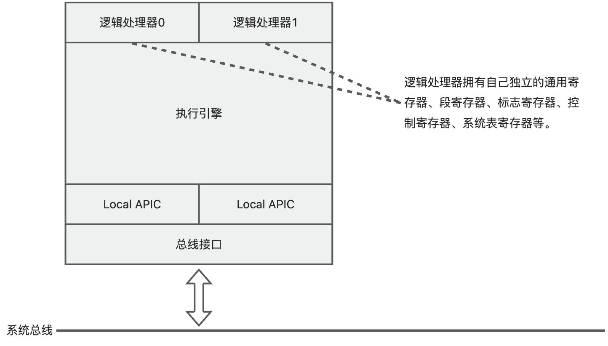
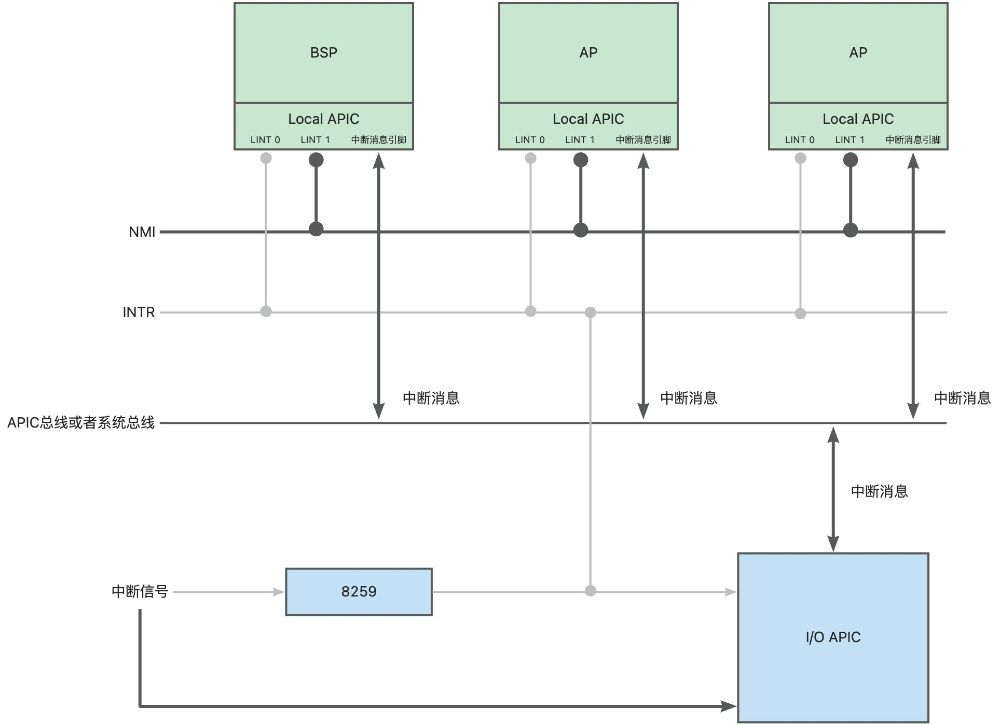
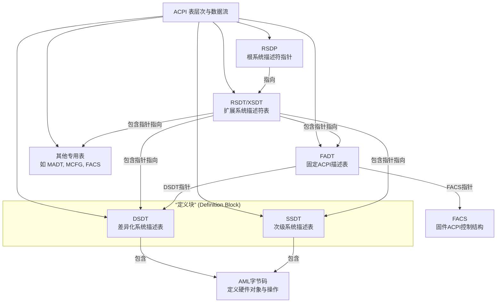
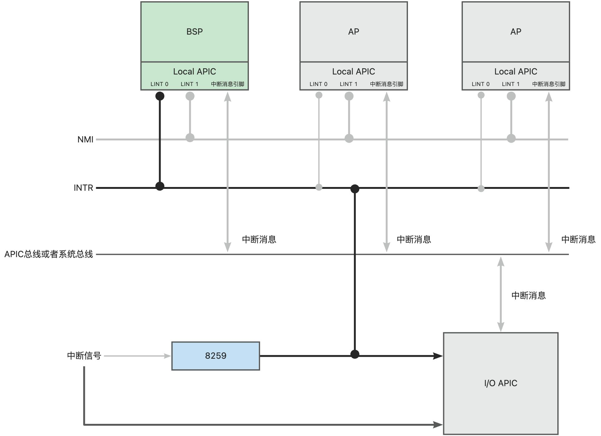
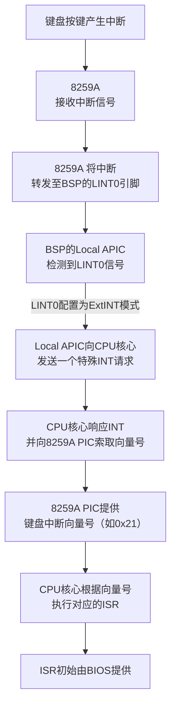
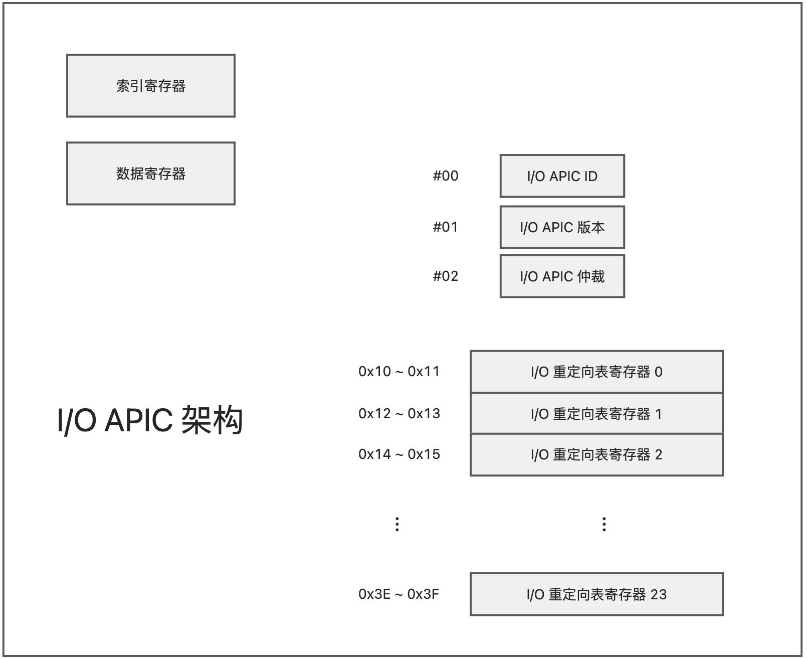
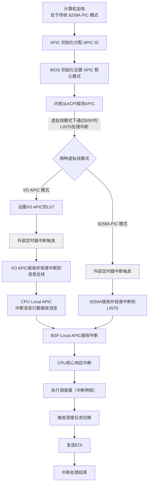

本文主要讲解 64 位多处理器相关的运行架构，及其初始化。

<!-- truncate -->

## 多处理器概念
最初的多处理器是在一个计算机系统内同时存在多个 CPU 的封装，简单理解就是在一个主板上插多个 CPU。这种系统叫做「对称多处理器系统」，简称 SMP 系统。

而现如今更多的是在同一个封装内封装多个核心。换句话说，多处理器系统位于同一块儿芯片上。

+ BSP：bootstrap processor，启动处理器，启动时由仲裁电路选出。最开始只有 BSP 在工作，其他核心处于等待状态。 
+ AP：application processor，应用处理器，由 BSP 分配任务并执行。

## 同时多线程（SMT）
### 气泡
我们知道 IA-32 架构引入了流水线技术，指令可以拆解成微操作，并放入流水线中同时执行。但如果流水线中存在气泡，则硬件利用率就会变低。

气泡，也叫流水线停顿（Pipeline Stall），就是指在流水线的某个阶段，没有进行任何有效工作的时钟周期。比如一个微操作未命中高速缓存，必须访问内存，而访问内存是耗时操作，则微操作处于停顿状态，这个强制性的**空闲、等待或阻塞**的周期，就是“气泡”。它像一个没有实际指令数据的“气泡”一样，在流水线中向后移动。

### 气泡产生的原因
为什么会产生气泡？气泡的产生是因为出现了**冒险（Hazard）**，即指令之间的依赖关系导致它们不能在流水线中顺畅地重叠执行。

+ 数据冒险（Data Hazard）：当一条指令需要依赖另一条指令的计算结果，但这个结果还没产生时，就会发生数据冒险。
+ 控制冒险（Control Hazard）：当 CPU 遇到分支指令（如 if-else、循环）时，它需要根据条件判断下一条指令是谁（是跳转，还是顺序执行？）。在判断出结果之前，流水线无法确定下一条要取哪条指令。
+ 结构冒险（Structural Hazard）：当多条指令试图在同一时钟周期使用同一个硬件资源时发生。

处理器可以同时启动并执行多条不相干的代码流（线程）。通过混杂多个线程的指令，可以减少气泡，提高整体运行效率。这种混杂执行多个线程的指令的运行方式叫做**同时多线程（Simultaneous Multi-Threading, SMT）**。

### INTEL 超线程技术
同时多线程是这种技术的名称，但实际实现上，各家有各家的叫法。在 INTEL 这里，就是我们常听说的「**INTEL 超线程技术**」。

## 高级中断控制器（APIC）
APIC 核心作用是取代传统的中断控制器（如 8259A PIC），以支持多处理器环境、提供更多的中断资源，并实现更灵活和高效的中断处理。它主要有以下特点：

+ **支持多处理器系统**：APIC 是 Intel 多处理规范的核心，它允许中断请求被精确地路由到指定的处理器核心，实现了多个处理器之间的中断分配与负载均衡。系统中的每个 CPU 都有一个本地 APIC（Local APIC），同时还有一个或多个 I/O APIC 来处理来自外部设备的中断。
+ **扩展中断数量**：传统的 8259A PIC 仅支持 8 个中断请求（IRQ），这在现代计算机中远远不够。APIC 系统支持多达 255 个中断向量（虽然 0-15 通常被保留），为大量硬件设备提供了充足的中断资源。
+ **处理处理器间中断（IPI）**：APIC 使得一个处理器能够通过中断的方式向另一个处理器发送消息，这对于多处理器操作系统进行任务调度、缓存同步等多核协作操作至关重要

现代 x86 处理器中有三个中断引脚：

+ LINT 0：用于接收来自 8259 或类 8259 芯片的中断 INTR。
+ LINT 1：通常用于来接收不可屏蔽中断 NMI
+ 中断消息引脚连接到 APIC 总线，用于接收 I/O APIC 的消息，和 IPI 消息（处理器间中断消息）

APIC 之间需要相互识别，所以需要有一个 APIC ID。APIC ID 不是固定不变的，而是动态分配，在加电后根据系统拓扑自动生成。即，根据每个 APIC 所在的位置生成，比如位于哪个封装的哪个核心内。

在多处理器系统中，APIC ID 就是它所在的处理器 ID。APIC 中有一个寄存器专门用来存储 APIC ID 的，APIC ID 的长度决定了这个系统中可以有多少个处理器。比如 APIC ID 长度是 8 位，则最多可以有 255 个处理器。

早期要组成多处理器系统，必须使用外置的 APIC 芯片，如 82489DX 芯片，它使用 8 位的 APIC ID，最多支持 255 个处理器。

后来从奔腾系列开始，APIC 被内置在 CPU 中，叫做 Local APIC。最初应该是对规模预估不足，只留了 4 位给 APIC ID。一个系统最多支持 15 个处理器。后来有对 Local APIC 做了扩展，变成 16 位的 xAPIC。xAPIC 一直延续到现在，最近又出现了 x2APIC 模式，使用 32 位的 APIC ID，最多支持$ 2^{23}-1 $个处理器。

**地址映射**：Local APIC 内部的寄存器被直接映射到内存区域，地址是 0xFEE0 0000 开始的 4KB 区域。部分处理器支持通过`IA32_APIC_BASE`型号专属寄存器修改映射的起始位置。I/O APIC 也直接映射到内存，默认地址是 0xFEE0 0000。

## 多处理器系统的启动过程
1. 加电复位，基于总线拓扑，生成 APIC ID。
2. 各处理器执行自检
3. 通过 APIC 仲裁出自举处理器 BSP。BSP 的`IA32_APIC_BASE`寄存器置 1。
4. BSP 执行 BIOS 自举代码。所有 AP 都是「等待 SIPI」的状态。
5. BSP 执行 BIOS 初始化代码，BIOS 在内存创建 ACPI 或 MP 表，并将 BSP 的 APIC ID 填入表中。
6. BSP 广播 SIPI 给 AP，要求他们从指定物理地址处开始执行初始化代码。
7. AP 初始化。用全局变量统计 AP 数量，并将自己的 APIC ID 写入 ACPI 或 MP 表。
8. 一旦 AP 都完成了上述初始化过程，BSP 继续执行剩余 BIOS 代码，执行操作系统自举和初始化。
9. 操作系统启动后，基于负载均衡策略，周期性使用中断消息给 AP 分配广义上的线程。

在计算机启动过程中，为了让操作系统能够准确识别和初始化系统中的所有处理器核心，并建立起正确的多处理器中断通信机制。操作系统需要获取 APIC ID 信息，具体来说是为了识别多处理器拓扑结构。这是操作系统进行任务调度、资源分配的基础。

APIC ID 信息可以从 ACPI（高级配置和电源接口）表中获取，所以我们需要研究一下 ACPI。

## 高级配置和电源接口（ACPI）
ACPI（高级配置与电源接口）协议是 90 年代中期由英特尔、微软、东芝、凤凰等公司联合创立的，主要是为了解决计算机硬件配置、电源管理以及操作系统与硬件固件（BIOS/UEFI）之间通信的标准化问题。

ACPI 协议的核心价值体现在以下几个方面：

1. **统一的电源管理标准**：在 ACPI 出现之前，不同厂商的硬件和操作系统在电源管理（如休眠、待机）的实现上各不相同，导致**兼容性问题**和**用户体验不一致**。ACPI 提供了一套统一的规范，使得操作系统能够以一种标准的方式管理不同硬件平台的电源状态。
2. **增强的硬件配置和热插拔支持**：ACPI 允许操作系统动态地识别和配置硬件设备，这对于支持**热插拔（Hot-Plug）** 功能（如 USB、PCIe 设备）至关重要。它提供了一个抽象的接口来描述硬件资源，减轻了操作系统直接与复杂硬件细节打交道的负担。
3. **操作系统控制的电源管理（OSPM）模型**：ACPI 确立了一种由**操作系统作为控制中心**来管理整个系统电源的策略，而不是由 BIOS 单独负责。这使得电源管理更加智能和高效，操作系统可以根据实际运行的应用和负载情况，动态地调整处理器、芯片组和设备的功耗状态。
4. **提供硬件信息接口**：ACPI 通过在内存中构建一系列表格（如 RSDP, RSDT, XSDT, FADT, DSDT, SSDT 等），向操作系统提供丰富的硬件配置信息，包括主板设备、电池、温度传感器等。这些信息对于操作系统的设备驱动程序和电源管理策略至关重要。

从 ACPI 中就能获取到我们关心的 APIC ID 之类的处理器信息。

### ACPI 的数据结构和表

各专有名词释义：

| 表格名称 (英文全称) | 签名 (Signature) | 主要功能与描述 | 是否必需 |
| :--- | :--- | :--- | :--- |
| **RSDP** (Root System Description Pointer) | `RSD PTR ` (含空格) | 所有 ACPI 表的**起始点**（入口指针），存在于内存固定区域，操作系统通过它来定位 **RSDT** 或 **XSDT**。 | 是 |
| **RSDT** (Root System Description Table) | `RSDT` | **ACPI 1.0** 的根表，包含一个**32 位物理地址**数组，指向其他 ACPI 表。为兼容性保留。 | 是（ACPI 1.0） |
| **XSDT** (Extended System Description Table) | `XSDT` | **ACPI 2.0+** 的根表，包含一个**64 位物理地址**数组，指向其他 ACPI 表。现代系统优先使用此表。 | 是（ACPI 2.0+） |
| **MADT** (Multiple APIC Description Table) | `APIC` | 描述系统中断控制器布局（如 IO-APIC、Local APIC）和处理器拓扑结构，支持多处理器（SMP）配置。 | 是 |
| **FADT** (Fixed ACPI Description Table) | `FACP` | 包含固定硬件的 ACPI 寄存器块地址（如电源管理寄存器）、睡眠状态控制信息，并指向 **DSDT** 和 **FACS**。 | 是 |
| **MCFG** (PCI Express Memory Mapped Configuration Space Table) | `MCFG` | 提供 PCI Express 设备内存映射配置空间的基地址信息，用于访问 PCIe 配置空间。 | 是（对于 PCI Express 系统） |
| **FACS** (Firmware ACPI Control Structure) | `FACS` | 包含上次启动的硬件签名、固件唤醒向量和全局锁，主要用于 **S3** 睡眠状态的保存和恢复。 | 是 |
| **DSDT** (Differentiated System Description Table) | `DSDT` | 包含系统主要的**差异化定义块**，定义了系统的实现和配置信息，如设备电源管理、热管理等。其内容由 AML 字节码编写。 | 是 |
| **SSDT** (Secondary System Description Table) | `SSDT` | **DSDT 的补充**，可提供额外的定义块（例如描述其他设备）。系统可以有多个 SSDT。 | 否 |

### E820
ACPI 申领到的内存所在地址不是不定不变的，而是在一定的地址范围内分配。为了能够确切地知道 RSDP 所在的位置，需要通过 0x15 号 BIOS 中断发起功能调用。这是一个总入口，需要使用 EAX 指定具体功能号，即指定为 **E820**_。_

内存映射数据繁多且复杂，因此需要多次调用 0x15 软中断，分页返回。每次返回的都是一个固定的数据结构，叫做**地址范围描述符（Address Range Descriptor）**。

**地址范围描述符（Address Range Descriptor）**

这个结构体有 两个主要版本：

+ 基本格式（20 字节） - 最常见，兼容性最好
+ 扩展格式（24 字节） - 包含 ACPI 3.0 扩展属性

我们主要讲基本格式。

| 偏移量 (字节) | 长度 (字节) | 名称 | 数据类型 | 描述 |
| :--- | :--- | :--- | :--- | :--- |
| **0** | **8** | **Base Address** | QWORD | **基地址 (64 位)**：该内存区域的起始物理地址。 |
| **8** | **8** | **Length** | QWORD | **长度 (64 位)**：该内存区域的大小（以字节为单位）。 |
| **16** | **4** | **Type** | DWORD | **类型 (32 位)**：标识该内存区域的类型（见下方类型表）。这是最关键字段，决定 OS 是否/如何使用该区域。 |

  
**内存区域类型 (Type)：**

| 值 (十进制) | 值 (十六进制) | 名称 | 描述 |
| :--- | :--- | :--- | :--- |
| **1** | **0x00000001** | **RAM (可用内存)** | 操作系统可以正常使用的可用内存。这是操作系统内核和应用程序主要使用的内存。 |
| **2**** | **0x00000002** | **Reserved (保留内存)** | **不可用内存**。可能被硬件保留（如 ROM, MMIO 空间）、包含 BIOS 代码或数据、存在硬件问题、或被 ACPI 表标记为保留。操作系统**不能**使用。 |
| **3** | **0x00000003** | **ACPI Reclaimable** | **ACPI 可回收内存**。包含 ACPI 表（如 DSDT, SSDT）。操作系统在初始化阶段可以读取这些表，之后可以回收这部分内存作为普通 RAM 使用。 |
| **4** | **0x00000004** | **ACPI NVS Memory** | **ACPI 非易失性存储内存**。被 ACPI 保留用于保存系统状态（如休眠到磁盘 S4）等目的。操作系统**不应**使用此内存（除非用于 ACPI 指定目的）。 |
| **5** | **0x00000005** | **Bad Memory (坏内存)** | 包含内存错误，**不可用**。 |
| **其他** | | | 其他值可能由特定 BIOS 或硬件定义，应视为保留类型。 |

+ **EAX**：0xe820
+ **EBX**：持续标记，首次使用清零，后续由 BIOS 设置。为 0 证明是最后一页数据，为 1 则应该继续请求。
+ **ES:DI**：指定 ARD 的逻辑段地址和段内偏移量。BIOS 用这个结构返回地址映射数据
+ **ECX**：指定 ARD 的长度，单位：字节。最小为 20 字节。
+ **EDX**：签名，固定位字符串“PAMS”（即物理地址映射结构，Physical Address Mapping Structure）

准备以上参数后，可以发起 0x15 中断。如果执行中没有出现错误，则 CF 被清零。否则 CF=1，同时 EAX 返回“PAMS”，EBX 返回持续标记。

### 根系统描述指针结构
| 字段名 | ACPI 版本 | 大小 | 偏移量 | 描述与说明 |
| :--- | :--- | :--- | :--- | :--- |
| **Signature** | 1.0 & 2.0+ | 8 字节 | 0 | 必须包含字符串 `"RSD PTR "`（注意末尾有空格），用于在内存中扫描识别该结构。 |
| **Checksum** | 1.0 & 2.0+ | 1 字节 | 8 | 对前 20 字节（v1.0 结构）进行校验和验证。所有字节相加后，取其结果的低 8 位应为 0，否则表无效。 |
| **OEMID** | 1.0 & 2.0+ | 6 字节 | 9 | 标识原始设备制造商（OEM）的字符串。 |
| **Revision** | 1.0 & 2.0+ | 1 字节 | 15 | 指明 RSDP 的修订版本。如果为 0，表示系统使用 ACPI v1.0；如果为 2 或更高，则应使用 v2.0 的扩展结构。 |
| **RsdtAddress** | 1.0 & 2.0+ | 4 字节 | 16 | **ACPI v1.0**：指向**RSDT**（根系统描述表）的**32 位物理地址**。RSDT 包含指向其他 ACPI 表的 32 位指针数组。 |
| **Length** | 2.0+ | 4 字节 | 20 | 整个 RSDP 结构的总长度（字节数），用于计算扩展校验和。 |
| **XsdtAddress** | 2.0+ | 8 字节 | 24 | **ACPI v2.0+**：指向**XSDT**（扩展系统描述表）的**64 位物理地址**。如果此字段非零，操作系统应优先使用 XSDT 而忽略 RSDT，以支持 64 位地址空间。 |
| **Extended Checksum** | 2.0+ | 1 字节 | 32 | 对整个 RSDP 结构（包括新增字段）进行校验和验证。同样，所有字节相加后的低 8 位必须为 0。 |
| **Reserved** | 2.0+ | 3 字节 | 33 | 保留字段，供未来使用，必须为 0。 |

这个结构并不位于 ACPI 申领的内存，而是位于传统的 1MB 物理内存之中。

根系统描述指针结构位于两个可能的位置，分别是扩展的 BIOS 数据区 EBDA，或者 0xE0000 和 0xFFFFF 之间的 BIOS 只读内存空间，只需要按照 16 字节边界来搜索一个有效的签名和检查和即可。

所以，代码里要做的就是不断的以 16 字节为长度搜索是否是字符串`"RSD PTR "`，如果存在则证明符合要求。

然后，就是从根系统描述指针结构中找到对应的 RSDT 物理地址了，通过它可以找到根系统描述表 RSDT。但是，如果这个结构的修订号字段的值为 2，则在这个结构内不但有 RSDT 的物理地址字段，还包括 XSDT 的物理地址字段，它的内容是扩展的系统描述表 XSDT 的 64 位物理地址，通过它可以找到扩展的系统描述表 XSDT。对于程序来说，它应该先检查根系统描述指针结构的修订号。若其为 0，则直接使用 RSDT 字段来访问根系统描述表 RSDT；若其为 1，则应当使用 XSDT 字段来访问扩展的系统描述表 XSDT 而不是 RSDT。

通过根系统描述表 RSDT 可以找到其他系统描述表，因为它包含了其他系统描述表的物理地址，这些地址的宽度是**32 位**的。而 XSDT 中的地址宽度是 64 位的。

### RSDT/XSDT
RSDT 与 XSDT 结构对比

| 字段/组件 | RSDT (Root System Description Table) | XSDT (Extended System Description Table) |
| :--- | :--- | :--- |
| **表签名 (Signature)** | `RSDT` | `XSDT` |
| **标准 ACPI 表头** | 包含所有 ACPI 表共有的基本信息，如表长度、校验和、OEM 信息等。 | 与 RSDT 相同，包含标准的 ACPI 描述表头。 |
| **条目指针 (Entries)** | 一个由 **32 位物理地址** 组成的数组，每个指针指向一个其他 ACPI 表（如 FADT、MADT 等）。 | 一个由 **64 位物理地址** 组成的数组，功能与 RSDT 完全相同，但支持 64 位寻址。 |
| **主要特点与区别** | 作为 ACPI 1.0 标准的一部分，其 32 位指针限制了所有 ACPI 表必须位于 4GB 物理地址空间以下。 | 自 ACPI 2.0 引入，解决了 RSDT 的地址空间限制，是现代系统和 64 位操作系统的首选。 |

XSDT 的结构

| 字段名 | 长度 | 数据类型 | 描述与作用 |
| :--- | :--- | :--- | :--- |
| **Header（表头）** | **36 字节** | `EFI_ACPI_DESCRIPTION_HEADER` | XSDT 的标准 ACPI 表头，是所有 ACPI 表的通用标识部分。 |
| **Entry（表项）** | **8*n** | `UINT64` 数组 | 一个由 64 位物理地址组成的数组，每个地址指向一个其他的 ACPI 表（如 FADT、MADT 等）。 |

### MADT
MADT 是 Multiple APIC Description Table，多 APIC 描述表。

MADT 的物理地址在上述的 RSDT/XSDT 的 Entry 中存储。要确定 RSDT 或 XSDT 中的哪个 Entry 指向 MADT 表，唯一的方法就是**遍历所有 Entry 并检查每个 Entry 所指向的表的签名（Signature）**。

#### MADT 结构
MADT 的结构如下：

| 字段名 | 字节长度 | 字节偏移量 | 说明 |
| :--- | :--- | :--- | :--- |
| **Signature** | 4 | 0 | 表的标识签名，固定为 `'APIC'` 。 |
| **Length** | 4 | 4 | 整个 MADT 表的总长度，包括表头和所有中断控制器结构体。 |
| **Revision** | 1 | 8 | 表的修订版本，例如版本 5。 |
| **Checksum** | 1 | 9 | 整个表的校验和，用于验证数据的完整性。 |
| **OEMID** | 6 | 10 | 原始设备制造商（OEM）的标识符。 |
| **OEM Table ID** | 8 | 16 | OEM 分配的表格标识符。 |
| **OEM Revision** | 4 | 24 | OEM 的表格版本号。 |
| **Creator ID** | 4 | 28 | 创建此表的工具或厂商的 ID。 |
| **Creator Revision** | 4 | 32 | 创建工具的版本号。 |
| **Local APIC Address** **（专有字段）** | 4 | 36 | 每个处理器可以访问其本地 APIC 控制器的 32 位物理基地址。 |
| **Flags** **（专有字段）** | 4 | 40 | 标志字段。例如，位 0 指示是否启用双线旧式 PIC（8259A），若为 1 则存在，可能需要手动屏蔽。 |
| **中断控制器结构体** **（可变长，专有字段）** | -- | 44 | 一个可变长度的中断控制器结构体数组，每个结构体描述系统中断架构的一个特定组件。 |

#### 中断控制器结构体
表头之后是一个可变长度的中断控制器结构体数组，每个结构体描述系统中断架构的一个特定组件。所有结构体都以一个公共的子头开始：

| 字段名 | 字节长度 | 字节偏移量 | 说明 |
| :--- | :--- | :--- | :--- |
| **Type** | 1 | 0 | 标识结构体的类型，决定了后续字段的具体含义。 |
| **Length** | 1 | 1 | 该特定结构体的总长度。 |

根据 `Type` 字段的不同，结构体有多种类型。包括但不限于以下：

| 记录类型 | 描述 |
| :--- | :--- |
| **处理器本地 APIC** (Type 0x0) | 描述系统中的一个处理器核心（或硬件线程）。包含该处理器的本地 APIC ID 和其在系统中的唯一 ID。通常会有一个标志位指明该处理器当前是否可用以及能否被操作系统启用。 |
| **I/O APIC** (Type 0x1) | 描述系统中存在的一个 I/O APIC。包含该 I/O APIC 的唯一 ID 及其内存映射的地址。 |
| **中断源覆盖** (Type 0x2) | 提供关于某些硬件中断源（如 ISA 中断）的额外信息，例如总线类型和中断标志，帮助操作系统正确配置中断。 |
| **本地 APIC NMI** (Type 0x4) | 指定连接到处理器本地 APIC 的非屏蔽中断（NMI）的配置信息。 |

我们重点先看一下 Local APIC 的结构：

| 字段 | 字节长度 | 偏移量 | 说明 |
| --- | --- | --- | --- |
| 类型 | 1 | 0 | 0 |
| 长度 | 1 | 1 | 8 |
| 处理器 UID | 1 | 2 | 由流行的操作系统使用 |
| APIC ID | 1 | 3 | 处理器的 Local APIC ID |
| 标志 | 4 | 4 | Local APIC 标志 位 0：为 1 表示处理器可以使用；为 0 且位 1 为 1 表示硬件支持操作系统在运行时启动该处理器 位 1：若位 0 为 1，则该位必须为 0；若位 0 为 0 且位 1 为 1，则表示硬件支持操作系统在运行时启动该处理器 位 2~31：保留 |

再来看 I/O APIC 结构：

| 字段 | 字节长度 | 偏移量 | 说明 |
| --- | --- | --- | --- |
| 类型 | 1 | 0 | 0 |
| 长度 | 1 | 1 | 12 |
| I/O APIC ID | 1 | 2 | I/O APIC ID |
| 保留 | 1 | 3 | 0 |
| I/O APIC 地址 | 4 | 4 | 访问此 I/O APIC 的 32 位物理地址 |
| 全局中断基准 | 4 | 8 | 指定本中断控制器的中断输入起始于哪个全局系统中断号 |

如果系统中有多个 I/O APIC，则每个 I/O APIC 只用来处理某个范围内的中断向量，因为它的中断输入引脚是有限的。比如，第一个 I/O APIC 处理 32 到 55 号中断；第二个 I/O APIC 处理器 56 到 79 号中断，等等，以此类推。

我们要做的是遍历所有中断控制器结构，从中找到类型为 0 的 Local APIC 结构，以及类型为 1 的 I/O APIC 结构，并取出相关信息。

为了方便使用这些信息，通常需要划分一些内存空间专门用于存储 APIC 信息，而不是每次使用时现找。

## APIC 内部寄存器
Local APIC 和 I/O APIC 的物理地址用来访问它们内部的寄存器，这些寄存器被映射到一个 4KB 的物理地址范围，叫作 APIC 寄存器空间。

举例说明：

+ 假定 Local APIC 的物理地址是 0xfee0 0000
+ 0xfee0 0020 对应 Local APIC ID 寄存器；
+ 0xfee0 0030 对应 Local APIC 版本寄存器; 
+ 0xfee0 00b0 对应 EOI 寄存器，如此等等。

映射的 Local APIC 和 I/O APIC 物理地址必须是不走高速缓存的，因此再做分页映射的时候，需要将 PCD 位置为 1。

简单来说，Local APIC 的寄存器主要关注“**我这个 CPU 核心要处理什么中断以及如何与其他核心通信**”，而 I/O APIC 的寄存器则负责“**外部设备的中断应该发给哪个 CPU 核心**”

我们先从整体上看一下 APIC 寄存器内都存储了什么数据：

| **组件** | **寄存器类别/名称** | **主要存储的数据内容** |
| :--- | :--- | :--- |
| **Local APIC** | **标识与控制寄存器** | - **APIC ID**：本核心在系统中的唯一标识符。   - **版本寄存器**：记录 APIC 硬件版本和支持的功能（如 LVT 条目数量）。   - **伪中断向量寄存器 (SVR)**：总开关（使能/禁用位）和伪中断向量号。   - **错误状态寄存器 (ESR)**：记录 APIC 内部的错误信息。 |
|  | **中断请求与状态寄存器 (IRR/ISR/TMR)** | - **IRR (中断请求寄存器)**：256 位，每位对应一个中断向量，置 1 表示中断已接收但**尚未交付**给 CPU 核心（排队中）。   - **ISR (服务中寄存器)**：256 位，每位对应一个中断向量，置 1 表示中断已交付给 CPU 核心且**正在处理**。   - **TMR (触发模式寄存器)**：256 位，记录对应中断的触发模式（电平触发或边沿触发）。 |
|  | **本地向量表 (LVT) 寄存器** | 为一组寄存器，每个条目配置一个**本地中断源**（如定时器、性能计数器、LINT0/LINT1 引脚等）的处理方式，包括：中断向量号、传递模式（Fixed/NMI 等）、屏蔽位。 |
|  | **中断命令寄存器 (ICR)** | 用于**发送处理器间中断 (IPI)**，存储的数据包括：目标核心的 APIC ID、要发送的中断向量号、传递模式（Fixed/Start-Up 等）、目标模式等。 |
| **I/O APIC** | **I/O 重定向表 (Redirection Table)** | 为一组寄存器（通常 24 个或更多条目），每个条目对应一个**外部中断引脚**（如 IRQ）。存储的数据决定该引脚中断的路由信息：   - **Vector**：中断向量号。   - **Destination**：目标 CPU 核心的 APIC ID（或逻辑目标标识）。   - **Delivery Mode**：传递模式（如 Fixed）。   - **Polarity & Trigger Mode**：中断信号极性（高/低电平有效）和触发模式（边沿/电平触发）。   - **Mask**：中断屏蔽位。 |

### 定时器
+ 如果不需要很高的精度，RTC 芯片可以产生定时器中断，精度在微秒级。中断信号同时发送给 I/O APIC 和 8259A 从片。
+ 如果需要几百个纳秒级的精度，可以使用 8253 或 8254 可编程定时器，中断信号发送给 I/O APIC 和 8259A 主片。
+ 如果需要几十个纳秒级的精度，可以使用主板芯片组中的高精度事件定时器 HPET。HPET 是一组定时器，而不是一个。这些定时器可以通过编程来指定如何发送中断信号，中断信号既可以通过指定的线路发送到 I/O APIC 和 8259，还可以用中断消息直接发送到处理器。
+ 如果是多处理器环境，每个处理器需要单独的定时器中断信号，则可以使用 **Local APIC Timer**，它是内置于每个处理器内部的，且精度很高。

Local APIC Timer 内部有三个寄存器：

+ 分频配置寄存器：物理地址是 Local APIC 的起始地址加上 0x3e0
+ 初始计数寄存器：物理地址是 Local APIC 的起始地址加上 0x380
+ 当前计数寄存器：物理地址是 Local APIC 的起始地址加上 0x390

Local APIC Timer 有三种工作模式：

+ 单次击发模式 (One-shot mode)：只触发一次中断。一旦为初始计数寄存器写入一个计数值，这个初始计数值就被复制到当前计数寄存器，并立即开始向下计数。计数值到 0 的时候，产生一个定时器中断信号。
+ 周期性模式 (Periodic mode)：和单次击发模式不同的是，如果向下计数到 0，则不但要产生一个定时器中断信号，还会自动重新将计数值从初始计数寄存器复制到当前计数寄存器，并重新开始向下计数。
+ TSC 截止期限模式 (TSC-Deadline mode)：部分 CPU 支持。允许软件通过 CPU 的时间戳计数器（TSC）来在绝对时间点上触发中断，而不是像传统模式那样基于相对的时间间隔或周期。这种模式能提供更高精度的时间控制。

Timer 计数的速度等于处理器的总线时钟频率或者核心的晶振频率除以分频配置寄存器指定的分频值。分频配置寄存器是 32 位的，但只使用了**位 0、位 1 和位 3**（你没看错，是位 3 而不是位 2）。如果这三位都是 0，表明是 2 分频的。问题在于总线时钟或者核心晶振的频率不是固定的，无法确定，毕竟不同的系统、不同的处理器都工作在不同的时钟频率下。所以，在不同的处理器上，这个向下计数的速度也各不相同。因此，在使用 Local APIC 定时器之前，必须先使用外部定时器测算它的精度。

### LVT 寄存器组
Local APIC 通常包含以下 LVT 寄存器（不同 CPU 可能略有不同）：

| **寄存器名称** | **偏移量 (xAPIC MMIO)** | **描述** |
| :--- | :--- | :--- |
| **LVT Timer** | `0x320` | 配置 Local APIC 定时器的中断行为 |
| **LVT Thermal Monitor** | `0x330` | 配置温度监控中断 |
| **LVT Performance Counter** | `0x340` | 配置性能监控计数器中断 |
| **LVT LINT0** | `0x350` | 配置 LINT0 引脚（通常连接 8259A 或 NMI） |
| **LVT LINT1** | `0x360` | 配置 LINT1 引脚（通常用于系统管理中断 SMI） |
| **LVT Error** | `0x370` | 配置 APIC 错误中断 |

每个寄存器的结构如下（32 位）：

| **位域** | **名称** | **描述** | **取值说明** |
| :---: | :--- | :--- | :--- |
| **31:19** | _保留_ | 保留字段，通常为 0 | - |
| **18:17** | **Timer Mode** | 定时器模式 | 仅限 LVT Timer。   `00b` = 单次击发   `01b` = 周期性   `10b` = TSC 截止模式 |
| **16** | **Mask** | 中断屏蔽位 | `0` = 中断未屏蔽（允许触发）   `1` = 中断屏蔽（禁止触发） |
| **15** | **Trigger Mode** | 中断触发模式 | `0` = 边沿触发（Edge）   `1` = 电平触发（Level） |
| **14** | **Remote IRR** | 远程 IRR 标志（仅电平触发中断有效） | `0` = 无远程 IRR 状态   `1` = 远程 IRR 已触发 |
| **13** | **Interrupt Input Pin Polarity** | 中断输入引脚极性 | `0` = 高电平有效   `1` = 低电平有效 |
| **12** | **Delivery Status** | 投递状态 | `0` = 空闲   `1` = 等待择机发送 |
| **11** | _保留_ | 保留字段，通常为 0 | - |
| **10:8** | **Delivery Mode** | 中断传递模式 | `000b` = Fixed（固定）   `010b` = SMI（系统管理模式中断）   `100b` = NMI（不可屏蔽中断）   `111b` = ExtINT（外部中断，类似 8259A） `101b` = INIT 其他保留 |
| **7:0** | **Vector** | 中断向量号 | 0x00 - 0xFF（0x00-0x1F 通常保留） |

**Delivery Mode**：

+ 000 是固定模式，采用此模式时，使用中断向量字段指定的向量号投递。
+ 010 是 SMI 系统管理模式中断，此中断使处理器进入系统管理模式。使用这种投递模式时，中断向量字段是不用的，但应当设置为 0。
+ 100 是 NMI 模式，将此中断作为不可屏蔽中断 NMI 发送给处理器。不可屏蔽中断 NMI 的向量号是 2，所以中断向量字段被忽略。
+ 111 是 ExtINT 外部中断模式。这种模式将导致处理器产生一个中断应答的总线周期，就好像中断来自一个外部的 8259 或者类似于 8259 的中断控制器，而且要求外部的中断控制器提供中断向量。也就是说，在这种模式下，中断向量字段是不使用的。在一个系统中，APIC 架构仅仅支持一个 ExtINT 类型的中断源。
+ 101 是 INIT 初始化模式，用来投递一个请求初始化的消息给处理器核心，这将导致处理器执行一个初始化过程。在这种投递模式下，中断向量字段是不使用的，而且应当设置为 00。

**Delivery Status**：只读

+ 0：没有中断消息需要投递，或者上一个中断消息已经成功投递并被处理器接收
+ 1：中断消息已经投递，但是处理器核心还没有接收。

**远程 IRR 标志**：只适用于固定模式或者电平触发的中断。只读。当 Local APIC 接受一个中断并进行服务时设置此标志；从处理器收到一个中断结束命令 EOI 时复位此标志。其他情况下，该标志是未定义的。

**Trigger Mode**：

+ 1：电平敏感。该标志仅适用于**固定投递模式**。
+ 如果投递模式为 NMI、SMI 或者 INIT，触发模式总是边沿敏感的；
+ 若投递模式为 ExtINT，触发模式总是电平敏感的。
+ LINT1 的本地向量表寄存器不支持电平触发，因此，它的这一位始终应当设置为 0，即，边沿敏感的。

**Mask**：

+ 0：允许接受中断
+ 1：禁止接受中断
+ 系统复位时，此标志被置 1，只有软件才能清除。

## 多处理器系统的虚拟线模式
在多处理器系统中，虚拟线模式是一种中断控制模式，它通过在系统启动初期模拟传统单处理器（PC/AT）的中断处理环境，为最终切换到功能完备的多处理器模式（如对称 I/O 模式）提供了一条平滑的过渡路径。

系统启动后，I/O APIC 处于工作状态，但它内部的 I/O 重定向表寄存器需要编程才能向处理器发送中断消息。因此，默认状态下 I/O APIC 还不能正常工作。

所有处理器通过 APIC 仲裁机制选出自举处理器 BSP，其他处理器都自动成为应用处理器 AP。自举处理器 BSP 执行 BIOS 自举代码；所有应用处理器 AP 都处于停机状态，并等待一个让它启动的中断消息。

在这幅图中，中断信号既发往 8259 芯片，也发往 I/O APIC，但 I/O APIC 是不理会这些中断的。因此，中断信号由 8259 芯片发送到所有处理器的 LINT0 引脚。

尽管中断信号被发送到每个处理器的 LINT0 引脚，但只有自举处理器 BSP 才响应中断。

这种中断模型叫作**虚拟线模式**。

所以虚拟线模式的第一种形式就是使用 LINT0 处理来自 8259A 芯片的中断信号。

### 初始状态
LINT0 引脚有一个对应的本地向量表寄存器（IVT)，这在 6.2 节 LVT 寄存器组中有说明。LINT0 LVT 寄存器是可编程的，用于指定从中断引脚 LINT0 来的中断信号是否允许被发送到处理器，以及如何发送到处理器。

计算机启动后默认使用经由 LINT0 的虚拟线模式，在这种模式下，BIOS 设置寄存器的默认值。LVT LINT0 寄存器的默认不屏蔽 LINT0，采用 ExtINT 投递模式；LVT LINT1 默认不屏蔽 LINT1，采用 NMI 投递模式。

这样做的目的是在系统启动的混沌初期，建立一个稳定、可靠的中断处理环境，确保计算机能从复位状态平滑过渡到操作系统接管。

#### LINT0 = ExtINT
通过将 LINT0 设置为 ExtINT 模式，CPU 被告知：“**当 LINT0 引脚有中断信号时，不要使用 Local APIC 内部的向量，而是去询问外部的 8259A 兼容 PIC 来获取中断向量号**”。BIOS 会初始化传统的 8259A PIC（或兼容逻辑），并将其输出连接到 BSP 的 LINT0 引脚。这样，在启动初期，系统就完美地模拟了一个单处理器 PIC 环境，所有中断都由 BSP 通过这条“虚拟线”处理。

我们举一个按下键盘按键产生中断的例子：

#### LINT1 = NMI
LINT1 默认设为 NMI（不可屏蔽中断）模式，是因为 NMI 用于处理关键硬件错误（如内存校验错误、硬件故障）。NMI 不能被软件屏蔽，确保系统在严重故障时能优先响应。

此时，我们屏蔽掉 LINT0 的本地向量表寄存器，中断就不会被投递到处理器，任务切换就不会再发生了。要屏蔽 LINT0 的中断，只需要将其本地向量表寄存器的位 16 设置为 1 即可。除此以外，还可以屏蔽掉 8259 主片的所有中断输入，这样它就不会有中断信号发往自举处理器。

屏蔽了 8259 的所有中断输入后，那就只能依靠 I/O APIC 来投递中断。

接下来，设置 Local APIC Timer 为周期模式，用于任务切换。

虚拟线模式的**第二种**形式需要屏蔽掉 8259 芯片的所有输入，或者将 LINT0 的本地向量表寄存器设置为屏蔽状态，然后允许 I/O APIC 以中断消息的形式将硬件中断投递到目标处理器。

### I/O APIC

+ 索引号为 0 的寄存器是 I/O APIC ID，宽度是 32 位的，用来保存当前这个 I/O APIC 的标识。
+ 索引号为 1 的寄存器是 I/O APIC 版本，宽度是 32 位的，保存了当前这个 I/O APIC 的版本号。
+ 索引号为 2 的寄存器是 I/O APIC 仲裁，宽度是 32 位的，在多处理器和多个 I/O APIC 的环境中，它的数值决定了谁有权占用总线来发送中断消息。通常使用轮流的优先权方案来仲裁总线的使用权。
+ 还有至少 24 个 I/O 重定向表寄存器，它们分别是 I/O 重定向表寄存器 0〜23。由于每个寄存器都是 64 位的，而且分成两个 32 位来访问，所以每个寄存器占用两个索引号。

#### I/O APIC 重定向表寄存器
| 位域 | 名称 | 描述 | 取值说明 |
| :---: | --- | --- | --- |
| **63:56** | **Destination Field** | 投递目标 | 中断投递目标。在**物理目标模式**下，这 8 位直接指定目标 CPU 的 Local APIC ID 在**逻辑目标模式**下，这 8 位表示消息目标地址（MDA) 来指定一组处理器，这个消息目标地址可以看成一个位模式或者说掩码。 |
| **55:17** | _保留_ | 保留字段，通常为 0 |  |
| **16** | **Mask** | 中断屏蔽位 | `0` = 中断未屏蔽（允许触发）   `1` = 中断屏蔽（禁止触发） |
| **15** | **Trigger Mode** | 中断触发模式 | `0` = 边沿触发（Edge）   `1` = 电平触发（Level） |
| **14** | **Remote IRR** | 远程 IRR 标志（仅电平触发中断有效） | `0` = 无远程 IRR 状态   `1` = 远程 IRR 已触发 |
| **13** | **Interrupt Input Pin Polarity** | 中断输入引脚极性 | `0` = 高电平有效   `1` = 低电平有效 |
| **12** | **Delivery Status** | 投递状态 | `0` = 空闲   `1` = 发送待收 |
| **11** | **Destination Mode** | 目标模式 | `0` = 物理模式 `1` = 逻辑模式 |
| **10:8** | **Delivery Mode** | 中断传递模式 | `000b` = Fixed（固定） `001b` = 最低优先级   `010b` = SMI（系统管理模式中断）   `100b` = NMI（不可屏蔽中断）   `111b` = ExtINT（外部中断，类似 8259A） `101b` = INIT 其他保留 |
| **7:0** | **Vector** | 中断向量号 | 0x00 - 0xFF（0x00-0x1F 通常保留） |

因为我们不再使用 8259 芯片，所以，针对它的中断结束命令 EOI 不需要发送。在传统 8259 PIC 架构下，中断结束时必须向 8259 芯片发送 EOI（End of Interrupt）命令，否则 8259 会认为中断仍在处理中，导致后续中断被阻塞。而在现代 APIC（Local APIC + I/O APIC）架构下，EOI 的发送逻辑更加复杂，由于我们现在是用 Local APIC 和 I/O APIC 处理中断的，所以，中断结束命令 EOI 需要发送到 Local APIC。必要的时候，Local APIC 再将它发送到 I/O APIC。

#### 投递模式
投递目标字段指定了消息目标地址（Message Destination Address，MDA）。APIC 中断发出之后，收到中断消息的每个 Local APIC 都通过检查投递目标、目标模式，以及消息的类型来决定它是否应当处理这个中断。

+ 物理目标模式下：Local APIC 将 MDA 和自己的 Local APIC ID 作比较；如果 MDA 的值是 0xFF，表明是广播。
+ 逻辑目标模式下：所有 Local APIC 使用两个寄存器来确定中断是不是发给它的。这两个寄存器分别是逻辑目标寄存器 LDR 和目标格式寄存器 DFR。
    - 逻辑目标寄存器 LDR（偏移 0xD0）：32 位。低 24 位没有使用，高 8 位用来保存 Local APIC 的逻辑 ID。
    - 目标格式寄存器 DFR（偏移 0xE0）：32 位。低 28 位没有使用，高 4 位用来指定一个模式，0000 是扁平模式；1111 是集群模式。
        * 扁平模式：Local APIC 将逻辑 APIC ID 和中断消息的 MDA 做逻辑与操作，结果不为零，表明这个消息是发给自己的。
        * 集群模式：将逻辑 APIC ID 分为两部分，高 4 位是集群 ID，低 4 位是成员 ID。将 MDA 的集群 ID 和逻辑目标寄存器的集群 ID 进行比较，如果匹配，则按照扁平模式的方法比较 MDA 的成员 ID 和逻辑目标寄存器的成员 ID。如果也能够匹配，说明这个 Local APIC 是中断消息的目标。
        * 无论模式，如果 MDA 的值是 0xFF，所有 Local APIC 都会接受这个中断。

#### 最低优先级模式
**核心概念**：

+ **适用条件**：仅当 I/O APIC 的**目标模式=逻辑模式**时，才能选择**最低优先级（Lowest Priority）投递模式**。
+ **作用**：从一组符合条件的 CPU 中，自动选择**当前负载最轻（优先级最低）**的 CPU 接收中断，实现中断负载均衡。

**运行流程**：

1. **目标 CPU 筛选**  
I/O APIC 根据**逻辑目标字段**，先筛选出符合条件的 CPU 集合（如共享同一逻辑 ID 的所有 CPU）。
2. **最低优先级裁决**  
系统需从候选 CPU 中选出**“优先级最低”的一个**，但不同硬件平台裁决方式不同：
    - **Intel Xeon 系统**：由**芯片组总线控制器**直接选择。
    - **P6 处理器家族**：依赖 Local APIC 的**仲裁优先级寄存器（APR）**动态计算。

**APR 寄存器如何工作？**

+ **APR 偏移地址**：`0x90`（Local APIC 寄存器空间内）。
+ **关键字段**：
    - **AP[7:4]**：仲裁优先级类（决定 CPU 当前“忙闲程度”）。
    - **APS[3:0]**：仲裁优先级子类（通常固定为 0）。
+ **APR 值计算规则**：
    1. 比较三个值：
        * **TPR[7:4]**（任务优先权寄存器）：操作系统设置的当前任务优先级。
        * **IRRV[7:4]**（IRR 中最高待处理中断的优先级）。
        * **ISRV[7:4]**（ISR 中正在处理的中断的优先级）。
    2. **若 TPR ≥ IRRV 且 TPR ≥ ISRV**：  
APR 直接复制 TPR 的值（表示 CPU“很忙”）。
    3. **否则**：  
APR 取 TPR、IRRV、ISRV 三者的**最大值**（反映 CPU 当前实际负载）。

最低优先级模式是 I/O APIC 在**逻辑目标模式**下的一种智能路由策略，通过硬件（如 APR 寄存器）或芯片组动态选择**当前最空闲的 CPU**接收中断。

## APIC 中断优先级
优先级：APIC 中断的优先级是基于中断向量的。中断向量是一个 8 比特的值。其中，高 4 位的值被用作中断优先权类。所以产生了 15 个中断优先权类，1 是最低的，15 为最高。之所以没有 0，是因为 0 到 15 的向量号只用于处理器内部异常，是非法的 APIC 中断。

如果想临时阻塞低优先级的中断，防止它们被投递给处理器。需要用**任务优先权寄存器 TPR**来设定优先级的阈值，超过这个阈值的中断才会被投递到处理器。任务优先权寄存器 TPR 用来设定优先级的阈值，它在 Local APIC 寄存器空间内的偏移为 0x80。这个寄存器是 32 位的，位 4 到位 7 是任务优先权类 TP；位 0 到位 3 是任务优先权子类 TPS。所以，只需要在这个寄存器的低 8 位写入一个中断向量即可，数值上小于这个向量的中断都不会被投递到处理器。

每个 Local APIC 中，还有一个寄存器叫作**处理器优先权寄存器 PPR**，它是只读的，由它所在的处理器负责写入，用来记录这个处理器的当前优先级。处理器优先权寄存器 PPR 在 Local APIC 寄存器空间内的偏移为 0xA0。这个寄存器是 32 位的，位 4 到位 7 是处理器优先权类 PP；位 0 到位 3 是处理器优先权子类 PPS。它等于当前正在处理的那个中断的优先级。如果当前并未处理中断，则当前优先级被设置为中断优先级的阈值，处理器优先权类 PP 来自任务优先权寄存器的任务优先权类 TP。

简单小结一下：

| **优先级因素** | **规则** |
| --- | --- |
| 向量号 | 越大优先级越高（0xFF > 0x20）。 |
| TPR（任务优先级） | 仅允许优先级 ≥ TPR 的中断。 |
| PPR（处理器优先级） | 新中断需 > PPR 才能抢占。 |
| 特殊中断（NMI/IPI） | 无视优先级规则，强制触发。 |

## APIC 中断的接受机制
先看两个寄存器：

+ 中断请求寄存器 IRR：用来记录中断请求。256 位，从位 0 开始，每位对应一个中断向量。这个寄存器用来记录那些**已经被 Local APIC 接收，但还没有投递到处理器的中断请求**。
+ 正在服务寄存器 ISR：用来记录正在被处理器服务的中断。256 位，从位 0 开始，每位对应一个中断向量。这个寄存器用来记录那些**已经被投递到处理器，并且依然正在被服务的中断**。

当一个系统中断被接受之后，它在 IRR 中对应的比特被置位。此后，当处理器核心请求为一个新的中断提供服务时，Local APIC 将 IRR 中那个优先级最高的被置位比特清零，并将它在 ISR 中的对应比特置“1”。然后，这一位所对应的中断被投递到处理器核心接受服务。

中断处理结束后，一般要写中断结束命令 EOI，表明我们完成了中断处理。此时，Local APIC 将 ISR 中优先级最高的被置位比特清零。

当处理器正在为某个中断提供服务时出现了另一个优先级更高的中断，高优先级的中断会立即投递到处理器，而不用等待当前的中断处理完成。此时，当前正在执行的中断服务会被打断，以便处理优先级更高的中断。更高优先级的中断处理完成后，被打断的中断处理过程恢复执行。在这个过程中，对 IRR 和 ISR 的操作依照前面的描述进行。

中断发生时，如果它的投递模式为 NMI、SMI、INIT、ExtINT、SIPI、电平触发的 INIT，将直接投递到处理器而不经过 IRR 和 ISR。

与中断接受有关的另一个寄存器是触发模式寄存器 TMR，这个寄存器也是 256 位的，而且也是只读的，用来指示中断的触发模式。在使用中断请求寄存器 IRR 接受了一个中断之后，如果它是**边沿触发**的，它在 TMR 中的对应比特被**清零**；如果它是**电平触发**的，它在 TMR 中的对应比特被**置位**。

## 总结
多处理器场景对比单处理器要更复杂。多处理器发展出了 APIC 机制，每个处理器核心都有自己的 Local APIC，而外部中断信号也不再经由 8259A 进行投递了（但是兼容），而是通过 I/O APIC 进行投递。

| 特性 | 单处理器架构 | 多处理器架构 |
| :--- | :--- | :--- |
| **核心数量** | 一个 CPU 核心 | 多个 CPU 核心 |
| **中断管理** | 单一 8259A PIC | **分布式 APIC 系统** |
| **任务调度** | 全局一个任务队列，在唯一核心上轮转 | 每个 CPU 可能有自己的任务队列，支持真正的并行 |
| **核心挑战** | -- | **负载均衡、缓存一致性、跨核心通信** |

APIC 出现后，定时器中断驱动的任务轮转发生了一些变化。

| 方面 | 单处理器时代 | APIC 多处理器时代 |
| :--- | :--- | :--- |
| **定时器来源** | 全局唯一的 PIT | **每个 CPU 核心都有一个 Local APIC Timer** |
| **中断目标** | 唯一的一个 CPU 核心 | **中断仅发送给其所属的 CPU 核心** |
| **调度模型** | **全局任务轮转** | **局部调度 + 全局负载均衡** |

多个处理器核心并不是一开始就能同时运行的，需要选举出 BSP 作为初始执行的 CPU，其他 SP 只能等待被唤醒。

I/O APIC 也必须经过配置才能使用。因此，初始条件下，BSP 通过 LINT0 来接受从 8259A 投递过来的外部中断信号，这叫做多处理器的虚拟线模式。更常见的虚拟线模式并非直接使用 8259A，而是禁用 8259A 后，使用 I/O APIC 来投递中断消息到 Local APIC。

下面以接收外部定时器的中断信号来实现任务调度为例，说明一下虚拟线模式的整个流程：

