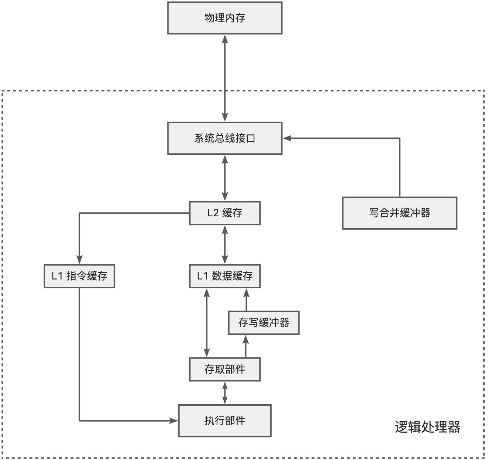
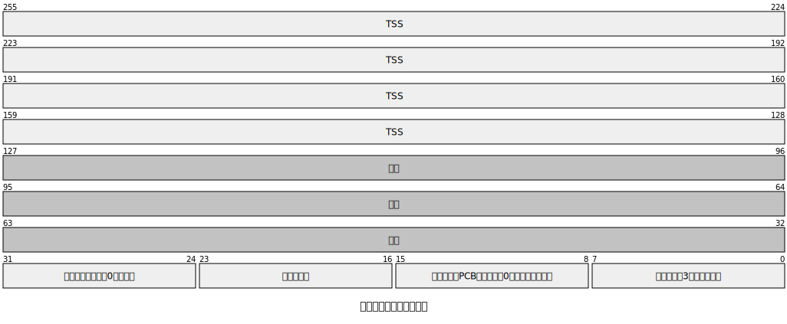
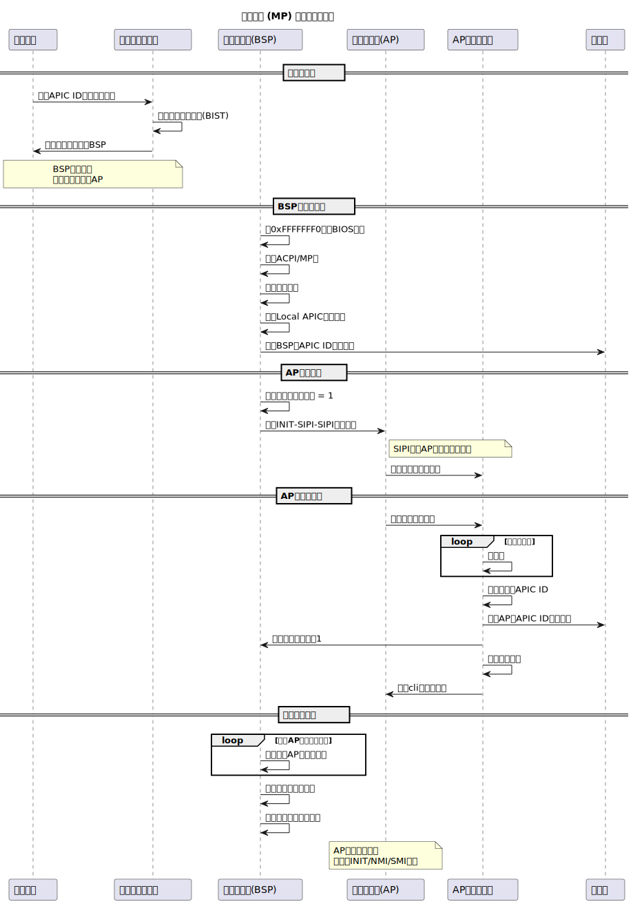
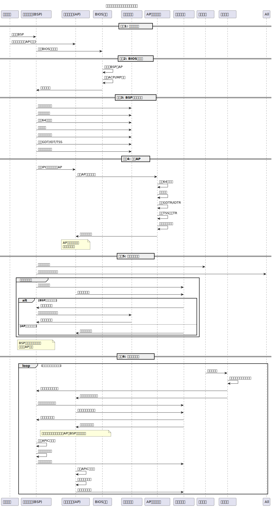
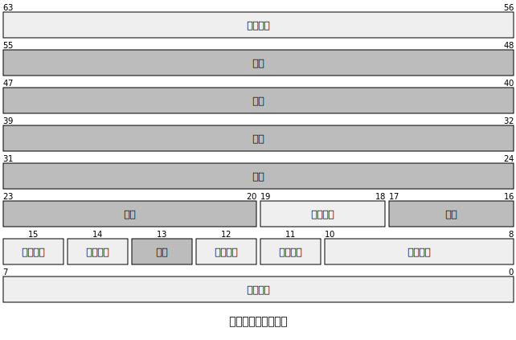
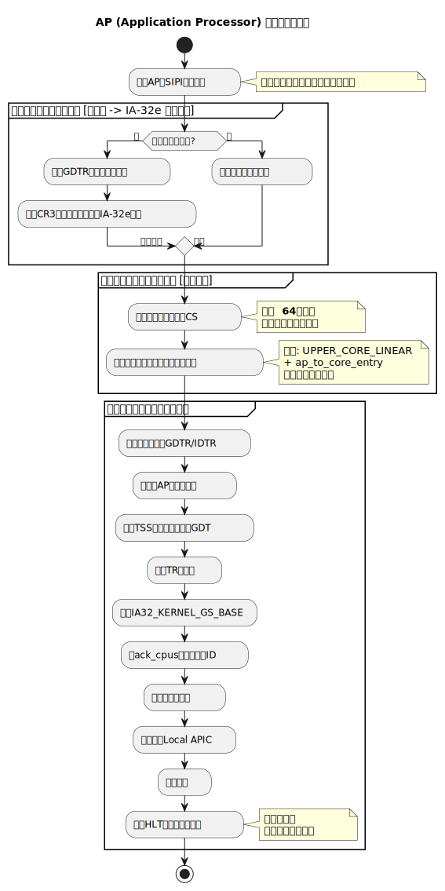
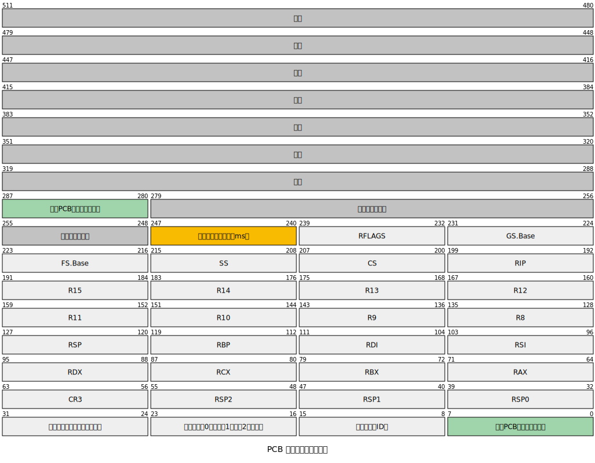
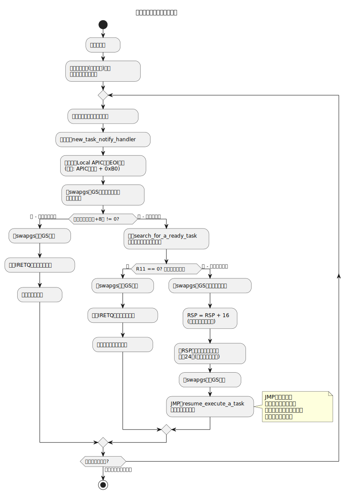
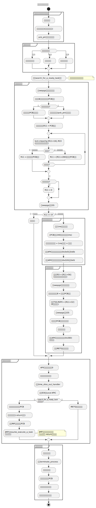
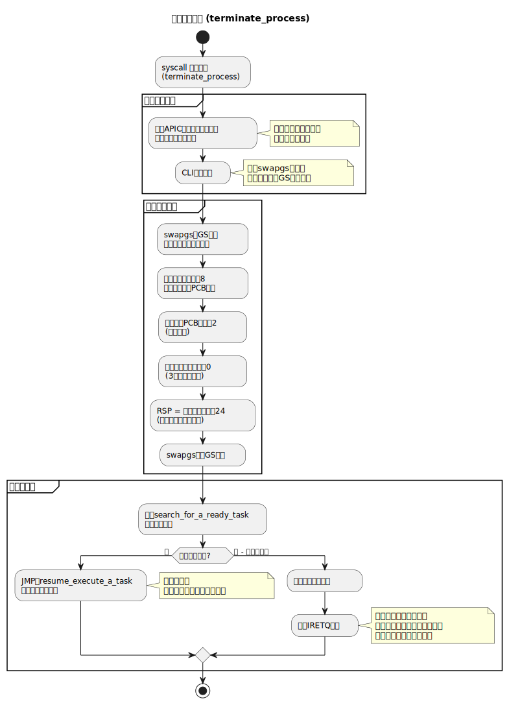

本文的目的是实现在 64 位的多处理器环境下，多 CPU 并行执行任务。

<!-- truncate -->

## 高速缓存


### 缓存线
缓存是由相同长度的缓存线组成的。

缓存线的尺寸是组成缓存数据的基本长度。

即使只访问一个字节，也要从内存中加载该字段前后以组成一个完整的缓存线。

缓存线尺寸可以通过 cpuid 指令获得。数据按缓存线尺寸对齐，也就是说被缓存的数据在内存中一定起始于一个能被 32 整除的地址。

高速缓存缓存数据是跟内存的位置相关的。如果你要存储的数据刚好是一个缓存线尺寸，但实际上数据在内存中存储时，并不是从缓存线尺寸对齐的位置开始的，那么实际上还是要缓存两个缓存线尺寸的内存区块的。这种现象称为 **"缓存行分裂"（Cache Line Splitting）**。<font style={{color:"rgb(0, 0, 0)"}}>在多核环境下可能引发假共享问题（这个以后再探究）。</font>

### 缓存基本概念
+ 缓存空间有限，需要淘汰已存在的缓存来腾出空间，这就是**缓存线替换**。
+ 如果缓存线在之前被修改过，则会执行**回写（Writeback）**，维持缓存和系统内存之间的一致性。
+ 从缓存读取数据而不必访问内存，叫做读命中（Read hit）
+ 如果内存位置有对应的缓存线，则可以直接写入缓存而不写入内存，这叫做**写命中（Write hit）**
    - 如果写未命中，则处理器先执行缓存线填充，然后写入缓存线。根据写入策略，决定是否写入内存
+ 某一处理器修改了内存中的数据，其他处理器都会得到通知并且更新它们的缓存内容。

### Cache 部件介绍
+ L1 缓存：有的处理器上分为 L1 指令缓存和 L1 数据缓存。L1 缓存最接近 CPU，访问速度最快（通常 1-4 个 CPU 周期）。L1 直接集成在 CPU 核心内部，物理链路最短，所以访问速度最快。但由于电路复杂性原因，容量较低。
+ L2 缓存：兼顾速度与容量。离核心稍远，访问延迟较高（通常 10-20 个 CPU 周期）。
+ 存写缓冲器：有的处理器配备存写缓冲器。有时总线正在忙于其它内存访问，为了不影响程序执行的连续性，可以先将数据写入存写缓冲器，有机会时在写入缓存或者内存。
+ 写合并缓冲器：有些内存区域是不需要缓存的，并且写入顺序不重要。最典型的就是**显存**。一个一个写入显存非常耗时且占用总线，因此可以先写合并，时机成熟再一次性写入显存。

## 数据竞争
数据竞争问题是伴随着多任务和多线程出现的。

单处理器环境下也有数据竞争，但相对简单。而多处理器环境就比较复杂了。

### 单处理器环境下的数据竞争
```asm
share_data dq 9000

do_divide:
    push rax
    push rdx

    xor rdx,rdx
    mov rax, [rel share_data]
    div r8
    mov [rel share_data], rax

    pop rdx
    pop rax

    ret
```

do_divide 是一个简单的除法例程，可以被任意调用门或者 syscall 调用。

它用来修改内核中的全局共享数据 share_data。进入例程，用 r8 传值。在例程内，将全局共享数据修改为它和 r8 相除的商。

多任务的情况下，必须在上一个任务修改完后，才能修改共享变量的值。所以 7~10 行必须完整执行，不能中断。

单处理器环境下，解决数据竞争的方法是禁止中断。上面的过程可以改进一下：

```asm
share_data dq 9000

do_divide:
    push rax
    push rdx

    pushfq
    cli
    
    xor rdx,rdx
    mov rax, [rel share_data]
    div r8
    mov [rel share_data], rax

    popfq

    pop rdx
    pop rax

    ret
```

### 多处理器环境下的数据竞争
`add qword [x], 3`

处理器 0 和处理器 1 同时各自执行这条语句时，就会导致数据竞争问题。

| 时间 | 处理器 0 操作  | 处理器 1 操作 | x 的内容 |
| ---- | -------------- | ------------- | -------- |
| t0   | 读取 X         | 等待总线      | 0        |
| t1   | +2             | 读取 X        | 0        |
| t2   | 写回 X         | +3            | 2        |
| t3   | 执行下一条指令 | 写回 X        | 3        |


原本应该结果等于 5，现在等于 3 了。原因就是交叉访问共享内存导致的数据竞争。当然这种竞争属于「读 - 改 - 写」模式，只需要原子操作即可解决。

在多处理器环境下，同一时间只能允许一个处理器进入会引起竞争的代码。需要使用「锁」。

#### 原子操作
原子操作是指其结果和状态不受其他程序影响的操作。一次性执行完，中间不会插入其他操作。

:::warning
李忠老师的《编写 64 位多处理器多线程操作系统》一书中指出，单处理器环境下，所有指令都执行原子操作。（x86 应该是典型的 CISC 架构）

同样跟作者持同一观点的还有：[https://stackoverflow.com/questions/70479632/is-assembly-instruction-inc-rax-atomic](https://stackoverflow.com/questions/70479632/is-assembly-instruction-inc-rax-atomic)（文中提问的是 RISC 架构的场景，且注意是 INC RAX，而不是 INC [mem]）

但网上似乎有不一样的说法。尤其是 **<font style={{color:"#DF2A3F"}}>AI 给出的说法</font>** 是：

在**简单的 RISC 处理器**（如早期 MIPS、ARM）中，通常采用这种“**指令边界中断**”（interrupts only at instruction boundaries）的设计。

在**复杂指令集**（CISC）或某些现代处理器中，**一条指令的执行可能被中断打断**，尤其是在以下情况：

1. 长时间执行的指令：例如`REP MOVSB`（重复字符串拷贝）、DIV 等，可能需要多个时钟周期甚至微秒级时间。如果不允许中断，系统响应性会很差。
2. 现代 CPU 中，复杂指令由微码（microcode）实现，本质上是一系列微操作。在微码执行过程中，处理器可能插入中断检查点，允许中断被响应。

~~根据 **Intel®** 64 and IA-32 Architectures Software Developer’s Manual：~~

~~“Interrupts are typically handled after the completion of the current instruction. However, for instructions that operate on large amounts of data (such as string operations with the REP prefix), interrupts may be serviced between repetitions.”~~

~~即：**大多数中断在指令完成后处理，但像 **`REP`** 这类指令，允许在重复之间响应中断。**~~

**(上面划线部分并未在手册中找到原文，还需核实）**

:::

在多处理器环境中，指令未必都执行原子操作，因为多个处理器上的指令可能交叉访问内存。处理器使用三种相互依赖的机制执行锁定的原子操作：

1. 保证是原子的操作
2. 总线锁定，使用 `LOCK#` 信号和 LOCK 指令前缀。X86 处理器提供了一个 `LOCK#` 信号，可用来锁定系统总线。“＃”表明是低电平有效。一旦锁定，来自其他处理器或者总线代理的总线控制请求都被阻塞，这样就不存在数据竞争，从而实现原子操作。如果需要，软件也可以在某些指令前添加 lock 前缀来实现 LOCK 语义。
3. 确保可以对缓存的数据结构执行原子操作的缓存一致性协议


**LOCK 语义**

在执行以下操作时，当前处理器自动附加 LOCK 语义：

1. 执行**具有内存操作数的 xchg 指令**时
2. **硬件任务切换**时，要设置 TSS 描述符的 B（忙）标志。为防止两个处理器同时切换到同一个任务，处理器在测试和设置此标志时附加 LOCK 语义
3. 加载一个段描述符时，处理器要设置已访问位（A 位，如果它是 0 的话）。在此期间，处理器附加一个 LOCK 语义，以防止其他处理器也执行此操作
4. 更新 **⻚目录** 和 **⻚表项** 时，处理器使用锁定周期来设置 **已访问位（A 位）** 和 **脏位（D 位）**
5. **响应中断**的时候。产生中断请求之后，中断控制器将使用数据总线发送中断向量给处理器。在此期间，处理器附加一个 LOCK 语义以确保没有其他数据出现在数据总线上

:::info
xchg 指令：`XCHG reg/mem, reg/mem`

xchg 是原子交换指令，用于原子地交换两个操作数的值。可以交换：

+ 寄存器 ↔ 寄存器（如 XCHG EAX, EBX）
+ 寄存器 ↔ 内存（如 XCHG EAX, [mem_addr]）

整个交换过程在硬件层面保证不可分割（不会被中断或其他 CPU 核心干扰）。由于 XCHG 是原子的，所以适合用于实现自旋锁（Spinlock）、CAS（Compare-And-Swap）等同步机制。

:::

要想明确地施加 LOCK 语义，软件可以在以下执行“**读—改—写**”操作的指令前添加 lock 前缀，但前提是它们用于**修改内存中的数据**。如果 lock 前缀用于其他指令，或者目的操作数是一个寄存器，则产生无效操作码异常 `#UD`。

数据是否对齐不影响锁定总线的实施，但如果条件允许，还是应该对齐到自然边界，以获得更好的性能。

:::info
**字**："字"由若干个字节构成，字的位数叫做字长。不同的处理器有不同的字长。一台 8 位机，它的 1 个字就等于 1 个字节，字长为 8 位。如果是一台 16 位机，那么，它的 1 个字就由 2 个字节构成，字长为 16 位。字是计算机进行数据处理和运算的单位。

**内存对齐**：

32 位 CPU 通常按 4 字节（32 bit）读取内存。

64 位 CPU 通常按 8 字节（64 bit）读取内存。

未对齐的数据可能导致多次内存访问，降低效率。例如，一个 4 字节的 int 存储在地址 0x3（未对齐），32 位 CPU 需要两次内存读取（0x0-0x3 和 0x4-0x7），然后拼接数据。而对齐的 int（如 0x4）只需一次读取。

某些架构（如 MIPS、RISC-V）直接**不支持未对齐访问**，会导致 Bus Error 或 SIGBUS 错误。

:::

所以，`add qword [x], 3` 不够安全的问题，可以这样解决：`lock add qword [x], 3`

#### 自旋锁
LOCK 前缀只能锁住一条语句，如果是希望锁住多条指令组成的操作序列，就只能使用锁机制。

```plain
share_data dq 9000
locker db 0  ;锁，其实本质上是存储了锁的状态

do_divide:
    push rax
    push rdx

    pushfq
    cli
.spin_lock:
    cmp byte [rel locker], 0
    je .get_lock
    pause
    jmp .spin_lock
.get_lock:
    mov dl, 1
    xchg [rel locker], dl
    cmp dl, 0   ;交换前为 0 才能证明是交换成功的
    jne .spin_lock

    xor rdx,rdx
    mov rax, [rel share_data]
    div r8
    mov [rel share_data], rax

    mov byte [rel locker], 0 ;释放锁

    popfq

    pop rdx
    pop rax

    ret
```

什么是锁？锁在哪里？

我们可以简单认为，自旋锁就是在内存里存储一个锁状态来代表锁。首先执行 cmp 指令，判断锁的状态是否为 0。如果为 0，表明锁处于释放状态，还没有人为它加锁。这是个好消息，所以 je 指令转到标号.get_lock 去加锁或者说获取锁。如果为 1，表明已有程序加了锁，现在唯一能做的，就是用 jmp 指令转到标号.spin_lock 这里继续观察锁的状态，并再次尝试加锁。

转到标号.get_lock 加锁，也不一定就能加得上。毕竟可能多个处理器都来到了这段逻辑，就看谁手速快了。在这里，所有处理器上的程序都将 DL 置 1，然后执行 xchg 指令，将 DL 和 locker 里面的数值交换。xchg 是原子操作指令，在它执行时，将锁定总线，这个特点会导致所有处理器只能按顺序轮流执行这条指令。所以，xchg 指令执行后，需要根据 DL 的值，来判断是否成功加锁。如果换回来的值是 0，说明已经成功加锁。

如果注意看，在自旋的时候还有一条`pause`语句，它是什么作用呢？

#### 分支预测和 PAUSE 指令
指令的本质：创建一些状态，并确定是否会引发异常。

:::info
**什么是指令隐退？**

指令隐退（Instruction Retirement）是 CPU 流水线执行过程中的关键阶段，指一条指令完成所有操作并**提交结果**，使其对系统状态的修改**对外可见**的过程。它是乱序执行（Out-of-Order Execution）架构中的核心机制，确保指令的**顺序提交**和**原子性**。

① 取指（Fetch） → ② 解码（Decode） → ③ 分发（Dispatch）→ ④ 乱序执行（Execute） → ⑤ 写回（Write-Back）→ ⑥ 指令隐退（Retire）


重排序缓冲区（ROB, Reorder Buffer）：

+ 所有指令进入 ROB 后按程序顺序排队。
+ 只有到达 ROB **头部**的指令才能隐退。

:::

指令引退时将按照指令在程序中的编排顺序将指令执行的结果提交（Commit）给软件可⻅的资源，比如内存、缓存、寄存器等。

之前说过，为了高效利用流水线，INTEL 引入了分支预测技术。而分支预测的准确性直接影响哪些指令能最终隐退。若预测错误，所有基于错误预测的指令都不会隐退，CPU 必须回滚并重新执行正确路径。

回到上面的代码，如果 locker 处于锁定状态（值为 1），企图加锁的处理器将执行自旋等待循环。经过几轮迭代之后，分支预测部件将预测前往标号.get_lock 的条件分支从不会发生，因此会用 cmp 指令填充流水线并预测执行，直至其他处理器释放锁。

但当锁释放时，对于其他处理器来说，他们的流水线里都塞满了 cmp 指令，现在只能清空流水线。

为了提升性能，需要使用`pause`来提升自旋等待循环的性能。它会导致处理器不再用预测方向上的那些需要读取内存的指令填充流水线并预测执行。pause 指令的一个附加功能是降低自旋等待循环期间的电力消耗。自旋等待循环执行得极快，致使处理器占用率大大提高并消耗很多电力。插入一个 pause 指令可以大幅度降低电力消耗。

一般来说，只要涉及到多处理器环境下同时操作共享内存，就需要加锁。加锁前可以考虑是否能使用锁定总线的方式减少锁的范围。

#### 互斥锁
自旋锁会占用处理器时间，长时间占用会很浪费 CPU。


改造一下自旋锁，如果加锁失败，则应当执行以下操作：

1. 保存当前任务的状态，然后将当前任务的执行状态设置为阻塞/休眠。
2. 没有其他任务等待执行时，转去执行这个任务。否则，执行停机指令。
3. 当该任务又恢复执行时，将继续尝试加锁

这个改进后的锁，就是互斥锁（Mutex）。

## 处理器专属存储区
多处理器场景下带来的复杂性：

1. 每个处理器都要记录任务执行的相关信息。为了记录与每个处理器有关的信息，需要为每个处理器都分配一块专属内存区。
2. 在单处理器环境下，当一个任务切换为当前正在执行的任务时，有义务填写 TSS 中的栈指针域。多处理器环境下，多个处理器的任务同时指向一个 TSS 中的栈指针，必然冲突。因此需要要为每个处理器准备自己的 TSS。为了方便，可以将 TSS 也合并到 CPU 专属存储区。



:::info
**访问 CPU 专属存储区的相关指令：**

wrfsbase 和 wrgsbase 指令：

用于在任何特权级下为 FS 和 GS 加载段基地址。

注意：

1. 并不是所有 CPU 都支持这两条指令
2. 需要将 CR4 的位 16 设置为 1 才能使用


swapgs 指令：

用于交换型号专属寄存器 IA32_KERNEL_GS_BASE 和段寄存器 GS 的 64 位段基地址部分的值

:::

## 多处理器系统的初始化
### 多处理器初始化协议


1. 基于系统拓扑，每个逻辑处理器都被赋予唯一的 APIC ID，对于支持 x2APIC 的系统来说，这个 ID 是 32 位的；否则是 8 位的；
2. 每个逻辑处理器都会分配一个基于其 APIC ID 的**仲裁优先权**
3. 每个逻辑处理器都和系统中的其他逻辑处理器一起同时开始执行内置的自测
4. 自测完成后，所有逻辑处理器使用一个硬件定义的选择机制选出一个自举处理器 BSP，其他逻辑处理器都成为应用处理器 AP。此后，自举处理器 BSP 开始从物理地址`0xffff fff0`取得并执行 BIOS 自举代码。
5. 作为自举处理器 BSP 所执行的自举代码的一部分，还要创建 ACPI 表和（或）MP 表。接下来，进入保护模式并映射 Local APIC 的地址空间，读取自己的初始 APIC ID 并添加到这些表中的相关部分
6. 自举过程的末尾，自举处理器 BSP 使用一个变量来保存处理器的数量，并将其设置为 1。然后广播一个`INIT-SIPI-SIPI`序列的消息给系统中的所有应用处理器 AP。按照规范，SIPI 消息包含了 AP 初始化代码的地址，接到消息的 AP 被唤醒并从这个地址开始执行；
7. AP 初始化代码的第一个动作是设置一个由所有 AP 竞争的锁，只有获得该锁的 AP 才能继续执行后面的初始化代码；未获得锁的处理器继续尝试直至最终获得该锁
8. 作为 AP 初始化代码的一部分，获得锁的 AP 读取自己的 APIC ID，并将其添加到相关的 ACPI 表和（或）MP 表。然后，将上述变量中的处理器数量加一。初始化过程结束后，AP 释放锁，执行一个 cli 指令并停机
9. 一旦所有 AP 都依次获得锁并执行了初始化代码，自举处理器 BSP 就可以从上述变量中获得处理器的总数，然后执行操作系统自举和启动代码。与此同时，AP 保持停机状态，只响应 INIT、NMI、SMI 消息



### Local APIC 中断命令寄存器（ICR）
再 Local APIC 内部有一个 64 位的中断命令寄存器（ICR）。由于他是每个 CPU 都有的，运行在任一处理器上的软件都可以用它想其他处理器发送「处理器间中断」（IPI）。



+ 投递模式：位 8 到位 10 是投递模式，注意 110 是 Start Up 模式，我们用它初始化 AP。
+ 快捷目标：位 18 和 19 是快捷目标，00 是不指定快捷目标，此时处理器由目标模式和投递目标指定；01 是投递给自己，10 是投递给所有处理器；11 是投递给自己之外的所有处理器。

ICR 是 64 位寄存器，但分成两个 32 位来访问。由于 Local APIC 是直接映射到内存的。所以：

+ 高 32 位：Local APIC 基地址 + 0x310
+ 低 32 位：Local APIC 基地址 + 0x300

只要 ICR 的**低双字**被写入，都会立即发送 IPI 消息。投递状态字段是<font style={{color:"#DF2A3F"}}>只读</font>的。

### BSP 引导 AP 进行初始化
必须按照 `INIT-SIPI-SIPI`的顺序向 AP 发送中断消息。

+ INIT：初始化请求，将导致所有目标处理器执行初始化过程。然后处理器会被复位，处于“等待 SIPI”状态。
+ SIPI：是 Start Up 的简称，促使所有目标处理器执行启动过程。它的中断向量字段决定了启动代码的物理地址。
    - 如果中断向量值为 XY，则启动代码的物理地址是 0x000XY000
    - 

需要注意，多处理器的初始化协议规定，AP 初始化代码必须位于低端 1MB 物理内存。AP 的启动代码必须在 1MB 以下的实模式下运行，但内核本身通常在高地址空间。这是 x86 SMP 启动的一个经典难题。有几种成熟的解决方案，这里使用两阶段启动法

**阶段 1（实模式初始化代码）**：

+ 编译成位置无关代码，固定在低 1MB 的某个地址（如 0x8000）
+ 只做最基础的初始化：切换到保护模式/64 位模式、设置临时栈、加载 GDT
+ 然后跳转到内核中预先定义好的一个高阶地址入口点

**阶段 2（内核中的 AP 入口点）**：

+ 在内核数据区中为每个 AP 准备独立的栈和状态信息
+ 完成完整的 AP 初始化，包括设置页表、加入调度器等


BSP 如何得知 AP 已经初始化完成了？答案是**应答计数**

### AP 初始化


整个 AP 的初始化可以概括为以下三大阶段：

**第一阶段：低端内存的实模式与保护模式引导（“引导代码”）**

1. **同步与锁定：** 所有 AP 被 SIPI 唤醒后，同时开始执行位于低端 1MB 内存的启动代码。为了防止对栈和共享数据的访问冲突，代码入口处使用了一个**自旋锁**。只有成功获得锁的 AP 才能继续执行，其他 AP 则在此等待。
2. **基础环境设置：** 获得锁的 AP 会：
    - 加载由 BSP 早已准备好的**全局描述符表（GDT）**。
    - 开启保护模式。
3. **开启分页与 IA-32e 模式：** AP 设置 CR3 寄存器指向内核的页表（与 BSP 相同），然后开启物理地址扩展（PAE）和分页功能，进入 **IA-32e 模式**（64 位模式的兼容子模式）。

**第二阶段：从低端内存跳转到内核空间（“过渡阶段”）**

1. **首次跳转（进入 64 位模式）：** 由于在 IA-32e 兼容模式下无法直接跳转到高地址的内核代码，设计了一个“两步跳”策略。第一步是一个远跳转，其目的主要是刷新 CS 寄存器，使处理器正式进入 **64 位模式**。此时代码仍在低端内存。
2. **二次跳转（进入内核）：** 进入 64 位模式后，执行一条间接跳转指令，目标地址是内核中 AP 初始化第二部分代码的**高端线性地址**。至此，AP 终于离开了低端内存的束缚，进入了内核的虚拟地址空间。

**第三阶段：内核中的最终初始化（“核心初始化”）**

1. **重载系统表：** 由于现在处于高端地址空间，AP 需要重新加载 GDTR 和 IDTR，使其指向 GDT 和 IDT 的**高端线性地址**，这样才能正确进行内存访问。
2. **分配专属资源：** 为当前 AP 在内核空间中分配专属资源：
    - **专属栈**：为 AP 分配一个独立的 4KB 栈空间。
    - **任务状态段（TSS）**：为 AP 创建并安装一个独立的 TSS 描述符到 GDT 中。
    - **专属存储区**：一块包含 TSS 等处理器特定数据的区域，其地址被设置到 `IA32_KERNEL_GS_BASE` 模型特定寄存器中。
3. **设置处理器标识：** 从一个全局计数器（`ack_cpus`）中为当前 AP 获取一个唯一的编号（ID），并存入其专属存储区。BSP 的 ID 为 0，后续 AP 依次为 1, 2, 3...
4. **收尾工作：**
    - **释放锁**：AP 初始化完成，释放第一阶段的自旋锁，允许下一个等待的 AP 继续执行。
    - **开启 Local APIC**：通过设置伪中断向量寄存器（SVR）来软件开启 AP 的本地高级可编程中断控制器。
    - **休眠待命**：AP 开启中断后，执行一个 `hlt`（停机）指令循环，进入低功耗状态，等待操作系统调度器分配任务（如中断）来唤醒它。

:::info
1. **身份映射（Identity Mapping）：** 内核页表将低端 2MB 的物理内存映射到相同的线性地址。这使得 AP 在启用分页后，执行低端内存中的代码时，线性地址到物理地址的转换是直接的，避免了地址混乱。
2. **两阶段跳转的必要性：** 由于 IA-32e 兼容模式的限制，无法直接从低端地址跳转到高端地址。必须先通过一个跳转进入 64 位模式，再跳转到内核。这体现了 x86 架构模式切换的复杂性。
3. **处理器专属资源：** 在 SMP 系统中，每个逻辑处理器（包括 BSP 和 APs）都需要独立的资源来并行工作：
    - **独立的栈**：防止执行流互相干扰。
    - **独立的 TSS**：用于处理任务切换和中断栈切换。
    - **独立的存储区（通过 **`IA32_KERNEL_GS_BASE`** 访问）**：用于快速存取处理器私有数据（如当前任务指针、处理器 ID 等）。
4. **`swapgs` 指令的妙用：** 该指令用于快速交换 `IA32_KERNEL_GS_BASE` 和 `GS` 寄存器的值。内核常用它来在进入内核态时，让 `GS` 指向当前处理器的专属存储区，从而高效地访问私有数据。
5. **Local APIC 的软硬件开关：**
    - **硬件开关**：位于 `IA32_APIC_BASE` 寄存器的位 11，由 BIOS 设置。
    - **软件开关**：位于 Local APIC 的 SVR 寄存器的位 8，由操作系统代码设置。AP 需要显式打开此开关才能接收中断。

通过这个过程，所有 AP 被成功地集成到一个对称多处理器（SMP）系统中，共享<font style={{color:"#DF2A3F"}}>同一份内核代码、全局描述符表、中断描述符表和页表</font>，但各自拥有独立的运行状态和私有数据。

:::

### 任务的启动
#### 允许定制任务抢占时间
在之前的案例中，由于是单处理器多任务系统，处理器可以完全依靠外部的定时器中断进行任务轮转。

在多处理器多任务系统中，这样一刀切也是可以实现的，只需要接收到中断的处理器将信号广播到所有处理器就可以了。相当于同一时刻所有处理器都进行任务切换。

简单是简单了，但不合理。每个任务的优先级不同，每个处理器应该使用自己独立的定时器。这个在前面也有提到，就是 Local APIC Timer，设置简单且精度高。

然后，我们需要为每个任务指定一个时间片。即每次抢占到处理器后，能够执行的时间长度，以毫秒为单位。我们把这个数据存放到 PCB 中。



添加新任务到 PCB 链表上的操作，由于多个处理器可能同时添加，所以也需要加锁。

#### 谁来执行任务
任务添加到 PCB 后，就可以找处理器来执行任务了。但到底是谁来执行呢？我们只需要通过广播中断信号来告知其他处理器即可。注意这个广播是可以广播给 BSP 自身的，因为它自己也要执行任务的。

#### 新任务认领中断处理过程
1. 开始中断处理后，首先向 Local APIC 发送中断结束命令 EOI。方法是向 EOI 寄存器写入 0。

```plain
section .text
global send_eoi

send_eoi:
    ; 假设 APIC 基地址在 EBX 中
    mov dword [ebx + 0xB0], 0  ; 写入 EOI 寄存器
    ret
```

2. 只有不忙的处理器才能认领任务。因此要看一下中断之前处理器是否正在执行任务。专属存储区的 +8 位置保存着当前任务的 PCB 线性地址，0 说明处理器不忙。
3. 如果忙则忽略；不忙则从任务链表中搜索一个就绪状态的任务。
4. jmp 到新任务的代码上执行。这一步不可逆，一旦执行新任务，就不知道什么时候返回了。



####  在任务链表中查找就绪任务
就是上面提到的 search_for_a_ready_task。



:::info
cmpxchg 指令：

**`cmpxchg` <font style={{color:"rgb(0, 0, 0)"}}>的核心是“先检查，后更新”。</font>**

cmpxchg 和 xchg 的区别：

1. xchg 指令
+ 功能：原子地交换两个操作数的值。
+ 语法：xchg reg/mem, reg/mem
+ 应用场景：自旋锁
+ 特点：
    - 无条件：它不关心内存中的当前值是什么，总是执行交换。
    - **隐式原子性**：在 x86 架构上，xchg 指令在操作内存时**隐式包含 lock 语义**，会自动锁定总线或缓存，保证多处理器环境下的原子性。你不需要加 lock 前缀。
2. cmpxchg
+ 功能：比较并交换。它将一个寄存器/内存位置的值与另一个值进行比较，如果相等，则进行交换。
+ 语法：cmpxchg dest, src(常见的操作数形式是 cmpxchg r/m, reg)
+ 应用场景：无锁结构 CAS
+ 特点：
    - 条件性：操作是否执行，取决于当前值是否等于期望值（在 EAX/RAX 中）。
    - 需要 lock 前缀：cmpxchg 本身**不是原子操作**。在单核系统或无竞争时可能没问题，但在多处理器（SMP）系统中，必须使用 lock cmpxchg 来确保从比较到交换的整个操作序列对其他处理器来说是原子的、不可分割的。
    - 标志位：结果通过 ZF（零标志位）反映，同时 EAX/RAX 寄存器会被更新。

:::

### 任务的终止



