前面了解的都是多任务管理，但现代操作系统都以线程为基本执行单位，所以本篇学习如何在多处理器系统下进行多线程管理。

<!-- truncate -->

## 线程带来的结构改变
### 任务链
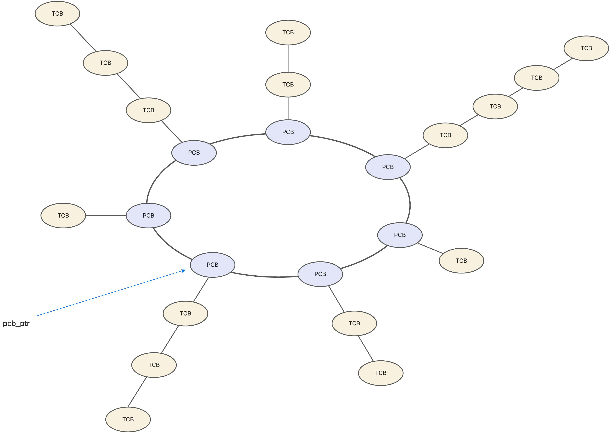

再多线程模型中，任务只是一个容器，线程是一定属于某一任务的。执行时，实际执行的是线程。而进程作为容器则只提供公共的地址空间。所有线程共享进程的资源。

### 进程控制块 PCB
PCB 的结构需要调整，原本我们在 PCB 中存储各个寄存器的内容。由于现在处理器在做任务切换时，实际切换的是线程，所以这些内容要挪到 TCB 中，而 PCB 得到大幅简化。

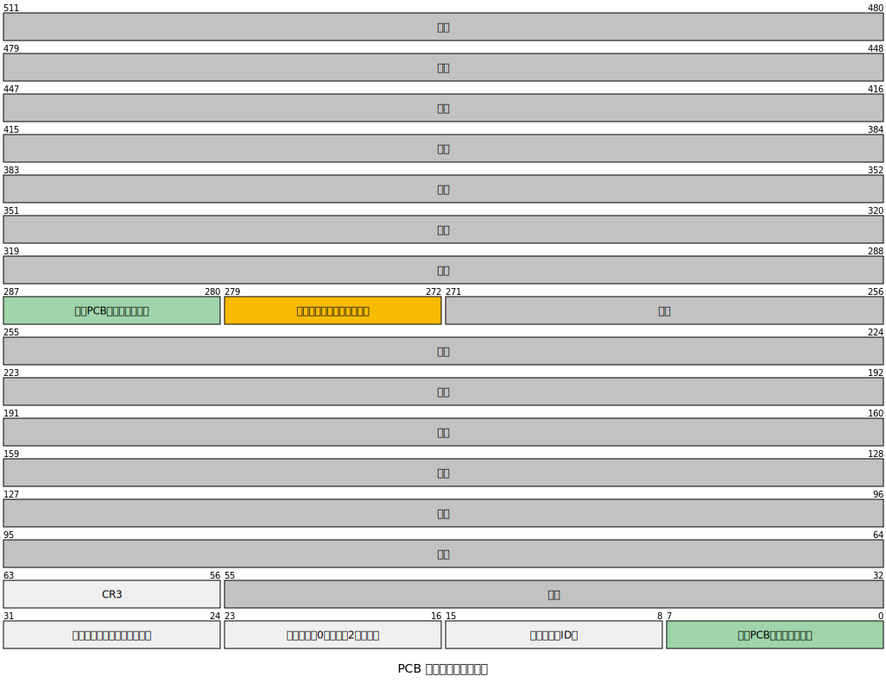

+ **任务状态**：现在任务状态可以简化成两种，**运行态**和**终止态**。
+ **CR3**：之所以保留 CR3，是因为 CR3 用于分页，而所有线程是共享进程地址空间的。
+ **线程链表首节点的线性地址**：它指向任务的第一个 TCB。

### 线程控制块 TCB
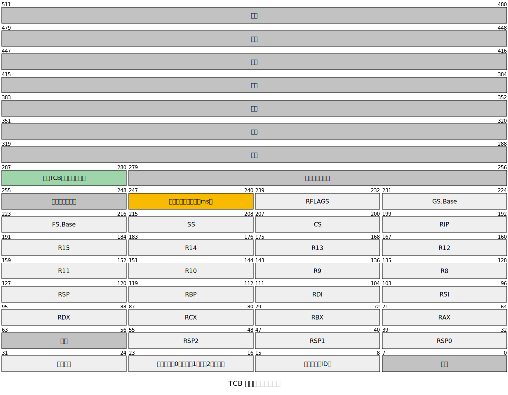

## 任务创建和调度流程
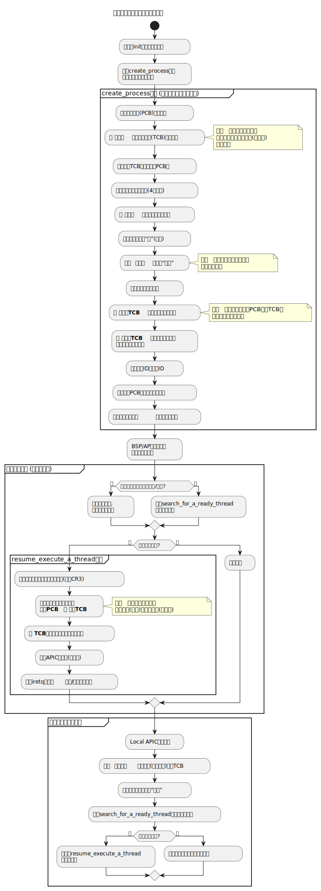

由于执行代码的基本单位从进程变成了线程，所以进程变成了容器。

1. 任务（PCB）管理地址空间、资源等环境；线程（TCB）管理执行流、寄存器、栈、状态和时间片。
2. 主线程的创建：在创建任务（create_process）时，必须同步创建其第一个线程——主线程。主线程的入口点就是任务的入口点。
3. 执行上下文的转移：关键的执行信息（如入口地址、栈、状态、时间片）从 PCB 转移到了 TCB 中。
4. 双重记录：处理器的专属存储区需要同时记录当前任务（PCB）和当前线程（TCB），因为线程在执行时离不开其所属任务的环境。

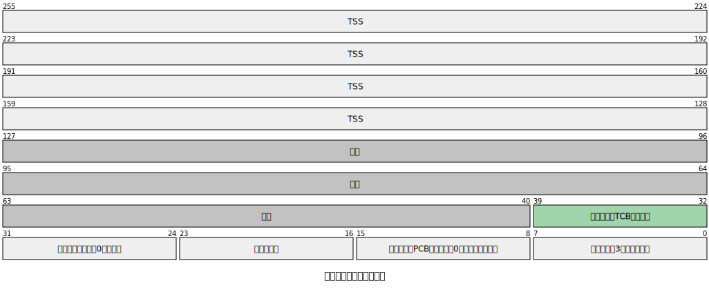

5. 调度单位的改变：调度器（search_for_a_ready_thread）寻找的不再是就绪的“任务”，而是就绪的“线程”。
6. 中断处理：新线程认领中断和时间片到期中断的处理逻辑，其操作对象都由任务变为了线程。

## 新建线程
假设当前线程工作在用户态，想要新建线程，需要进行系统调用。线程创建后，系统即将其交给调度器调度。所以什么时间执行新创建的线程在用户程序层面是不可控的。

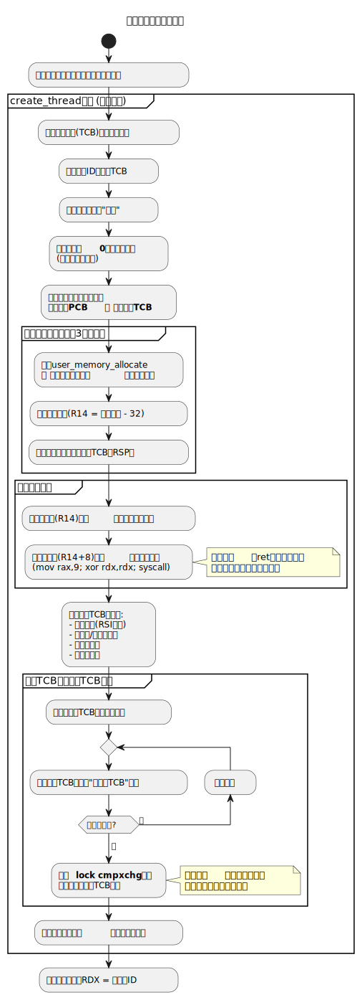

**ret 指令的双重语义**：

+ 被 call 调用时：栈中有真实的返回地址，ret 正常返回调用者
+ 作为线程执行时：栈中植入的是线程结束代码地址，ret 会跳转到终止流程

兼容性目标：同一个函数既可以作为传统子程序被调用，也可以作为现代线程并发执行，为系统从单线程向多线程平滑过渡提供了技术基础。

## 线程结束和任务终止
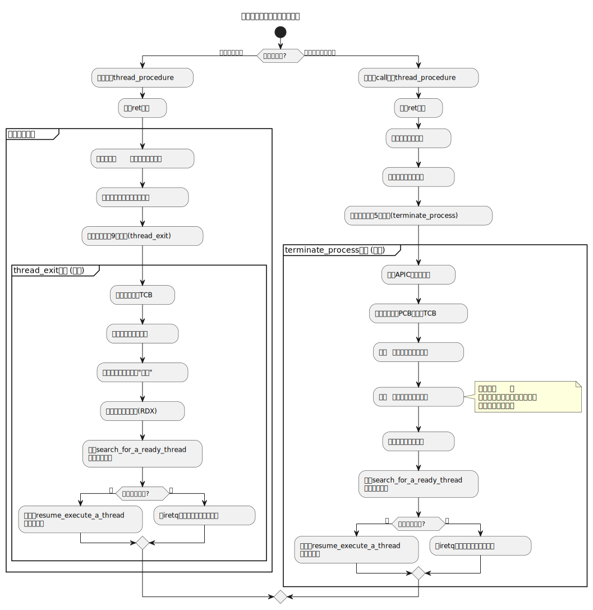

## 线程休眠
线程休眠后，线程进入阻塞状态，处于阻塞状态的线程不会被 CPU 调度。

我们可以通过设置外部定时器中断，中断发生时处理器检查线程的休眠时间是否到期。

用户程序想要实现线程休眠需要执行系统调用。

系统调用的流程如下：

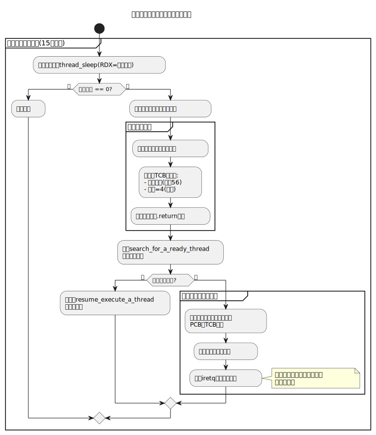

系统管理中断处理流程：

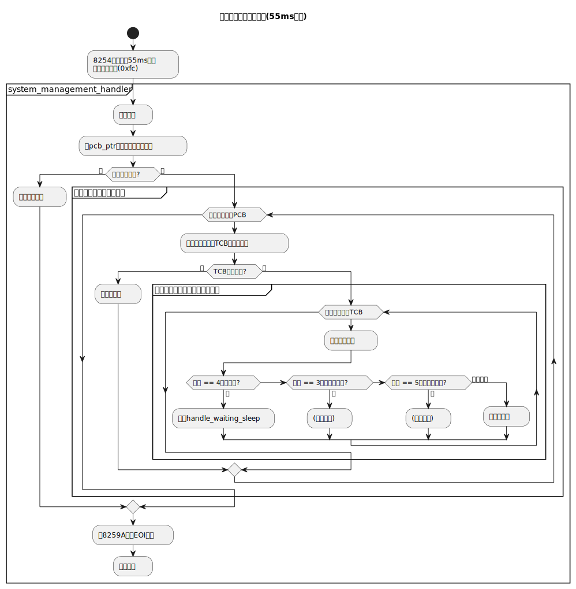

再来看看休眠唤醒的`handle_waiting_sleep`过程：

## 线程等待
我们所说的线程等待，是指线程 A 需要等待线程 B 执行完才能继续执行的这种情况。

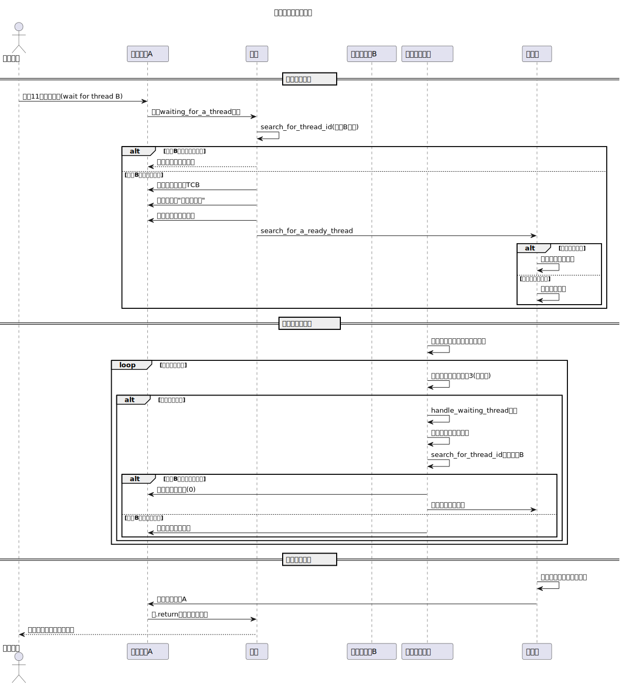

## 多线程竞争互斥锁
其实互斥锁的本质就是一块共享内存空间，通过原子操作尝试去改变该共享空间的值，只有交换回 0 值（即锁未被占用）的线程才能成功获得锁，而其他线程需要陷入休眠，等待下一次系统管理中断时重新尝试竞争锁。

下面是一个多线程竞争互斥锁的示例流程。

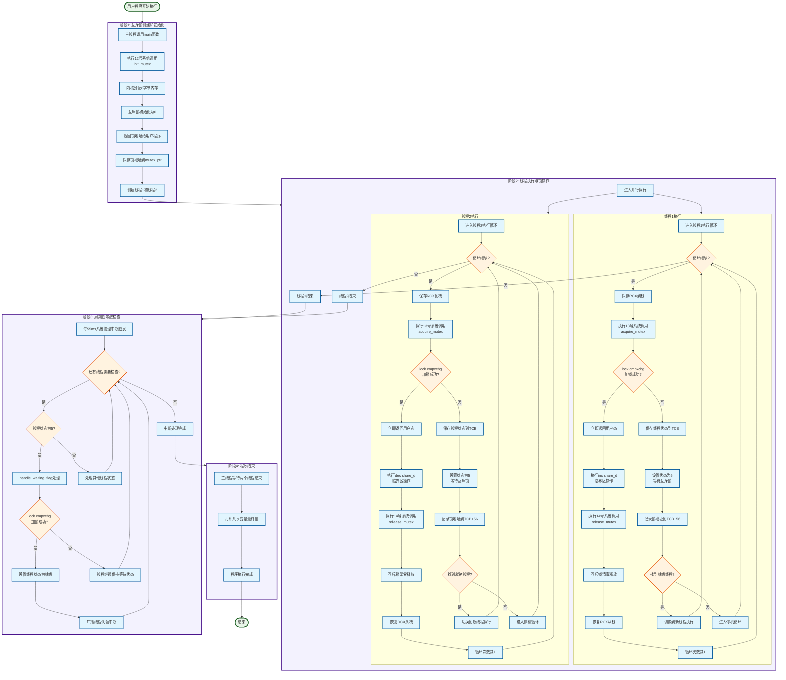

