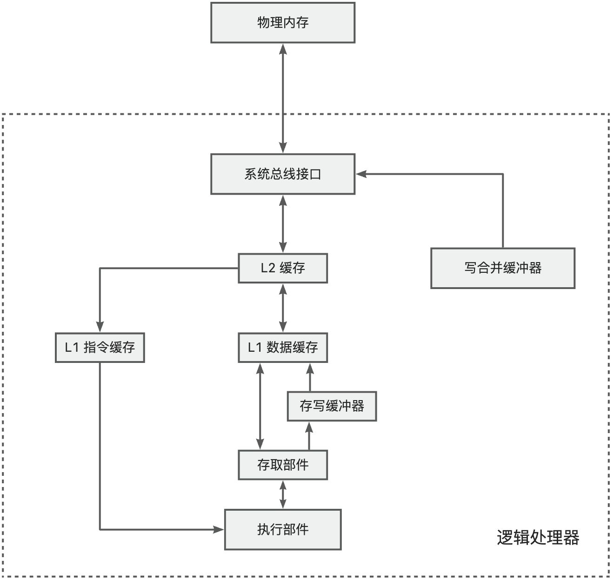
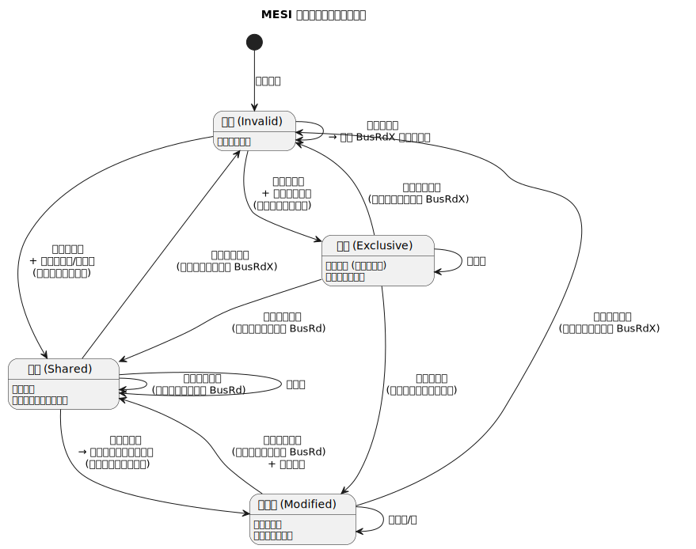

本篇是 x86 架构的番外篇，我希望借这篇博文，理清「锁」的本质。

<!-- truncate -->

## 什么是锁？
我们先看一个之前举过的例子：

```plain
share_data dq 9000

do_divide:
    push rax
    push rdx

    pushfq
    cli
    
    xor rdx,rdx
    mov rax, [rel share_data]
    div r8
    mov [rel share_data], rax

    popfq

    pop rdx
    pop rax

    ret
```

在单处理器环境下，由于在执行除法计算前禁止了响应中断，所以不会出现除法过程中转去执行其它任务，进而导致 share_data 被其他任务改变的情况。

但在多处理器环境下，由于多个任务在多个 CPU 上同时执行，还是存在同时修改 share_data 的情况。即可能存在：

| 时间 | 处理器 0 操作 | 处理器 1 操作 | x 的内容 |
| --- | --- | --- | --- |
| t0 | 读取 X | 等待总线 | 0 |
| t1 | +2 | 读取 X | 0 |
| t2 | 写回 X | +3 | 2 |
| t3 | 执行下一条指令 | 写回 X | 3 |


如果只是要保证单条语句的执行顺序，我们可以通过原子操作来避免数据竞争。

站在操作系统的层面来看，原子操作有两种实现方式，一种是使用类似 xchg、xadd 这类的原生的原子操作；另一种是使用 lock 前缀来为原本不是原子操作的指令施加「锁总线」的语义，这是一种硬件锁。

如果要锁定的指令不止一句，也就是说要锁定一个范围时，就必须使用「锁」。


从上述表述可以总结出，所谓的数据竞争问题，本质上就是 **<font style={{color:'#DF2A3F'}}>多个任务同时操作同一个地址空间</font>** 的问题。

下面我们再展开聊聊。

## 原子操作
**原子操作** 是指在并发编程或多处理器系统中，一个或多个指令序列所组成的、在执行过程中不会被中断的操作。该操作具有不可分割性，其执行过程对外部观察者（如其他处理器或线程）而言，呈现出一种“全有或全无”的语义。

原子操作必须同时满足以下两个核心属性：

1. **原子性**：操作作为一个不可分割的整体执行。系统状态在操作开始前和操作结束后是一致的，外部观察者无法看到操作的任何中间状态。操作要么完全生效，要么完全不生效。
2. **隔离性**：在操作执行期间，其所访问的内存区域不会被其他任何并发操作所修改。这保证了操作是在一个一致的、不被干扰的状态基础上进行的。

**原子指令** 是计算机硬件架构提供的一种特殊的机器指令，其核心特性是能够独立地、在单个指令执行周期内完成一个不可分割的 **读 - 修改 - 写** 内存操作。

### XCHG 原理探究
XCHG 指令有两种形式：

```plain
xchg reg, mem   ; 交换寄存器与内存中的值
xchg reg1, reg2 ; 交换两个寄存器的值（此形式不涉及内存，天然原子）
```

当交换的是寄存器和内存中的值的时候，**CPU 会自动在其执行期间施加一个总线锁定（Bus Lock）或缓存锁定（Cache Lock）**，相当于隐式地添加了 LOCK 前缀。

> “The XCHG instruction that references memory always asserts the LOCK# signal regardless of the presence of the LOCK prefix.”
>

这意味着：

+ 即使程序员没有显式写出 `lock xchg`，只要 XCHG 操作内存，就具有原子性。
+ 这种原子性由硬件保证，无需软件干预。

现代 x86 处理器通常使用 **缓存一致性协议（如 MESI）** 来避免实际拉低总线（enable 引脚，操作代价高）。具体如下：

+ 早期系统：通过拉低 **LOCK# 引脚**，禁止其他处理器访问内存总线，直到当前操作完成。
+ 现代系统（利用缓存一致性）：如果目标内存地址位于处理器的缓存中，并且缓存行处于 **“独占”（Exclusive）或“已修改”（Modified）** 状态，则 CPU 可以直接在缓存中完成原子交换，而无需锁定整个总线。此时称为 **缓存锁定（Cache Locking）**，效率更高。

（如果内存未对齐或跨越缓存行边界，可能仍会触发总线锁，严重影响性能）

### 内存屏障（Memory Barrier）
XCHG 不仅是原子的，还具有**全内存屏障（Full Memory Barrier）** 的语义：

+ 在 XCHG 执行前后，**所有之前的读写操作必须完成，之后的读写不能提前。**
+ 这防止了编译器和 CPU 的重排序，确保内存操作顺序符合预期。

**内存屏障（Memory Barrier，也称 Memory Fence）**是计算机体系结构中用于**控制内存访问顺序**的一种同步机制。它主要用于解决由于 **编译器优化** 和 **CPU 乱序执行（Out-of-Order Execution）** 导致的内存操作重排序问题，确保多线程、多处理器环境下程序行为符合预期。

#### 重排序
**编译器重排序**

编译器在生成机器码时，可能对无关的读写操作重新排序。

```c
a = 1;
b = 2;
```

例如以上 C 语句，编译器可能先写 b 再写 a，只要单线程语义不变。

**CPU 乱序执行（硬件重排序）**

现代 CPU 支持**指令级并行**，会动态调整指令执行顺序。

例如：写操作可能被延迟到缓存中（Store Buffer），读操作可能提前（Load Reordering）。


在单线程中这些优化无害，但在多线程共享内存场景下，可能导致其他线程看到“违反程序顺序”的状态，引发竞态条件（Race Condition）。

#### 内存屏障的类型
根据限制方向不同，在 x86 中内存屏障可分为以下几类：

| 类型 | 作用 | 常见指令/原语 |
| --- | --- | --- |
| **LoadLoad 屏障** | 确保屏障前的读操作在屏障后的读操作之前完成 | 较少显式使用 |
| **StoreStore 屏障** | 确保屏障前的写操作在屏障后的写操作之前提交 | 如 `sfence` |
| **LoadStore 屏障** | 确保屏障前的读操作在屏障后的写操作之前完成 | 隐含在多数屏障中 |
| **StoreLoad 屏障** | 确保屏障前的写操作对其他 CPU 可见后，才执行屏障后的读操作 | 最强约束，如 `mfence` 或 `lock` 指令 |


具体几个例子来帮助理解：

**LoadLoad 屏障**

这就好比你有两个快递：

+ 快递 A：通知你“考试通过了”
+ 快递 B：里面是“毕业证书”

你必须先看到通知，再拿证书。如果先拿到证书但没看到通知，就可能产生困惑。

如果没有 LoadLoad 屏障，CPU 可能会先看快递 B，再看快递 A。


**StoreStore 屏障**

你要寄两件东西：

+ 包裹 A：合同签字页
+ 包裹 B：付款收据

对方必须先收到合同，再收到付款收据。

类比代码：

```c
// 初始化共享数据
buffer[0] = 'H';
buffer[1] = 'i';

ready_flag = 1;  // 标志：数据已就绪
```

如果没有 StoreStore 屏障，CPU 可能先写 ready_flag = 1，再慢慢写 buffer。

其他线程看到 ready_flag == 1 时，buffer 还是乱码！


**LoadStore 屏障**

你去快递站：

+ 先查看是否有退货通知（Load）
+ 如果没有，才寄出新商品（Store）

如果 CPU 先寄出商品，再去看通知，可能就寄错了！


**StoreLoad 屏障**

这是最严格，也是最慢的屏障。可以类比为：你必须把快递给到快递员后，才能查到快递信息！


而所谓的全内存屏障，禁止**所有**类型的重排序，即：

+ 屏障前的所有内存操作（读/写）必须在屏障后所有内存操作**之前完成**。
+ 对应 **StoreLoad + LoadLoad + StoreStore + LoadStore** 的组合。

#### 内存屏障的实现原理
内存屏障 = CPU 暂停流水线 + 清空本地缓冲区 + 等待缓存一致性协议完成

强制确保指定内存操作的全局顺序性和可见性。

### MESI 和缓存锁定
现代多核处理器依靠缓存一致性协议保证多核之间的数据一致性。这一节详细了解一下 MESI 和缓存锁定。

首先这里的缓存其实指的就是 CPU 的高速缓存，高速缓存在每个核中都独立存在。先回顾一下典型的多级缓存结构：



+ **L1 缓存**：有的处理器上分为 **L1 指令缓存**和 **L1 数据缓存**。L1 缓存最接近 CPU，访问速度最快（通常 1-4 个 CPU 周期）。L1 直接集成在 CPU 核心内部，物理链路最短，所以访问速度最快。但由于电路复杂性原因，容量较低。
+ **L2 缓存**：兼顾速度与容量。离核心稍远，访问延迟较高（通常 10-20 个 CPU 周期）。
+ **存写缓冲器**：有的处理器配备存写缓冲器。有时总线正在忙于其它内存访问，为了不影响程序执行的连续性，可以先将数据写入存写缓冲器，有机会时在写入缓存或者内存。
+ **写合并缓冲器**：有些内存区域是不需要缓存的，并且写入顺序不重要。最典型的就是**显存**。一个一个写入显存非常耗时且占用总线，因此可以先写合并，时机成熟再一次性写入显存。

多核 CPU 的情况下有多个一级缓存，如何保证缓存内部数据的一致，不让系统数据混乱。这里就引出了一个一致性的协议 MESI。

#### MESI 协议
MESI 是指 4 种状态的首字母。每个 Cache line 有 4 个状态，可用 2 个 bit 表示，它们分别是：

| **状态** | **描述** | **监听任务** |
| --- | --- | --- |
| M 修改 (Modified) | 该 Cache line 有效，数据被修改了，和内存中的数据不一致，数据只存在于本 Cache 中。 | 缓存行必须时刻监听所有试图读该缓存行相对主存的操作，这种操作必须在缓存将该缓存行写回主存并将状态变成 S（共享）状态之前被**延迟执行**。 |
| E 独享、互斥 (Exclusive) | 该 Cache line 有效，数据和内存中的数据一致，数据只存在于本 Cache 中。 | 缓存行也必须监听其它缓存读主存中该缓存行的操作，一旦有这种操作，该缓存行需要变成 S（共享）状态。 |
| S 共享 (Shared) | 该 Cache line 有效，数据和内存中的数据一致，数据存在于很多 Cache 中。 | 缓存行也必须监听其它缓存使该缓存行无效或者独享该缓存行的请求，并将该缓存行变成无效（Invalid）。 |
| I 无效 (Invalid) | 该 Cache line 无效。 | 无 |




#### 多核缓存协同操作
假设有三个 CPU A、B、C，对应三个缓存分别是 cache a、b、c。在主内存中定义了 x 的引用值为 0。

CPU 之间的通信是基于“总线监听”（Bus Snooping）的被动通知模型。

**单核读取时：**

1. CPU A 发出指令，从内存中读取 x。
2. 数据从内存通过总线读取到缓存中（远端读取 Remote read）,这时该 Cache line 修改为 E 状态（独享）

**多核读取时：**

1. CPU A 发出指令，从内存中读取 x
2. CPU A 从内存通过读取总线到 cache a 中并将该 cache line 设置为 E 状态（独享）
3. CPU B 发出指令，从内存中读取 x
4. CPU B 试图从内存读取 x 时，CPU A 检测到了地址冲突。这时 CPU A 对相关数据做出响应。此时 x 存储于 cache a 和 cache b 中，x 在 chche a 和 cache b 中都被设置为 S 状态 (共享)

**如果此时发生了数据修改：**

1. CPU A 计算完成后发指令需要修改 x
2. CPU A 将 x 设置为 M 状态（修改）
3. CPU B 监听到 CPU A 修改了 x，将本地 cache b 中的 x 设置为 I 状态（无效）
4. CPU A 对 x 的内存进行赋值

**同步数据：**

1. CPU B 发出了要读取 x 的指令，发现 cache b 无此行（或为 Invalid），于是向互连网络（如 Ring Bus）发送 BusRd 请求
2. CPU A 监听到 BusRd，发现该地址处于 Modified（M）状态。CPU A 将数据写入内存，将状态设置为 E（独享）
3. CPU B 从内存读取到 x，cache a 和 cache b 中的 x 设置为 S 状态（共享）

:::warning
🌟 现代 CPU 支持 **Cache-to-Cache Transfer（缓存直传）**

即在 CPU B 读取 x 的时候，**CPU A 并不需要先把数据写回主存再让 CPU B 读！**

CPU A 直接通过互连网络将缓存行数据发送给 CPU B。同时，CPU A 将自己的缓存行状态从 M → S。主存仍然保持旧值（暂时不写回）。

CPU B 收到 CPU A 发来的最新数据。将其放入本地缓存，状态设为 S。Load 指令完成，无需等待主存。

:::

#### MESI 引入的问题
缓存的一致性消息传递是要时间的，这就使其切换时会产生延迟。当一个缓存被切换状态时，其他缓存监听并完成各自的切换。这么一长串的时间中 CPU 都会等待所有缓存响应完成。这些阻塞可能导致性能问题和稳定性问题。

为了避免这种 CPU 运算能力的浪费，高速缓存中有一个 Store Buffer，处理器把想要写入到内存的值写到缓存，然后继续去处理其他事情。当获得缓存行的独占权限（通过 RFO）后即可提交。

但这样有两个问题：

1. 处理器会尝试从 buffer 中读取值，但它还没有进行提交。这个的解决方案称为 Store Forwarding，它使得加载的时候，如果存储缓存中存在，则进行返回
2. 保存什么时候会完成，这个并没有任何保证

举个具体例子：

```c
x = 1;      // 写入 Store Buffer
y = x;      // 读 x —— 如果从缓存读，会得到旧值！
```

解决方案：Store Forwarding（存储转发）

+ CPU 的 **Load 单元在执行读操作时，不仅查缓存，还查 Store Buffer**。
+ 如果发现 Store Buffer 中有**相同地址的未提交写**，就直接返回该值。
+ 对本核而言，**看起来写立即生效**，维持了单线程语义。


再来看这个例子：

```c
// CPU A
value = 10;       // (1)
finished = true;  // (2)

// CPU B
while (!finished); // (3)
assert(value == 10); // (4) 可能失败！
```

因为 (1) 和 (2) 写入不同缓存行，可能 (2) 先获得独占权并提交，(1) 滞后。

CPU B 看到 finished == true 时，value 还是旧值。

解决方案：就是前面刚提到的**内存屏障**

需要在 CPU A 中插入 StoreStore 屏障（或全屏障）：

```c
// CPU A
value = 10;
smp_wmb();        // StoreStore barrier（Linux 内核）
finished = true;
```

阻止 Store Buffer 乱序提交：确保 value = 10 在 finished = true 之前提交到缓存。

#### 缓存锁定
**缓存锁定（Cache Locking）** 是现代多核处理器在执行原子内存操作（如带 `LOCK` 前缀的指令）时，**不通过锁住整个系统总线（Bus Lock）**，而是 **利用缓存一致性协议（如 MESI）** 在缓存层级完成原子操作的一种高效硬件机制。

CPU 执行一条带原子语义的指令时，会 检查 `[addr]` 所在的缓存行（Cache Line）。

+ 如果该行已在本地缓存，且处于 Exclusive（E）或 Modified（M）状态 → **拥有独占权**。
+ 如果不在缓存中 → **发起 RFO（Read For Ownership）** 请求，通过 MESI 协议使其他核失效该行，**获得独占权**

在本地缓存中直接执行原子操作，优势是：整个过程不占用全局总线，其他核心仍可访问其他内存地址。操作完成后，缓存行保持 Modified 状态，后续由缓存子系统写回主存。

### 小结
最后，以 `xchg eax, [addr]` 为例，说明它是怎么保证原子性的：

1. CPU 检查 `[addr]` 所在的缓存行是否在本地 L1/L2 缓存中。
2. 如果不在：
    - 发起 RFO（Read For Ownership）请求。
    - 通过互连网络（如 Intel 的 Ring Bus / Mesh）通知其他核心。
    - 其他核心将该缓存行置为 Invalid。
    - 本核获得该缓存行的 **独占（E）**或**已修改（M）** 状态。
3. 一旦拥有独占权限：
    - CPU 直接在本地缓存中执行原子交换。
    - 此过程不需要锁定整个内存总线。
4. 操作完成后：
    - 缓存行保持 Modified 状态。
    - 后续写回主存由缓存系统自动处理。

## 自旋锁（Spinlock）
LOCK 前缀只能锁住一条语句，如果是希望锁住多条指令组成的操作序列，就只能使用锁机制。

```plain
share_data dq 9000
locker db 0  ;锁，其实本质上是存储了锁的状态

do_divide:
    push rax
    push rdx

    pushfq
    cli
.spin_lock:
    cmp byte [rel locker], 0
    je .get_lock
    pause
    jmp .spin_lock
.get_lock:
    mov dl, 1
    xchg [rel locker], dl
    cmp dl, 0   ;交换前为 0 才能证明是交换成功的
    jne .spin_lock

    xor rdx,rdx
    mov rax, [rel share_data]
    div r8
    mov [rel share_data], rax

    mov byte [rel locker], 0 ;释放锁

    popfq

    pop rdx
    pop rax

    ret
```

自旋锁通常通过一个共享内存变量（如 locker）表示其状态：0 表示未加锁（可用），非 0 表示已加锁（被占用）。

典型实现流程如下：

+ 测试阶段：使用原子读或轻量比较（如 cmp [locker], 0）快速检查锁是否空闲。
+ 若空闲（值为 0），尝试通过原子交换指令（如 xchg）将锁状态置为 1
+ 若已被占用（值为 1），或原子获取失败，则进入忙等待循环（busy-wait loop），不断重试上述过程，直至成功获取锁。

自旋锁适用于**临界区极短、上下文切换开销大于自旋开销的场景**（如操作系统内核、中断处理等）

## 互斥锁（Mutex）
下面是一个简单的可重入互斥锁实现：

```plain
section .data
    share_data dq 9000

    ; 互斥锁结构：8 字节对齐
    mutex:
        .owner dq 0      ; 当前持有者 CPU ID（0 = unlocked）
        .count dq 0      ; 重入计数

section .text
global do_divide

; 假设：
;   - r8 = 除数
;   - 有一个函数 get_cpu_id 返回当前 CPU ID in rax
;   - 若为单核系统，可将 owner 固定为 1，或省略 owner 检查

do_divide:
    push rax
    push rbx
    push rcx
    push rdx

    call get_cpu_id      ; rax = current CPU ID
    mov rbx, rax         ; rbx = owner ID

    ; --- 尝试获取互斥锁 ---
.acquire:
    ; 读取当前 owner
    mov rcx, [rel mutex.owner]

    cmp rcx, 0
    je .try_lock_new     ; 无人持有，尝试获取

    cmp rcx, rbx
    je .already_owned    ; 已是本 CPU 持有，重入

    ; 否则，自旋等待
    pause
    jmp .acquire

.try_lock_new:
    ; 尝试原子地将 owner 从 0 改为 rbx
    mov rax, 0
    mov rdx, rbx
    lock cmpxchg [rel mutex.owner], rdx
    jnz .acquire         ; 失败，重新尝试

    ; 成功获取，count = 1
    mov qword [rel mutex.count], 1
    jmp .critical_section

.already_owned:
    ; 重入：count++
    inc qword [rel mutex.count]
    ; 无需自旋，直接进入临界区

.critical_section:
    ; 执行临界区
    xor rdx, rdx
    mov rax, [rel share_data]
    div r8
    mov [rel share_data], rax

    ; --- 释放互斥锁 ---
.release:
    dec qword [rel mutex.count]
    jnz .done            ; count > 0，不释放锁

    ; count == 0，真正释放
    mov qword [rel mutex.owner], 0

.done:
    pop rdx
    pop rcx
    pop rbx
    pop rax
    ret


; 获取当前 CPU ID（示例版）
; 实际上可以使用 APIC ID
get_cpu_id:
    mov rax, 1
    ret
```

**通过原子地记录当前持有锁的 CPU ID 和重入计数，实现可重入的互斥访问。**

+ 当锁空闲（owner = 0）时，使用 `lock cmpxchg` 原子地将 owner 设为当前 CPU ID，确保多核竞争下的唯一获取；
+ 若当前 CPU 已是持有者，则仅递增重入计数，允许同一线程多次加锁而不死锁；
+ 释放时递减计数，仅当计数归零才真正清空 owner，交出锁。


如果把上述互斥锁逻辑再加以改造，可以得到一个不忙占的互斥锁：

```plain
section .data
    share_data dq 9000

    ; 互斥锁结构
    mutex:
        .owner   dq 0          ; 0 = unlocked, 否则为持有者 TCB 地址
        .waiter  dq 0          ; 等待者 TCB（简化为单等待者）

    ; 任务控制块简化版（仅两个任务示例）
    tcb0:
        .rsp     dq stack0_top
        .state   dq 1          ; 1=RUNNING, 0=BLOCKED
    tcb1:
        .rsp     dq stack1_top
        .state   dq 0

    current_task dq tcb0

section .bss
    stack0: resb 4096
    stack0_top:
    stack1: resb 4096
    stack1_top:

section .text

; ----------------------------
; 互斥锁：加锁（可能阻塞）
; ----------------------------
mutex_lock:
    push rax
    push rbx
    mov rbx, [rel current_task]

.try_acquire:
    mov rax, [rel mutex.owner]
    test rax, rax
    jz .do_cas

    ; 锁已被占用 → 阻塞自己
    mov [rel mutex.waiter], rbx       ; 记录等待者
    mov qword [rbx + tcb_state], 0    ; tcb 设置为 BLOCKED 状态

    call schedule                     ; 主动切换（让出CPU）

    jmp .try_acquire                  ; 被唤醒后重试

.do_cas:
    mov rax, 0
    mov rdx, rbx
    lock cmpxchg [rel mutex.owner], rdx
    jnz .try_acquire

    pop rbx
    pop rax
    ret

; ----------------------------
; 互斥锁：解锁（唤醒等待者）
; ----------------------------
mutex_unlock:
    push rax
    mov qword [rel mutex.owner], 0

    mov rax, [rel mutex.waiter]
    test rax, rax
    jz .done

    mov qword [rax + tcb_state], 1    ; 简单实现，唤醒等待的任务
    mov qword [rel mutex.waiter], 0

.done:
    pop rax
    ret

; ----------------------------
; 调度器：保存当前上下文，切换到下一个可运行任务
; ----------------------------
schedule:
    ; 保存当前任务的寄存器（简化：只保存 rsp，以及应保存所有栈针和寄存器）
    mov rax, [rel current_task]
    mov [rax + tcb_rsp], rsp

.find_next:
    ; 简单轮转：tcb0 ↔ tcb1
    mov rax, tcb0
    cmp rax, [rel current_task]
    je .switch_to_tcb1

    ; 当前是 tcb0 → 切到 tcb1
    mov rax, tcb1
    cmp qword [rax + tcb_state], 1
    jne .halt
    jmp .do_switch

.switch_to_tcb1:
    mov rax, tcb0
    cmp qword [rax + tcb_state], 1
    jne .halt

.do_switch:
    mov [rel current_task], rax
    mov rsp, [rax + tcb_rsp]
    ret

.halt:
    hlt
    jmp .find_next

; ----------------------------
; 定时器中断处理函数（抢占式）
; ----------------------------
global timer_handler
timer_handler:
    ; 保存所有寄存器（此处简化，实际需 pushaq/popaq）
    push xxx

    ; 关键：调用调度器，实现抢占式切换
    call schedule

    ; 恢复寄存器（顺序相反）
    pop xxx

    ; 发送 EOI（简化）
    ; mov al, 0x20
    ; out 0x20, al

    iretq         ; 返回被中断的任务（可能是另一个！）

; ----------------------------
; 使用示例
; ----------------------------
do_divide:
    push rax
    push rdx

    call mutex_lock

    xor rdx, rdx
    mov rax, [rel share_data]
    div r8
    mov [rel share_data], rax

    call mutex_unlock

    pop rdx
    pop rax
    ret
```

如此一来，一旦加锁失败，任务可以主动让出 CPU，当锁释放时，将被当前锁阻塞的任务重新唤醒。

这样任务轮转时，就又可以调度到该任务，并再次尝试获取锁。


在多核场景下，上述实现又引入了一个唤醒丢失的问题。

考虑以下两个任务的交错执行：

```plain
Task A（尝试加锁）Task B（释放锁）
----------------------------|---------------------------
1. 检查 mutex.owner ≠ 0      |
   → 决定要阻塞任务           |
                            | 2. 设置 mutex.owner = 0
                            | 3. 检查 waiter == NULL
                            |    → 无等待者，不唤醒
4. 设置自己为 BLOCKED         |
5. 将自己加入 waiter          |
```

Task B 在 Task A 尚未把自己挂到等待队列之前就完成了释放和唤醒检查；

结果导致：Task A 被挂起，但再无人唤醒它 → 永久阻塞（死锁）。

这是典型的 **“检查 - 后 - 设置”（Check-then-Act）** 竞态条件。

究其原因，是因为步骤 1 到 5 不是原子的。在多线程情况下，除了屏蔽中断，还需要利用底层自旋锁（spinlock）来保护“检查锁状态 + 加入等待队列”这一临界区。

## 读写锁（Read-Write Lock）
读写锁是允许同时读，但不允许同时写，也不允许同时读写。

读写锁又比互斥锁更复杂了一些，所以这里只是一个简化的，仅用于学习读写锁的简易实现。

```plain
rwlock:
    .meta_lock   dq 0        ; 底层自旋锁，保护以下字段
    .writer      dq 0        ; 写者 TCB（0 = 无写者）
    .readers     dq 0        ; 当前读者数量
    .write_waiters dq 0      ; 写等待队列头（简化为单个）
    .read_waiters  dq 0      ; 读等待队列头（简化为单个）

rw_read_lock:
    ; 1. 获取元数据自旋锁（多核安全）
.acquire_meta:
    lock bts qword [rel rwlock.meta_lock], 0   ; test-and-set
    jc .acquire_meta

    cli  ; 防本核抢占

    ; 2. 检查是否有写者 or 写等待者（可选：写优先）
    mov rax, [rel rwlock.writer]
    or  rax, [rel rwlock.write_waiters]  ; 若需写优先
    jnz .block_reader

    ; 3. 无冲突，直接增加读者计数
    inc qword [rel rwlock.readers]
    sti
    mov qword [rel rwlock.meta_lock], 0
    ret

.block_reader:
    ; 4. 加入读等待队列（简化：只存一个）
    mov [rel rwlock.read_waiters], current_tcb
    mov [current_tcb + state], BLOCKED

    sti
    mov qword [rel rwlock.meta_lock], 0

    ; 5. 主动调度（阻塞）
    call schedule
    jmp rw_read_lock  ; 被唤醒后重试


rw_write_lock:
.acquire_meta:
    lock bts qword [rel rwlock.meta_lock], 0
    jc .acquire_meta

    cli

    ; 检查：无写者 且 无读者
    mov rax, [rel rwlock.writer]
    or  rax, [rel rwlock.readers]
    jnz .block_writer

    ; 直接获取写锁
    mov [rel rwlock.writer], current_tcb
    sti
    mov qword [rel rwlock.meta_lock], 0
    ret

.block_writer:
    mov [rel rwlock.write_waiters], current_tcb
    mov [current_tcb + state], BLOCKED

    sti
    mov qword [rel rwlock.meta_lock], 0
    call schedule
    jmp rw_write_lock


rw_read_unlock:
.acquire_meta:
    lock bts qword [rel rwlock.meta_lock], 0
    jc .acquire_meta

    cli
    dec qword [rel rwlock.readers]

    ; 如果读者归零 且 有写等待者 → 唤醒写者
    jnz .no_wakeup

    mov rax, [rel rwlock.write_waiters]
    test rax, rax
    jz .no_wakeup

    mov [rax + state], RUNNING
    mov qword [rel rwlock.write_waiters], 0
    mov [rel rwlock.writer], rax   ; 转交写锁（实际应在写者被调度后获取）

.no_wakeup:
    sti
    mov qword [rel rwlock.meta_lock], 0
    ret


rw_write_unlock:
.acquire_meta:
    lock bts qword [rel rwlock.meta_lock], 0
    jc .acquire_meta

    cli
    mov qword [rel rwlock.writer], 0

    ; 优先唤醒写者（写优先），否则唤醒所有读者（简化：只一个）
    mov rax, [rel rwlock.write_waiters]
    test rax, rax
    jnz .wake_writer

    mov rax, [rel rwlock.read_waiters]
    test rax, rax
    jz .done

    ; 唤醒读者
    mov [rax + state], RUNNING
    mov qword [rel rwlock.read_waiters], 0
    inc qword [rel rwlock.readers]  ; 预分配？或由读者自己加（更安全）
    jmp .done

.wake_writer:
    mov [rax + state], RUNNING
    mov qword [rel rwlock.write_waiters], 0
    mov [rel rwlock.writer], rax

.done:
    sti
    mov qword [rel rwlock.meta_lock], 0
    ret


; 使用示例
; 读
call rw_read_lock
mov rax, [shared_data]
call rw_read_unlock

; 写
call rw_write_lock
mov [shared_data], rax
call rw_write_unlock
```

用一个底层自旋锁（.meta_lock）保护读写锁的内部状态（读者计数、写者标识、等待队列）

在加锁/解锁时原子地检查状态、修改等待队列，并通过调度器实现阻塞/唤醒，从而在多核裸机环境下安全地支持并发读与独占写。

+ **写优先 vs 读优先**：
    - **写优先**：只要有写等待者，新读者就阻塞 → 避免写饥饿；
    - **读优先**：只要无写者，就允许新读者 → 可能饿死写者。

这里使用的是写优先策略，若 **无写者** 且 **无写等待者**，则允许读者进入。

写者要求完全独占，因此必须等所有读者退出；解锁后，若是写优先则先唤醒写等待者（若有）；读优先，唤醒所有读等待者。

## 其他锁简介
还有很多种锁的变种，有一些我也还没详细研究其实现，所以只在这里做简介。

### 顺序锁（Seqlock）
+ 核心思想：
    - 写者加版本号（sequence number），读者通过检查版本号是否一致来判断读取过程中是否有写入。
    - 读者无锁、不阻塞写者；写者之间互斥。
+ ⚠️ 注意：写操作不能太频繁，否则读者无限重试。

```c
// 共享数据 + 序列号（对齐，避免撕裂读）
volatile int seq = 0;
struct data shared;

// 写者
void write_lock() {
    seq++;                  // 奇数表示“正在写”
    smp_wmb();              // 内存屏障
    // 修改 shared 数据
    smp_wmb();
    seq++;                  // 变回偶数，表示写完成
}

// 读者
struct data read_copy() {
    int start_seq, end_seq;
    struct data tmp;
    do {
        start_seq = seq;
        smp_rmb();
        tmp = shared;       // 读取数据
        smp_rmb();
        end_seq = seq;
    } while (start_seq != end_seq || (start_seq & 1)); // 奇数或不一致则重试
    return tmp;
}
```

### RCU (Read-Copy Update)
+ 核心思想：
    - 读者完全无锁、无原子操作、无内存屏障（极致性能）；
    - 写者通过“复制 - 修改 - 替换”更新数据，并等待宽限期（Grace Period）（确保所有读者退出旧版本）后再释放旧数据。
+ 适用于极读多、极少写的场景（如内核路由表），允许写操作延迟生效

```c
// 全局指针
struct node *global_ptr;

// 读者
struct node* rcu_read_lock() {
    return global_ptr;   // 直接读，无锁
}

// 写者
void update() {
    struct node *new = copy(global_ptr);
    modify(new);
    atomic_store(&global_ptr, new);     // 原子切换指针

    synchronize_rcu();  // 等待宽限期（所有 CPU 经历一次上下文切换/中断）Linux 内核中，synchronize_rcu() 通过调度点、中断等机制检测宽限期。
    free(old_ptr);      // 安全释放旧数据
}
```

### 信号量（Semaphore）
+ 控制对 **N 个相同资源** 的并发访问（N ≥ 1）；
    - `P()`（wait）：若计数 > 0 则减 1，否则阻塞；
    - `V()`（signal）：计数 +1，唤醒一个等待者。

```plain
semaphore:
    .count   dq 3          ; 初始资源数
    .waiters dq 0          ; 等待队列
    .lock    dq 0          ; 保护 count/waiters 的自旋锁

P:
    acquire_spinlock(.lock)
    if (.count > 0) {
        .count--
        release_spinlock(.lock)
    } else {
        add current_task to .waiters
        set task BLOCKED
        release_spinlock(.lock)
        schedule()
        jmp P  ; 重试
    }

V:
    acquire_spinlock(.lock)
    .count++
    if (.waiters not empty) {
        wake one waiter
    }
    release_spinlock(.lock)
```

⚠️ 注意：信号量与 mutex 区别，信号量无“所有权”，任意线程可 `V()`

### 票证锁（Ticket Lock）
模拟银行叫号：每个线程取一个“排队号”，只有当前号码匹配“服务号”才能进入。

公平、FIFO、避免缓存颠簸（Cache Thrashing）。

当需要避免传统自旋锁的“抢 cache line”问题时，可以考虑。

```plain
ticket_lock:
    .next_ticket dw 0      ; 下一个排队号
    .now_serving dw 0      ; 当前服务号

acquire:
    ; 原子取号
    mov ax, 1
    lock xadd [ticket_lock.next_ticket], ax   ; ax = my_ticket

.wait:
    cmp ax, [ticket_lock.now_serving]
    je .got_lock
    pause
    jmp .wait

.got_lock:
    ret

release:
    inc word [ticket_lock.now_serving]   ; 叫下一个号
```

### MCS 锁（Mellor-Crummey & Scott Lock）
每个线程在**自己的局部变量**上自旋（而非全局变量），极大减少缓存行争用；

线程组成**队列**，前驱释放时通知后继。

```c
struct mcs_node {
    volatile int locked;   // 1=需等待，0=可进入
    struct mcs_node *next;
};

// 全局 tail 指针
volatile struct mcs_node *tail = NULL;

void mcs_lock(struct mcs_node *me) {
    me->locked = 1;
    me->next = NULL;
    
    // 原子将自己加入队尾
    struct mcs_node *pred = xchg(&tail, me);
    
    if (pred) {
        pred->next = me;        // 告诉前驱：我是你的后继
        while (me->locked);     // 在自己 cache line 上自旋
    }
}

void mcs_unlock(struct mcs_node *me) {
    if (!me->next) {
        // 我是最后一个？尝试原子清空 tail
        if (cmpxchg(&tail, me, NULL) == me)
            return;
        // 否则等待后继出现
        while (!me->next);
    }
    me->next->locked = 0;  // 唤醒后继
}
```

## 总结
:::info
**所有软件层面的锁（互斥锁、自旋锁、读写锁、信号量等）的底层核心，都依赖于 CPU 硬件提供的原子操作（Atomic Operations）。**

:::

+ 单核系统可通过关中断实现互斥
+ 多核系统必须依赖硬件原子指令


硬件提供的关键原子原语：

| 指令（x86-64 示例） | 功能 | 用途 |
| --- | --- | --- |
| `LOCK` 前缀（如 `lock inc [x]`） | 对内存操作加总线/缓存锁 | 简单原子增减 |
| `XCHG`（带隐含 LOCK） | 交换寄存器与内存值 | 实现 test-and-set |
| `CMPXCHG`（Compare-and-Swap） | 比较并交换 | 实现无锁算法、锁获取 |
| `XADD` | 原子加并返回旧值 | 计数器、票证锁取号 |


软件在硬件原子操作之上构造锁：

| 软件锁 | 底层依赖的硬件原语 |
| --- | --- |
| **自旋锁** | `XCHG` 或 `CMPXCHG` |
| **互斥锁（Mutex）** | 自旋锁 + 等待队列（“入等待队列”仍需原子操作保护） |
| **票证锁** | `XADD`（原子取号） |
| **MCS 锁** | `XCHG`（链接队列） |
| **Seqlock** | 原子递增序列号（`LOCK INC`） |
| **信号量** | 原子减/增计数（`LOCK DEC`） |


