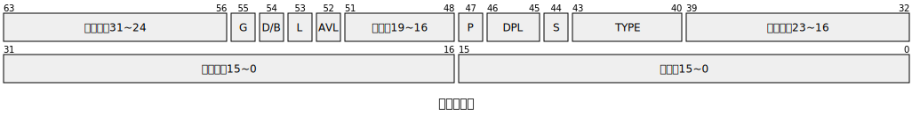
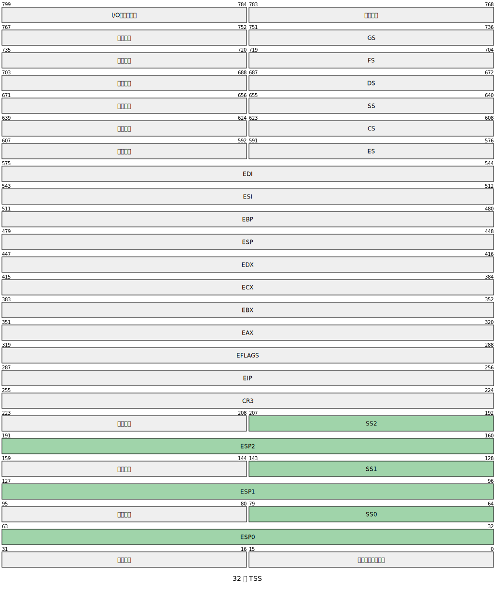
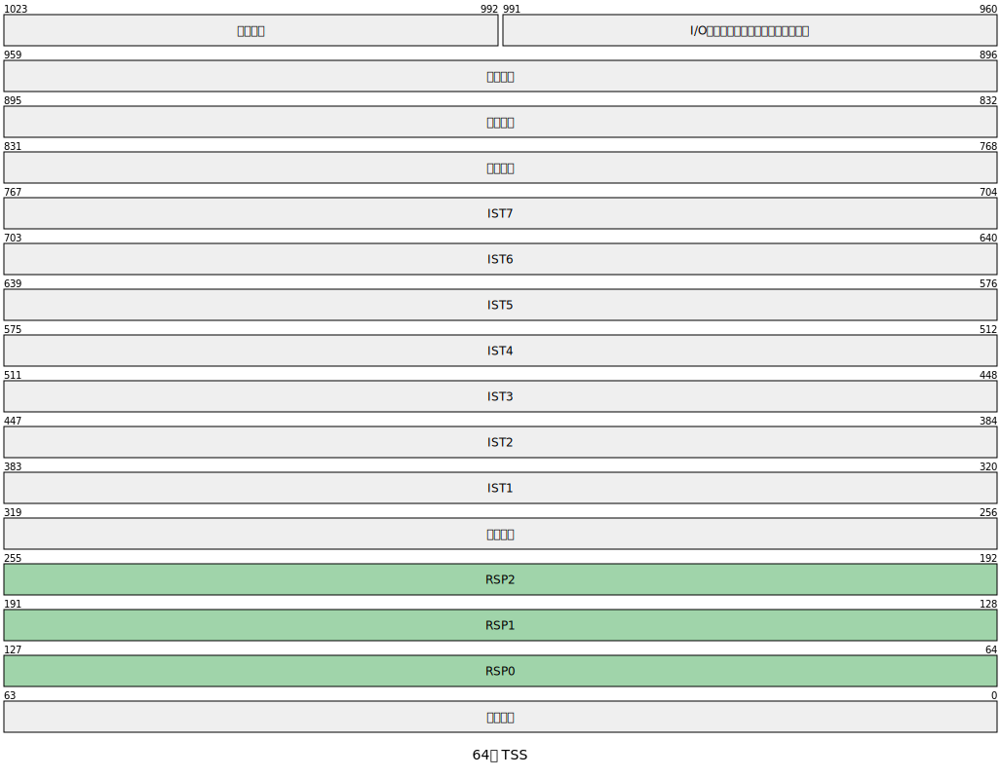
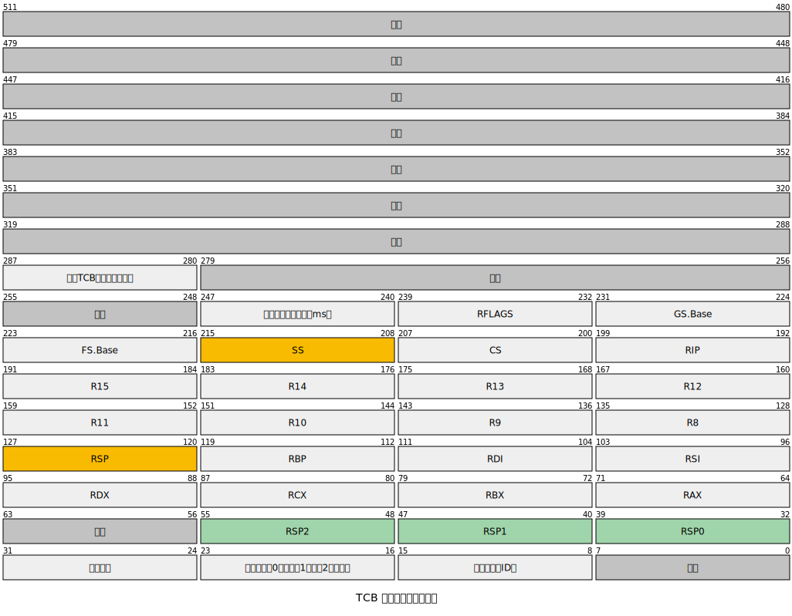

栈是一个很简单的数据结构，但它很重要。在 x86 中有各种各样的栈。本篇是 x86 架构的番外篇，目标是理清「栈」的本质。

<!-- truncate -->

## 实模式下的栈
Intel 8086 及其系列处理器在硬件层面原生支持栈（stack）这一抽象数据结构。

要有效使用栈，需满足两个基本要素：栈的**内存布局定义**与**对应的栈操作指令**。

### 栈的内存布局定义
也就是说要知道栈以什么形式存储，存储在内存中的哪个位置。

实模式（Real Mode）下，内存采用分段寻址模型。栈作为一个独立的逻辑段，其位置由两个专用寄存器共同确定：

+ **SS（Stack Segment Register）**：存放栈段的段基地址（即段起始物理地址的高 16 位，实际物理地址为 `SS << 4`）
+ **SP（Stack Pointer Register）**：16 位寄存器，指向当前栈顶元素的偏移地址（相对于 SS 段基址）


栈段的大小最大为 `64 KB`（因 SP 为 16 位），且必须位于一个连续的 64 KB 段内。程序员或操作系统需确保栈空间不与其他段重叠，并预留足够空间以避免溢出。

SS 寄存器和其他段寄存器一样，只能利用其他寄存器赋值，不允许使用立即数（immediate value）赋值。原因是段寄存器在 x86 的内存管理模型中具有特殊语义，直接加载任意段值可能破坏系统稳定性或违反保护机制。

```plain
MOV AX, 0x1000    ; 先将段基址加载到通用寄存器 AX
MOV SS, AX        ; ✅ 再将 AX 的值传给 SS

MOV SS, 0x1000    ; ❌ 汇编错误！x86 不支持此指令形式
```

在后续的 32 位或 64 位处理器上，SS 被扩展到 64 位，SP 被扩展位 ESP（32 位）或 RSP（64 位）。但在实模式下，能使用到的仍然只有低 16 位。

### 栈的基本操作指令
栈的基本操作就是 push 和 pop。x86 提供了这两个指令。

+ `PUSH src`：将操作数 `src`（可以是寄存器、内存或立即数）压入栈顶。执行时，**先将 SP 减 2**（因为 8086 是 16 位架构，一次压栈操作处理 2 字节），**再将数据写入新栈顶地址**。
+ `POP dst`：从栈顶弹出 2 字节数据到目标操作数 `dst`（寄存器或内存）。执行时，**先读取当前栈顶数据**，**再将 SP 加 2**。

> **关键特性**：x86 架构（包括 8086）的栈**向低地址方向增长**（即“向下增长”）。这意味着每次 `PUSH` 操作会使栈顶指针（SP）**减小**，而 `POP` 使其**增大**。
>

## 保护模式下的栈
### 分段模型
保护模式下，所有的段都需要用段描述符来定义。在使用时，SS 中不再存储段基地址，而是保存一个 16 位的**段选择子（Segment Selector）**。选择子中包含的索引指向全局描述符表（GDT）或局部描述符表（LDT）中的对应段描述符。

因此，要正确使用栈，必须完成两个关键步骤：

+ 在 GDT（或 LDT）中定义一个合法的栈段描述符；
+ 将该描述符的选择子加载到 SS 寄存器，并初始化栈指针 ESP。

#### 栈段描述符
栈在保护模式下被视为一种**可读可写的向下扩展数据段**（Expand-Down Data Segment），但实践中更常见的是将其定义为**普通向上扩展的数据段**（因为“向下增长”由栈指针行为实现，而非段属性）。

在栈段定义中，其**段界限**（Limit）表示栈的最大可用空间（以字节或页为单位），而**基地址**（Base）指定栈底的线性地址。由于 x86 栈指针天然向低地址增长，只要确保初始 `ESP` 指向栈顶（即**基地址 + 段大小**），即可正常工作。



#### 栈段选择子
定义好描述符后，需将其选择子加载到 SS，并设置 ESP：

`选择子 = (index << 3) | TI | RPL`

TI = 0 代表 GDT，TI = 1 代表 LDT。

注意，修改 SS 后，下一条指令必须立即设置 ESP；x86 架构规定：在 `MOV SS, reg` 或 `POP SS` 之后的一条指令期间，中断和异常被屏蔽，以防止在 SS:ESP 不一致时发生上下文切换。这是硬件保证的原子性。

### 平坦模型
平坦模型是把整个内存空间看作是一个段，这也是现代操作系统的做法。

平坦模型中，代码段、栈段和数据段都是同一个内存区间。

## 任务、特权级和栈
### 特权级栈
x86 架构定义了四个特权级别（Ring 0 ~ Ring 3），其中 **Ring 0 拥有最高权限**（可执行所有特权指令、访问所有系统资源），而 **Ring 3 权限最低**（受限于操作系统保护）。为防止安全漏洞，**不同特权级必须使用相互隔离的栈段**。若共用栈：

+ 用户态（Ring 3）可能读取内核栈中残留的敏感数据（如指向内核数据的指针）；
+ 内核在返回用户态时，若栈被恶意篡改，可能跳转至用户提供的恶意代码（如 ROP 攻击）；
+ 中断或异常处理过程中，内核可能无意执行用户栈上的指令。

因此，x86 硬件强制要求：**当发生特权级变更**（如系统调用、中断）。

> ✅ 这一机制由 **TSS**（Task State Segment）和 **段描述符 DPL 检查** 共同保障。
>

尽管 x86 支持四层特权级，但包括 Linux、Windows、macOS 在内的 **主流操作系统仅使用 Ring 0（内核态）和 Ring 3（用户态）**，目的是简化中间特权级带来的复杂性。

#### 特权级栈创建
Ring 3 特权级栈在进程创建时，由内核分配在 **用户虚拟地址空间 **内。用户态运行时，`SS` 指向 DPL=3 的数据段选择子，`RSP` 指向用户栈顶。

Ring 0 特权级栈在进程创建时，有内核分配在 **内核虚拟地址空间** 内。**内核栈的顶部地址**（即初始 `RSP` 值）会被预先写入 **TSS**（Task State Segment）的 `RSP0` 字段。

#### TSS
**先来看 IA-32 架构下的 TSS 结构：**



任务创建时，就会在 TSS 中写入 Ring  0~Ring 2 的 ESP、SS 的值。

可为什么不存储 Ring 3 的 RSP 和 SS 呢？这是因为，从高特权级（Ring 0）返回低特权级（Ring 3）时，CPU 并不需要“切换到一个预定义的用户栈”，而是直接恢复之前陷入内核时保存在 Ring 0 栈上的用户态上下文（包括 SS:RSP）。

从另外一个角度来看，用户栈由用户程序自己管理的，内核也无法预知用户程序分配了几个用户态的栈段。


再来看看 IA-32e 架构下的 TSS：



同样，保存 Ring 0~Ring 2 的 RSP，但是却不再保存 SS 了。这是因为在 IA-32e 的 64 位模式下，强制使用平坦模型，不再分多段了，也就没了保存 SS 的必要。

虽然 TSS 不再存储 SS0/SS1/SS2，但 CPU 在从 Ring 3 切换到 Ring 0 时，仍然会加载一个新的 SS 值。

这个 SS 是由操作系统预先在 GDT 中定义好，并在切换时通过以下方式确定：

当 CPU 发生中断/异常并提升 CPL 时，它会从 IDT 条目（门）中获取目标代码段选择子（CS），并自动将 CS 的 RPL（请求特权级）作为新 SS 的 RPL；即 `SS.RPL = CS.RPL`

#### 特权级切换时的栈转换
当 CPU 从低特权级（如 Ring 3）切换到高特权级（如 Ring 0）时（例如系统调用、中断、异常），必须离开不可信的用户栈；切换到受内核控制的安全栈（内核栈）；保存用户态上下文，以便后续返回。

这一过程称为 **特权级切换时的栈转换**。

假设当前运行在 Ring 3，发生一个中断，IDT 中对应门描述符的目标 DPL = 0，需要提权才能运行。则 CPU 通过以下步骤完成栈转换。

1. CPU 检测到特权级提升（CPL 3 → 0）。检查 IDT 门描述符的 DPL 和目标 CS 的 DPL；若允许切换，则启动栈转换。
2. **从 TSS 中加载 Ring 0 栈指针**。CPU 读取当前 TSS 结构（由 TR 寄存器指向）；取出 `TSS.RSP0` 字段（64 位值）作为新的栈顶指针；设置 `RSP = TSS.RSP0`
3. CPU 按以下顺序（从高地址到低地址）将以下内容压入**新的内核栈**：

```plain
[New RSP + 0x28] → SS      (16-bit, zero-extended to 64-bit)
[New RSP + 0x20] → RSP     (64-bit)
[New RSP + 0x18] → RFLAGS  (64-bit)
[New RSP + 0x10] → CS      (16-bit, zero-extended)
[New RSP + 0x08] → RIP     (64-bit)
[New RSP + 0x00] → ...     (可能还有 error code, vector number 等)
```

压栈后，RSP 指向最低地址。

4. 加载新的段寄存器和指令指针
+ CS ← IDT 中指定的目标代码段选择子（DPL=0）；
+ SS ← 对应的 DPL=0 数据段选择子（由 CPU 推导）；
+ RIP ← IDT 中指定的中断处理函数地址；
+ CPL ← 0（因 CS.RPL = 0）。
5. 开始执行内核中断处理程序。此时 CPU 运行在 **Ring 0**；使用 **内核栈**（RSP 指向内核分配的栈）；**用户态上下文安全保存在内核栈上**；可安全访问内核数据结构。
6. 当执行完内核代码，从内核返回时，CPU 从当前内核栈弹出`RIP`、`CS`、`RFLAGS`、`RSP`、`SS`等寄存器的值。自动将 CPL 设置为 CS.RPL（即 3）；SS 和 RSP 恢复为进入内核前的值；继续在原来的用户栈上执行。整个过程**不需要 TSS 参与**，因为用户栈信息已在进入内核态时保存。

### 任务切换时的栈转换
IA32 架构下，任务切换由 CPU 自动完成，也叫做硬件任务切换；而 IA32-e 架构下，任务切换需要由软件完成。

#### 硬件任务切换
在 IA-32 保护模式下，x86 CPU 支持通过 **任务门（Task Gate）** 触发硬件自动完成的任务切换。

当发生硬件任务切换时，CPU 会：

1. 自动保存当前任务的完整执行上下文到其 **TSS**（Task State Segment）；
2. 从目标任务的 TSS 中加载新上下文；
3. 切换 CR3（页目录基址）、LDT、I/O 权限位图等；
4. 跳转到新任务的指令指针（EIP）继续执行。

当任务被切换出去时，其 **当前 SS:ESP** 被保存到 TSS 的 **SS/ESP** 字段；

当任务被切换回来时，CPU 从 **SS/ESP **字段恢复 SS:ESP。

#### 软件任务切换
在现代操作系统（如 Linux、Windows）中，任务切换（Task Switching）是由内核调度器通过**软件方式**完成的，而非依赖 x86 的硬件任务切换机制。因此，“栈如何随之切换”本质上是 **内核如何保存旧任务的上下文**、**加载新任务的上下文**，**并确保新任务使用自己的用户栈和内核栈** 的过程。


当调度器决定从 **任务 A** 切换到 **任务 B** 时（在同一 CPU 上），需要由软件（即操作系统）将任务状态（即各个寄存器的值）保存到当前任务的 PCB 或 TCB 上。其中当然也包括了 SS 和 RSP。



+ 如果切换时，线程运行在用户态，则 SS 和 RSP 一定是保存在 PCB 中的。恢复时，原封不动地恢复即可。而由于 64 位 CPU 上，TSS 在每个 CPU 核心上是唯一的。所以需要把 RSP 0、RSP 1 和 RSP 2 也保存到 PCB 或 TCB 中。
+ 如果切换时，线程运行在内核态，则 SS 和 RSP 保存的就是内核栈的栈段基地址和栈指针。此时，用户态的 SS 和 RSP 都还在当前任务的内核栈中保存着，所以也不用担心找不回来。任务恢复时，会自动恢复到内核态继续执行。

## 总结
栈是计算机中基础的数据结构，其 **先进后出（FILO, First In Last Out）** 的特性，非常适合处理程序执行过程中的一些关键任务。例如：

+ 函数调用与返回
+ 中断和异常处理
+ 局部变量存储
+ 表达式求值与语法解析（编译器/解释器层面）
+ 递归等

其操作简单高效（仅需维护一个栈指针），天然匹配程序的嵌套结构，无论是硬件设计还是操作系统/编译器，都深度依赖栈来保证程序的正确性和效率。


在 x86 中，有两种情况下必然要发生栈切换。

1. **特权级切换**

每个特权级有自己独立的栈空间，特权级切换时，必须使用新特权级对应的栈。

现代操作系统中，一般只用到 Ring 0（内核态）和 Ring 3（用户态）栈。从用户态升级到内核态时：

    - 内核态的 SS 和 ESP（或 RSP，下面简写为 SS:ESP）存储在 TSS 中。内核态的 SS0:ESP0 是在任务创建时，由内核分配的独立内存空间，并存储在 TSS 中。IA-32e 下，由于使用平坦模型，不需要再存储 SS，但仍然需要 RSP。
    - 切换时，需要将用户态的所有寄存器值压入内核栈，这其中就包括了用户态的 SS3:ESP3。在从内核态返回时，可从内核栈恢复 SS3:ESP3。
2. **任务切换**

任务切换时，分为硬件切换和软件切换两种方式：

    - **硬件切换**：通过 **任务门（Task Gate）** 触发硬件自动完成的任务切换。当任务被切换出去时，新任务的 SS:ESP 保存在 新任务的 TSS 中，当前任务的 SS:ESP 被保存到当前任务的 TSS 的 SS/ESP 字段中；当任务被切换回来时，CPU 从 SS/ESP 字段恢复 SS:ESP。
    - **软件切换**：切换时，通过编程，将 SS:ESP 的值保存到 PCB 中。


