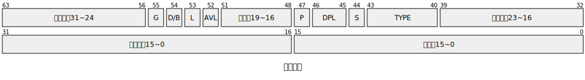
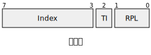
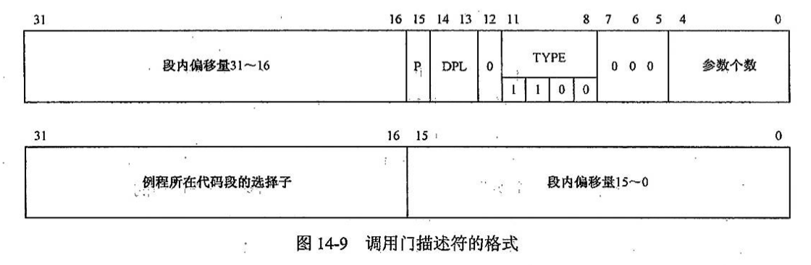
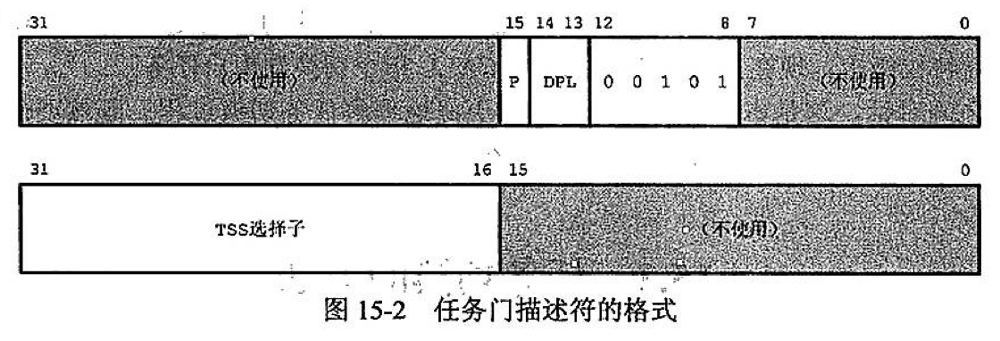
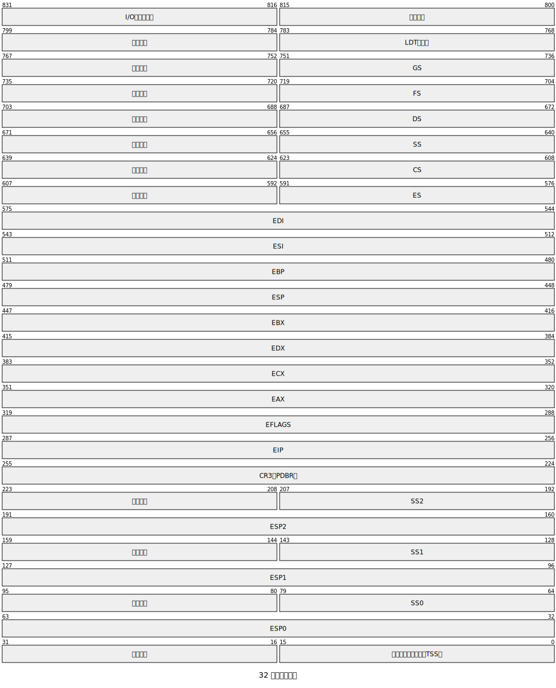
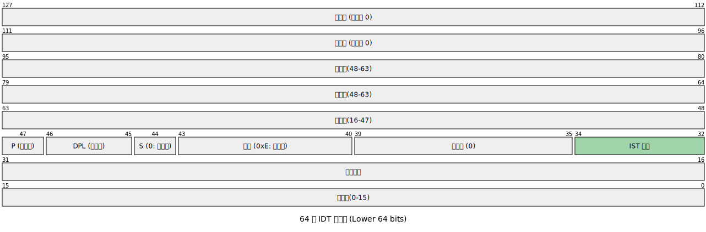
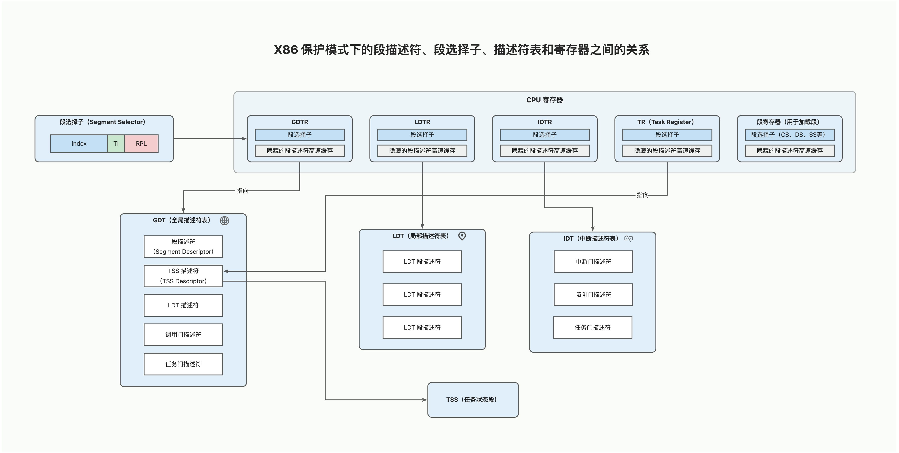

在实模式下，段的基地址直接由段寄存器存储，一个段最大是 64 KB（即 65536 字节）。

切换到保护模式后，段寄存器不再直接存储段基地址，而是存储 **选择子（Selector）**，而真正的段信息（如基地址、段限长、特权级、类型等）则保存在 **描述符（Descriptor）** 中，这些描述符集中存放在 **全局描述符表（GDT）** 或 **局部描述符表（LDT）** 中。

这样做是出于这样几个关键的目的：

+ 保护模式的核心是 **“保护”** ——防止程序越界访问或破坏系统或其他进程。因此，段描述符规定该段最大可访问偏移；特权级用于控制哪些代码可以访问该段；通过 Type 规定只读/可写/可执行等属性
+ 支持虚拟内存与多任务
+ 使用缓存（描述符缓存）优化效率
+ 所有段的元数据集中存放，便于操作系统统一管理

除了段，门（Gate）、任务状态段（TSS）等也是通过描述符来进行描述，通过选择子进行调用。

所以，很有必要好好梳理一下描述符和选择子机制。本篇是 x86 架构的番外篇，目标是理清「描述符」和「选择子」的本质。

<!-- truncate -->

## 段
### 段描述符
<!-- 这是一张图片，ocr 内容为： -->


每个段描述符占 8 字节（64 位），由很多字段组成，虽然看着多，但这些字段大体可以分为四类：

| 字段 | 位宽 | 位置（bit） | 说明 |
| --- | --- | --- | --- |
| **Base (段基地址)** | 32 位 | 16–31（低 16 位） + 32–39（中 8 位） + 56–63（高 8 位） | 段在线性地址空间中的起始地址 |
| **Limit (段界限)** | 20 位 | 0–15（低 16 位） + 48–51（高 4 位） | 段的最大偏移量（即段大小 - 1） |
| **权限控制** | 8 位 | 40–47 | 包含段类型、特权级、存在位等关键属性 |
| **Flags（其他标记）** | 4 位 | 52–55 | 包含粒度（G）、默认操作大小（D/B）、64 位代码段标志（L）、可用位（AVL） |


我们一类一类的看：

#### 段基地址
+ 段在线性地址空间中的起始地址。
+ 分布在描述符的三个不连续区域（历史原因，是为了兼容 80286 的 16 位保护模式）：
    - Base[15:0]：字节 2–3（bits 16–31）
    - Base[23:16]：字节 4（bits 32–39）
    - Base[31:24]：字节 7（bits 56–63）

> ⚠️ 注意：在启用分页后，Base 地址是 **线性地址**（不是物理地址），还需经过 MMU 页表转换。
>

#### 段界限
+ 表示段内 **最大允许的偏移地址**（即 offset ≤ Limit 才合法）。
+ 实际段大小 = Limit + 1。
+ **粒度（Granularity, G）位决定单位**：
    - **G = 0**：Limit 单位为 **字节** → 最大段大小 = 1 MB（2²⁰ = 1,048,576 字节）
    - **G = 1**：Limit 单位为 **4KB 页** → 最大段大小 = 4GB

#### 权限控制
| 位 | 名称 | 含义 |
| --- | --- | --- |
| 40 | **P**（Present） | **存在位**：<br/>1 = 段在内存中；<br/>0 = 段不在内存（访问触发 #NP 异常） |
| 41–42 | **DPL**（Descriptor Privilege Level） | **描述符特权级**：<br/>0（最高，内核）~ 3（最低，用户） |
| 43 | **S**（Descriptor Type） | **段类型标志**：   - S=1：**代码段或数据段**（普通段）   - S=0：**系统段或门描述符**（TSS、调用门等） |
| 44–47 | **Type** | **具体类型**，含义取决于 S 位 |


当 **S = 1**（普通代码/数据段）时，分两种情况：

+ **数据段**（DS、SS、ES 等，最高位为 0）

对于数据段，Type 字段的格式为：`0 | E | W | A`

其中，A 代表 Accessed (已访问)，由 CPU 在访问该段时自动置 1，用于虚拟内存管理。

| Type | 含义 | 可读 | 可写 | 扩展方向 |
| --- | --- | --- | --- | --- |
| 0000 | 只读 | ✓ | ✗ | 向上增长 |
| 0001 | 只读 + 已访问（A） | ✓ | ✗ | 向上 |
| 0010 | 读/写 | ✓ | ✓ | 向上 |
| 0011 | 读/写 + A | ✓ | ✓ | 向上 |
| 0100 | 只读，向下扩展 | ✓ | ✗ | **向下**（用于栈段等） |
| 0101 | 只读 + A，向下 | ✓ | ✗ | 向下 |
| 0110 | 读/写，向下扩展 | ✓ | ✓ | 向下 |
| 0111 | 读/写 + A，向下 | ✓ | ✓ | 向下 |


+ **代码段**（最高位为 1）

对于代码段，Type 字段的格式为：`1 | C | R | A`

其中，C 代表 Conforming (一致性)。

> 🔔 C=1：**一致代码段**：允许低特权级代码跳转到高特权级一致段（但 CPL 不变）。常用于共享库。  
🔔 C=0：**非一致代码段**：跨特权级调用必须通过门（如调用门、中断门）。
>

| Type | 含义 | 一致 | 可读？ | 可执行？ |
| --- | --- | --- | --- | --- |
| 1000 | 只执行 | 非一致 | ✗ | ✓ |
| 1001 | 只执行 + A | 非一致 | ✗ | ✓ |
| 1010 | 执行/读 | 非一致 | ✓ | ✓ |
| 1011 | 执行/读 + A | 非一致 | ✓ | ✓ |
| 1100 | 只执行，一致 | **一致** | ✗ | ✓ |
| 1101 | 只执行 + A，一致 | 一致 | ✗ | ✓ |
| 1110 | 执行/读，一致 | 一致 | ✓ | ✓ |
| 1111 | 执行/读 + A，一致 | 一致 | ✓ | ✓ |


当 **S = 0 **时，该描述符就变成了 TSS 或者门描述符了，这个会在下面章节详解。

#### 其他属性
| 位 | 名称 | 含义 |
| --- | --- | --- |
| 52 | **AVL**（Available for use by system software） | 系统软件可用位，CPU 不使用，OS 可自定义用途 |
| 53 | **L**（64-bit code segment） | **仅用于长模式**：   - L=1:64 位代码段   - L=0:32 位或 16 位（由 D/B 决定） |
| 54 | **D/B**（Default operation size / Big） | 含义依段类型而定：   - **代码段**：D=1 → 默认 32 位指令；D=0 → 16 位   - **栈段**（SS）：B=1 → SP 是 32 位（ESP）；B=0 → SP 是 16 位（SP）   - **数据段**：忽略 |
| 55 | **G**（Granularity） | **粒度位**：   - G=0：段限长单位 = 1 字节   - G=1：段限长单位 = 4KB（页） |


:::warning
L 和 D/B 共同决定了**代码段**中指令的**默认操作数和地址大小**，以及 **栈指针的宽度**。它们不影响段本身的长度（段长度由 Limit + G 位决定），而是影响 **CPU 在该段中执行代码时的默认行为模式**。

L 仅在 IA-32e 模式有效。

L = 1：表示这是一个 64 位代码段

+ 默认操作数大小 = 64 位
+ 默认地址大小 = 64 位
+ 指令指针 = RIP（64 位）
+ 此时 D/B 位必须为 0（硬件要求）

L = 0：表示这是 **兼容模式**（32 位或 16 位代码段）。实际是 32 位还是 16 位，由 **D/B 位** 决定。

**L 和 D/B 互斥**：在长模式下，若 L=1，则 D/B 必须为 0。

L=1 是进入 64 位执行环境的关键标志。CS 寄存器加载一个 L=1 的代码段选择子后，CPU 进入 64 位模式。

:::

### 选择子
<!-- 这是一张图片，ocr 内容为： -->


`选择子 = (index << 3) | TI | RPL`

+ index 是目标段在 GDT 或者 LDT 中的索引号
+ TI 用于选择是 GDT 还是 LDT
+ RPL 用于指定请求权限级

当 CPU 将一个段选择子（Segment Selector）加载到段寄存器时，会触发一系列硬件层面的自动化动作，即“段描述符的加载与校验”。

1. 索引计算与位置定位

CPU 首先根据选择子的内容确定去哪里寻找描述符：

+ 如果 TI=0，CPU 从 GDTR 寄存器中获取全局描述符表的基地址。
+ 如果 TI=1，CPU 从 LDTR 寄存器中获取局部描述符表的基地址。

计算偏移：CPU 将选择子的高 13 位（索引值 Index）乘以 8（因为每个描述符占 8 字节），再加上表的基地址，找到内存中对应的段描述符条目。

2. 硬件合法性检查

在允许访问之前，CPU 内部会进行权限检查。检查失败，CPU 会触发 General Protection Fault (#GP) 异常。检查包括：

+ **边界检查**：检查选择子的索引是否超出了 GDT 或 LDT 的限长（Limit）。
+ **类型检查**：例如，不能把一个“只执行”的代码段选择子加载到 DS（数据段寄存器）中。
+ **特权级检查**：对于数据段，通常 `max(CPL, RPL) <= DPL`（即当前特权必须足够高才能访问该段）。
+ **存在性检查**：检查描述符中的 P 位（Present）。如果 P=0，说明该段不在内存中，触发段不存在异常（#NP）。
3. 加载到描述符高速缓存

x86 的每个段寄存器实际上由两部分组成：

+ 可见部分：16 位的**选择子寄存器**（程序员可见）。
+ **不可见部分（描述符高速缓存）**：这是一个隐藏的、位宽很大的寄存器，包含了该段的基地址、限长和属性。

### GDT
在保护模式下，为了高效管理描述符，CPU 要求在内存中开辟一块空间来集中存放它们，这块空间就是 **GDT (Global Descriptor Table，全局描述符表)**。

+ **全局性**：它是整个系统共用的（相对于局部描述符表 LDT 而言）。
+ **地址索引**：CPU 通过寄存器 `GDTR` 指向这块内存区域。

GDT 本质上是一个**数组**，数组的每个元素都是一个 **8 字节（64 位）** 的**段描述符**。

> ⚠️ 注意：GDT 索引为 0 的位置，要空出 8 个字节，作为整个 GDT 的开头。不能在这个空间内设置有实际意义的描述符。LDT 则不需要这种限制。


操作 GDT 通常分为三个阶段：**定义、加载、跳转**。

**A. 在内存中构建 GDT**

程序员需要在内存中手动拼凑出这些 8 字节的描述符。

> ⚠️** 注意**：GDT 的第 0 个描述符（Index 0）必须是**空描述符（Null Descriptor）**，即全为 0。


**B. 设置 GDTR 寄存器**

CPU 有一个专门的寄存器 `GDTR` 记录 GDT 的位置和大小。我们需要准备一个 6 字节的伪描述符：

+ **2 字节**：GDT 的界限（长度 - 1）。
+ **4 字节**：GDT 在内存中的 32 位基地址。

然后使用汇编指令加载它：

```z80
lgdt [gdt_ptr]  ; gdt_ptr 指向上面那 6 字节的数据
```

**C. 更新段寄存器（刷新）**

加载完 GDT 后，CPU 里的段寄存器（CS, DS, SS 等）还存着旧的数据。我们需要通过一个 **长跳转（Far Jump）** 来强制刷新 CS 寄存器，并手动更新其他寄存器：

```z80
jmp 0x08:flush   ; 0x08 是代码段在 GDT 中的偏移量（选择子）
flush:
    mov ax, 0x10 ; 0x10 是数据段的偏移量
    mov ds, ax
    mov es, ax
    ; ...以此类推
```

### LDT
LDT 是 x86 架构为了实现更细粒度的资源隔离而设计的。在多任务操作系统中，虽然所有任务都共享 GDT，但每个任务可以拥有自己独立的 LDT，用来存放仅属于该任务的内存段描述符。

> 💡提醒：LDT 本身也是一个“段”。它的地址和属性信息作为一条记录，存放在 GDT 之中。


当操作系统切换任务（Context Switch）时，会切换不同的 LDT，从而让不同的进程看到不同的内存段，实现隔离。

LDT 的内部结构和 GDT 完全一样，都是由 8 字节的段描述符组成的数组。

:::warning
**现代系统（Linux/Windows）很少用 LDT**

虽然 LDT 设计初衷是很好的，但在现代 64 位（x86_64）操作系统中，它已经基本淡出了舞台：

+ **分页机制（Paging）**：现代 OS 主要依靠页表来实现进程隔离，而不是靠“分段”。分页更灵活且效率更高。
+ **平坦模型（Flat Model）**：Linux 等系统倾向于让所有段的基地址都为 0，界限为 4GB/16EB，实际上“绕过了”分段。
+ 简化设计：维护大量的 LDT 会增加任务切换的开销。目前 LDT 主要用于一些特殊场景（如 Wine 模拟运行某些老的 Windows 程序，或某些线程局部存储 TLS 的实现）。

:::

## 门
### 调用门
用户程序（低权限）想调用内核中（高权限）的一个特定函数，它不能直接跳转过去（否则会触发保护异常）。这时候，调用门 (Call Gate) 就充当了「接口」的角色。

调用门的本质也是一个**描述符**，但它是一种特殊的系统描述符。它不像 GDT/LDT 里的普通段描述符那样指向一段内存的开头，而是指向一个特定的**函数入口点**。

也可以把它理解为一个受控的**隧道**：

+ 入口：位于低权限层（用户态）。
+ 出口：位于高权限层（内核态）的一个固定函数地址。
+ 检查：CPU 在穿越隧道时会自动检查调用者的权限，确保它是合法的。

调用门存储了以下关键信息：

1. **目标代码段的选择子 (Selector)**：这个函数属于哪个段（通常是内核代码段）。
2. **偏移地址 (Offset)**：函数在目标代码段内的具体起始位置。
3. **参数个数 (Param Count)**：因为跨越权限级会涉及堆栈切换，CPU 需要知道要从用户栈拷贝多少个参数到内核栈。
4. **属性 (Attributes)**：
    - **P 位**：是否存在。
    - **DPL (Descriptor Privilege Level)**：**门的特权级**。决定了谁能调用这个门。
    - **TYPE**：固定为 `0xC` (32 位调用门)。



当程序执行 `lcall selector:offset` 指令时，如果 `selector` 指向的是一个调用门：

1. **特权检查**：CPU 比较当前特权级 (CPL) 和调用门的 DPL。如果 CPL 小于等于门 DPL，则允许通过（例如：DPL 为 3 的门允许 Ring 3 调用）。
2. **堆栈切换**：
    - CPU 根据目标代码段的权限，从 **TSS (Task State Segment)** 中找到对应高权限等级的栈指针（如 `SS0` 和 `ESP0`）。
    - 自动将旧的 `SS`、`ESP` 和参数拷贝到新栈。
3. **保存返回地址**：将旧的 `CS` 和 `EIP` 压入新栈。
4. **跳转执行**：加载门描述符中的目标 `CS` 和 `EIP`，开始执行内核函数。
5. **返回**：函数执行完毕，使用 `lret` 指令，CPU 会自动切回低权限栈并继续执行。

:::info
在 32 位模式下，调用门可以配置将参数从用户态栈复制到内核态栈（通过 `Param Count` 字段）。在 **64 位模式下，硬件参数复制功能被移除**。即便描述符中还有这个字段，CPU 也会忽略它。参数传递必须通过寄存器进行（遵循 x64 调用约定）。

:::

### 任务门
如果说调用门是跨权限调用一个函数，那么任务门就是直接切换整个执行环境（任务/进程）。它是硬件级多任务处理的核心机制。

它的唯一作用是指向一个 TSS（Task State Segment，任务状态段）。

当 CPU 遇到指向任务门的跳转或调用时，它会暂停当前正在运行的一切，把当前的寄存器状态“打包”存起来，然后根据任务门指向的 TSS，把新任务的状态“解包”到寄存器中，从而实现硬件级的任务切换。

**硬件任务切换**

当你执行 `jmp task_gate_selector:0` 或者触发了一个关联了任务门的中断时，CPU 会执行以下“重型”操作：

1. 保存当前现场：将当前所有的通用寄存器（EAX, EBX...）、段寄存器（CS, DS...）、状态寄存器（EFLAGS）和指令指针（EIP）全部写入当前任务的 TSS 中。
2. 加载新现场：从任务门指向的新 TSS 中，把保存的所有寄存器值读取出来，覆盖掉当前的寄存器。
3. 切换 CR3：如果开启了分页，新 TSS 里的 CR3 寄存器会被加载，这意味着整个内存地址空间（页表）也跟着切换了。
4. 设置 NT 位：在新任务的 EFLAGS 中设置 Nested Task 位，表示这个任务是嵌套在旧任务里的，方便以后 iretd 跳回来。

**任务门的存放位置**

+ 放在 GDT/LDT 中：程序员可以通过代码（jmp 或 call）主动触发任务切换。
+ 放在 IDT（中断描述符表）中：这是最经典的用法。当发生某个严重错误（如双重异常 Double Fault）时，硬件自动通过任务门跳到一个“已知健康”的任务中去处理错误，而不是在已经崩溃的旧任务堆栈里继续挣扎。

:::warning
**现代系统（Linux/Windows）很少用任务门**

现代操作系统一般都选择使用纯**软件任务切换**的方案：

+ 性能开销：硬件切换会保存/恢复所有寄存器。但实际上，软件往往只需要保存一小部分寄存器，手动切换（Software Context Switch）更快。
+ 可移植性：其他架构（如 ARM, RISC-V）没有这种硬件任务门。为了让内核代码在不同 CPU 上通用，开发者倾向于在软件层面实现切换。
+ 灵活性：软件切换可以更精细地控制哪些状态需要保存（比如是否需要保存浮点运算单元 FPU 的状态）。


**<font style={{color:"#DF2A3F"}}>任务门（Task Gate）在 64 位模式下已经被移除了。</font>**


:::

<!-- 这是一张图片，ocr 内容为：:31 15141312 (不使用) P 0 DPI 31 16 15 不使用 TSS 选择子 任务门描述符的格式 图 15-2 -->


任务门中只保存 TSS 选择器，不存储基地址和偏移量。

**TYPE**：固定为 `0x5`。

### 中断门
中断门是 **IDT（Interrupt Descriptor Table，中断描述符表）** 中最常见的条目类型。它的存在是为了让 CPU 能够响应外部硬件中断或内部异常，并安全地跳转到内核预设的**中断处理程序 (Interrupt Handler)**。

:::warning
**IDT（Interrupt Descriptor Table，中断描述符表）**

IDT 是保护模式下处理中断和异常的关键数据结构。IDT 固定包含 256 个条目（对应中断向量 0-255）。CPU 通过一个专门的寄存器 **IDTR** 来寻找这张表在内存中的位置。

IDT 中主要包含以下三类门：

+ **中断门 (Interrupt Gate)**：最常用的，用于处理硬件中断（时钟、键盘等）。进入时会自动关闭中断（设置 IF=0）。
+ **陷阱门 (Trap Gate)**：常用于调试或软中断。进入时不会关闭中断。
+ **任务门 (Task Gate)**：（现代系统极少用）用于将中断处理交给一个独立的硬件任务。

:::

**TYPE**：固定为 `0xE` (32 位中断门)。


当一个中断发生时（例如时钟中断）：

1. **查表**：CPU 根据中断向量号（0-255）在 IDT 中找到对应的中断门。
2. **权限检查**：如果是 `int n` 指令触发，CPL 必须  门 DPL。
3. **保存现场（最关键一步）**：
    - 如果发生了特权级切换（从 Ring 3 到 Ring 0），CPU 会切换到内核栈（从 TSS 获取）。
    - CPU 自动在内核栈中压入：**旧 SS、旧 ESP、EFLAGS、旧 CS、旧 EIP**。
    - 对于某些异常，CPU 还会额外压入一个 **Error Code（错误码）**。
4. **关闭中断**：设置 `IF = 0`。
5. **跳转执行**：加载中断门里的 CS 和 EIP，开始执行内核代码。

:::info
64 位的 TSS 中包含一个有 7 个条目的 IST 表。中断门描述符中有一个新的 3 位字段（IST Index），可以指定该中断专门使用这 7 个预定义栈中的哪一个。这对于处理“双重错误”（Double Fault）或“不可屏蔽中断”（NMI）非常关键，因为它可以强制使用一个已知的、干净的栈，防止栈溢出导致系统彻底崩溃。

:::

### 陷阱门
陷阱门和中断门是一对「双胞胎」：它们都存在于 IDT（中断描述符表）中，都指向一个内核函数入口，执行流程也基本一致。唯一的区别在于：CPU 穿过这道门时，会不会屏蔽中断。

+ **中断门 (Interrupt Gate)**：进入时，CPU 会自动将 `EFLAGS` 中的 `IF` 位清零，**禁止**其他外部中断。这通常用于处理硬件中断（如硬盘读写、时钟滴答），因为这些任务通常需要极高的原子性，不能被打断。
+ **陷阱门 (Trap Gate)**：进入时，CPU **不会**改变 `IF` 位。这意味着在陷阱处理程序执行期间，外部中断（如键盘输入）依然可以进来。这通常用于处理那些不那么“紧急”或者需要允许嵌套的事件。

**TYPE**：固定为 `0xF` (32 位模式下)。

> **陷阱门通常用在什么地方？**
>
> 由于陷阱门允许中断嵌套，它最典型的用途是处理 **CPU 内部产生的异常（Exceptions）**：
>
> + **软件调试**：比如指令 `INT 3`（断点异常）。当调试器在代码里设断点时，它实际上是插了一条 `INT 3` 指令。CPU 执行到这里会通过陷阱门跳入调试处理程序，此时允许外部中断（如鼠标移动）继续工作。
> + **运算异常**：比如溢出检查（`INTO` 指令触发）。
> + **系统调用（历史上）**：某些早期的操作系统使用陷阱门来实现系统调用，因为系统调用执行时间可能较长，不希望一直屏蔽外部硬件中断。
>

## TSS
### TSS
TSS 在 32 位和 64 位模式下差异巨大，这与 IA-32 和 IA-32e 对任务的切换和管理上的差异有关。

1. **32 位模式下的 TSS (Protected Mode)**

在 32 位保护模式下，Intel 最初的设计愿景是实现**硬件级多任务切换**。

**核心功能：**

+ **上下文保存：** TSS 几乎包含了 CPU 的所有通用寄存器（EAX, EBX, ECX 等）、段寄存器、指令指针（EIP）和标志位（EFLAGS）的快照。
+ **任务切换：** 只要执行 `ljmp` 到一个 TSS 选择子，CPU 就会自动把当前寄存器存入旧 TSS，并从新 TSS 加载寄存器。
+ **特权级堆栈指针：** 存储了不同特权级（Ring 0, 1, 2）对应的堆栈指针（ESP0, ESP1, ESP2），用于处理中断时的堆栈切换。
+ **I/O 许可位图：** 控制用户态程序对特定 I/O 端口的访问权限。

<!-- 这是一张图片，ocr 内容为： -->


2. **64 位模式下的 TSS**

在 64 位模式下，硬件任务切换机制被废除。现在的 TSS 主要负责存储以下关键信息：栈指针表：不同特权级（Ring 0-2）的栈顶指针 ($ RSP_n $)。中断栈表 (IST)：用于指定处理特定中断（如双重故障或调试中断）时的独立栈指针。I/O 许可位图基地址。

<!-- 这是一张图片，ocr 内容为： -->


**什么是 IST？**

IST 全称是 Interrupt Stack Table（中断栈表），是一种**强制替换堆栈的机制**，确保某些极端重要的中断（如崩溃或严重错误）能在已知的、安全的内存区域运行。

在早期的 32 位系统中，中断发生时，CPU 通常会使用当前任务的内核栈。

但如果发生了以下情况：

+ **栈溢出（Stack Overflow）**：内核栈空间已经用完了。
+ **双重故障（Double Fault）**：在处理一个异常时又触发了另一个异常。

此时，CPU 尝试把中断上下文压入“已经坏掉”或“已经满了”的栈，会导致系统直接死机或硬件复位。IST 就是为了解决这种“无处落脚”的尴尬。

当一个中断发生时，CPU 会查看 IDT（中断描述符表），每个中断门描述符中有一个 3 位的 IST 字段。

+ 如果 IST 字段为 0：使用传统的栈切换规则。
+ 如果 IST 字段为 1-7：CPU 会强制从 TSS 中取出对应的 IST 指针，并将 RSP（栈指针）直接切换到该地址。

然后，在新的、干净的 IST 栈上压入 `SS`, `RSP`, `RFLAGS`, `CS`, `RIP`。

<!-- 这是一张图片，ocr 内容为： -->


### TR 寄存器
**TR 寄存器**的全称是 **Task Register**（任务寄存器）。TR 寄存器的主要作用是“指向”当前正在运行的任务。它存储了一个 **段选择子（Segment Selector）**，这个选择子指向 **GDT（全局描述符表）** 中的一个条目，即 **TSS 描述符**。

## 总结



